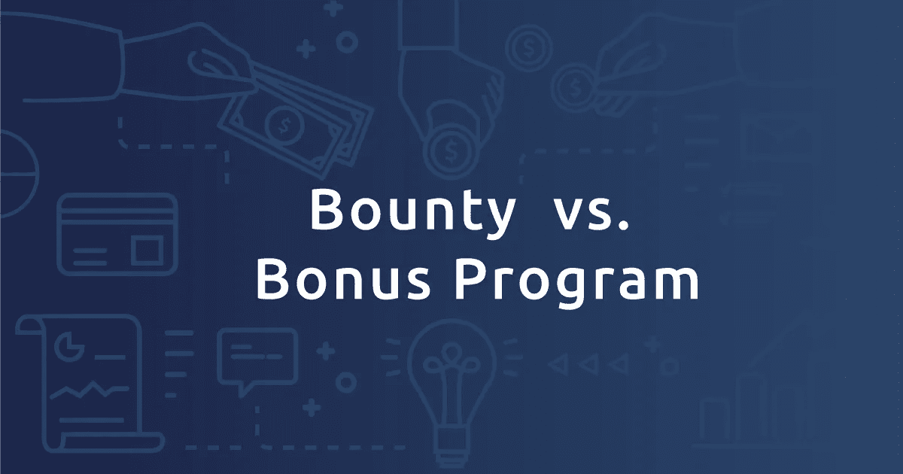
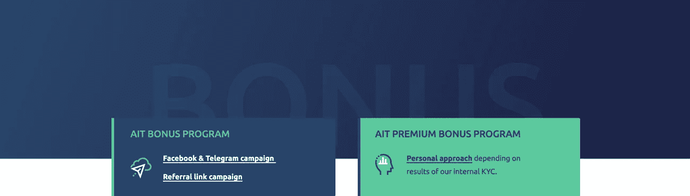

# 奖金与红利忠诚度计划

> 原文：<https://medium.com/hackernoon/bounty-vs-bonus-loyalty-program-726370dc9e63>

众筹和众包在组织*中越来越受欢迎。简而言之，一群普通人聚在一起，通过经济或独特的技能做出贡献，来解决一个复杂的问题或实现一个项目。*

## 在这样的环境中，项目领导倾向于与项目支持者的分布式团队互动，特别是当涉及到需要互补技能的国际项目时。

在当今的加密世界中，当涉及到大量人员时， ***项目负责人经常会宣布“赏金计划”，通常会在 BitcoinTalk 论坛上发布，面向广大“赏金猎人”受众。这样的赏金猎人致力于完成特定的任务，比如翻译、社区管理、漏洞报告或内容写作。***

## 在调查这种方法并与市场参与者协商后，我们决定不能将项目敏感任务分配给技能和经验不确定的陌生人。

虽然许多项目继续使用赏金活动，但好处并不十分明显。现在，拥有一个专门的技术交流的 Bitcointalk 论坛主要被认为是一种礼仪。毫无疑问，**有一个积极的结果，比如关于该项目的信息。人们开始在许多社会传播渠道(脸书、电报等)上传播这个项目。**真正的问题是，现在，由于所有这些与赏金运动的炒作，太多的机器人已经涌向这一领域。因此，实际息差似乎没有数据显示的那么大。如果机器人能向你的项目投入真金白银，事情会有所不同。但是他们不能。

# 交易奖金计划方法

## 申请 AITrading 奖金计划的主要好处是，它包括那些对项目真正感兴趣的人，那些准备为项目的成功做出贡献的人，以及那些可以在志同道合的投资者和 AITrading 的早期支持者中传播消息的人。

我们正在放弃过时的奖金活动，但我们仍然鼓励每个人仔细检查所有可用的信息，并分享我们关于改革交易和将人工智能(“AI”)应用到他们的交易体验中的想法。

我们的目标是将人工智能交易推向大众市场。我们认为，它不能只属于大型对冲基金和金融大亨。AITrading 计划将人工智能交易的价值和智能重新导向普通人。

# [奖金计划](https://aitrading.com/)

在 AITrading，我们承诺保持最高的专业标准，并坚持我们对所有项目支持者的责任。

## 在我们的奖金计划中，有两个组成部分。

**第一个是致力于众筹的最有效的社交渠道——**[**【脸书】和**](https://aitrading.com/#modal-id-15) **【电报】。在 AITrading 奖金计划的这一部分，我们正在寻找积极参与交易、加密、创新创业、技术和所有高科技的人。我们首先邀请那些不仅仅是对项目本身没有太大兴趣的赏金猎人，而是那些能够支持项目、传播消息、提供反馈和分享想法的人。**

第二个选项是一个推荐[链接](https://aitrading.com/#modal-id-16)。大型社区的所有者和影响者可以充分利用我们的推荐链接。该链接对每个特定用户都是唯一的。当有人通过这种推荐链接投资于 AITrading 项目时，奖金计划参与者将获得奖励。

# [额外奖励计划](https://aitrading.com/)

对于那些在我们的项目领域(如交易、加密、人工智能、金融市场)有很多相关活动的人，我们提议加入**高级奖金计划**。我们认为他们是推广和支持项目和想法的品牌大使。我们一直邀请这些人成为新贸易未来的一部分，分享他们的知识，并帮助传播有关 AITrading 的消息。

# 交易记录

我们感谢对我们众筹项目的任何有价值的贡献，因为我们依靠我们的共同努力使它成功实施并推向市场。

# 请查看我们的网站并订阅我们的社区，以保持更新和了解项目进展。

**交易团队**

## [官方网页](https://aitrading.com/?utm_source=medium&utm_medium=article)

## [脸书](http://facebook.com/aitrading.official)页面

## 我们现在在 LinkedIn 上

## [电报通道](http://t.me/aitrading_en)

## [电报社区](http://t.me/aitrading_com)

## 订阅[推特](http://twitter.com/aitrading_en)

## 检查我们的 [Insta](https://instragram.com/aitrading_official)

## [Reddit](https://www.reddit.com/user/aitrading)

## [斯蒂米特](https://steemit.com/@aitrading.com)