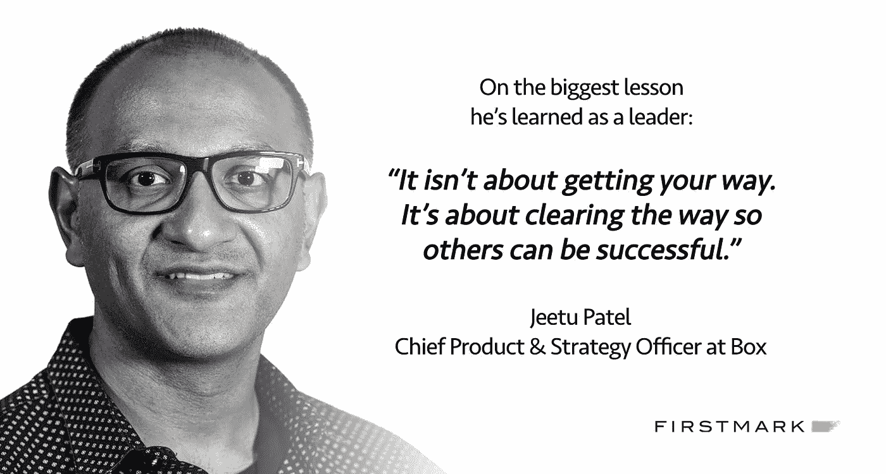

# 博克斯首席采购官吉图·帕特尔讲述了“走出困境:领导力课程”

> 原文：<https://medium.com/hackernoon/boxs-cpo-jeetu-patel-on-getting-out-of-the-way-lessons-on-leadership-7903411a3831>

## 有效领导系列

[吉图·帕特尔](https://medium.com/u/aeef114f4727?source=post_page-----7903411a3831--------------------------------) *是首席产品官&首席战略官* [*包厢*](https://medium.com/u/64729b1ea670?source=post_page-----7903411a3831--------------------------------) *。他帮助领导 Box 的团队构建了现代数字时代最普遍和最重要的技术工具之一——触及数万家企业、数百万用户和数十亿次交互。*

# **你的第一个管理职位是什么？你从中学到了什么？**

我的第一个管理角色是在我从 Sizzler 餐厅的服务员被提升为服务主管时出现的，我的工作是在我们换班期间管理其他服务员。在这段时间里，我意识到我不能再争论把餐厅最好的部分分配给我，而是作为经理，我必须把最好的部分提供给当班的其他服务员。我学到的最重要的一课，也是我在职业生涯中一直铭记的一课，就是成为一名领导者并不是要随心所欲，而是要扫清道路，让其他人也能成功。

# **在你职业生涯的早期，在你担任领导职务之前，你欣赏优秀经理的哪一个品质？**

我最喜欢的经理是那些给我自主权并提供直接反馈的人。这样，我总是知道我站在哪里，我需要做什么。此外，高度正直对我来说一直是一个非常重要的性格特征——我知道我的经理会支持我，这对我来说很重要。

# **你能举出一个从根本上塑造了你的领导方法的时刻吗？**

当我还是 Documentum 的 CMO 时，我当时的老板让我担任[EMC] Syncplicity 的首席执行官。问题是，我将不得不放弃目前在 CMO 的角色——在当时，这是一份更大的工作，范围更广。当我问他为什么时，他告诉我两件事——第一，这不是谈判，第二，他觉得如果我把全部精力集中在一个问题上，我成功的机会会更大。他最终完全正确。

了解如何让团队成员获得成功是我学到的重要一课，我意识到有时给优秀的人太多的机会会埋没他们，导致他们和公司都不满意的结果。

> 有时候给强者太多的空间会埋没他们。

# 作为领导者，你养成的最重要的日常或每周习惯是什么？

我很不擅长回复邮件，我很早就知道，如果人们找不到你，他们会很沮丧。但是，我意识到短信对我来说效果更好，我总是对短信做出回应——所以，真正需要我的人总是可以通过这种方式找到我。

最近，我还养成了另一个习惯，目的是让重要的人也能找到我。每当我七岁的女儿给我打电话时，不管我在开什么会，我都会接——这样她就知道她爸爸就在一个电话之外。

# 你在一对一的会议中使用什么框架？

我已经向任何安排与我进行一对一会谈的人明确表示，这是他们的时间，由他们决定议程。我的工作是扫清障碍，让他们的生活更轻松。

我告诉他们先告诉我坏消息。

# **在提供有效反馈方面，你会给第一次当经理的人什么建议？**

不要专注于被人喜欢——专注于表达清楚，但要尊重。如果你关心你的员工，那么你会非常清楚他们在任何时候的立场。如果人们知道他们什么时候做得好，什么时候做得不好，他们将能够持续改进。我相信躲在礼貌的背后只是现代形式的谎言。你欠你的人民不止这些。

> 不要专注于被人喜欢——专注于表达清楚，但要尊重。

# **你和教练一起工作过吗？如果是的话，你学到的最大的一课是什么？**

在我的职业生涯中，我有过几位教练和导师，但我在担任 Syncplicity 首席执行官期间的教练非常有帮助。这位教练帮助我认识到自我意识的重要性，以及作为一名高层领导，如果你的言行不谨慎，你将会造成很大的混乱。人们会紧紧抓住你说的每一句话——即使你只是在大声思考。这位教练不仅向我灌输了意识到我使用的词语的重要性，还确保我为我的团队提供了他们取得成功所需的明确方向。

> 如果你不仔细考虑你的言行，你会造成很大的混乱。

# 你现在正在做的一件事是什么？

工作场所的多样性是我非常感兴趣的一个领域，尤其是让更多的女性进入技术领域，跨越所有的职能部门。我真的相信，在一个背景、信仰多样化的环境中，在一个员工有归属感的环境中，团队会表现得更好。

我们还有很长的路要走，但我个人致力于推动我的团队和 Box 更广泛的变革，我们一直专注于开发和实施我们认为会带来实际结果的项目和合作伙伴关系。

有没有你真正钦佩的领导者(不是你现在的公司),你认为他会喜欢接受采访？

请将他们的姓名和简短描述发送到 jack@firstmarkcap.com，让我们知道。