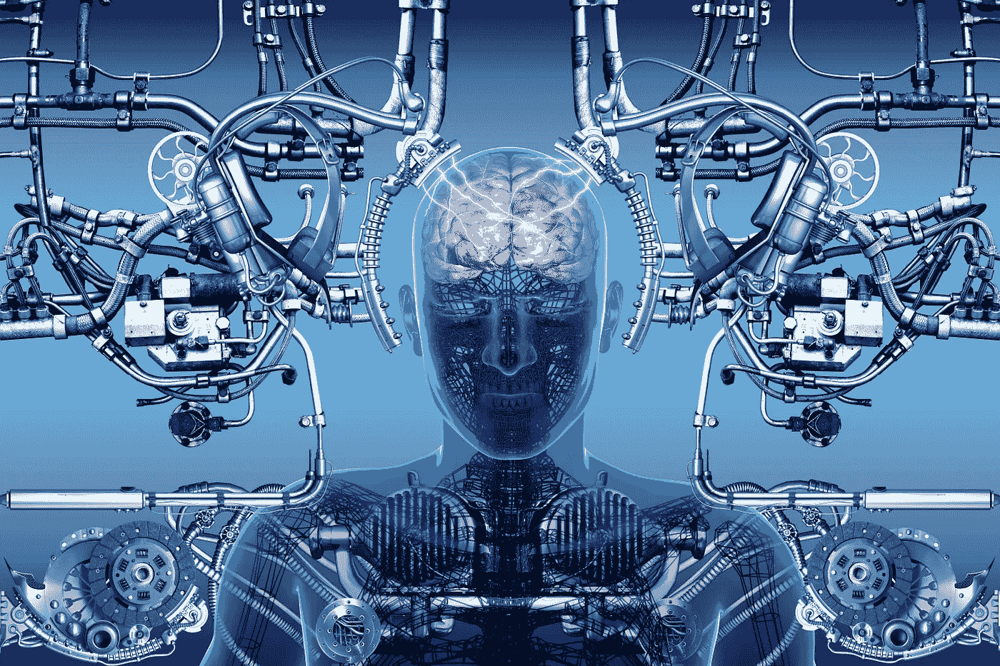

# 什么是脑链接口？

> 原文：<https://medium.com/hackernoon/brain-chain-interface-4f9620124624>

## 一个[脑链接口](https://michaelhaupt.com/evolution-of-societies-93a5f0f9b31#b25b)是一个增强的人脑和区块链上的网络之间的直接通信路径

The brain-chain interface. Image source and excellent neuro-tech blog: [Convergent science network.](http://csnblog.specs-lab.com/2014/05/25/neuroprosthetics-wearable-tech-inside-the-brain/)

我们目前正处于一个融合时期的尖端，以前分别开发的技术(例如生物技术、基因组学、纳米技术、人工智能、计算逻辑、材料科学和认知神经科学)正以越来越跨学科的方式出现。融合已经彻底改变了我们与企业和机构打交道的方式。随着相对较新的区块链的出现，特别是 T2 和区块链所概括的哲学，进一步的技术融合有可能满足人类的基本需求，提高人类的生活质量。

当人们考虑到大脑中的神经网络以并行、分布式的方式处理信息的扩散激活时，不可避免的是，在不太遥远的[未来](https://hackernoon.com/tagged/future)的某个时刻，我们将能够直接利用进化中的区块链生态系统，并有可能加速实现[全球大脑](https://en.wikipedia.org/wiki/Global_brain)。全球大脑将是*社会 5.0 的* *迷人项目*。