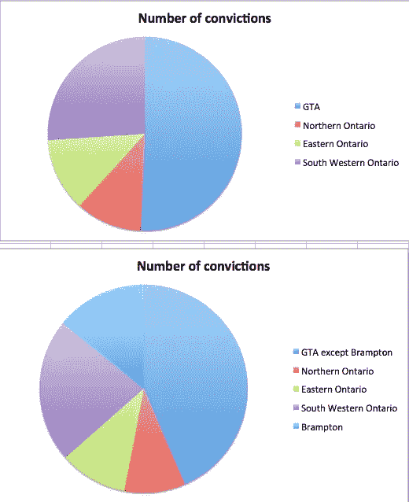
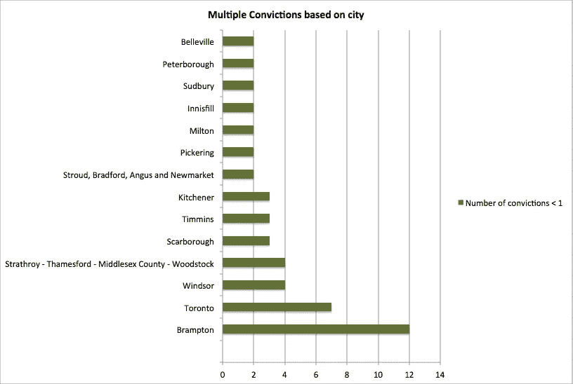

# 布兰普顿:安大略省最危险的工作场所

> 原文：<https://medium.com/hackernoon/brampton-the-most-dangerous-place-to-work-in-ontario-28c69ee866cd>

4 月 9 日。2015 年，安迪·索汗给戈登·格雷厄姆发短信说他认为他操作的起重机很危险。建筑公司 Forma-Con 的主管格雷厄姆告诉索汗，如果起重机使用起来有危险，就应该关闭。

这台起重机被用来在戈尔路的布兰普顿的一个新图书馆和社区中心的建筑工地浇注混凝土。

一个半星期后，有缺陷的起重机仍在使用。它在降低吊杆时倾斜，杀死了马克·阿塔拉。马克 40 岁，是丈夫、兄弟和两个孩子的父亲。他是当地 27 个木匠工会的成员，住在奥罗拉。

对这场悲剧的报道很少。马克的名字没有出现在任何新闻报道中。多伦多和约克地区劳工委员会主席约翰·卡特赖特写了一篇《脸书现状》来纪念马克和同月去世的另外三名工人:从三层楼上摔死的威廉·塞尔奎拉和从五层楼上摔死的路易吉·库迪尼和沙恩·詹宁斯。

2017 年 11 月 27 日， [Forma-Con](https://hackernoon.com/tagged/forma-con) (1428508 安大略省康科德有限公司)，Graham 和 Sokhan 因继续使用故障起重机而违反各种健康和安全法规而被罚款。福马-孔被罚款 28.5 万美元，格拉汉姆被罚款 1.5 万美元，[索汗](https://hackernoon.com/tagged/sokhan)被罚款 1.3 万美元。

布兰普顿是安大略省工人伤亡事故的中心。对劳工部 2017 年公布的 72 起定罪的冷静分析表明，工作场所健康和安全违规行为在布兰普顿发生的次数比安大略省任何其他城市都多。2017 年，有 12 起罚款，包括与 Mark Attallah 死亡有关的三起罚款，是因工作场所受伤、死亡或未付工资而被罚款。这比整个东安大略省的违法行为都多。

2017 年期间实施的罚款涉及 2013 年至 2017 年期间严重到足以导致罚款的工人健康和安全违规行为。在大多数情况下，对伤害处以罚款。劳工部报告了每一笔罚款，并列入了关于死亡情况的信息，如 Attallah 的死亡情况。

2017 年的平均罚款额为 78，552 美元。最大的一笔罚款是给 Fiera 食品公司的，因为 Amina Diaby 的头巾被机器卡住而死亡。多伦多菲拉食品公司的工作条件被《多伦多星报》的萨拉·莫杰特·赫德扎德和布伦丹·肯尼迪在长达一个月的秘密调查中记录了下来。菲拉食品公司被罚款 30 万美元。

一名工人受伤的最大一笔健康和安全违规罚款，被判给了参与另一个大型公共项目的三家公司:建设位于温莎的西南拘留中心。2013 年，一名工人被严重烧伤。三家公司共被罚款 46 万美元，其中包括 Toromont 工业公司，该公司被罚款 21 万美元。

托罗蒙特工业公司也在 2017 年伦敦的另一起工作场所事故中被罚款。伦敦工厂的一名工人的手被压碎了。在那起案件中，托罗蒙特被罚款 11.5 万美元。(据劳工部称，2011 年，托罗蒙特还被罚款 9.5 万美元，当时一名通过托罗蒙特的 Cimco Refrigeration 受雇于 Sobey 在 Whitby 的零售支持中心工作的工人遭受了“严重的头部伤害和电烧伤”)。

四分之一的罚款是针对公共工地的健康和安全违规行为征收的。大多数承包给私人公司做这项工作，但在某些情况下，公共实体被罚款。这包括两个精神病院，那里的工作人员被病人刺伤。劳工部发现，在这两种情况下，没有采取足够的措施来防止这些事件。

因尼斯菲尔镇、多伦多市和滑铁卢地区市政当局都因违反健康和安全规定而被罚款。

因疏忽导致工人死亡的最低罚款只有 1 万美元。威廉·维特是一家小企业的老板，事故发生时，他正和死去的工人一起清理木材。事故发生在布鲁斯县。《欧文声音时报》报道称，受害者是 51 岁的马克·弗里茨。他的讣告上说他有九个孙子。

有八项罚款是针对被认为是永久性伤害的。虽然劳动部报告了造成伤害的事件的一些细节，但在某些情况下，它们提到伤害需要住院治疗，一处或多处伤害是严重的或永久性的。

要查看这些数据的所有图表，请访问 CALM 网站: [www.calm.ca](http://www.calm.ca)