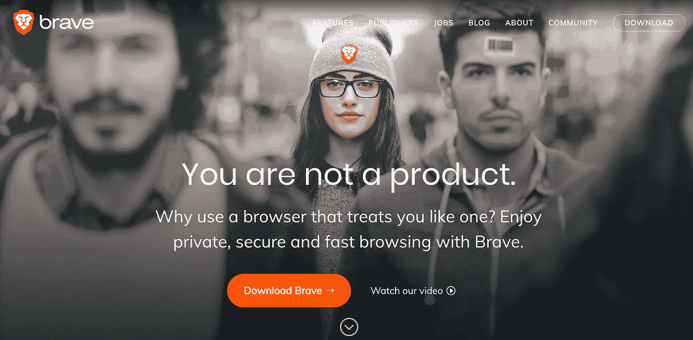
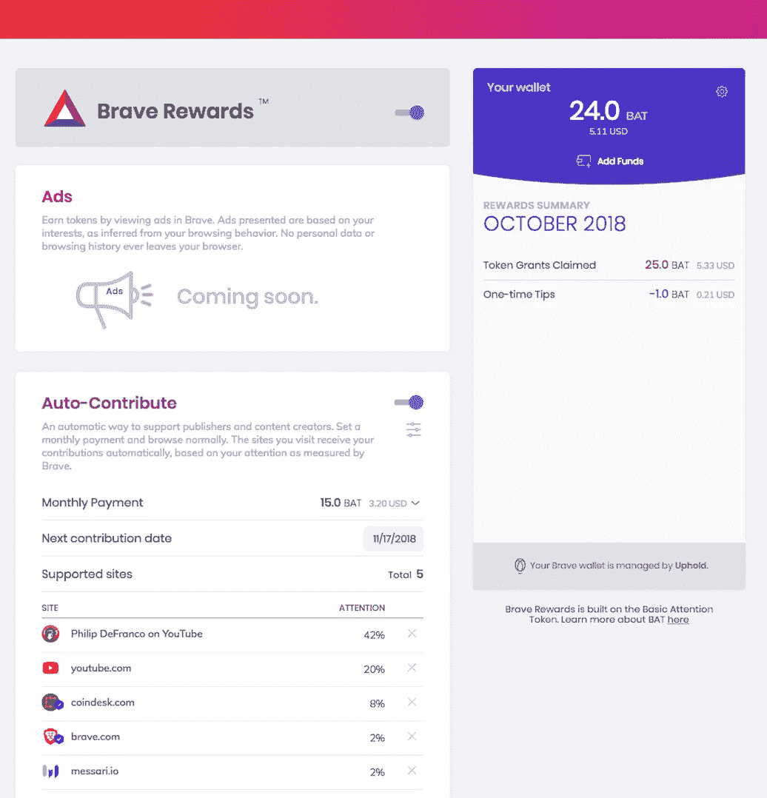
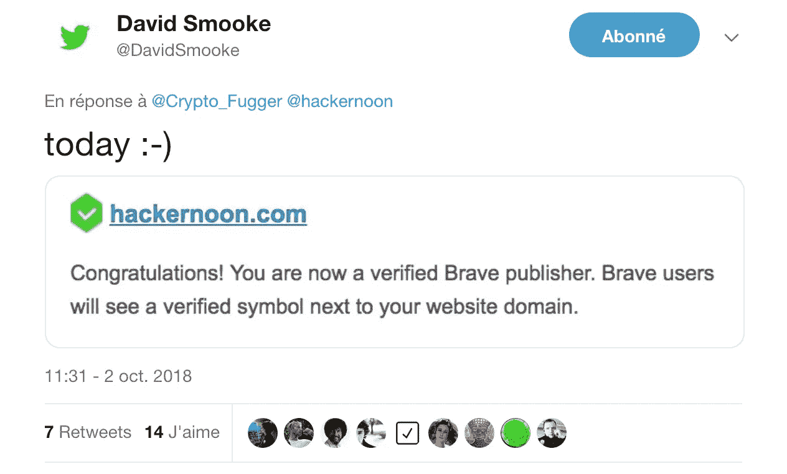

# 勇敢的浏览器正在席卷网络

> 原文：<https://medium.com/hackernoon/brave-browser-is-taking-the-web-by-storm-e6fb6dcadf92>

现在，在你不知道的情况下，你每天浏览的许多网站都注册成为勇敢的出版商

确切地说，是 27k 个出版商，而对于一个两年前才开始的项目来说，网络浏览器本身的月活跃用户超过 460 万。令人印象深刻！

**什么叫勇敢来着？**

[Brave](https://brave.com/hac724) 是一款关注隐私的网络浏览器，通过内置的广告拦截器实现。

此外，Brave 还引入了一些新功能:一个 [Tor](https://www.torproject.org/) 标签集成，以及一个针对浏览器用户(付费选择加入隐私友好广告)和内容创建者的新广告模式(获得出版商认证，如果他们在付费设置中包含你的内容，你将从使用 Brave 浏览器的访问者那里获得 [BAT](https://basicattentiontoken.org) )。

这是 Brendan Eich(Javascript 的创造者，Mozilla 基金会)的最新项目。

好吧，那么到底什么是勇敢的出版商呢？

> 引入勇敢奖励
> 
> 在过去的好时光里，出版商创作内容，广告付费。但是广告拦截在过去的几年里显著增长。现在超过 5 亿人使用软件来阻止他们手机和桌面设备上的广告。
> 
> 它是如何工作的？
> 
> 读者可以选择每月的捐款金额，在他们访问最多的出版商网站之间分配。随着 Brave 的成长，您的收入也会增加。这是最精彩的部分。读者和出版商都不需要做任何不同的事情。他们继续冲浪，你继续出版。

[来源:勇敢的出版商常见问题解答](https://brave.com/publishers/)

当我第一次开始阅读 Brave 时，我了解到这是一种新的出版商奖励制度和新的广告模式。

我想知道有多少出版商，他们是谁，但在任何地方都找不到名单。这就是为什么[我搜索了数百万个网站/youtube/twitch 频道](/@MaxenceCornet/ive-run-a-script-to-detect-brave-browser-bat-publishers-amongst-the-top-1m-ranked-website-from-7a994e873f5e)并建立了[batgrowth.com](https://batgrowth.com/)，来找出谁是勇敢的出版商

这就是我如何意识到 Brave 正在席卷网络，而我却没有注意到:我每天使用的许多网站，无论是工作网站(如[jsbin.com](https://jsbin.com/))、娱乐网站(VICE 的 Youtube 频道**、** Vimeo **、**[rockpapershotgun.com](https://rockpapershotgun.com/))还是工具网站(DuckDuckGo **、** CoinMarketCap **、或 Archive.org)都已经注册成为 Brave 认证的出版商**

就连你正在阅读这篇文章的网站 **Hackernoon** 也是 2018 年 10 月 2 日以来的认证发布者！

**现在是时候给你一个惊喜了:** 让我们看看有多少你每天都在浏览的网站成为了勇敢的发布者，我将在下面列出一些最受欢迎的

**视频流媒体:
-**-[17210 多个 Youtube 频道](https://batgrowth.com/publishers/youtube)都是经过验证的勇敢发行商，其中，一些庞大的频道:Trap Nation、Bart Baker、Philip DeFranco、VICE、HowToBasic- [近 3000 条 Twitch 流媒体都是经过验证的发行商](https://batgrowth.com/publishers/twitch)
- Vimeo

**媒体** -卫报-副-维基百科-华盛顿邮报
-阿拉伯日报
-黑客帝国
-SitePoint-Slate.com
-lad bible
-AndroidPolice
-scotch . io

**隐私工具** -duck duck go
-HOLA
-q want

**加密货币相关
-**coin market cap
-coin desk
-coin gecko
-Crypto compare

**杂项** -BitTorrent
-xda-developers.com-Archive.org
-SocialBlade.com
-TinyURL.com
-apk mirror

**编程
-**Drupal.org
-FreeCodeCamp

**色情** - Xhamster

读者，让我们打个赌:如果你今天不知不觉地拜访了至少 2 家勇敢的出版商，你必须鼓掌；你可以在 batgrowth.com 网站上找到勇敢的出版商的完整名单

如果您有任何意见或问题，请随时在 [Twitter](https://twitter.com/MaxenceCornet) 上联系。
**试玩勇者浏览器:**[https://brave.com/bat684](https://brave.com/bat684)