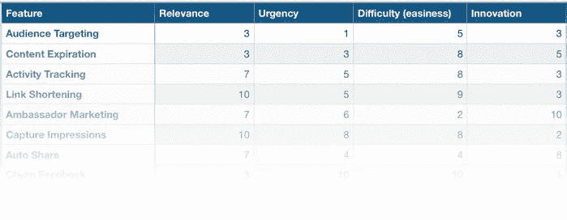
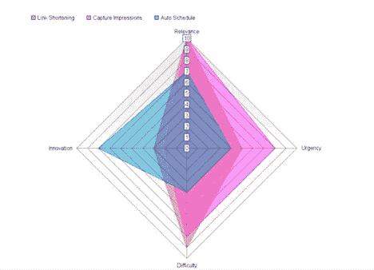

# 打破黑客思维

> 原文：<https://medium.com/hackernoon/break-the-hacker-mindset-69ecd3948e85>

Rami Malek in Mr. Robot Season Two. Photograph by Mr Nadav Kander/USA Network

作为一名软件工程师转行的企业家，我花了一段时间才打破黑客心态。

仅仅因为你能建造一些东西并不意味着你应该建造。

这花了我一段时间来学习。我认为竞争对手不提供这个功能是因为他们没有想到或者他们没有能力构建它，但是，很有可能，他们没有构建它是因为没有人想要它或者它离核心产品太远了。

人们很容易陷入这种思维定势，“也许一旦我做了这一个功能，**然后**产品就会起飞。”[丹尼尔·陶菲克](https://hackernoon.com/@DanielTawfik1)将此描述为[初创公司 tarpit](https://hackernoon.com/its-not-a-feature-problem-avoiding-startup-tarpits-7d5ec4b8c81b) 。

最近有人问我如何决定下一步开发什么特性——这是一个很好的问题，但我没有很好的答案。

我着手建立一个评分系统。

*   **相关性/可及性** —这会让多少客户受益？有多少人要求这个功能？
*   **紧急程度** —它是一个阻止功能吗？
*   **难度** —需要多长时间建造？
*   **创新** —是独特的、创新的吗？

有了这个新的评分系统，我对所有悬而未决的功能/想法进行了分类。

将特征和分数表示为 web 图有助于可视化并使决策更容易。以下是其中的几个例子:

Link Shortening vs. Impression Analytics vs. Auto Scheduling

你如何决定下一步开发什么功能？随着团队的成长，它会改变吗？