# 分解转化驱动的 SaaS 登录页面(旨在获取更多销售线索)

> 原文：<https://medium.com/hackernoon/breaking-down-a-conversion-driven-saas-landing-page-designed-to-capture-more-leads-584c569f9565>

在这篇文章中，我将向你展示我是如何设计一个专门捕捉销售线索的概念页面的，在这种情况下，它更侧重于销售驱动/高接触的初创公司，因为他们更难捕捉销售线索，他们的销售周期更长。

这里的基本原则是在整个网站上回答目标客户的异议(更多信息请参见[我的免费电子邮件课程](http://bit.ly/2xwP2fz)的第 2 步和第 3 步),这样网站本身就可以让他们相信产品或服务可以解决他们的问题，或者至少让他们有足够的好奇心填写联系表格，获得免费试用或要求演示，这样销售团队就可以跟进，直到他们真正成为客户。

这将是一个虚构产品的概念登陆页面的细分，基于我在改进我的客户网站时注意到的最大问题。

**🎁如果你也想让我的 5 步流程从诊断问题到提高转化率**(并捕捉更多线索)，你可以[在这里](http://bit.ly/2xwP2fz)获得我的免费电子邮件课程。

# 我要打破的登陆页面

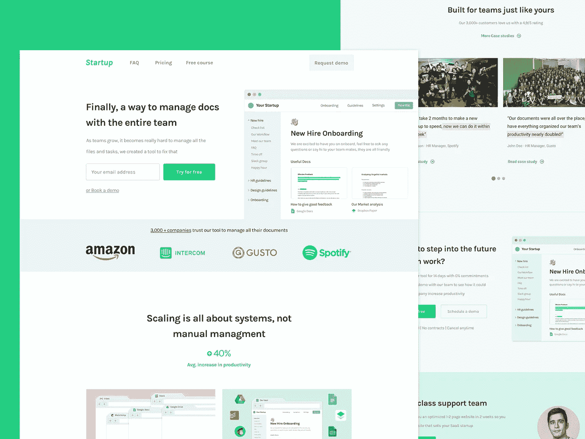

I designed this page in <6 hours, imagine what I can do for your company… [more info about my services](http://bit.ly/2xwP2fz)

## 该结构

当改变或构建以转化率为中心的页面时，结构是非常重要的，因为它可以让你有一个清晰和可重复的过程，以尽可能最好的方式展示你想要销售的任何东西。

对你来说幸运的是，我将分享我如何构建一个 [SaaS](https://hackernoon.com/tagged/saas) [登陆页面](https://hackernoon.com/tagged/landing-page)，你可以在任何你需要你的产品/服务需求的上下文中应用它。

**转换驱动登陆页面的结构应该包含以下内容(按此顺序！):**

*   标题
*   最初的社会证明
*   引入问题
*   它是如何工作的
*   展示他们如何使用它
*   更多的社会证明
*   最终 CTA
*   替代 CTA

**关于每个部分的更多信息以及我如何在下面设计它们👇**

## 标题

这是你的公司给潜在客户的第一印象，在一个注意力持续时间极低的世界里，你真的需要介绍你将解决的问题的“大画面”，一小段描述解决方案可能是什么，最好是一张展示解决方案可能是什么样子的图片。

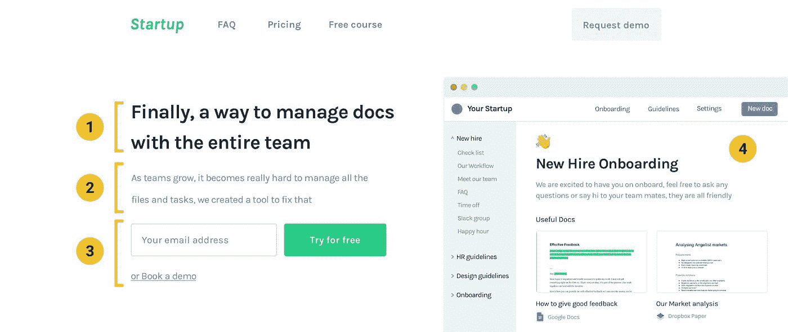

1.  **简介—** 这个标题应该开始回答出现的第一个异议“这是什么？”。
2.  **支持文字** —利用这一段来支持并简要解释解决方案的工作原理或它将解决什么问题。
3.  **CTA—**有些人可能准备尝试一下，要么是因为他们更愿意尝试，要么是因为你正在解决的问题对他们来说是一个巨大的痛点。无论如何，你应该总是有清晰可见的 CTA，这样如果人们有兴趣尝试/购买，他们就不必去找 CTA，相信我，这比你想象的更常见…
4.  **预览** —你不能相信人们会阅读你的文章(相信我，他们不会)，所以你需要展示问题或你的解决方案看起来像什么，以提供更多的背景，并支持这一部分的其他三个要点

**好的头球要求:**

*   简要回答“这是什么？”以及“它是做什么的？
*   激发持续浏览页面的兴趣，这样你就可以继续向他们推销
*   有清晰的 CTA，有很多对比，在人们想转换的情况下突出出来。
*   展示解决方案或问题可能的样子。正如你在第四点中看到的以工具的图像为例。

## 最初的社会证明

这一部分的目的是在页面的早期建立权威，这样他们不仅会更信任你提出的解决方案，而且任何解释或更多的社会证据你都必须在页面的后面支持它。

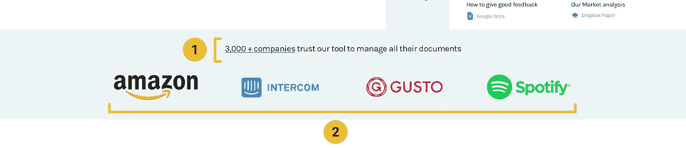

1.  不要忘记向人们解释为什么会有这些标志，这也是一个很好的地方，可以让社会证明更强大，就像你在“3000 多家公司信任…”的例子中看到的那样
2.  通常，使用该产品的最大公司的标志或最好的新闻稿是快速提升你的权威的最佳选择。

请记住，这不是保存证明的正确位置，因为这应该是一个易于理解的结果预览，并建立社交证明，直到您在页面下方展示证明或案例研究。

## 引入问题

这一点非常重要，它让你更容易理解你正在解决的问题(因此解决方案也更容易理解)，同时也提醒他们这个问题有多痛苦，他们有多想解决这个问题(希望他们将你的产品/服务视为解决方案)

很少看到登录页面在解释如何解决问题之前恰当地描述了他们正在解决的问题。

难怪潜在客户会很快提出异议，如“我不明白它是如何工作的”或“我不知道它是否能解决我们的问题”… **这是避免这些问题的一个简单方法！**

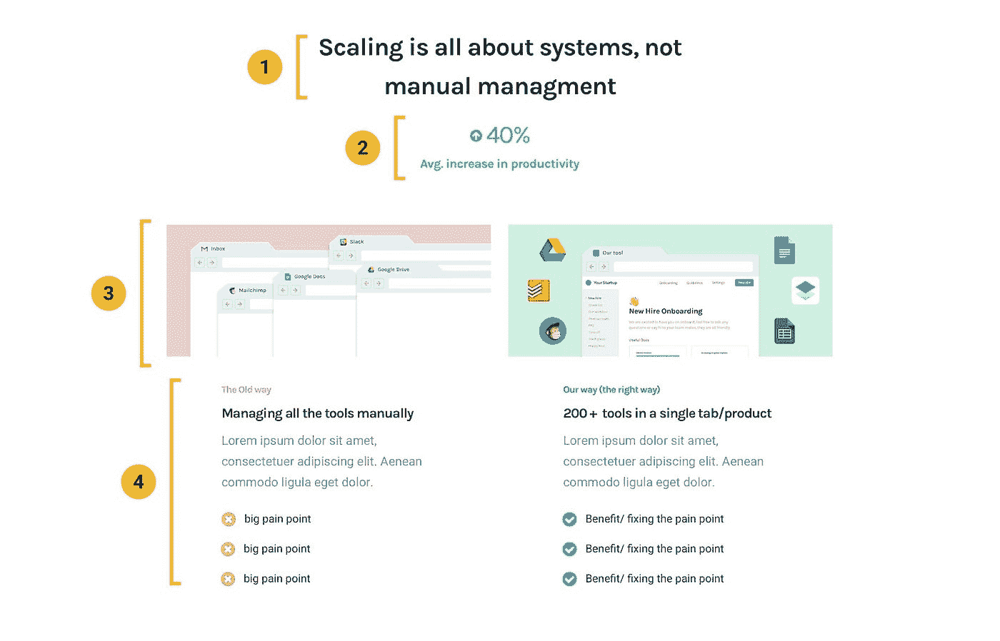

1.  **标题** —确保你提出了问题或者他们当前的做事方式是如何被打破的，不要害怕在这里变得更加两极分化，因为最终这会让你的目标客户更加清楚
2.  **统计数据** —这是一种非常简单的方法，可以提供关于痛点有多糟糕、您对它们了解多少或它们可以改进多少的背景信息。这可能是你的目标客户可能不会经常意识到的，特别是当他们访问你的网站时，所以通过提醒他们他们的问题，你会使你的产品在他们眼中比你没有提供的产品更有益。
3.  **预览**——支持你所解释内容的一个简单方法是至少有一张图片。即使你没有设计技巧，你也可以使用一个截屏，上面有很多通知，一个繁忙的收件箱，混乱的标签页，或者任何你的目标客户可能涉及到的东西。
4.  **文案**——使用与标题中的文案相同的结构，并确保你能尽可能简要地解释要点，你甚至可以使用那些红色标志来使其更加突出，从而更容易被阅读。

**其他例子(** [**我的网站**](http://www.cortes.design) **)**

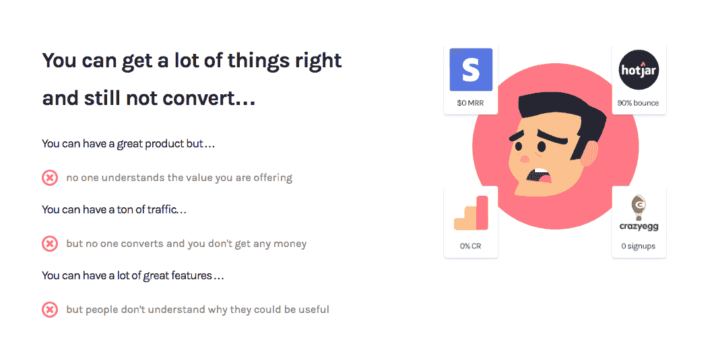

[Introducing the problems of my target clients](http://www.cortes.design)

看看我如何利用我的目标客户可能遇到的问题，即使他们在理论上做了很多正确的事情。

这使得转化似乎成了他们成功的瓶颈，这很好，因为我解释了我如何在不久后解决这个问题，让他们将我视为解决方案。非常强大的东西！

## 它是如何工作的(也就是你的产品/服务如何解决“X 问题”)

在介绍了你可以解决的问题后，是时候展示你将如何解决它，以及解决问题或使用你的产品/服务有什么好处了。

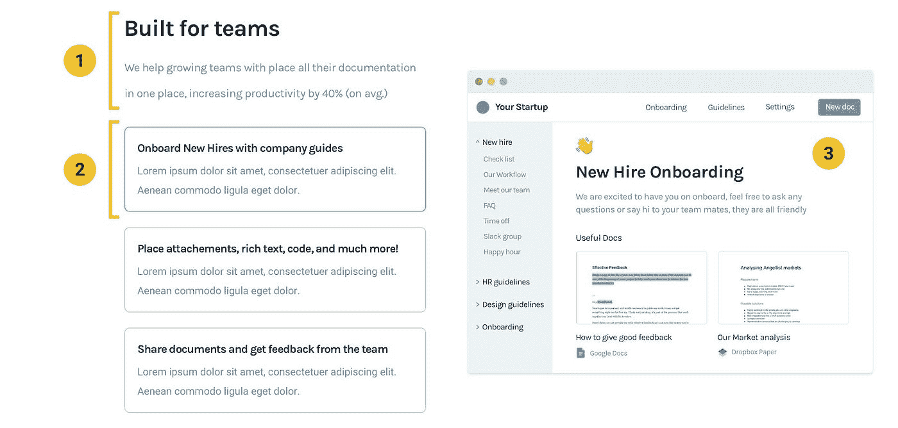

1.  **标题** —用它来吸引更多的注意力，或者作为你解释问题时所用标题的对比点。例如，如果你在上一节写了“手动做 X 件事永远花不完”，试着写类似“我们自动完成你手动做的 X 件事”。
2.  **解释** —确保你要么一步一步地(最好是 3-5 步)解释你的产品/服务是如何工作的，要么解释它是如何解决前一部分列出的 3 大问题的。确保你尽可能地具体，不要写“我们让 X 的事情更好/更快/更容易”之类的话，因为这实际上没有任何意义。

## 强化利益

向一个部分添加例子和/或统计数据来帮助支持你的解决方案有多好，这是一个非常简单的调整，可以不断向你的网站添加非常规的社会证明方式。

在这些例子中，我确保人们知道该产品可以与他们最常用的工具集成，因此再次确认这可能是他们问题的一个好的既定解决方案。

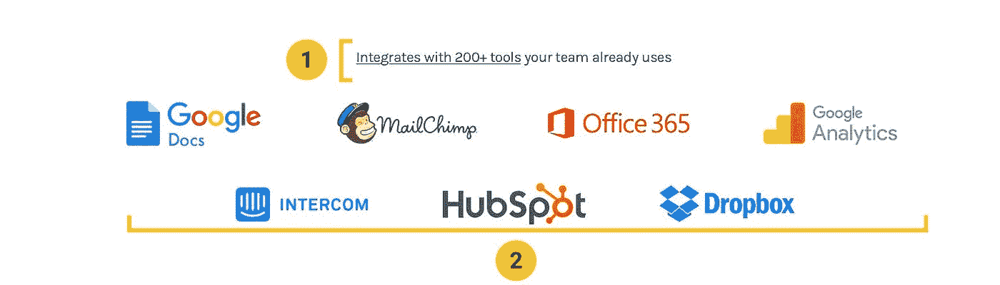

1.  就像上面解释的公司徽标一样，不要忘记介绍为什么会有徽标。这是一个很好的解释平台可以集成多少工具的地方，因为你不能在页面上放那么多徽标(尽管我以前见过一些公司这样做……)
2.  确保你使用的标志是你的目标客户最容易识别的，否则会给你留下不好的印象，适得其反。

## 告诉他们如何使用它

让人们意识到你的产品有多有价值的一个简单方法是向他们展示如何利用它来获得更好的结果。这是非常强大的，因为不是你告诉他们这有多么有益，而是他们自己意识到了这一点！

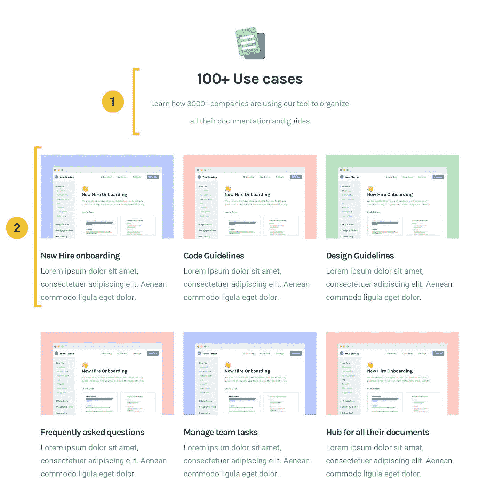

1.  **标题** —简单解释一下，这是一个解释用例的部分，确保它简单易懂。
2.  **描述—** 根据您需要解释的信息，您也可以使用这一部分来解释优势，而不是使用案例

## 更多的社会证明

既然人们已经明白你在解决哪些问题，以及你如何解决这些问题，这就是他们开始怀疑你是否真的能得到他们想要的结果的时候了，这是提出证明和案例研究的最有效时机。

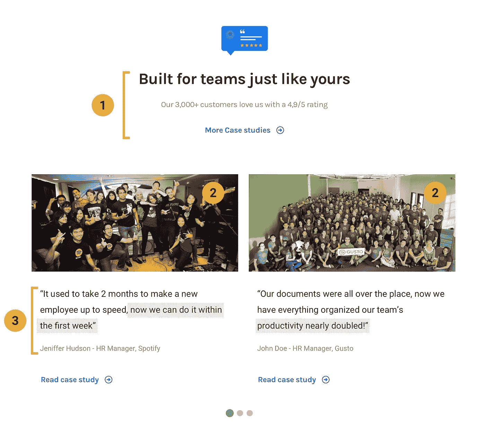

1.  **使其具有关联性**——为了让你的目标客户更加信任客户评价，你需要确保内容尽可能集中在他们(或类似的公司)身上。这表明，如果它为其他类似的公司工作过，它也必须为他们工作。
2.  **图片是强大的** —你不能相信人们会阅读推荐，但你可以展示知名人士、类似公司或比他们更大的公司的图片，以吸引他们的注意力，增加他们阅读和信任推荐的可能性。
3.  **实际客户评价** —尽可能使用结果驱动的客户评价，这是人们最终会购买的东西。尽量保持简短，高度以利益/结果为导向，这样你就可以更好地控制人们如何看待你已经提供给其他客户的价值。

## 最终 CTA

既然你花了这么大力气来解释你的产品/服务有多好，有些人会愿意转变，那么在你失去抓住他们的机会让潜在客户点击离开，永远不再回来之前，给他们一个简单的方法…

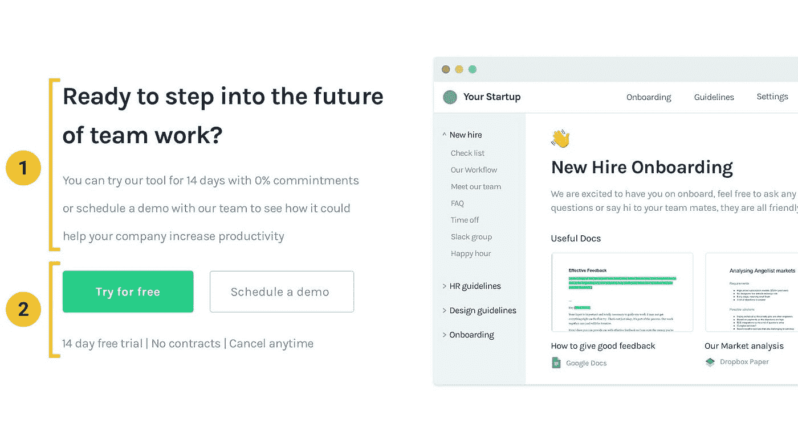

1.  **明确接下来的步骤** —确保你对点击 CTA 后的下一步有所了解，这样人们会认为这是一个较小的承诺，因此更有可能点击完成。
2.  **明确 CTA—**总是要有可见且简单的 CTA，这样人们就可以找到他们，并对他们是否转换做出更好的决定。由于一些潜在客户会比其他人有更多的异议或更少的耐心，所以添加承诺较少但仍能抓住这些销售线索的替代 CTA 总是一个好主意(就像您在这里看到的安排演示一样)。

## 替代 CTA

不同的人会有不同的问题，甚至或多或少可能会转化，这些替代/较低承诺的 CTA 旨在抓住一些线索，如果你不使用它们，你可能不会抓住它们(即使它们在漏斗中处于较高位置)

**专注于演示和与团队的对话**

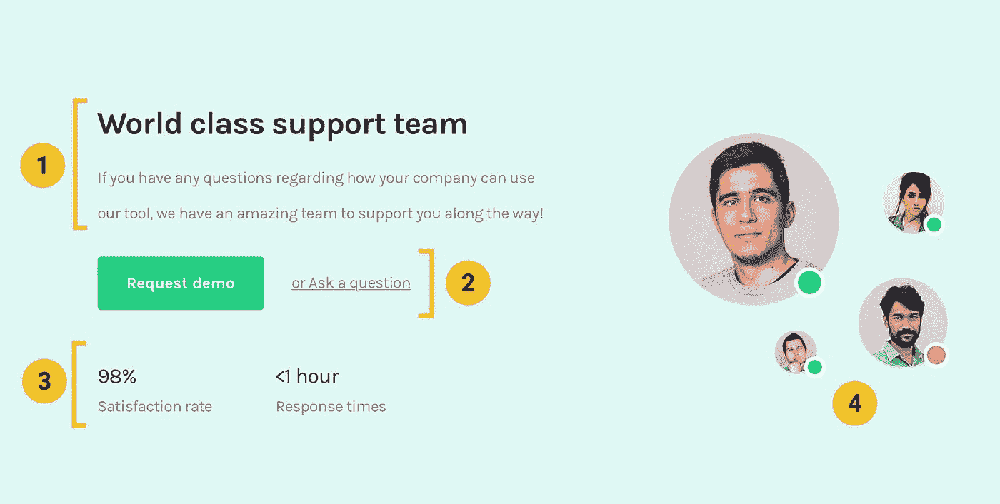

1.  我解释了为什么他们应该联系或安排演示，同时提到团队中有人只是为了支持他们解决问题，这比简单地要求他们安排演示要有效得多。
2.  承诺越来越低的更清晰的 CTA。如果你看一下“提问”部分，它可以像发送电子邮件或使用聊天气泡一样简单，这比安排演示或自己尝试服务要容易得多，而且即使只有电子邮件或网站上的聊天，你的团队仍然能够抓住线索，并有望在以后将其转化为客户。
3.  统计数据总是有助于理解和支持你的解释，在这个例子中，快速的响应时间让潜在客户知道，如果他们问了一个问题，他/她不必做跟进工作或浪费更多的时间。
4.  没有比展示他们是谁，并提醒他们有真正的人帮助他们取得更好的结果更好的方式来显示你有一个支持团队。

## **使用铅磁铁**

如果您正在使用集客营销来获取销售线索，那么您可能已经有了一个销售线索磁铁，这也是与他们建立融洽关系并获取他们联系信息的好方法，以防您的销售/支持团队想要跟进他们，或者甚至在比小型销售团队自己更大的范围内获取销售线索。

销售线索磁铁是一种更长期的方法，但如果使用您的工具的时机还不理想，这是捕捉销售线索的一种很好的方法，此外，您肯定可以使用这里解释的两个示例，就像我在这个概念页面中所做的那样。

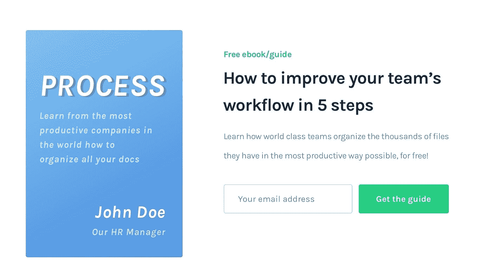

## ▶️[免费视频分解]

# 打破我用来帮助 SaaS 初创公司将访客转化为客户的漏斗

[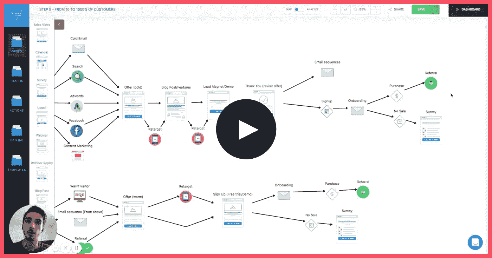](http://bit.ly/2Na6Of6)

[**下面是视频的链接**](http://bit.ly/2Na6Of6)

# 📨需要帮助你的网站创收吗？

我很乐意讨论你的问题，所以请在评论中告诉我你的现状、需求或目标👇或者…

[**服务**](http://www.cortes.design/pricing)

**想聊天？** [此处安排免费咨询](http://www.cortes.design/consultation)

**邮箱:** pedro@cortes.design

## 关于 SaaS 登陆页面的进一步阅读

你可以在我的博客上找到关于为 SaaS 优化网站的每周文章。

 [## 没有转换？以下是您的登录页面无法转换的 4 个原因

### 根据我的经验，我可以告诉你，大多数页面转换不好的原因至少可以归结为以下四点之一…

www.cortes.design](https://www.cortes.design/post/some-traffic-but-no-conversions-here-are-4-reasons-your-page-is-not-converting-any-why)  [## SaaS 登陆页面如何在几秒钟内创造黑仔印象

### 如果你不能在人们访问你的网站的前几秒钟给他们留下好印象，你就没有机会…

www.cortes.design](https://www.cortes.design/post/how-saas-landing-pages-can-create-a-killer-impression-in-seconds)  [## 打破旨在获取更多线索的 SaaS 登录页面

### 在这篇文章中，我将向你展示我是如何设计一个概念页面来捕捉线索的，在这种情况下，它是…

www.cortes.design](https://www.cortes.design/post/breaking-down)  [## 围绕异议设计登录页面！

### 在我的每一篇文章中，我都试图解释可以改进产品的通用技术…

www.cortes.design](https://www.cortes.design/post/design-landing-pages-around-objections)  [## 优化 SaaS 登陆页面的交通温度

### 这些人对你的产品、你的公司或者你如何解决他们的问题一无所知，而你可以…

www.cortes.design](https://www.cortes.design/post/optimizing-for-traffic-temperature-in-saas-landing-pages)