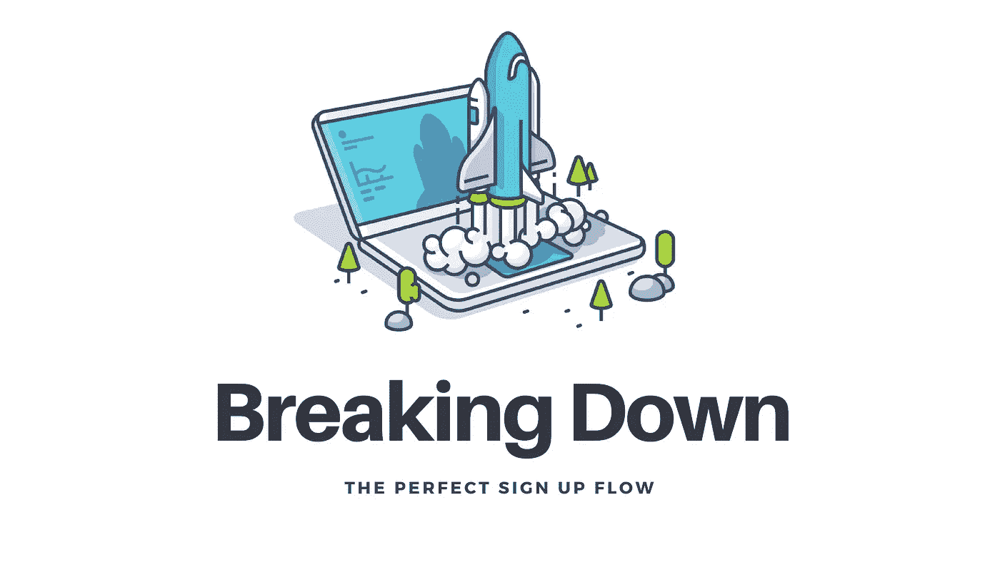
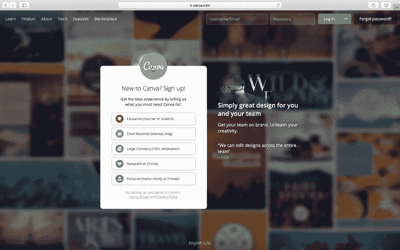
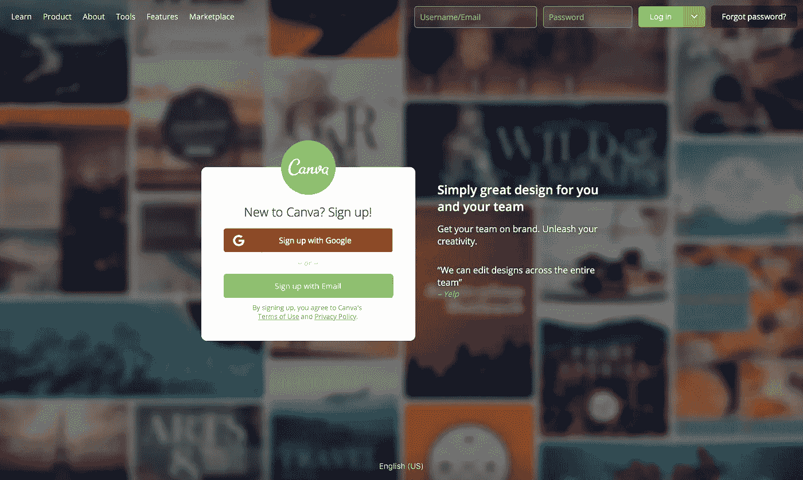
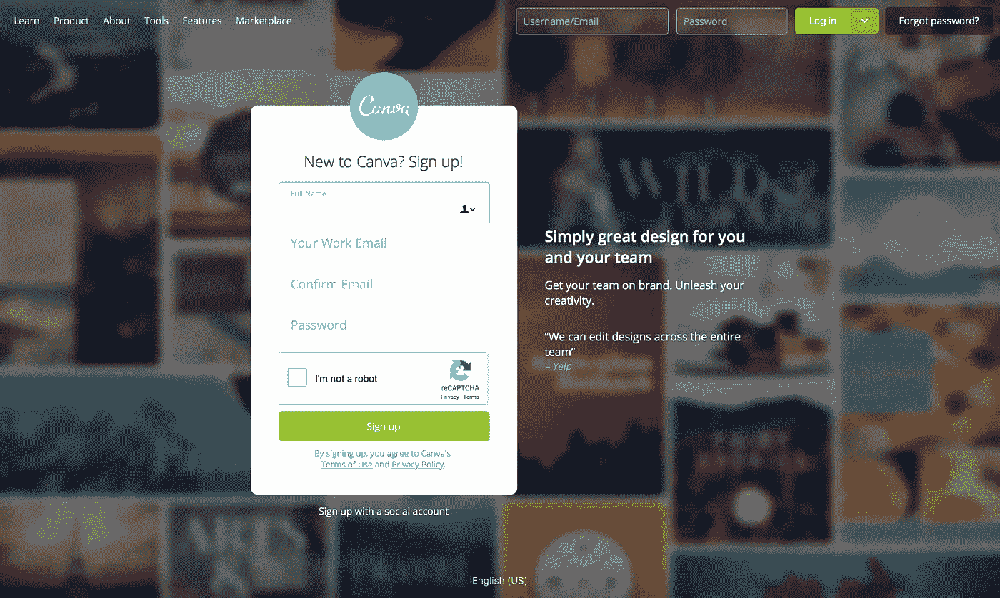
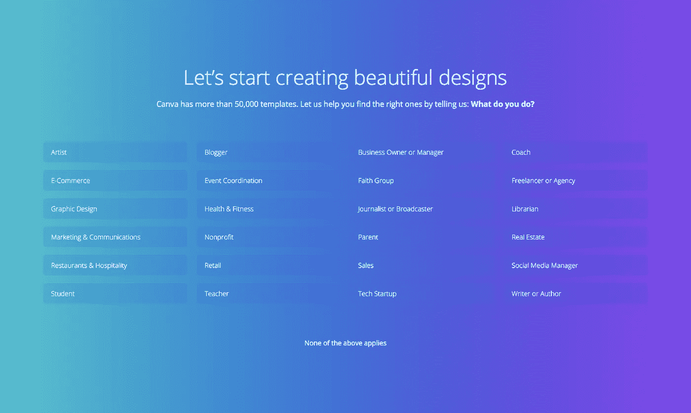
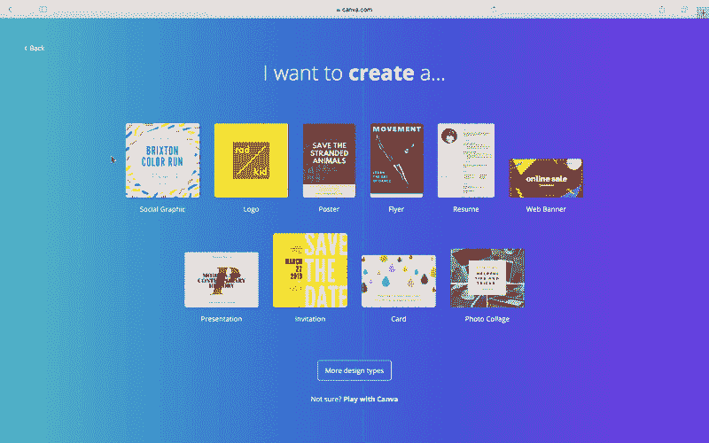
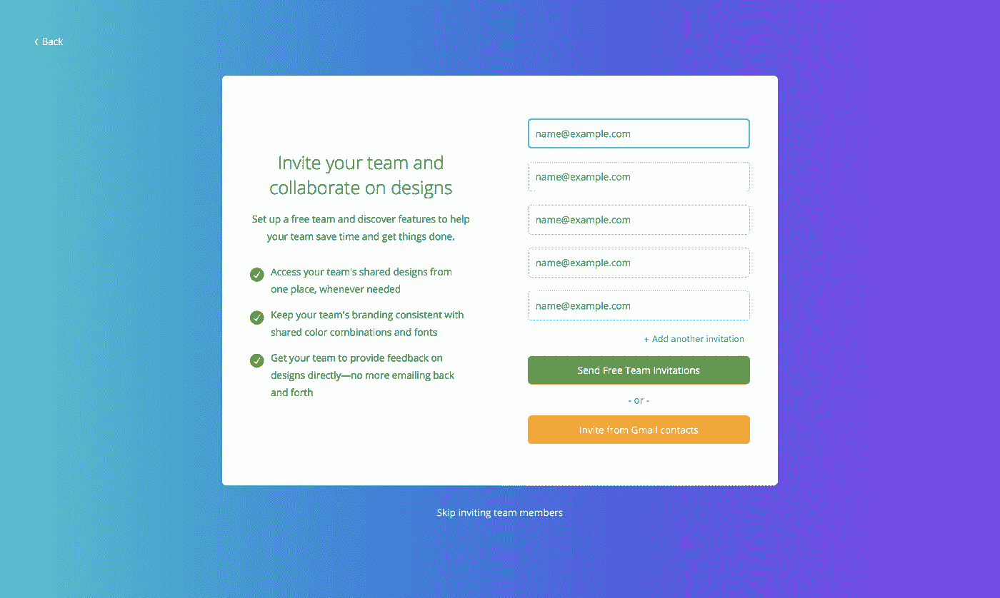
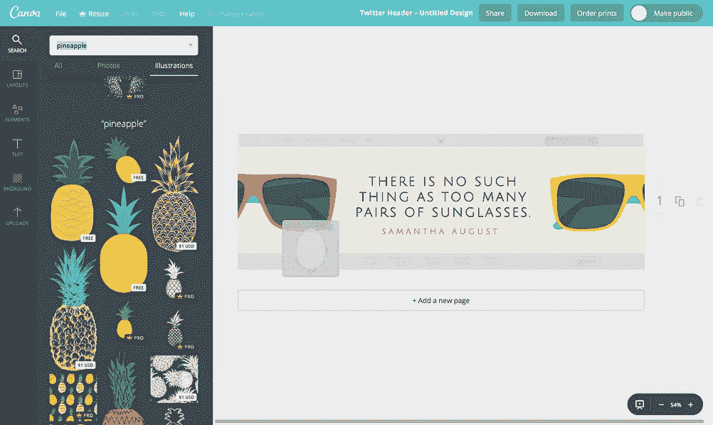
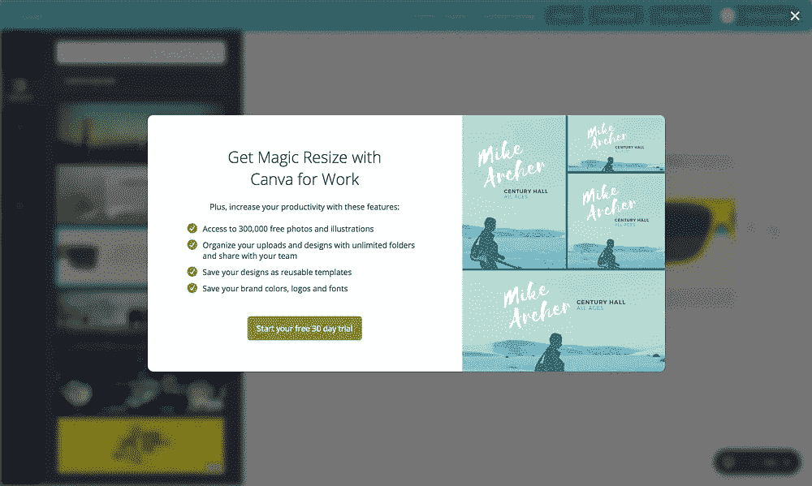
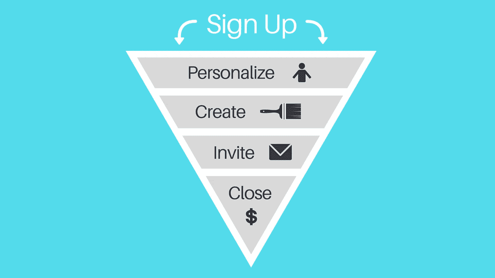

# 打破完美的注册流程

> 原文：<https://medium.com/hackernoon/breaking-down-the-perfect-sign-up-flow-92a1f74c9f85>

如果说我从与[免费增值](https://hbr.org/2014/05/making-freemium-work)用户的合作中学到了什么的话，那就是这个过程是一场有来有往的游戏。决定在数据收集和进入平台的便利性之间找到正确的平衡本身就是一门艺术。

测试表单、a/b 测试页面、将注册过程分成多个步骤，以及将 onboarding 集成到组合中是一个不断发展的过程。

虽然每个产品都需要运行自己的特定测试，但是通过分解[完美的注册流程](https://www.canva.com/?ref=peter_schroeder)，我们可以学到很多东西。在这个过程中，每个人都应该努力效仿的公司是 Canva。([在这里自己尝试一下](https://www.canva.com/?ref=peter_schroeder))

每个人都需要意识到的是，要有一个良好的注册流程——你需要能够引导你的用户采取一些你希望他们采取的行动，同时收集他们的信息，让他们使用你的产品。

了解 Canva 如何在注册过程中找到完美的平衡。👇

# 1.注册过程

在对表单和页面产生兴趣之前，不要忘记第一步——实际上是注册用户。

[Canva’s sign up page](http://www.canva.com?ref=peter_schroeder) (also their homepage)

这是 Canva 的注册页面[☝️，这里有几个需要注意的地方。](https://www.canva.com/?ref=peter_schroeder)

*   约占屏幕 25%的主要行动号召(CTA)是注册一个帐户。这使得你应该采取的行动很清楚，这是注册一个帐户。
*   马上，他们让你自己选择你的用例。
*   他们清楚地传达了注册的好处以及喜欢该产品的用户的社会证明。
*   有一个切换语言的选项。
*   在菜单中，有额外的选项可以导航到对你来说可能很重要的任何地方(如果你还没有准备好注册。)

接下来，你可以选择用 Gmail 或其他电子邮件地址注册。

在这里，他们让你选择填写一个简单的表格或注册一个社交账户。(如果你选择用你的邮箱而不是 Gmail 账户注册的话)注意，他们给出了很多进入产品的方法，但只有一种方法是明确的。

他们为你设计了一条路，但是如果这条路不适合你，他们也有额外的选择。

# 2.产品个性化

既然他们已经知道了您的用例，他们希望对您的数据进行更细致的分析，以了解您具体做了什么。这些数据有助于他们为您提供一套定制的模板，他们知道您可能会使用这些模板。

对于他们在你身上收集的每一个数据点，他们都能够为你提供更加个性化的体验。这类似于[网飞根据你看过的节目和电影对他们的图像](https://fstoppers.com/lifestyle/netflix-personalizes-images-movies-youre-browsing-208573)所做的事情。

他们用不了多久就会利用他们收集的关于你的数据。既然他们帮了你:

1.  创建一个帐户
2.  自我识别您的用例
3.  定义你的角色

[Canva](https://www.canva.com/?ref=peter_schroeder) 利用这些数据为您量身定制您会喜欢的模板。这种程度的个性化几乎可以保证你会进入下一步。

# 3.创造/使用产品

是什么让人们从免费试用变成付费用户？当人们看到产品的价值时，他们愿意购买产品(无论价格如何)。如果他们看到你的产品可以帮助他们在日常生活中节省时间/金钱，他们就会购买。

(CCA 是由可证伪的假设定义的一组故事驱动的行为，当在试验期间作为一组完成时，会导致转化。— [林肯·墨菲](http://www.slideshare.net/lincolnmurphy/a-saas-metric-designed-to-increase-free-trial-conversions))基本上，CCA 是用户正在做的一系列行动，展示你的服务的价值(导致他们从免费用户转变为付费用户)

没有什么比用产品创造出你绝对喜欢的东西更有价值的了。

这是入职过程中我最喜欢的部分。一旦你通过了测试并准备开始设计，他们会用 30 秒的演示向你展示如何使用产品。

这不仅是一个超级简单的产品使用，但他们走你到底如何使用它。Canva 做了一项了不起的工作，让用户从自满转向创造为他们提供价值的内容。

# 4.邀请同事/同事

在注册过程中，可以选择[邀请您的团队](https://www.cloudsponge.com/blog/platform-invitation-guide/)使用 Canva。

大卫·w·麦克威廉和大卫·m·查维斯称这种行为为“[社区意识](http://gageparkhs.enschool.org/ourpages/auto/2011/5/7/37616703/Sense%20of%20Community-McMillan%20and%20Chavis.pdf)”，他们用下面的陈述描述了这种行为(引用在[大卫·斯宾克斯](http://thecommunitymanager.com/2013/11/19/the-psychology-of-communities-4-factors-that-create-a-sense-of-community/)之后):

> *“社区意识是一种成员拥有的归属感，一种成员对彼此和群体都很重要的感觉，以及一种成员的需求将通过他们在一起的承诺得到满足的共同信念。”*

根据两位研究者的说法，我们属于:

*   分享个人的归属感，
*   对其他人有影响，
*   满足我们归属的需求，
*   与其他成员分享情感联系。

注册过程中这一聪明而有效的步骤为产品创造了一种“病毒”效应，并有助于成倍增加用户增长和保持。

# 5.成交

一旦你进入 [Canva](https://www.canva.com/?ref=peter_schroeder) 并开始创作，你会发现这是一个美丽而简单的产品。它解决了我生活中的痛苦，免费版本满足了数百万用户的需求。

Canva 并不是一个免费的工具。他们的存在是为了赚钱，他们在创造[捕鼠器](https://www.fastcompany.com/3017123/the-myth-of-building-a-better-mousetrap)以获得付费订阅方面做了大量工作。

从自定义插图，到透明背景，再到智能图像大小调整— [Canva](https://www.canva.com/?ref=peter_schroeder) 为付费客户保留了他们最好的功能(这是公平的。)

[Canva](https://www.canva.com/?ref=peter_schroeder) 是少数几个大多数人可以通过使用其免费版本 *forever* 获得的工具之一。我觉得这个策略非常棒。他们真的抱着[给、给、给、给、问](https://www.inc.com/gary-vaynerchuk/askgaryvee-episode-73-give-away-best-work.html)的心态。

放弃这样一个有用的免费工具鼓励了病毒的增长。见鬼，我告诉过数百人 Canva T1 有多棒。我用了大约一年的免费工具，最终升级到付费订阅计划(我最喜欢的付费工具。)

# 摘要

这里是简化版的 [Canva](https://www.canva.com/?ref=peter_schroeder) 的注册流程，在一个漏斗中可视化。

总的来说， [Canva](https://www.canva.com/?ref=peter_schroeder) 是一个任何人都可以利用的神奇工具。从营销人员，到社交媒体经理，到教师，到设计师。我鼓励每个人在这里创建一个免费账户来试试看——https://www.canva.com/

让我知道你的想法！🤗

由[带给你的 API 经济](https://www.apifirst.tech/welcome?ref=medium)。

