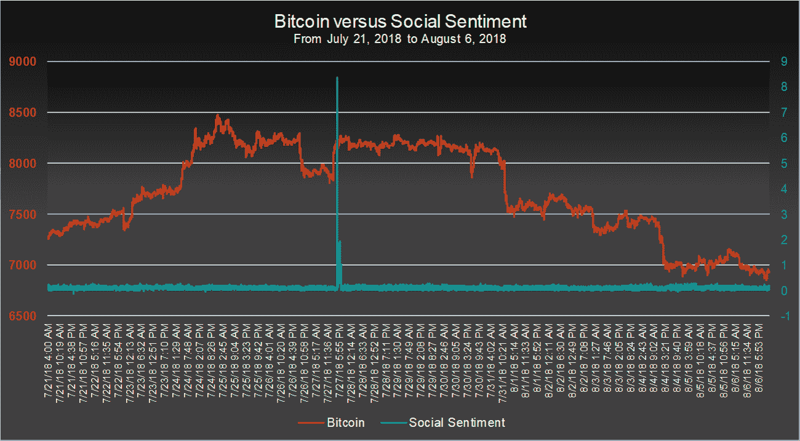
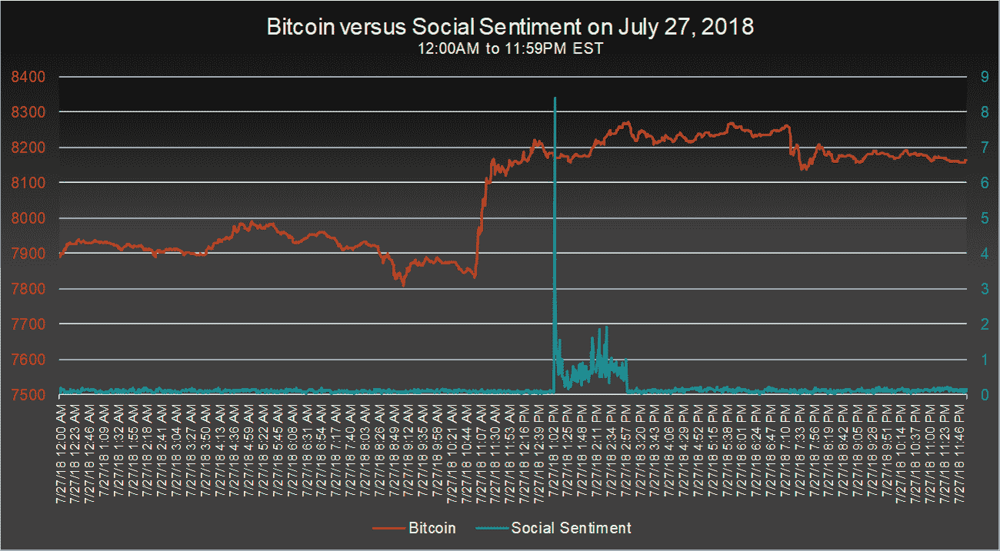

# 突发新闻:人工智能检测到比特币市场操纵

> 原文：<https://medium.com/hackernoon/breaking-news-bitcoin-market-manipulation-detected-by-artificial-intelligence-a4534b7be369>

2018 年 7 月，[加密货币交易 SaaS 工具 RoninAi](https://www.roninai.com) 正在开发其尖端的人工智能后端，这将是推出交易工具平台的核心。随着数据的涌入，RoninAi 团队与强大的人工智能一起分析这些数据。

虽然迹象非常有希望，但团队和人工智能都注意到 7 月 27 日美国东部时间下午 1:00 到 3:00 之间有一些非常奇怪的事情。就在这两个小时里，加密货币(尤其是比特币)的价格出现了突然和出乎意料的上涨。该团队每分钟都在跟踪事态发展，数据不断涌入，这使得不可否认的是，市场正在发生明显的操纵，RoninAi 看到了肉眼看不到的坐标操纵的每一个部分。

虽然比特币价格的正飙升并不是这个市场的一个不同寻常的特征，但该团队一致认为，这一特定的飙升是奇怪的，肉眼看到的所有迹象都将导致比特币价格下跌的结论。利用 RoninAi 的数据收集和预测能力，RoninAi 团队能够得出结论，在这两个小时里，比特币的价格受到了非常有针对性和协调的操纵。

**roni nai 如何收集数据**

RoninAi 收集了超过 100 个因素的数据，其中之一是社会情绪。社会情绪最近被一个由教育机构组成的[联盟](https://www.stevens.edu/news/how-social-medias-powerful-silent-majority-moves-bitcoin-prices)证明是比特币每日价格波动的关键驱动因素之一。RoninAi 进一步采取了一些措施，解析各种各样的社交内容，从 Twitter 到学术写作，传统的交易信号以及介于两者之间的一切。然后，它使用隐藏的成功算法(以及它创造的新算法)对当前的社会情绪进行排名，从-10 到 10，10 是最积极的。

**为什么这个尖峰如此奇怪**

7 月 26 日，就在这次攻击的前一天，美国证券交易委员会(SEC)拒绝了比特币 ETF，这被广泛视为世界上最大的加密货币的挫折，但从长期来看，这不会产生很大的负面影响。

在比特币(或任何加密货币)的短期未来出现一些负面消息后，价格往往会出现短暂下跌，这种情况也不例外。这一消息发布后，比特币经历了 5%的快速下跌，稳定在 7800 美元至 8000 美元之间。在不久的将来，这一价格预计将保持在这一水平左右，但在 7 月 27 日，在没有明显原因的情况下，比特币飙升至下跌前的水平。

**人工智能如何知道这是协同操作**

由于 [RoninAi](https://www.roninai.com) 不断分析社会情绪数据，它认识到随着这一高峰的到来，社会情绪发生了巨大变化。下图显示了相关时期比特币的价格，以及 RoninAi 对社会情绪数据的分析:

可以清楚地看到，RoninAi 所做的社会情绪分析显示了几天来总体上中性的社会情绪，但在这两个小时的时间窗口内，它达到了 8.0 以上，这表明社会情绪出现了极其急剧的积极上升，这不可能是由社会情绪的自然变化引起的。相反，唯一合乎逻辑的解释是，有一种协调一致的努力，作为一种盈利手段，直接影响比特币的短期价格，这种努力被称为“抽水和倾倒”。仔细观察该图，可以看到这一特定的泵送和倾倒时间段:

当 RoninAi 团队进一步研究这种异常时，他们发现社会主观性得分也达到了最高点，这意味着在这段时间内被分析的社会情绪特别主观，这表明狂野和未经证实的理论正在被推出。

所有这些数据让 RoninAi 团队准确地得出了人工智能在这段时间内得出的结论:一群人故意操纵比特币市场，以此作为快速赚钱的手段。他们的策略有些超前，因为许多人不知道社会情绪对决定比特币价格的影响有多大。

**我们何去何从**

对于大多数人来说，这个消息无疑会有点令人不安，特别是那些参与加密货币交易的人，但 RoninAi 能够立即检测到这一点的好消息应该会给人带来希望，即人工智能有能力在这些有意操纵发生时准确定位它们。

这可能不是最近发生的唯一一次有意操纵市场的行为，如果未来没有任何类似的尝试，那将是令人惊讶的。目前，加密货币交易商必须考虑到这一点，并通过像 RoninAi 这样的交易工具找到一些方法，保持对这些类型事件的控制，甚至利用这些事件。