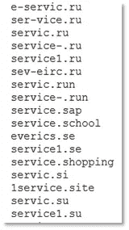
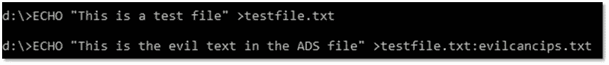
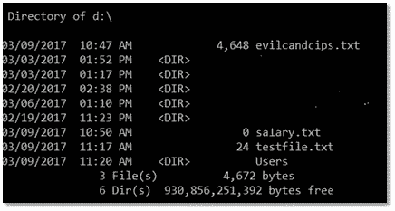
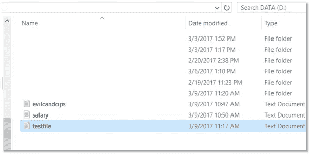
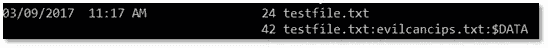
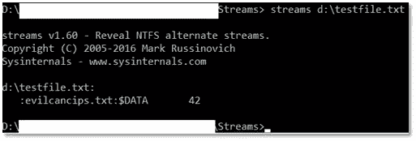
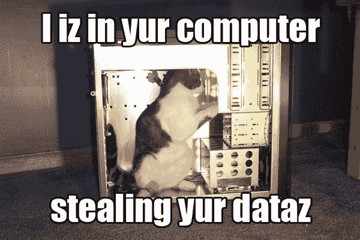
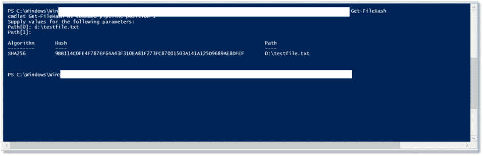
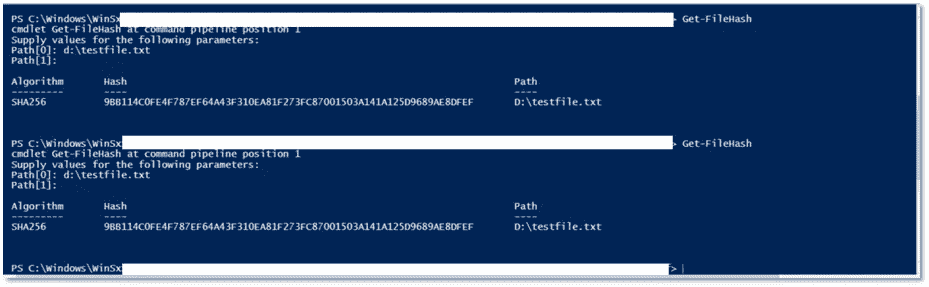

# 破坏 NTFS 流的哈希完整性

> 原文：<https://medium.com/hackernoon/breaking-software-integrity-with-ntfs-streams-fe4a1b13d2da>

F*ck software integrity

出于安全目的，许多应用程序使用哈希来确保软件完整性。在基于 Windows 的 NTFS 文件系统上，有一个弱点。文件可以隐藏在文件内部或后面。在某些情况下，这些隐藏文件可以被散列并保持隐藏。感兴趣了吗？幸运的是，维基解密在 2016/17 年的一次大规模披露中泄露了一份旧的中情局行动手册的一部分。一个漏洞技术引起了我的注意，[在 NTFS 数据流中隐藏数据](https://wikileaks.org/ciav7p1/cms/page_13763461.html)。缺少完整的说明；然而，由于我们中的一些人已经秘密地享受使用这种技术很多年了，是时候传播这种快乐了。早在 2013 年，微软就从开发者的角度在上面发布了一个[博客](https://blogs.technet.microsoft.com/askcore/2013/03/24/alternate-data-streams-in-ntfs/)。不是邪恶的(穿上帽衫)黑客视角。快，躲在邪恶黑客的被窝里，一切都会好的。我们要达到中情局的水平，打破一些禁忌。

Self explanatory…

让我们比无意中起草的 MS 博客文章更进一步，在驱动器的根目录上添加一些散列。微软已经推出了一款名为[SysInternals Streams.exe](https://technet.microsoft.com/en-us/sysinternals/bb897440.aspx)的工具，可以免费下载，用于这项技术。它可以帮助检测 NTFS 流并验证结果。

如果攻击者想在众目睽睽之下隐藏数据，根据情况和目标，这是一个可以考虑的狡猾的小方法。NTFS 替代数据流(ADS)也被称为[分叉](https://en.wikipedia.org/wiki/Fork_(file_system))。是的，它过去曾被恶意使用，很好的问题。我决定用完整的说明更新最初的帖子。然后进一步向您展示如何通过使用 SHA256++和 NTFS ADS 来破坏文件完整性。

***And Ants***

*格式化后的中情局行动手册，供你阅读愉悦。*

**NTFS 备用数据流(ADS)**

[*渗透*](https://www.techopedia.com/definition/14682/data-exfiltration) *，操纵软件和文件完整性，混淆*

**驱动器根上的备用数据流**

这取决于目标和系统配置。NTFS 备用数据流(ADS)应被视为隐藏数据和避开保护或警报的可行方法。尤其是在保护严重依赖或依赖文件哈希作为验证文件完整性的方法的情况下。无论是为了渗透、操纵诚信、混淆视听还是普通交易。非常适合绕过许多安全控制，深入目标网络。

有几种方法。最简单的方法之一是从命令提示符。在硬盘目录的根目录下工作。如果您已经可以远程访问受害者，这也可以远程完成。

**获得本地或远程访问受害者的权限**

以受害者 D:数据驱动器为例，由于权限有限。攻击者有一个 IP 地址文件，除了卡巴斯基的列表之外，这些 IP 地址是与 [StoneDrill](http://www.miamiherald.com/news/nation-world/world/article130131929.html) 和 NewsBeEF 相关的额外命令和控制域。作为有针对性攻击的一部分，攻击者需要悄悄地将该列表放到受害机器上。攻击也可以通过 PowerShell 或批处理文件来完成。一旦批处理文件在系统上，重命名它们以绕过安全控制通常是很容易的，只需要有限的访问。如果它是一个可执行文件，你也可以在 PSExec.exe 中使用这种技术。许多反恶意软件和其他保护将捕捉 PSExec，但并不总是如此。

*Sample contents of the evil file*

**执行 NTFS 广告并隐藏邪恶文件**

在受害机器上打开本地或远程命令提示符。攻击者，为了使用方便。将命令和控制服务器的文本文件放在 D 的根目录下，命名为 evilcancips.txt

创建您想要隐藏邪恶文件的文件。在这个例子中，我们将调用这个文件: **testfile.txt** 。在根目录下键入以下命令。该命令首先创建无辜文件。第二个命令将邪恶的文件隐藏在看起来无害的文件后面。

**ECHO "这是一个测试文件"> testfile.txt**

**ECHO“这是广告文件中的恶文”>testfile . txt:evil cancips . txt**

**验证 NTFS ADS 流工作正常**

检查目录在命令提示符下显示的内容。它看起来应该和 NTFS 广告之前一样

该目录在 GUI 中的样子

虽然可以在命令提示符下轻松显示 ADS NTFS 流/分支。这超出了普通用户的水平，也是最技术性的。作为一种攻击或间谍手段，这种技术仍然有些晦涩难懂。Windows 的 GUI 部分不容易显示 NTFS ADS 文件。

在命令提示符下，确保 NTFS ADS 流正常工作。它将显示与原始文件的双线，然后显示隐藏的文件。

**方向/r**

练习时，也要使用 Streams.exe 进行验证。在本例中，安装了 Streams.exe。

打开命令提示符，将工作目录加载到 Streams 所在的位置。然后对看起来无害的文件执行流:testfile.txt

**流 d:\testfile.txt**

**哈希验证文件完整性**

确保你把邪恶文件藏在受害者的机器上。在 NTFS ADS 之前哈希无害文件，记录哈希。PowerShell 中的默认哈希级别是 Sha256。因为现代基于 Windows 的受害者机器有 PowerShell。散列不需要额外的工具。攻击者不需要成为管理员就可以使用 PowerShell 来散列文件。在此示例中，PowerShell 不是以管理员身份运行的。大多数用户和企业管理员仍然不熟悉 PowerShell，并且将功能默认配置为攻击者可以利用的方式。

在 PowerShell 提示符下，使用 cmdlet **Get-FileHash** ，然后使用原始文件所在的 **-Path** 。

**Get-file hash-Path d:\ testfile . txt**

在 NTFS 广告之后，在隐藏邪恶文件的地方再次散列原始文件。

哈希将显示相同的哈希。**9 bb 114 c 0 Fe 4 f 787 ef 64 a 43 f 310 ea 81 f 273 fc 87001503 a 141 a 125d 9689 AE 8 dfef**

如果受害者使用大多数现代 Windows 使用的 NTFS 文件系统。任何人都可以将任何恶意文件隐藏到根目录下的一个无害文件中，如示例所示。受害者和攻击者都不能在 GUI 中显示隐藏的文件。防御是基于目标保护机制是否能够识别邪恶的文件或行为。很少使用**方向/r** 。该文件可以隐藏和散列与 MD5，SHA1，沙 256 等…邪恶的文件将看起来隐藏。在对目标进行现场测试之前，可以很容易地重新创建和实践这种技术。

**结论**(暗示邪笑)

依靠散列来保证文件完整性并不能完全减轻这种风险或攻击技术。通过给人一种限制风险的假象，哈希过程在某种程度上进一步隐藏了数据。许多安全产品依赖哈希来保证文件完整性。这是公认的最佳实践。现在每个人都知道它可以在特定条件下被操纵。就像许多安全研究人员担心政府囤积漏洞或被狡猾的罪犯滥用一样。我 2012 年写的关于这个话题的论文是保密的。她会很快变得邪恶。看看谷歌，他们变得如此邪恶，他们不得不改变他们的名字。

2012 , that’s almost last century!

我想我不再需要那个密码或加密那份旧文件了。感谢中情局和维基解密:-)

享受阅读，留下一个掌声(或 50)，并进入评论。加入我的 [Goodreads](https://www.goodreads.com/author/show/17044584) 阅读一本好书或 [Peerlyst](https://www.peerlyst.com/users/chriskubecka/info?trk=user_dropdown) 进行技术社区讨论。