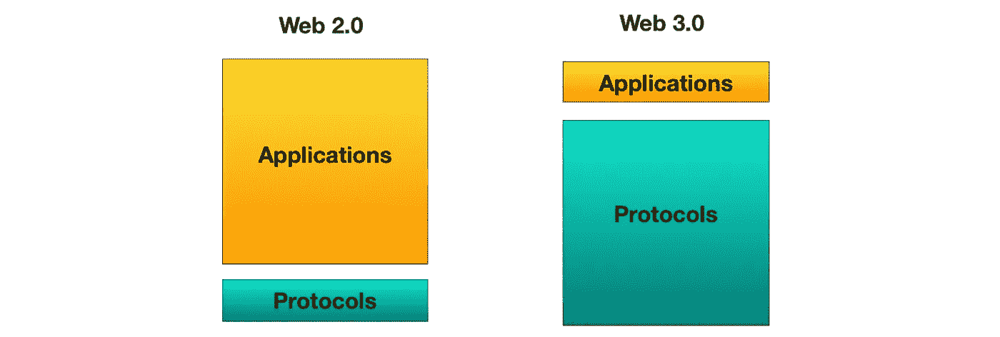

# 打破僵局:IPFS 速成班，以太坊和未来的 Fat 协议

> 原文：<https://medium.com/hackernoon/breaking-the-ice-a-crash-course-in-ipfs-ethereum-and-fat-protocols-of-the-future-eb9bd15eb96e>

如今组织是必要的。我们列出长长的购物清单，发送关于工作的详细电子邮件，并在手机上花费数小时。我们希望通过提高效率领先一步。

我们工作时的交流方式取决于信息的类型。我们使用 Asana 列出待办事项清单，并与同事分享，使用 Slack 等工具讨论问题，使用 Google Hangouts 查看。这些产品涌现得如此之快，以至于我们认为它们是理所当然的，并期望不断改进。

建立科技公司就像建造摩天大楼。在最早的日子里，你只能看到泥土和混凝土块，而基础是奠定。看起来什么都没做。如果基础建立得正确，这些公司就会随着指数增长而迅速崛起。

我们倾向于认为基础是牢固的。毕竟，最热门的科技创业公司往往会使用最新的技术。它们也是由最聪明的人建造的。然而，问题是基金会内部的技术可能会过时。

当你在电脑上打开一个网页浏览器并导航到一个网站时，你可能习惯于看到“https ”,或许还会看到上方工具栏上的一把锁。HTTPS(最初是 HTTP:超文本传输协议)是由 Netscape Communications 于 1994 年开发的。从那以后，它在网络上的受欢迎程度大幅增长。根据 StatOperator.com 的数据，截至 2018 年 4 月，Alexa 排名前 100 万的网站中有 33.2%默认使用 HTTPS。HTTPS 是网络的支柱之一，支持客户端-服务器交互。

然而，HTTPS 也有一些缺点。例如，用户必须信任证书颁发机构，该机构只能担保合法网站。客户机-服务器系统也以集中的方式存储信息，在这种方式下，信息可以被修改，而不需要服务器所有者的任何通知。我们经常在网上看到这种情况。也许你是一个 Youtube，厌倦了 Youtube [将你的视频去货币化](https://www.youtube.com/watch?v=HZakJFqdpRY)并不断改变规则。或者想想上一次你因为你最喜欢的网站关闭而感到沮丧的时候，比如最近的 [Youtube 宕机](https://heavy.com/tech/2018/10/youtube-down/)。集中化意味着在没有任何通知或责任的情况下，信息可能变得无法访问或更改。

我们将当前版本的互联网称为“Web 2.0”。它关乎社交互动、用户生成的内容、兼容性和易用性。然而，这与隐私和言论自由无关。

# 迈向新的基础

就互联网而言，有多个技术项目旨在打破现状。网络的下一个版本“Web 3.0”将包含更多面向隐私、去中心化和民主化的功能。这里有一些关键技术，它们将在网络的下一阶段发挥重要作用。

# IPFS

星际文件系统 (IPFS)是一种存储文件的分布式方式。 [IPFS](https://ipfs.io/) 由[协议实验室](https://protocol.ai/)开发，这是一家总部位于三藩市的公司，发布旨在改善互联网工作方式的开源软件。根据协议实验室的说法，IPFS 是“一个对等超媒体协议，使网络更快、更安全、更开放。”

当与区块链结合使用时，IPFS 是一个很好的文件存储解决方案。IPFS 的网页包含了关于这两种技术之间自然同步性的说明:

*IPFS 和区块链是绝配！您可以使用 IPFS 处理大量数据，并将不可变的永久 IPFS 链接放入区块链事务中。这将为您的内容添加时间戳并保护其安全，而不必将数据放在链上。*

事实上，区块链的初创公司已经在使用 IPFS 存储文件。例如，分散式文件共享服务 [Filecoin](https://filecoin.io/) 使用 IPFS 以分散的方式存储文件。这些目前在以太坊上存储太贵了，所以 IPFS 是一个很好的解决方案。IPFS 也是管理文件的一个很好的方式。即使以太坊能够廉价地处理大文件，IPFS 的文件管理工具也能保持其相关性。

这是来自 Protocol Labs 的演示，展示了 IPFS 的易用性:

# 以太坊

以太坊是一个运行应用程序的去中心化平台。智能合约决定了这些应用程序的规则。这些契约是用 Solidity 编程的，Solidity 是一种面向契约的编程语言。推动以太坊平台的本地货币“以太”目前的市值超过 179 亿美元。以太坊自 2014 年成立以来，估值有了显著增长。

把以太坊智能触点想象成在新的去中心化互联网上决定规则和行动。配合像 IPFS 这样的文件共享工具，开发者现在可以运行连接到 P2P 文件共享服务的分散式智能合约。当你使用以太网时，你需要付费使用以太网来执行这些智能合约的部分功能。以太坊的开发者社区正在研究支持每秒更多交易的方法，这样更多的人就可以廉价地使用网络。

有很多简单的方法可以开始学习更多关于以太坊的知识。了解[如何通过简单的几步创建自己的加密货币令牌](https://blog.elixirtoken.io/how-to-create-your-own-cryptocurrency-token/)，或者[如何通过空投建立一个巨大的社区](https://blog.elixirtoken.io/how-to-build-a-huge-community-with-a-crypto-airdrop/)。

# Fat 协议

在一个典型的“互联网堆栈”中，大部分价值都是在顶层获取的。我们在像谷歌和脸书这样的公司身上看到了这一点，他们通过使用像 HTTPS 这样的协议构建应用程序赚了很多钱。

有趣的是，对于区块链，大部分价值都是在协议层捕获的。我们通过观察各种代币的市值来了解这一点，没有一种代币的市值超过以太坊数十亿美元的市值。由于用户还需要付费来运行智能合约和分散式应用程序，随着令牌的蓬勃发展，该协议将变得更加强大。

在 Web 3.0 中，价值在网络中的贡献者和参与者之间共享，而不是在几个大型应用程序之间共享。这是网络的一个根本性转变，把用户放在第一位。这意味着今天的科技巨头需要更好地照顾他们的用户，如果他们明天还想保持相关性的话。