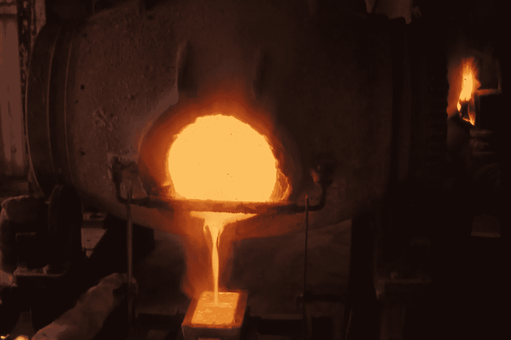

# 连接密码市场

> 原文：<https://medium.com/hackernoon/bridging-the-crypto-markets-1d9f64a14803>

## ICO 面试

> 披露: [**元宝币**](https://goo.gl/Wjupvq) **，**将密码与传统金融联系起来的生态系统，此前曾赞助过黑客正午。

*今天，我们将采访* [*元宝币的 CRO·扎伊德·马德巴克*](https://www.linkedin.com/in/zeidmadbak/) *来讨论元宝币的进展，为什么加密货币比传统货币更有能力创建一个更好的金融系统，以及一个新的金融系统会是什么样子。*

[**大卫·斯穆克**](https://medium.com/u/7f91547ce9c9?source=post_page-----1d9f64a14803--------------------------------) **:传统金融机构对加密热潮准备不足吗？**

扎伊德·马德巴克 *:* 当前的金融体系没有崩溃，所以没有人试图去修复它。然而，它有许多方面可以改进，它缓慢、昂贵且不可靠，这导致它不能被接受，因为它不能满足人们提供优雅和无缝服务的需求。我们现在拥有的是一个集中化的行业，企业拥有信息和流程。

> 加密热潮顺应了新的消费趋势；透明度和效率导致了权力下放时代。

**与传统货币相比，加密货币的哪些功能使其更有能力创建公正的金融体系？**

> 主要是加密货币拥有的一切都比传统货币领先一两步。举几个例子:**速度、效率、透明度**和**控制信息**和价值。

在这个快速的世界里，我们不应该接受非即时的汇款，或者不能抓住投资机会，因为不同市场之间转移价值的效率低下。区块链和加密货币的创新将彻底改变金融业，而元宝币将成为该领域的先锋。

对于像元宝这样的加密市场，防止欺诈和价格操纵的最佳方法是什么？

KYC、KYC 和 KYC 也将反洗钱列入名单，以创建一个完全透明、值得信赖的生态系统，人们甚至不会考虑在相互关联的组件之间流动的每一分钱的合法性。

**元宝 2018 年第三季度 ICO 预计募资多少？**

第二轮 ICO 仍有待确定，因为可行性研究、令牌机制、监管进度等等。然而，第一阶段的生态系统必须扩展到包括完全数字化的商品交易所，这将花费至少 5000 万美元。

作为 CRO，3 年内的收入目标是什么？预计的投资回收期是多少？

鉴于我们保守的收入方法与夸大的成本，我们得出 2021 年的收入超过 8 亿美元，净收入约为 3 亿美元。与前一年相比，这些数字几乎翻了一番。至于投资回收期，我们预计不到两年。

**你能描述一下元宝币的品牌吗？对于那些不知道的人来说，** [**【元宝】维基百科上的“元宝”**](https://en.wikipedia.org/wiki/Ingot) **是“大约在 1959 年，在尼加拉瓜锡乌纳的拉·鲁斯金矿，铝锭从铸模中弹出后将熔炼的黄金浇铸成元宝。铸锭是一块相对较纯的材料，通常是金属，铸造成适合进一步加工的形状**

一个[锭](https://goo.gl/Wjupvq)本身就具有珍贵的价值，可以定制以满足任何客户需求。这同样意味着我们的生态系统，集成电路将有宝贵的价值，将升值鉴于我们的保守预测。至于生态系统，它是为了适应任何需求而创建的，因为它将为新的革命性金融行业设定标准。

**元宝币似乎有非常大量的成分参与到生态系统中，这是什么原因呢？**

为了解决我们在白皮书中提到的挑战，从不透明和缺乏流动性的市场开始，到缺乏加密退出策略，元宝币结合了 4 个主要组件，即数字银行、钱包、交易所和经纪公司，使之成为可能。

银行、钱包和经纪公司将分别作为法定资产、加密资产和传统资产的保管人。至于剩下的两个组成部分，认证机构和 ICO 加速器，我们将它们包括在内，以体现我们的核心价值观，即持续学习和社会责任。认证机构将负责教育下一代，并为他们提供学习区块链、智能合约和加密货币开发的不同方式。此外，我们将为所有通过认证机构了解区块链并希望制作自己的 ICO 的参与者提供 ICO 加速器中的不同服务，例如白皮书、技术、合法性、营销和 PR 等领域的指导，最终他们甚至可以在我们的交易所以非常低的成本列出自己的令牌。

**元宝币是如何在竞争中领先的？**

元宝币，或者更准确地说，元宝集团认为合作是创新当前市场的最佳方法。迄今为止，我们看到成千上万的 ico 试图筹集资金，最终改善他们的服务，并发现提高效率的新方法。竞争对创新或市场来说并不是坏事，但当竞争像现在这样激烈时，负面影响大于正面影响。[元宝币](https://goo.gl/Wjupvq)一直专注于与大机构打造大联盟，包括但不限于:成功和有前途的未来 ico，大学，远见者，顾问，基金和机构。

> 我们相信，通过建立这一机构，并不断分享知识和资源，我们将能够在市场上应对更多的挑战，并真正为所有参与者提供最具创新性和最高效的市场解决方案。

> 在黑客正午和[元宝币白皮书中阅读更多关于](https://www.ingotcoin.io/documents/en/white-paper.pdf)[元宝币的信息。](https://hackernoon.com/ingot-coin/home)