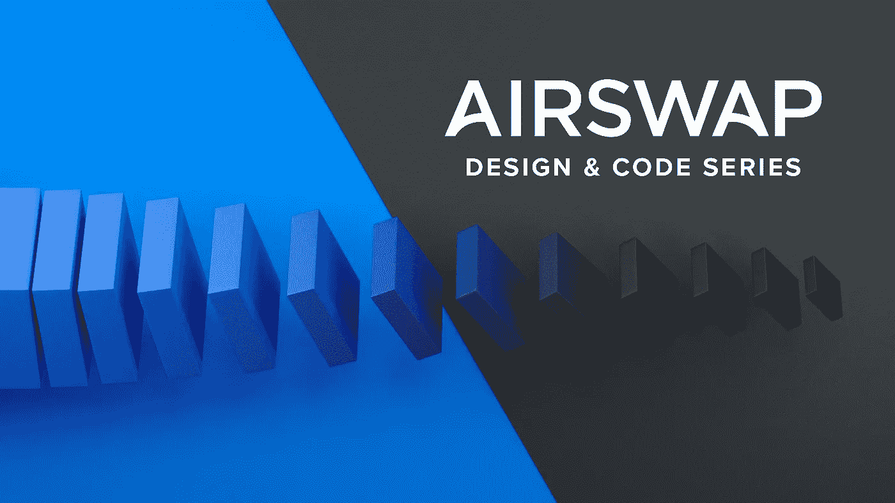
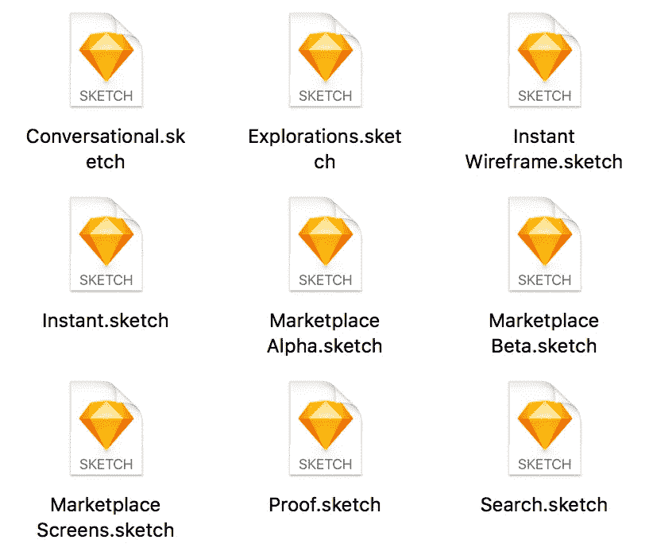
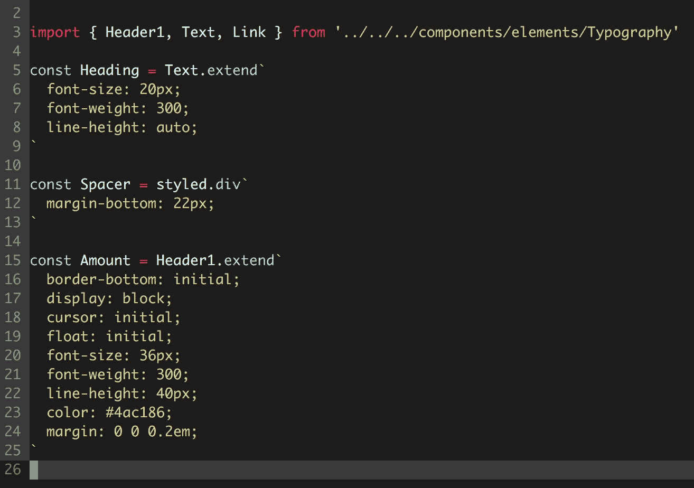
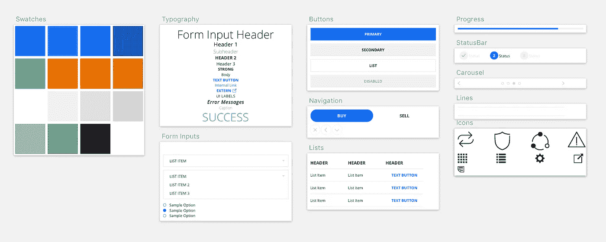
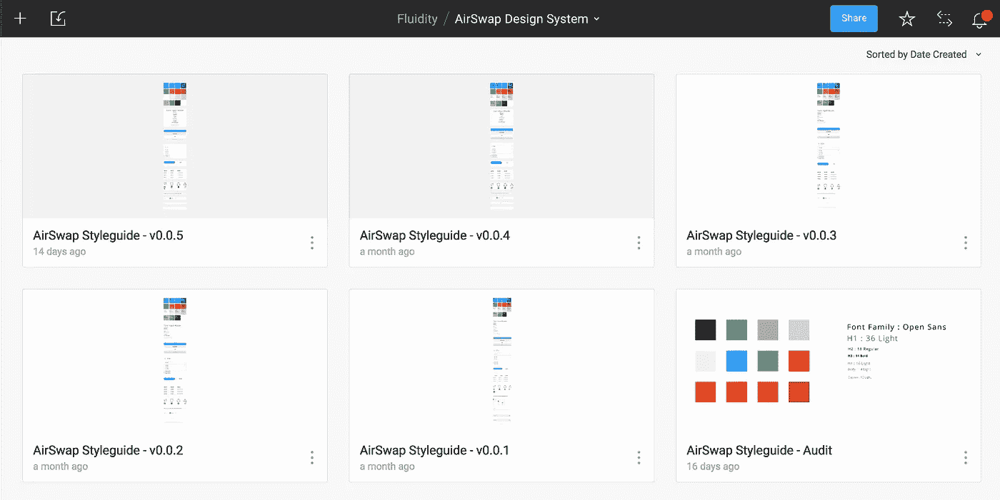
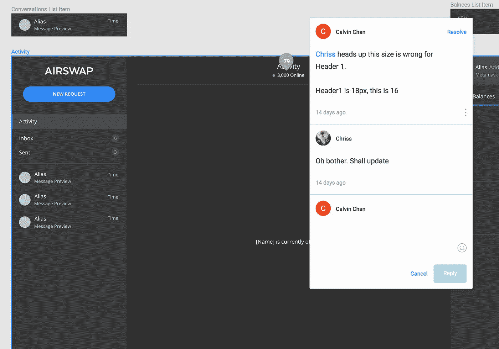
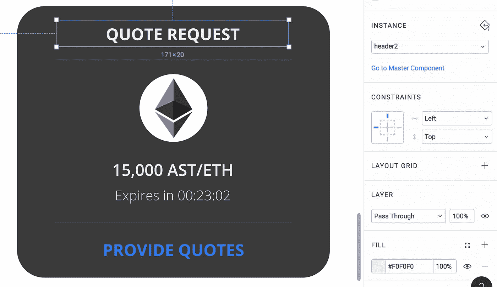

# 弥合设计和代码之间的差距

> 原文：<https://medium.com/hackernoon/bridging-the-gap-between-design-code-b6e330e16d93>

## “设计与代码”是 AirSwap 团队为您带来的一系列关于设计和工程实验、过程和学习的内容。

在 AirSwap，我们有一个异步和迭代的产品开发方法。然而，我们遇到的最早的挑战之一是在多个产品所有者之间，通过功能工作的迭代来维护一致的产品身份。在开发早期版本的 [AirSwap Token Trader](https://blog.airswap.io/token-trader-is-live-e24553c2e7b0) 和 [AirSwap Widget](https://blog.airswap.io/airswap-is-here-c83c001d5bbe) 的过程中，我们很快积累了一些草图文件——每个文件都包含一个符号和风格的抓包，代表了我们当时的产品身份状态。虽然这在开始时有效，但是我们缺乏一个统一的事实来源，很快就变成了一个跨越多个来源的过时风格的混乱。

With multiple files and symbols scattered across all of them, it became a hassle managing a consistent identity.

AirSwap 的每一次前端体验都是用 React 写的。开始时，我们有一个共享组件的目录，如果你愿意的话，可以称之为一个初步的组件库，带有与产品身份相匹配的适当样式。然而，随着我们的迭代，我们的产品身份发生了变化。引用新特性的[设计](https://hackernoon.com/tagged/design)组件使得识别特定组件是否已经存在或者需要实现变得更加困难。我们很早就决定使用[样式组件](https://www.styled-components.com/)，这允许我们快速迭代和构建特性。样式组件带来的易用性是一个巨大的胜利，但它也无意中让我们在扩展样式时做出了一些糟糕的决定。没有关于如何创建或扩展组件的严格规则，我们的代码库很快就变成了许多只有微小差异的重复代码的家园。这不仅降低了开发者的速度，增加了技术债务，而且还引入了我们产品身份的不一致性。

Because of the absence of a well-defined system on the design comps, many files in our codebase would introduce new components that were similar to existing ones, or make minor changes to the existing components.

在寻找这些问题的解决方案时，我们最近开始尝试如何弥合设计和代码之间的差距。

# 设计工艺

设计技术的想法并不新鲜。像 [Craft](https://www.invisionapp.com/craft) 和 [Invision](https://www.invisionapp.com/) 这样的工具的存在是为了帮助设计师整合他们的风格，并将这些信息传递给开发者。这允许多个利益相关者在维护一组统一的基础组件或共享组件库的同时处理不同的特性。然而，我们需要的是一种方法，不仅要保持设计之间的平衡，还要保持构成设计的组件和代码中存在的组件之间的平衡。

大约一年前，Airbnb 的设计技术团队发布了一个名为`[react-sketchapp](https://github.com/airbnb/react-sketchapp)`的开源项目，该项目使 React 组件能够渲染成 Sketch。React 社区反应良好，很快，styled components 发布了他们库的扩展`[styled-components/primitives](/styled-components/announcing-primitives-support-for-truly-universal-component-systems-5772c7d14bc7)`，支持多目标渲染(包括渲染到草图)。这些项目成为我们面临的不一致问题的基础技术解决方案。

# AirSwap 组件库

在对 AirSwap 小部件进行了详尽的审计之后，我们在 Sketch 中确定并重新创建了将在所有当前和未来特性中使用的组件集。然后我们花时间在 React 中重新创建了整个组件库，使用`styled-components/primitives`作为我们的基础。我们的组件通过`react-sketchapp`被渲染成符号，为我们的设计创造了一个真实的来源。

React components rendered to Sketch

创建组件库成为我们在 AirSwap 的初步端到端设计流程的基础。首先是组件的设计，然后是实现。因为我们使用了`styled-components`和`react-sketchapp`，我们可以将实现的代码提交回 Sketch 进行审查。批准后，渲染的组件将成为新的设计，如有必要，可用于将来的修改。

Multiple versions of the component library, rendered to Sketch and uploaded to Figma

# 输入 Figma

这个循环消除了代码和设计之间的差异。然而，当我们开始在 [Figma](https://www.figma.com/) 上完成大部分设计工作时，我们很快发现了这种解决方案的额外好处。因为我们的设计工具允许我们从组件库中创建草图文档，所以我们将每个新版本上传到 Figma。可以在最新修订版上以交互方式提出意见和更改请求，最新修订版为下一个修订版提供了规范，只有在解决了之前的所有意见后才能上传。这还不是完美无缝的，但是它创建了一个 UI 审查过程，在信息上类似于 GitHub pull 请求。

Using our new component library to build mocks for the new [AirSwap Conversational OTC Trading](https://blog.airswap.io/introducing-conversational-otc-trading-358f15d8e9e4)

此外，使用 Figma 的共享库功能，我们可以在所有设计组件中访问这些组件。作为工程师，我们可以实时协作地查看和编辑这些组件，这就清楚地表明了正在使用哪个组件。这完全消除了对组件是否已经存在的猜测，因为组件的名称显示在 Figma 上。

The component name is displayed in Figma, which immediately provides information to developers viewing the mocks

# 下一步是什么

展望未来，我们打算改进和调整这一过程，以更好地适应我们的产品开发工作。仍然需要几个手动且低效的步骤。

首先，Figma 目前没有为文档提供可写的 API，需要我们手动上传生成的草图文件。有了适当的 API 支持，我们可以轻松地将这个端到端流程集成到我们的持续集成管道中。我们设想在未来，CI 管道会从 repo 中的标记或分支呈现一个草图文件(或者更好的是，呈现原生 Figma 对象，而不是遍历草图)，将该文件上传到 Figma，并将结果文档链接到一个 pull 请求。Figma 的评论可以交叉发布到 GitHub，在设计和代码之间提供无缝的交流和反馈。

此外，尽管我们已经为组件库创建了技术基础，但是我们还没有建立可行的规则来确定我们应该如何以及何时扩展组件和/或创建新组件。哪些组件的哪些属性可以根据具体情况进行调整，什么时候大量的更改表明需要创建新的组件？我们需要找到这些问题的自然答案，最好是想出自动执行这些决策的方法。

有了这个新的组件库，我们已经注意到从设计到编码的交付的生产率和效率有所提高。虽然远非完美，但这一新流程的完整端到端功能使我们能够提高迭代工作的速度，同时保持产品身份的高度完整性。围绕设计和设计技术的对话正在世界各地的许多产品团队中迅速发展。在 AirSwap，设计是我们非常关心的事情，设计技术已经成为产品开发的一个令人兴奋的交叉领域，我们可以利用它来帮助我们推出令人惊叹的产品。

*   订阅 [AirSwap 博客](https://blog.airswap.io/)
*   加入我们[官方频道的电报](https://t.me/airswapofficial)
*   在[推特](https://twitter.com/airswap)上关注我们
*   在脸书[找到我们](https://www.facebook.com/airswapio/)
*   订阅我们的[子编辑](https://www.reddit.com/r/AirSwap/)