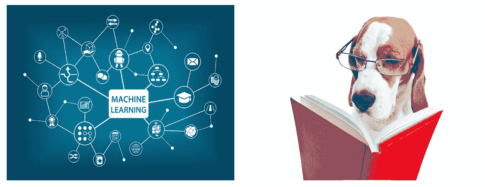
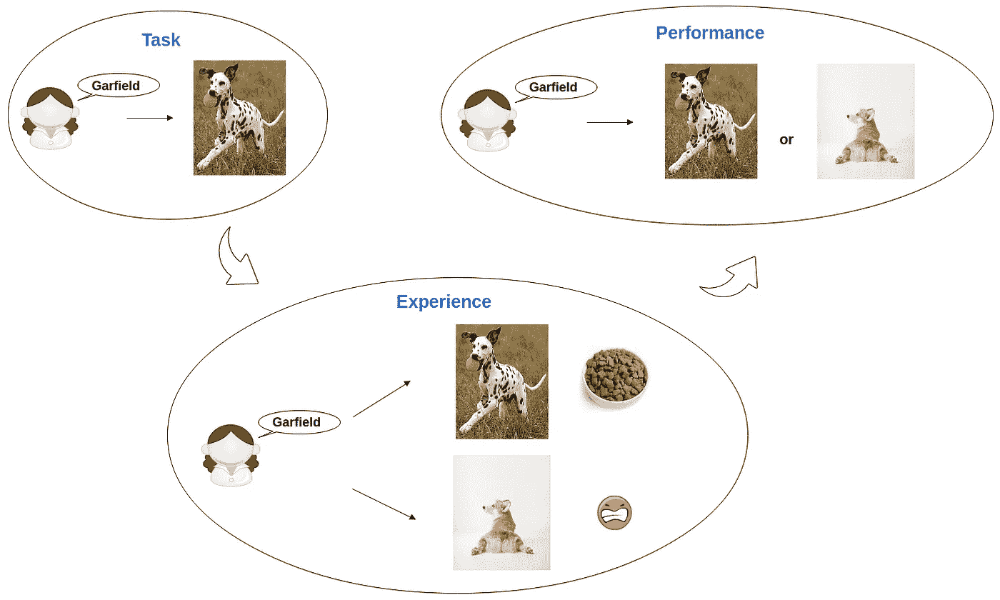
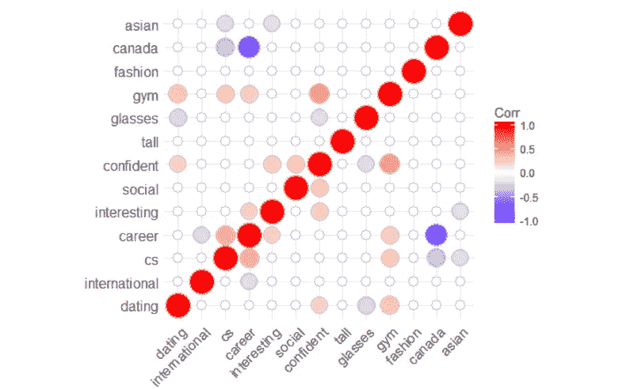

# 使用狗和网球的简短机器学习介绍

> 原文：<https://medium.com/hackernoon/brief-machine-learning-introduction-using-dogs-and-a-tennis-ball-f01d24498350>

> 这是从最开始介绍机器学习的“机器学习”系列的一部分。更多文章来了！
> 
> [下一篇>](https://hackernoon.com/which-type-of-ml-tell-us-diapers-and-beer-often-sale-together-e2be563d7790)

每天，公司都会收集一堆数据。现在他们想让[利用那些数据](https://www.digitalistmag.com/digital-economy/2017/10/11/time-for-ai-machine-learning-05413783)。这就是为什么机器学习(ML)、人工智能(AI)和更广泛的数据科学领域在近几年不断兴起。

作为一名博士生，我的论文是建立一个无人机系统模型来检查故障。

制作模型涉及到数学，在实验过程中我也有大量的数据要分析。由于机器学习和建模系统非常接近，所以我决定学习 ML。

有大量的资源和特定的词汇，所以似乎有点难找到你的方式。在本文中，我将向您介绍机器学习，并向您解释为什么值得研究它。

## 机器学习真的有用吗？

尽管你没有意识到，我们在日常生活中被 ML 系统包围着。你一上网做研究，就会触发广告公司制造的 ML 算法。

这意味着，如果你在网上寻找一只*【可爱的黑白小狗】*，此后你访问的每个网站现在都会试图向你出售*【超级棒的可爱黑白小狗】*。

此外，当你收到一封电子邮件时，你的收件箱会检测它是垃圾邮件还是普通邮件。

Go boardgame, a Chinese strategy board game for two players

你听说 AlphaGo 成为世界上最好的围棋手了吗？它打败围棋高手的能力来自于在比赛中观察高手如何对弈的训练。

由于大数据分析，机器学习可以帮助我们找到数据中的节奏(或模式)。

分析结果将提高你对数据的理解。然后你就可以利用那些洞察去更好的做一些事情，做出最合适的选择！

## 人们试图定义什么是机器学习

让我们跳过我从维基百科复制粘贴 ML 定义的部分。相反，我更喜欢复制粘贴 ML 领域中试图定义它的影响者的报价。

> [亚瑟·塞缪尔](https://en.wikipedia.org/wiki/Arthur_Samuel) : ML 是一个研究领域，它赋予计算机无需明确学习就能学习的能力。
> 
> 汤姆·米切尔博士(Dr Tom Mitchell):据说一个计算机程序从经验 E 和
> 中学习一些任务 T 和一些性能测量 P。如果它在 T 上的性能，如 P 所测量的，随着经验 E 而提高

他们都是做某事的第一人。A.Samuel 是开发出第一个成功的自学程序的第一人，林可唯博士是计算机科学学院机器学习系主任。

这些定义并不容易理解。为此，我给你举一只狗的例子，它的名字叫加菲猫。

Garfield trying to figure out what “go get the ball” means

加菲猫很年轻，但也是一种懒惰的狗。你多次试图扔掉一个网球，并要求它把它找回来，但它没有。

为了教它捡网球，每当它捡球回来时，我们都会给它一些食物。重复几次这个练习后，它会开始学习。它不会明白“去拿球”是什么意思，但它会知道，如果它拿到球并带着球回来，它就能得到食物。

现在回到米切尔博士对机器学习的定义，试着猜猜这个例子中的 T，E 和 P 是什么。

实际上，在这个小历史中，任务是加菲尔德在你要求的时候去拿网球。经验就是当你用食物训练它的时候，表现就是加菲猫带球回来的概率。

**让我们总结一下:**

> t:要执行的任务
> 
> e:通过实践变得更擅长 T
> 
> 你擅长做什么

狗需要大量的练习来发展它的新能力。同样适用于计算机和 ML。

机器练习久了会给出更准确的答案。因此，为 it 部门提供大量高质量的数据至关重要。

## 节省您的时间，让计算机为您服务

好吧，曼梯·里做着和孩子在学校时一样的事情:学习。如果 ML 的唯一目的是学习，为什么需要使用 ML？实际上，机器学习程序不仅比孩子更快地学习我们教给它的东西。它还分析数据，提出见解并给出最准确的答案。

加菲猫不需要懂英语，你所要求的是在一种情况下举止得体:你扔了一个球并对着它大喊大叫。

想象你是一个成功的跑车销售商。为了变得更富有，你想把你的车卖得尽可能贵，但又不超过上限，所以人们还是会买。

你有过去销售的数据，但自己从中找出见解可能会令人厌倦。相反，你可以用你的数据喂你的机器学习程序，而不用看你的数据。你的 ML 程序会计算出汽车价格是由什么决定的，并得出一个公式。

当然，你也可以不用电脑，自己全部搞定，找出公式。然而，它会浪费你的时间，却不能保证找到最准确的结果。

## 机器学习还能做别的吗？

您可以将 ML 应用于几乎任何领域。在查看了它可以解决的各种问题之后，我发现了一个令人惊讶的问题。

在这篇来自 UW 数据科学家的文章中，作者建议你使用 ML 来找女朋友。这是一张显示特征权重的图表。

Feature closer to one wins

在回答了一些关于你的问题后，它的算法会给出你找到女朋友的概率。

就这样，你的机器学习入门到此结束。我希望你喜欢阅读它，它帮助你找到什么是 ML。

下一篇关于不同类型的 ML 的文章再见。如果你对它感兴趣，请让我知道，别忘了给这篇文章一些👏鼓掌支持我。

祝你今天开心！玩的开心！

> 这是从最开始介绍机器学习的“机器学习”系列的一部分。更多文章来了！
> 
> [下一篇>](https://hackernoon.com/which-type-of-ml-tell-us-diapers-and-beer-often-sale-together-e2be563d7790)