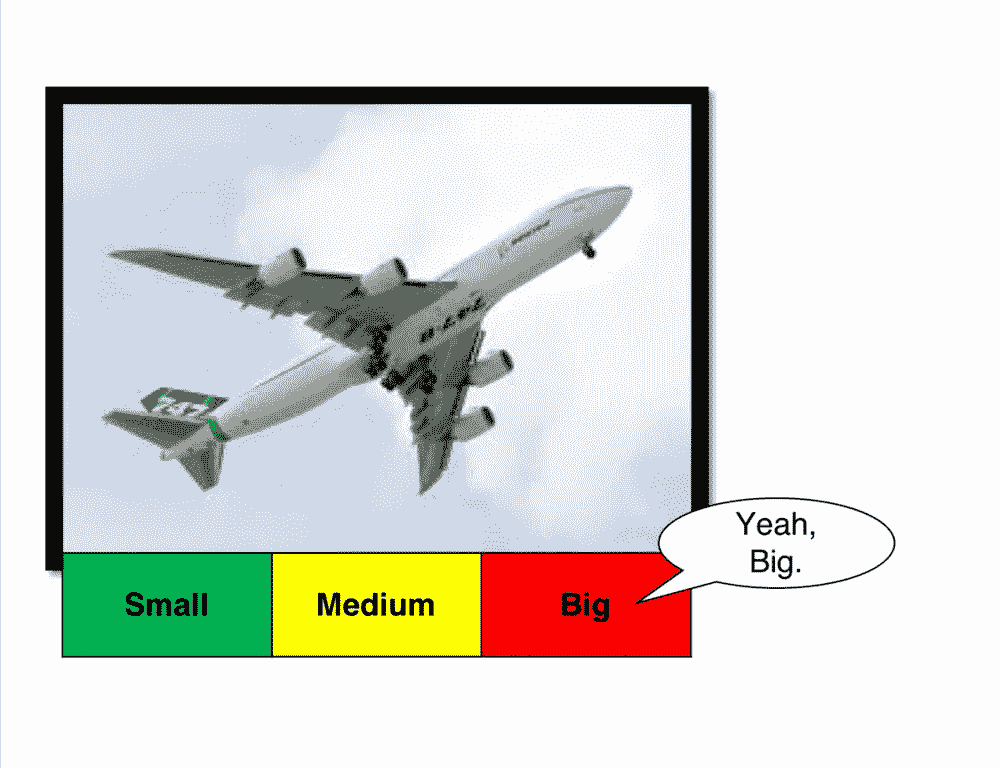
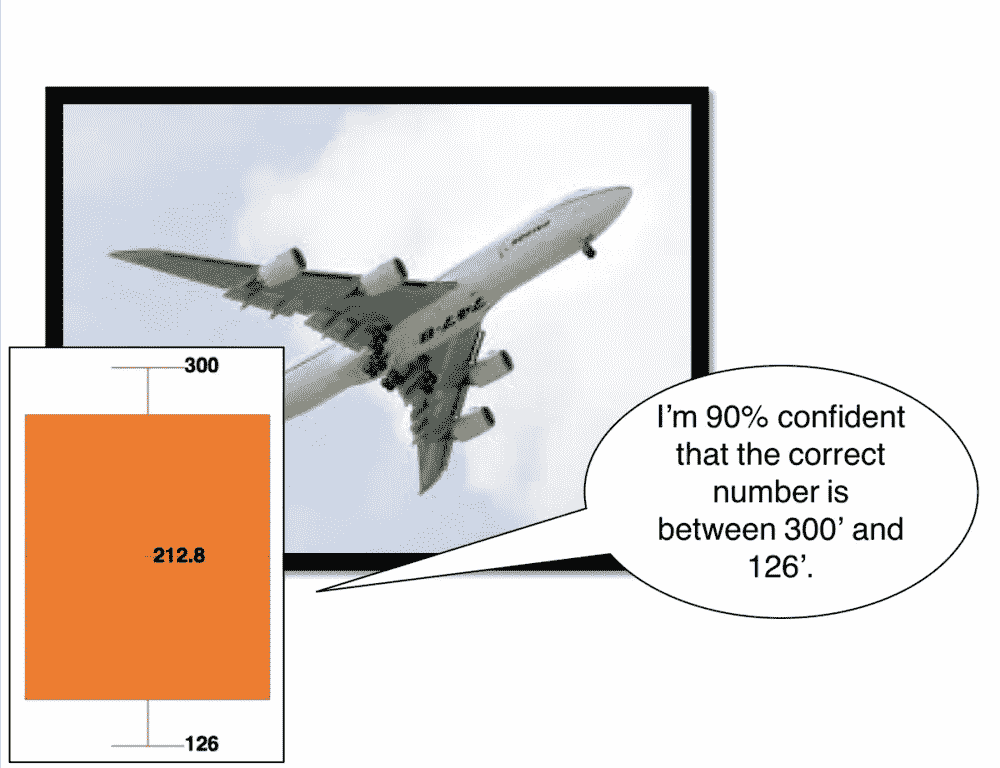
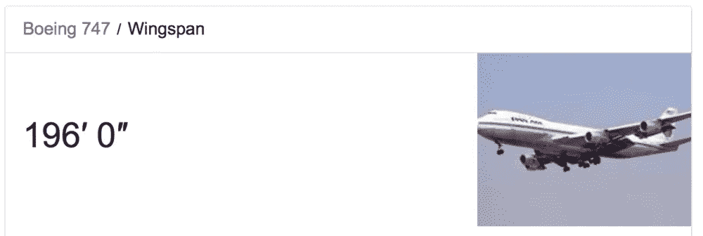

# 把不确定性带回来

> 原文：<https://medium.com/hackernoon/bring-uncertainty-back-e3777bc33c5d>

我们需要将不确定性带回风险测量。

假设我让你测量一架波音 747 的翼展。现在，无论你在哪里，用你手头的知识和工具。你可能会说这是不可能的，但是道格·哈伯德[告诉我们](https://www.howtomeasureanything.com/3rd-edition/)一旦你明白什么是测量，任何事情都可以被测量。随着这个心理障碍的消除，你现在可以测量波音 747 的翼展了。

在现代商业中有两种不同的方法。

# 选项 1:想想一架客机的大小，然后说:“大。”

从技术上讲，这回答了我的问题。然而，这个答案有一个问题——它既不*精确*也不*精确*。在日常语言中，*精确*和*精确*这两个词可以互换使用。在经常使用测量的科学领域，它们有不同的含义。*精确*表示测量正确，而*精确*表示测量与其他测量一致。

“大”这个词是一个形容词，用来描述某物的属性，但是如果没有上下文或参照系来进行比较，它实际上是没有意义的。此外，用一个形容词来代替测量值有点不诚实。的确，我们不知道波音 747 的确切翼展。此外，翼展因型号而异。然而，我们选择了一个词，“大”，它传达了精确性、准确性和准确性，但不是其中的任何一个。如果这还不够糟糕的话，我们已经完全混淆了我们估计波音 747 翼展能力的不确定性水平。

# 选项 2:费米会怎么做？

像恩利克·费密和道格·哈伯德这样的思想家对这个问题有不同的看法。他们——就像我们一样——可能不知道 747 的翼展。就像费米[简单地通过思考和分解问题来估计芝加哥钢琴调音师的数量](http://web.pdx.edu/~pmoeck/pdf/The%20classic%20Fermi%20problem.pdf)一样，我们也可以这样做。

*   我见过波音 747，甚至坐过几次，所以我有一些参照系。
*   我身高 6 英尺 2 英寸，”我知道波音 747 比我高
*   一个足球场有 100 码(300 英尺)，我敢肯定 747 的翼展比足球场还小
*   我最初的估计是在 6 英尺 2 英寸到 300 英尺之间——让我们改进一下
*   我知道雪佛兰 Suburban 长什么样——它们有 18 英尺长。从前到后，有多少郊区居民相当于一架波音 747？也许…7 是一个安全的数字。那是 126 英尺。
*   我要说的是，波音 747 的翼展在 126 英尺到 300 英尺之间。
*   我 90%确定实际数字在这个范围内(又名[置信区间](https://www.mathsisfun.com/data/confidence-interval.html))吗？让我再想想我的估计。是的，我确定。

让我们对照谷歌检查一下我们的估计。

这是一个很好的测量。

这里发生了两件不同寻常的事情。使用与“大”相同的数据——但不同的心理模型——我们进行了准确的测量。其次，我们表达了我们关于测量的*不确定性*——主要是，我们引入了误差线。

一个缺失的数据点是*精度*的水平是否足够。要回答这个问题，我们需要知道*为什么*我要求测量。是为了赢得一场酒吧琐事游戏还是为了建一个飞机库来存放一架 747？我们的思想是测量的工具。我们可能没有卷尺精确，卷尺没有激光测距仪精确，激光测距仪没有干涉仪精确。所有的测量仪器都有误差线。在确定测量所需的精度水平时，我们总是需要考虑获取新信息的成本，是否相关，以及我们是否需要进一步降低不确定性来做出决定。

如果你觉得这是一个不错的故事，但又不太切题，那就再想想吧。

使用“红色”或“高”这样的形容词来代替对风险因素(如概率、影响、控制力度)的真实测量既不精确*也不准确*。更糟糕的是，不确定性隐藏在形容词*的背后，感觉*准确，但事实并非如此。读者不知道这是否是一个精确的测量——使用历史数据、内部数据和许多经过校准的主题专家的混合物——或者它是否是由一个名叫鲍勃的人坐在办公室里，思考这个问题几秒钟，然后说，“感觉很高。”

管理风险是一家企业为了生存所能做的最重要的事情之一。是时候将不确定性带回风险测量了。这是诚实的做法。

*关于作者:*

托尼·马丁-维格是一名作家、演说家和风险专家，热衷于数据驱动的决策。他利用自己在经济学、网络风险量化和信息安全方面的专业知识，就如何将基于证据的风险分析整合到业务战略中，为高级运营和安全领导提供建议。他领导过几家湾区金融机构的风险团队，用他八岁的儿子的话说，过去 20 年的大部分时间都在“与互联网上的犯罪分子作斗争”。托尼也是公平研究所旧金山分会的主席，公平研究所是一个致力于推进风险量化的专业组织。请访问[www.tonym-v.com](http://www.tonym-v.com)了解更多信息。