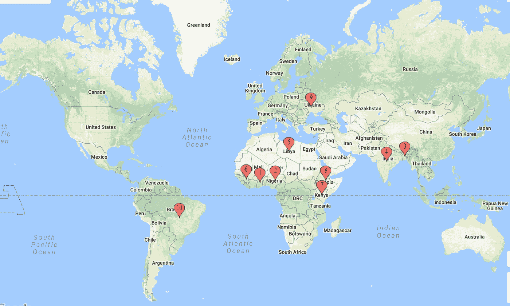
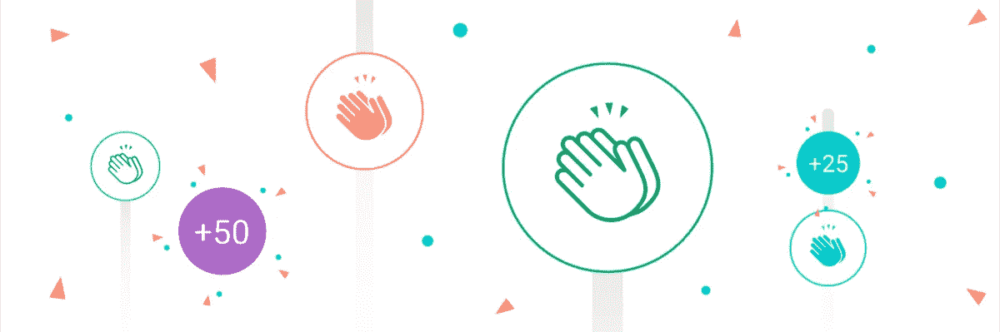

# 将 HTML5 游戏带入生活。启动 Eulercoder 游戏— QuickGames

> 原文：<https://medium.com/hackernoon/bringing-html5-games-to-life-launching-eulercoder-games-quickgames-dddd99fdfab1>

Photo by [Pawel Kadysz](https://unsplash.com/photos/CuFYW1c97w8?utm_source=unsplash&utm_medium=referral&utm_content=creditCopyText) on [Unsplash](https://unsplash.com/search/photos/game?utm_source=unsplash&utm_medium=referral&utm_content=creditCopyText)

你好！

漫长的等待结束了。我们今天将在全球市场推出我们的最新产品。Eulercoder 正在推出 QuickGames——html 5 和 Android 游戏的全球发行商。我们花了过去三个月的时间策划、构建和测试我们的 HTML5 游戏，今天是我们准备上市的日子。

quick games(Euler coder 公司)已经与许多渠道合作伙伴合作，在全球发行我们的游戏。我们有超过 230 款 HTML5 游戏，通过我们的渠道合作伙伴在全球范围内销售。我们简单的定价模式和集成 API 使我们的游戏集成变得无缝和容易。

这篇文章涵盖了所有关于 QuickGames 的信息，我们的服务，产品，定价模式和基本的常见问题。

所以让我们开始吧…

QuickGames Partner Network — Yes, we are looking for distributors in the US, Canada and Australia 😉, Shoot us an email — hello@eulercoder.com

# 我们的服务💼

QuickGames 支持所有主要设备和平台，我们开发了高质量的 HTML5 游戏，可以在任何设备上玩，无需下载。我们支持 Android、iOS、桌面、浏览器、机上娱乐系统、智能电视、原始设备制造商或您自己的网站或应用程序。我们强大的 API(99.9%正常运行时间)让我们可以在任何平台上集成我们的游戏。

## Eulercoder 游戏手机应用程序📱

我们设计精美的移动应用程序可以轻松贴上白色标签，在任何地方使用。我们的移动应用程序完全支持订阅 API、社交登录、社交排行榜、喜欢的游戏部分、用户设置等。

这是我们的移动应用程序演示。

## 门户网站🖥

我们正在用顶级开源技术构建我们最新的 Web [游戏](https://hackernoon.com/tagged/gaming)门户——React、NodeJS、 [TypeScript](https://hackernoon.com/tagged/typescript) 、GraphQL、Docker 和 AWS for servers。我们想确保我们开发的任何东西都是一流的产品。作为一家科技公司，我们努力创造高质量和可扩展的网络应用。

## 蜜蜂🌐

我们支持许多强大的 API。如果我们的合作伙伴有任何特定的需求，我们也会构建 API。

*   游戏 API — *获得所有游戏的完整列表。*
*   发布者 API — *发布者 API，获取您的发布者密钥，开始使用我们的游戏。*
*   订阅 API — *如果您想按月或按周向您的用户收取订阅费，我们也支持。*
*   喜欢的游戏— *为用户保存喜欢的游戏。*
*   用户活动— *我们构建了 API 来保存用户活动，让用户从他们离开的地方开始。*

# 定价模型💁🏻‍$

我们的定价模式非常简单，没有隐藏成本，固定费用。我们以 50-50%的收入分成发行游戏。所以，

*   合作伙伴总收入的 50%,包括但不限于应用程序、门户网站、浏览器和我们游戏的任何地方。
*   如果您想使用我们的手机或门户网站，每月统一 500 美元。如果你想两个都用，每月 1000 美元。所有的处理，托管，支持，维护，所需的变化和定制将由我们完成。

## 谁可以加入我们的合作伙伴网络？🤷🏻‍

*   坦率地说，任何公司或个人，尽管在市场上拥有一些用户群或网络来获取初始用户是件好事。
*   电信运营商
*   增值服务公司
*   B2C 公司
*   航空公司

# 常见问题💁🏻‍

*   **加入游戏合作伙伴网络的基本要求是什么？**
    没有具体要求，只要给我们发邮件，让我们和 NDA 签合同，我们就准备上市了。
*   **完成整合需要多长时间？**
    这取决于我们沟通和完成工作的效率，如果您想使用我们的移动应用程序或门户网站，可能需要一周时间来完成所有必需的 API 的定制和集成。
*   **合同持续多少年？我们通常签 2 年的合同，而且很容易延期。**
*   如果我想取消合同怎么办？你可以随时取消合同，但必须提前一个月通知。但是我们不希望我们的伴侣离开我们。🙈

如果您想加入我们的合作伙伴网络并分发我们的游戏，请给我们发电子邮件——hello[at]Euler coder[dot]com，我们希望收到您的来信，并在您的平台上推出我们的游戏。您也可以在此直接安排电话讨论合作关系[。](http://calendly.com/eulercoder/30min)

# **关联公司？**

如果你在主要的电信公司有良好的网络，或者如果你能在我们的网络中带来合作伙伴，让我们来谈谈，我们将提供高达 10%的总收入给我们的分支机构。写信给我们— hello [at] eulercoder [dot] com，主题为“附属合作伙伴……”

好了，目前就这些了。未来几周会有更多消息。

你是开发商吗？你愿意帮助我们建立 QuickGames 网站吗？[说吧！](mailto:hello@eulercoder.com)

Show Some Love.

作为一家公司和一个社区，我们正在慢慢成长。如果你喜欢我们正在做的事情，请表现出你的爱。

另外，如果你喜欢你刚刚阅读的内容，请点击绿色的"**推荐**"图标**喜欢**这个资源，**在 **Twitter 或脸书**上分享**它，这样其他人也可能会发现它。

您可以随时在 [**Linkedin**](https://www.linkedin.com/in/vikeshtiwari) 上或通过 [**邮箱**](mailto:hello@eulercoder.com) 联系我。**在 [**Medium**](https://www.medium.com/@tvicky002) 上关注我**以便在未来获得更多关于 Eulercoder 的更新。