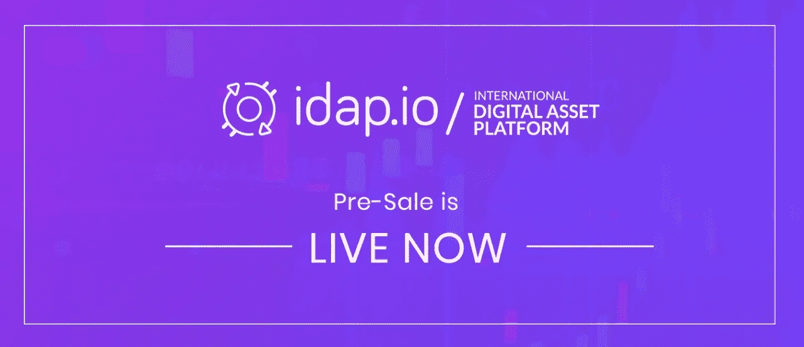

# 让老派交易员加入 crypto

> 原文：<https://medium.com/hackernoon/bringing-in-old-school-traders-to-crypto-5d23f7700808>

> “就个人而言，我们是一滴水。合在一起，我们就是一片海洋。”——**龙之介**，*日本诗人*

市场可能是红色的，但密码社区每天都在继续增长。鉴于[加密货币](https://hackernoon.com/tagged/cryptocurrency)市场的年轻，市场的成熟和规模的增长还有很长的路要走。考虑到这一点，当涉及到扩大用户基础时，市场不要成为“我们对他们”心态的牺牲品，并接受传统交易者和机构投资者可以被推动交易加密货币，只要他们以正确的方式适应。

传统全球市场的交易商尚未完全接受加密货币作为投资工具，其中一个因素是当前交易所在产品和平台功能方面缺乏选择。我在前两篇文章中谈到了界面和模拟交易环境，以及我们的交易生态系统如何解决这两个方面的问题。在这篇文章中，我想谈谈大型交易公司容易进入的衍生品市场如何帮助吸引更多的交易者并扩大参与范围。

对于传统投资者来说，通过期货、利差和蝴蝶等衍生工具间接接触加密货币可以作为一个很好的起点。在基于加密的衍生品的统一市场上，与这些类型的金融工具打交道数十年的交易者可以在熟悉的领域舒适地交易，与直接买卖硬币/代币相比，风险更低。在自营交易公司的情况下，他们雇佣了几百名专业交易者，主账户系统将被证明是非常有效的。主账户允许创建不能用于存款或取款的“交易专用”子账户。因此，掌舵的是公司控制下的主账户，因为他们可以决定何时进入或退出市场，而子账户可以自由交易以获取利润。更重要的是，通过允许从子账户收取交易费用，可以鼓励新的密码交易公司，进一步巩固更多的参与者进入交易领域。

在 idap.io 交易平台上引入主账户系统将使我们能够与希望进入加密交易的交易公司建立合作伙伴关系，同时也为企业家提供了建立新交易公司的机会，促进了采用和整体市场增长。

IDAP 代币的[预售现已开始](https://tokensale.idap.io/signup)和 [ICO](https://hackernoon.com/tagged/ico) 贡献者可以获得 25%的代币奖励。为了刺激代币需求的稳定增长，我们采取了许多措施来维持流通供应。ICO 贡献者被激励持有他们的代币，以便在平台上线后获得丰厚的交易费折扣。拥有 20，000 代币或更多代币的贡献者将终生无需支付任何交易费用。凡购买 125 万代币或以上者，可免费使用主账户。此外，任何以 IDAP 代币支付的交易费用将获得 50%的折扣。这样，很大一部分令牌将被阻止。此外，我们将定期烧掉 20%的代币作为各种费用，直到我们达到 5 亿代币的供应量。

按照参考价格模式，IDAP 证券上市时的最低参考价格将成为其当前价值的 1.5 倍，即从 3 美分变为 4.5 美分，以确保在使用该参考价格计算交易费用时，ICO 参与者在现货价格跌至 4.5 美分以下的情况下不会遭受损失。鉴于所有这些因素，代币价格很有可能会随着时间的推移而上涨。

考虑到 idap.io 交易所是为交易者量身定制的，预售是成为该项目的早期采用者并为平台开发做出贡献的绝佳时机，如果您希望在平台推出后进行交易的话。我们正努力让这个平台尽可能地方便和包容，并希望 live exchange 将看到多样化的用户群，老派交易者对 idap.io 交易生态系统有宾至如归的感觉。

## 保持更新:

[网站](https://www.idap.io) | [电报](https://t.me/idap_io) | [Reddit](https://www.reddit.com/r/idap_io/) | [推特](https://twitter.com/idap_io) | [脸书](https://www.facebook.com/idapio.exchange/) | [Instagram](https://www.instagram.com/idap.io) | [比特币会谈](https://bitcointalk.org/index.php?topic=3431151)