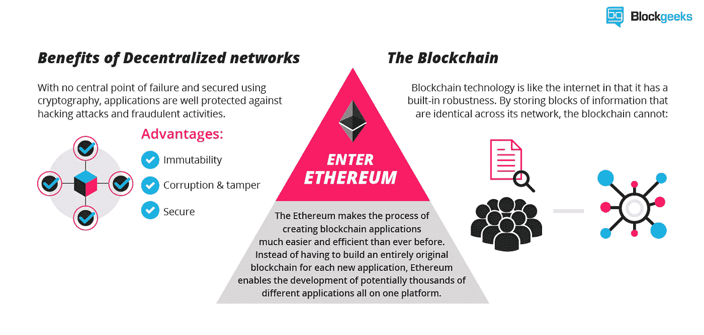

# 将区块链带向本土

> 原文：<https://medium.com/hackernoon/bringing-the-blockchain-to-react-native-98b76e15d44d>

TLDR:尽管 React Native 没有以太坊钱包或浏览器来与跨平台的分散式移动应用程序进行交互，但还是有可能将区块链带入 React Native。

Bringing blockchain to cross platform apps by React Native. Credits to pixabay.

根据 [dApp 的白皮书](https://github.com/DavidJohnstonCEO/DecentralizedApplications)，基本上一个 **dApp** 的后端代码运行在一个分散的对等网络上。相比之下，应用程序的后端代码运行在集中式服务器上。

区块链的透明、不变和去中心化的特性使得许多令人惊叹的用例得以开发，例如自治组织、销售、社交网络、保险公司和游戏等。

This is an example of a proof-of-existence application of blockchains

在这篇博文中，我将解释我如何使用 React Native 制作了一个移动跨平台 dApp，旨在对你最喜欢的[crypto 朋克](https://www.larvalabs.com/cryptopunks)进行排名。

Me, being wrong with this twit

等等… **为什么是密码朋克？cryptopunks 是一个很棒的项目，就像一个隐喻，更多信息请看 reddit 中的以下[博客。](https://www.reddit.com/r/ethtrader/comments/7hdycd/if_you_think_cryptokitties_is_about_cats_youre/)**

Credits [https://blockgeeks.com/](https://blockgeeks.com/guides/initial-coin-offering/)

# 堆栈

在我们开始编写代码之前，理解如何分解代码是很重要的。

*   [React Native](https://facebook.github.io/react-native/) 是脸书开发的一个框架，允许你使用 JavaScript 和 React 构建原生的跨平台移动应用。
*   [Expo](http://expo.io) 是一套工具，使得开始使用 **React Native** 项目变得非常容易，因为它包括一套开箱即用的原生 API，如 camera 等。
*   [Web3](https://github.com/ethereum/web3.js/) 是以太坊兼容的 [JavaScript API](https://github.com/ethereum/wiki/wiki/JavaScript-API) ，它实现了为 node.js 和浏览器构建的[通用 JSON RPC](https://github.com/ethereum/wiki/wiki/JSON-RPC) 规范。
*   [Truffle](https://github.com/trufflesuite) 是一个以太坊的开发环境，它提供了一套类似 [ganache-core](https://github.com/trufflesuite/ganache-core) 的工具，可以在本地主机上模拟以太坊网络，非常适合入门。
*   其他值得一提的酷库包括 *react-navigation、* *victory-native 和 react-native-star-rating。*

# 反应本地的以太坊区块链

关于让 [web3.js JavaScript API](https://github.com/ethereum/wiki/wiki/JavaScript-API) 在 React 原生应用上工作，还有许多[未解决的问题](https://github.com/ethereum/web3.js/issues/1022)，看起来目前还没有一个[真正的解决方案](https://github.com/concensus/react-native-ios-concensus/issues/3)。

这是因为 React Native 使用 [JavaScriptCore](http://trac.webkit.org/wiki/JavaScriptCore) 执行环境，并且根据如何模拟或实现 React Native app 的[节点标准库 API](https://nodejs.org/api/index.html)，如 buffer、 [crypto](https://nodejs.org/api/crypto.html) 或 stream，可能需要[链接一些原生依赖](https://facebook.github.io/react-native/docs/linking-libraries-ios.html)；因此，您可能需要[退出 expo 应用](https://github.com/react-community/create-react-native-app/blob/master/EJECTING.md)，因为它在示例项目中有详细说明，如[react-Native](https://github.com/philikon/ReactNativify)将节点 API 引入 React 本地环境。

因此，当我在寻找替代方案时，在找到了博览会上的[功能请求后，**作为变通办法**，我为 react native](https://expo.canny.io/feature-requests/p/crypto-api) 构建了一个[巴别预设，在幕后使用](https://github.com/agrcrobles/babel-preset-react-native-web3)[加密浏览器](https://github.com/crypto-browserify/crypto-browserify)和一个微小的纯 javascript 实现[随机字节](https://github.com/agrcrobles/babel-preset-react-native-web3/blob/master/src/randombytes.js)。
但请注意，JavaScript 的`Math.random()`函数可能被认为是一个密码可预测的随机数生成器，但我现在并不担心它，因为 [ethereumjs-tx](https://github.com/ethereumjs/ethereumjs-tx) 不需要它来签署交易。

# 那么，投票交易不是免费的吗？

简短的回答是在 [mainnet](https://etherscan.io/) (主以太网)中没有
所有的交易都用真实的以太或气体来估价，但是我的实验应用程序部署在 Testnet [Ropsten](http://ropsten.etherscan.io) 上，这是一个真实的 *staging* 区块链，用于开发目的，每秒只允许 5 次投票/交易，感谢[水龙头](https://faucet.metamask.io/.)的免费以太来测试它:)

在这个简单的实现中，每个投票/星都围绕着 [*0* ***。*** *0012 醚类* ( *美元 1.31* 截至今日)](https://ropsten.etherscan.io/tx/0xb9db465182b81240944d6800b1f1992503d2add9bd0d38f4236de4b0f83954f2)。这一点也不便宜，但是如果每张选票消耗汽油减少，费用可能会提高。在这种情况下，风险在于矿商可能需要数小时或数天来处理这种低费用交易。

目前正在讨论如何通过使用软叉、LN、侧链或微交易来改善区块链的这一问题。

# Web3 提供商的困境

交易是用于修改区块链状态的一组指令，以便签署以太坊交易并消耗气体，需要真正的以太、公共地址和私有密钥，或者配置有至少一个解锁的 coinbase 账户的 HD 钱包来支付*投票交易*。

有不同的方式来配置 web3 提供者访问网络上的 dApps，要么通过以太坊专用浏览器如 [Mist](https://github.com/ethereum/mist) 注入，通过 [MetaMask Chrome Extension](https://metamask.io/) 注入，要么通过创建一个本地实例并在代码上配置一个帐户。

问题是 React Native 没有这样的浏览器，web3 也不能注入到应用程序中，所以在这个实验中，我最终用[truffle-HD wallet-provider](http://truffle-hdwallet-provider)配置了 coinbase。

另一个有效的选择是使用来自 [MetaMask](https://metamask.io/) 的 [web3-provider-engine](https://www.npmjs.com/package/web3-provider-engine) ，它允许您使用[纯 javascript 通过子提供者签署交易，正如我在本要点](https://gist.github.com/agrcrobles/d1cabde05fc38cc032336f1dbdbfb4df)中详述的那样，但情况实际上是相同的，因为 truffle-hdwallet-provider 在幕后使用了类似的机制。

在提到的两个选项中，帐户以某种方式编码在移动应用程序中，这在真实的生产环境中可能是不安全的，并且缺乏灵活性。

取而代之的是，一种简单的方法可能是向用户询问公钥和私钥，以便签署交易并支付投票费用，但是这种方法被丢弃了，因为它非常不安全。

或者使用 [uport](https://www.uport.me/) 注册投票者的身份，但是我还是[不确定 React 原生支持](https://github.com/uport-project/uport-connect/issues/39)。

我已经看到了下面的项目 [react-native-geth](https://github.com/YsnKsy/react-native-geth) ，它看起来很有希望成为 React Native HD wallet 的关键依赖项，可以将 web3 注入任何给定的应用程序，因为它实现了一个轻量级客户端以太坊节点。绝对雄心勃勃。

# 智能合同

我用 [Solidity](https://solidity.readthedocs.io/en/develop/) 语言创建了一个简单的投票契约，并使用 [truffle-contract](https://github.com/trufflesuite/truffle-contract) 作为一个抽象，从移动 dApp 中使用它。

契约也是不可变的。一旦在区块链上创建和部署了合同，就不能更改、撤销或修改。

Voting 有一个构造函数，它用一个 cryptopunks 数组初始化，并根据它们的主要附件为它们分配一个标识符名称。

如果你对这个合同感到好奇，它部署在 [Ropsten Testnet](https://ropsten.etherscan.io/address/0x25cee65ac493a0c965f12a2d0c46fe82e09d6d44) 网络上。
关于我如何部署它的更多信息，请看下面的[要点](https://gist.github.com/agrcrobles/e03151b27ad4753827de227929677db3)。

# 可能的改进

*   在选举中，你拥有的股票或代币越多，你得到的选票就越多。这可以通过向投票者提供一定量的 ERC20 令牌来实现。
    这可能不适用于加密朋克，但值得考虑。

# 演示

 [## react-native-区块链对世博会的调查

### 一个移动 dApp 来启动你最喜欢的密码朋克

世博会](https://expo.io/@agrcrobles/react-native-blockchain-poll)  [## agrcrobles/react-native-区块链-poll

### 在 GitHub 上创建一个帐户，为 react-native-区块链-poll 的发展做出贡献。

github.com](https://github.com/agrcrobles/react-native-blockchain-poll) 

# 思想

尽管区块链带来了大量的用例，但时至今日，大公司在移动应用上并不经常采用它；因为所有的 ico 都是基于网络的。

来自 [cipherbrowser](https://www.cipherbrowser.com/) 和 [status.im](https://status.im/) 的人们正在创造移动 dApp 浏览器，我认为这一步已经完成。

我支持分散式跨平台移动应用的想法，React Native 正在变得越来越成熟，越来越稳定，并被大公司采用来开发真正伟大的移动应用(事实上 status.im 移动应用是建立在 React Native 上的)，我很确定 React Native 中的区块链用于构建真正的移动 dapp 指日可待。

观点是我自己的，我可能是错的。感谢阅读。

# 信用

Mahesh Murthy 写了一篇很棒的文章[,带我创建了一个投票式的简单智能合同。](/@mvmurthy/full-stack-hello-world-voting-ethereum-dapp-tutorial-part-1-40d2d0d807c2)

像[react-native-IOs-consensus](https://github.com/concensus/react-native-ios-concensus/)、[react-native-web 3-example](https://github.com/bullish-ventures/react-native-web3-example)或 [react-native-box](https://github.com/truffle-box/react-native-box) 这样的开源项目，旨在以不同的方式实现类似的目标。

感谢我的姐姐和@pittorrr 帮助我写这篇文章，感谢 [@gisela.d.muro](https://www.instagram.com/gisela.d.muro/) 一如既往地鼓励我写这篇文章。

# 参考

*   [https://ether eum . stack exchange . com/questions/383/what-a-dapp](https://ethereum.stackexchange.com/questions/383/what-is-a-dapp)
*   [https://medium . com/@ preethikasireddy/how-does-ether eum-work-anyway-22d 1 df 506369](/@preethikasireddy/how-does-ethereum-work-anyway-22d1df506369)
*   [https://medium . com/@ jgm . orinoco/understanding-ERC-20-token-contracts-a809a 7310 aa 5](/@jgm.orinoco/understanding-erc-20-token-contracts-a809a7310aa5)