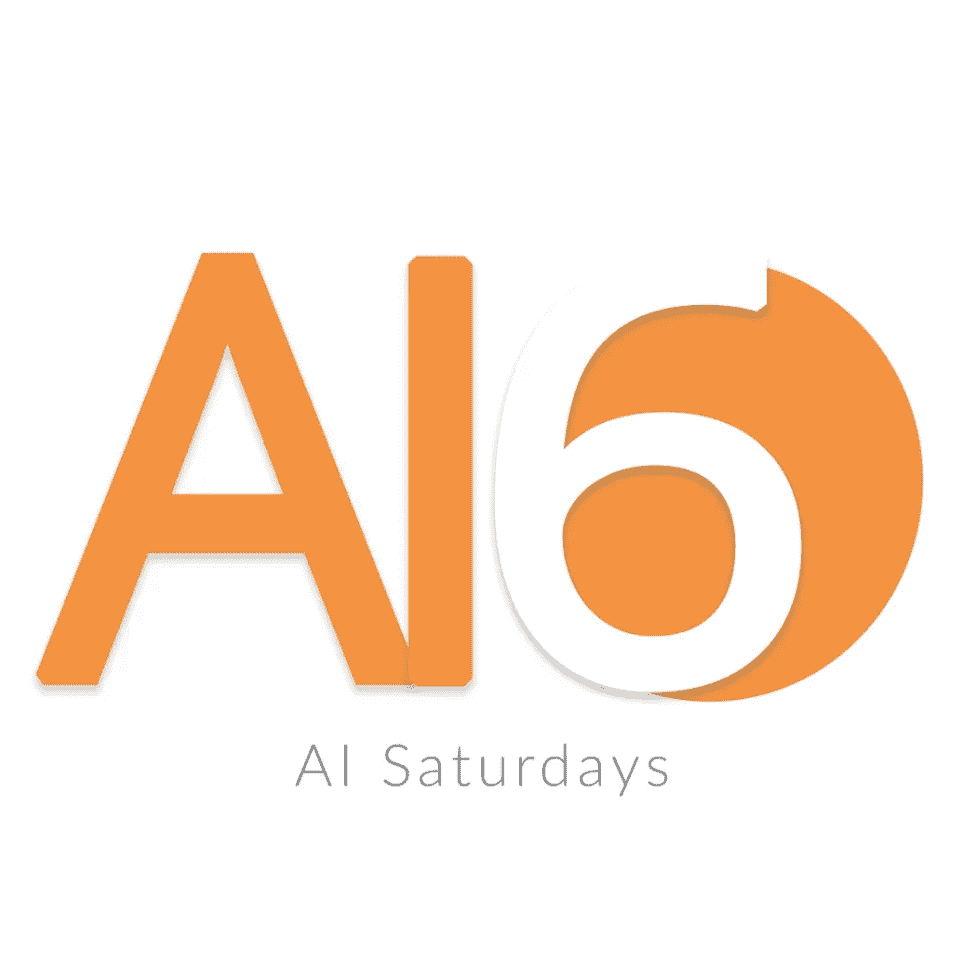
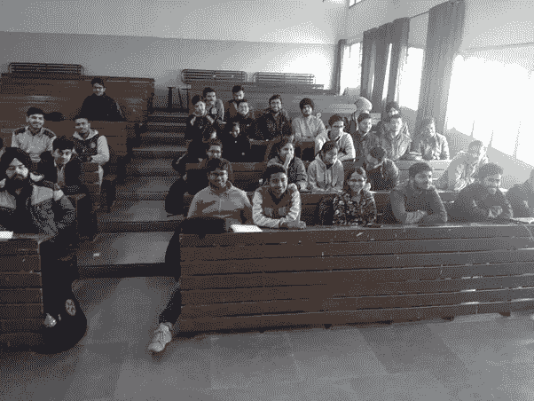

# 用人工智能把世界连在一起

> 原文：<https://medium.com/hackernoon/bringing-the-world-together-with-ai-47b6e1ebd2ab>

> [你可以在 Twitter @bhutanisanyam1](http://twitter.com/bhutanisanyam1) 上找到我，在 [Linkedin 上联系我](https://www.linkedin.com/in/sanyambhutani/)

一个月前，我读了人工智能星期六的标语

```
**Totally free for anyone to attend, aimed at getting you to kickass in AI!**
```



AI Saturdays 是由[nursing . AI](https://hackernoon.com/tagged/nurture-ai)建立的一个社区，全球各地的人们将在每个周六在他们的城市聚会，一起学习 AI [课程。](https://hackernoon.com/tagged/learning)

课程包括:

*   计算机视觉
*   自然语言处理
*   深度[学习](https://hackernoon.com/tagged/learning) : [这是一个让你入门的教程系列](/init27-labs/basic-tutorials-part-0-90f623b291e6?source=user_profile---------27----------------)，另一个关于 [PyTorch 基础知识的系列](/init27-labs/pytorch-primer-series-0-e2e5df9b31c6?source=user_profile---------9----------------)。
*   [自动驾驶汽车](https://hackernoon.com/tagged/self-driving-cars) : [这里是麻省理工学院自动驾驶汽车深度学习课程的讲稿。](/init27-labs/mit-6-s094-deep-learning-for-self-driving-cars-2018-lecture-1-notes-807be1a50893?source=user_profile---------1----------------)
*   强化学习:[这里有一个关于 RL 入门的教程](/init27-labs/reinforcement-learning-part-0-8c2c3efe0ad6)
*   统计学。

作为一名深度学习极客，我决定马上加入进来，并自愿成为一个城市的大使来组织聚会，后来我自愿作为一名人工智能极客领袖帮助指导在线社区解决他们的疑问。

这个社区的创始人雅普·嘉庆非常谦逊和热情，他们所学的课程([查看他们的网站](http://nurture.ai/ai-saturdays))与我的兴趣重叠。我觉得在我的实验室(或家里，无论你喜欢)！

在一个半月的时间里，AI Saturdays 已经发展成为一个拥有 3800 多名成员的社区。来自不同城市、不同文化、跨越不同时区的人们。

所有人都被同一件事团结在一起:学习人工智能的途径。

这是一次令人惊奇的经历:AI 星期六作为一个社区，默默地把每个人团结在 AI 的旗帜下。

在 1 个月的社区讨论中，我遇到了来自世界各地的非常棒的人。专业人士、业余爱好者、书呆子、没有技术背景的人、来自不同年龄组、不同国家、不同文化的人。我们都说一种共同的语言:代码。我们都像飞蛾一样被人工智能灯泡所吸引，感谢创始人，我们分享他们的帮助，共同成长。



Meetups from different cities


我们有来自新加坡的超级明星导师，帮助来自加德满都的爱好者，而来自拉各斯的人也会评论和帮助调试代码，还有什么是真正的社区体验？

我们都有同样的学习热情

我们都想成为人工智能界的牛人。

我们都是在周六学习的极客。

如果这让你兴奋，[我邀请你加入我们的社区](http://nurture.ai/ai-saturdays)。如果你的城市没有我们的聚会；我邀请你做我们的城市大使。

最后，我邀请你团结每一个学习爱好者，他们没有幸运地从一流大学，或网上最好的学习资源中学习，因为他们是付费的。来吧，加入我们的人工智能星期六，在那里我指导像我一样的极客，让我们一起成为了不起的人工智能实践者。我真的很荣幸也很高兴成为一个对人工智能充满热情的了不起的社区的一员。

> [你可以在 Twitter @bhutanisanyam1](http://twitter.com/bhutanisanyam1) 上找到我，在 [Linkedin 上联系我](https://www.linkedin.com/in/sanyambhutani/)
> 
> [订阅我的时事通讯，获取深度学习、计算机视觉文章的每周精选列表](https://tinyletter.com/sanyambhutani)
> 
> [这里的](https://becominghuman.ai/a-self-driving-new-year-33284e592f35)和[这里的](https://hackernoon.com/a-self-driving-new-year-2-d1bbc5a83570)是我学习自动驾驶汽车道路上的两篇文章