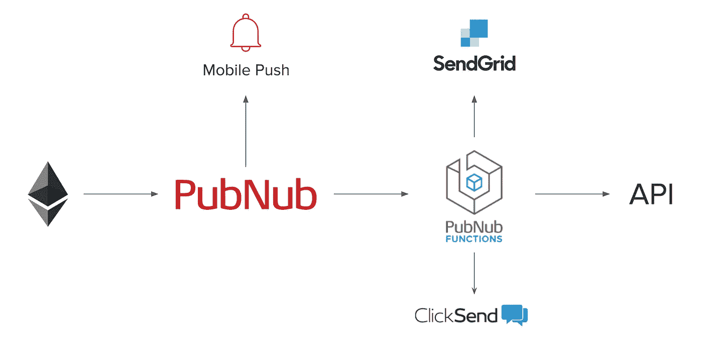

# 用 Web3.js 和 PubNub 广播以太坊事件

> 原文：<https://medium.com/hackernoon/broadcast-ethereum-events-with-web3-js-and-pubnub-267f6e38210b>

在本帖中，我们将向您展示如何利用 [PubNub](https://www.pubnub.com/?utm_source=Syndication&utm_medium=Medium&utm_campaign=SYN-CY18-Q2-Medium-May-24) 的力量来放大以太坊智能合约事件。使用我们的全球实时网络 API，我们将智能地更新观看您的分散应用程序的人群。

# 以太坊是什么？

以太坊是一个分散的[区块链](https://hackernoon.com/tagged/blockchain)网络，用于运行智能合约。假设你已经创造了你的 [DApp](https://www.stateofthedapps.com/) 杰作，但是你需要一种方式向你的选民传达事件的执行。这方面的一个例子是一个投资者网络，他们正在等待你的加密令牌众筹交易的开始。是时候使用 [PubNub](https://hackernoon.com/tagged/pubnub) 扩音器实时告诉每个人你的众筹已经开始了。

# Web3.js

Web3.js 是与区块链智能合约接口的 JavaScript 框架。无论您有 Node.js 应用程序，还是 web 浏览器前端，web3.js 都有两个核心用途:

*   触发智能合同功能的执行
*   倾听合同执行时发出的事件(如[可靠性事件](http://solidity.readthedocs.io/en/v0.4.21/contracts.html#events))

# 众筹已经开始了！

使用 [Crowdsalable 以太坊令牌](https://github.com/ajb413/crowdsalable-eth-token)代码，我们可以编写 Node.js 应用程序来监听以太坊事件，并使用 PubNub 更新我们所有的粉丝。

PubNub 是一个实时的全球数据传输网络。我们可以确保我们所有的众筹投资者，他们可能正屏住呼吸盯着一个购买网页，看到销售已经在瞬间打开。PubNub 可以用来保持大量用户同步，发送实时更新，还可以执行数据丰富。

# 增强您的智能合同事件

一个正在收听以太坊事件的应用程序，也连接到 PubNub，可以触发推送通知，发送[文本消息](https://www.pubnub.com/docs/blocks-catalog/clicksend-sms?utm_source=Syndication&utm_medium=Medium&utm_campaign=SYN-CY18-Q2-Medium-May-24)，发送[电子邮件](https://www.pubnub.com/docs/blocks-catalog/sendgrid?utm_source=Syndication&utm_medium=Medium&utm_campaign=SYN-CY18-Q2-Medium-May-24)，等等。使用[移动推送](https://www.pubnub.com/products/mobile-push-notifications/?utm_source=Syndication&utm_medium=Medium&utm_campaign=SYN-CY18-Q2-Medium-May-24)，或 [PubNub 功能](https://www.pubnub.com/products/functions/?utm_source=Syndication&utm_medium=Medium&utm_campaign=SYN-CY18-Q2-Medium-May-24)，巨大的能力被添加到纯粹的以太坊活动中。

[Open Growth SDK](https://github.com/pubnub/open-growth) 使用 PubNub 函数通过 [Clearbit](https://clearbit.com/) 收集用户数据，通过机器学习 API 对客户的用例进行分类，然后提交丰富的警报。所有这些功能都由一条 PubNub 消息触发。在这个类似的用例中，PubNub 可以让你的智能合约事件**变得强大**。

下面是 Node.js 脚本，它将把发布提交到 PubNub 的网络，保证在不到四分之一秒的时间内交付给数百万耐心的投资者。

*您可以查看该项目的完整*[*GitHub Repo*](https://github.com/ajb413/eth-event-megaphone)*。*

为了运行这个例子，您需要在第 4 行中输入您的智能契约构建的 JSON 文件的路径。接下来粘贴你的[**pub nub API**](https://admin.pubnub.com/#/login?utm_source=Syndication&utm_medium=Medium&utm_campaign=SYN-CY18-Q2-Medium-May-24)**键**，最后你的**契约的地址**朝向文件底部。这段代码可以和前面提到的 **Crowdsalabe Token** 项目结合使用。

这个连接器打开了 **PubNub 功能**和**移动推送通知**的大门，以确保我们的选区获得文本、电子邮件、推送通知，我们可以[向 Twitter 账户](https://www.pubnub.com/docs/blocks-catalog/twitter?utm_source=Syndication&utm_medium=Medium&utm_campaign=SYN-CY18-Q2-Medium-May-24)发帖，所有这些都以自动化的方式进行。

*原载于*[*www.pubnub.com*](https://www.pubnub.com/blog/broadcast-ethereum-events-with-web3-js-and-pubnub/)*。*