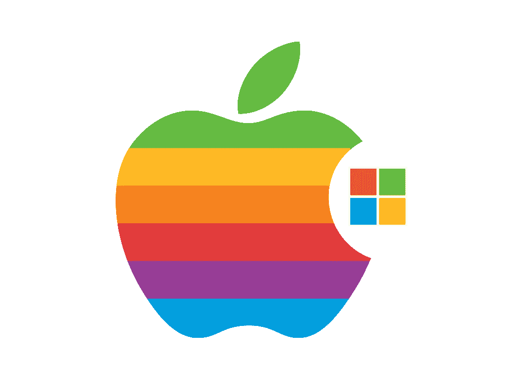
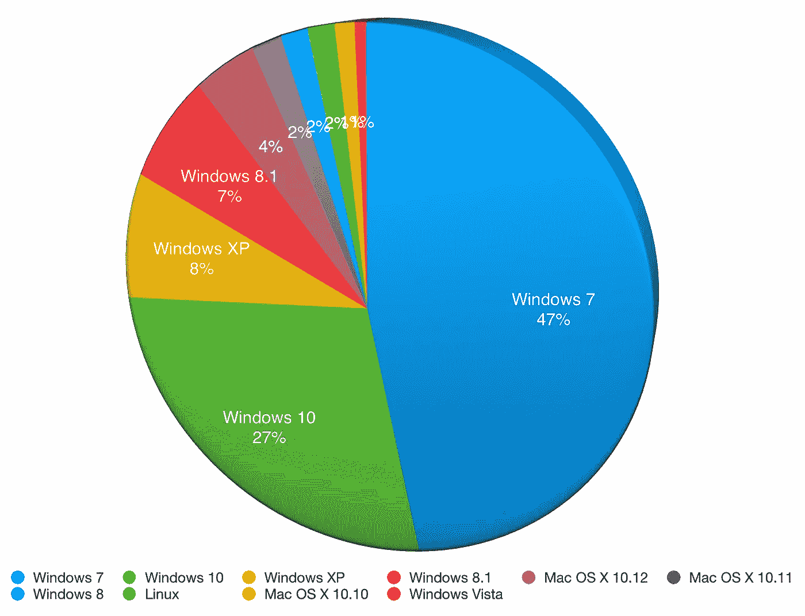
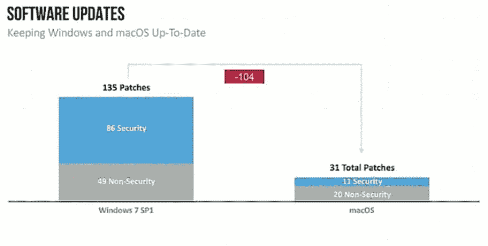
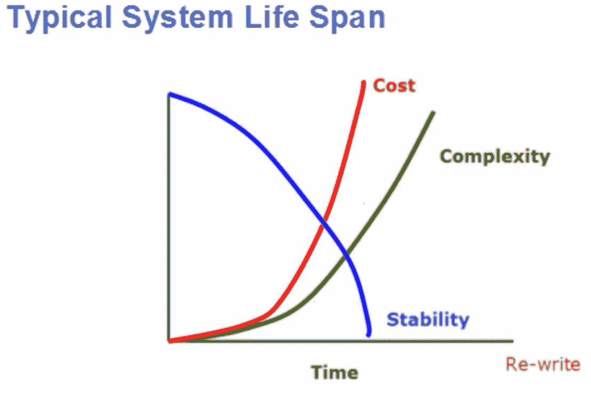
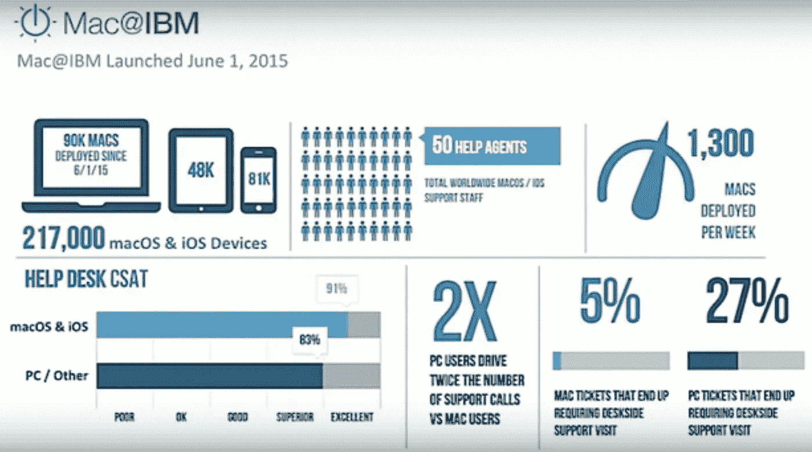
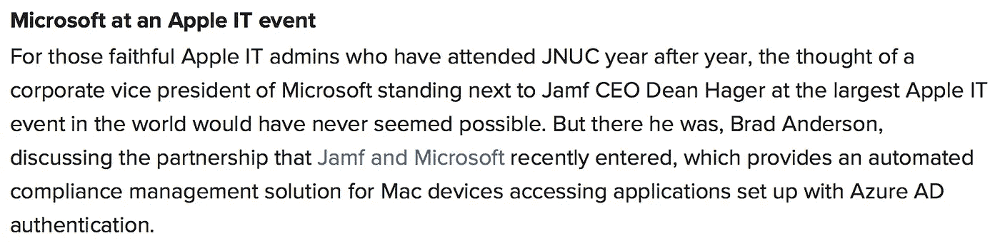
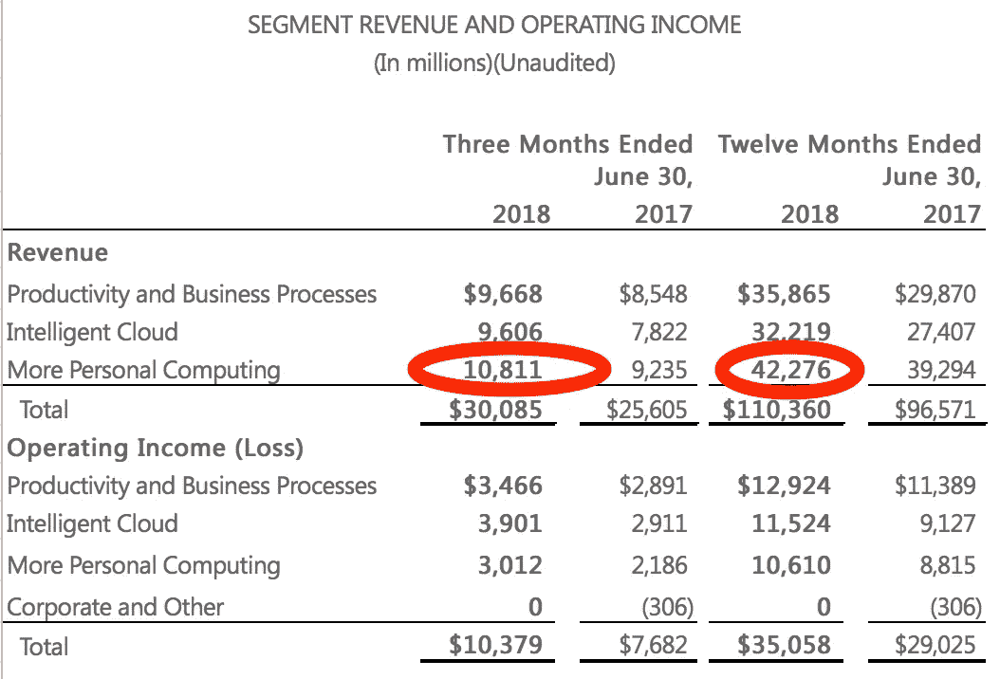

# 破碎的窗户

> 原文：<https://medium.com/hackernoon/broken-windows-db4845c049e5>

正如我们的眼睛是我们灵魂的窗户一样，Windows 是微软灵魂的窗户，不管他们的[上涨的股价](https://finance.google.com/finance?q=NASDAQ:MSFT)可能表明什么，如果他们保持目前的路线，微软注定会陷入停滞。很明显，如果你否认他们用 Azure 和 Office 365 彻底击垮了它，那你就是个傻瓜，但是那些产品没有 Windows 是无法自立的。作为微软其余产品的关键和漏斗，随着企业规模的扩大，Windows 为 Office、Active Directory、Exchange、SQL、Sharepoint、Office 365、Azure、CRM 和其他产品创造了自然的升级途径。如果没有 Windows 为这些服务创建一个自然的升级路径，它们将被迫单独运行，这是它们从未设计过的。不用说，一如既往，当 Windows 岌岌可危时，微软作为一个整体也岌岌可危，这些天 Windows 的情况似乎不太好。

我并不是在暗示 Windows 10 做得不好。尽管微软试图将其称为 Windows 的“最后”版本，但它是一个全新的操作系统，尤其是以其创收方式来衡量。Windows 以前是围绕授权模式构建的，原始设备制造商、企业和零售商批量购买许可证以供使用和转售，而 Windows 10 是围绕免费(至少对消费者而言)构建的，代价是遥测功能无法禁用，以及定向广告收入，类似于谷歌。从本质上来说，它服务于两个主人，它不再真正以促进业务为唯一重点，这似乎是为什么这些天他们喋喋不休地谈论他们的用户数量，就像任何其他围绕广告收入建立的搜索或社交网络一样。尽管 Windows 10 是一种全新的操作系统，不管人们对它有什么看法，它在自由市场上取得了巨大的成功，作为世界上排名第二的操作系统也没有什么可羞愧的。它似乎不仅像海绵一样吸收了挥之不去的 Windows XP、Vista、7、8 和 8.1 用户，而且在免费的同时做到了这一点；至少在一段时间内。

Source: [https://www.netmarketshare.com/](https://www.netmarketshare.com/operating-system-market-share.aspx?options=%7B%22filter%22%3A%7B%22%24and%22%3A%5B%7B%22deviceType%22%3A%7B%22%24in%22%3A%5B%22Desktop%2Flaptop%22%5D%7D%7D%5D%7D%2C%22dateLabel%22%3A%22Custom%22%2C%22attributes%22%3A%22share%22%2C%22group%22%3A%22platformVersion%22%2C%22sort%22%3A%7B%22share%22%3A-1%7D%2C%22id%22%3A%22platformsDesktopVersions%22%2C%22dateInterval%22%3A%22Monthly%22%2C%22dateStart%22%3A%222016-12%22%2C%22dateEnd%22%3A%222017-11%22%2C%22segments%22%3A%22-1000%22%7D)

当然，Windows 10 还有很长的路要走，仍然生活在 Windows 7 的阴影下，特别是在企业中，但对于一个免费的新操作系统来说，它是浪费大家时间使用 Windows 8 和 8.1 的一个公平的道歉。然而，与 Windows 7 相比，它在商业、工业、商业和企业应用方面绝不是一种升级，这就是 Windows 10 未能在这个巨大的市场领域产生重大影响的原因，类似于 8 和 8.1。虽然他们像其他人一样以讨厌变化而闻名，但回避 Windows 10 有一个合乎逻辑的理由，特别是在软件和硬件的个体优势变得更加突出的企业规模上。

尽管他们在 Windows 10 中荒谬的更新频率已经得到了很好的记录，但似乎很少有人考虑到这样的频率真正表明了什么，尤其是在考虑他们发布的更新类型时。微软并没有急于推出功能更新，2016 年 Windows 10 的非功能和安全更新是 2015 年 Windows 7 的两倍。这不仅是缺乏质量协议的症状，无法跟上他们的冲刺，本质上将数量置于质量之上，而且也高度表明缺陷密度的急剧上升，这也恰好是这种方法的逻辑结果。简而言之，对于那些没有意识到的人来说，缺陷密度的增加往往会导致我们在 Windows 10 中看到的非功能更新的增加。但这本身并不能保证，相关性并不等于因果关系。

Source JNUC 2016: [https://youtu.be/NLgvIarqdDM?t=2119](https://youtu.be/NLgvIarqdDM?t=2119)

虽然微软的 QA 实践或其产品的缺陷密度难以从外到内进行验证，但您仍然可以通过解决方案对业务的影响来衡量解决方案的缺陷程度，特别是随着时间的推移与其他解决方案或其自身进行比较，主要是通过对总拥有成本(TCO)的影响。例如，IBM 开始向他们的用户推出苹果产品，当时他们注意到 macOS 用户的总体拥有成本降低到 Windows 7 用户的 1/3。不出所料，在对比当年 Windows 7 和 macOS 的非功能更新时，2015 年 macOS 是 Windows 7 的 1/4。记住这一点，并考虑到 Windows 10 在 2016 年有 [270 多个非功能更新](https://support.microsoft.com/en-us/help/4018124/windows-10-update-history)，是 2015 年 Windows 7 的两倍多，那么我们可以从 Windows 10 对 TCO 的影响方面期待什么？当与 TCO 的显著上升相结合时，则高度预示着缺陷率和缺陷密度的急剧上升。

假设仅通过更新来衡量，如果 macOS 为 IBM 产生的总拥有成本是 Windows 7 的 1/3，而 IBM 是一家大多数人都认为凭借其发明在管理 PC 方面效率极高的公司，那么它产生的总拥有成本应该是 Windows 10 在相同环境下产生的 1/6–1/8。对于那些没有意识到这一点的人来说，这意味着企业可以为他们的员工购买冗余的配置良好的 MacBook Pros，同时仍然比相同的员工在一台 Windows PC 上产生更少的拥有成本，即使这些 PC 是免费的。虽然它们的初始成本经常被比较，但企业购买后管理和支持这些产品所需的成本几乎总是让初始成本相形见绌。

IBM’s Mac Presentation @ JNUC 2016

当以总拥有成本衡量时，对企业来说真正重要的是 Windows 7，它本身就是一个杰作，也是微软向前迈出的最好的一步，却被 IBM 的 macOS 弄得尴尬不已，Windows 10 遥遥无期；因此，商业、工业和企业仍然坚持使用 Windows 7。这不仅仅是因为 IBM 是一家聪明的公司，而是因为他们确实是在理解我正在申请的基础上写的这本书。从内部和复杂性的角度来看，我们可以看到软件会随着时间的推移而衰退，随着软件变得越来越复杂，成本也越来越高，这就是测量缺陷密度使我们能够关联的东西，这正是 Windows 正在发生的事情。

Source: [https://pdfs.semanticscholar.org/presentation/48e8/30f19e80c6071b1d5b6fb3e654c8e4d04baf.pdf](https://pdfs.semanticscholar.org/presentation/48e8/30f19e80c6071b1d5b6fb3e654c8e4d04baf.pdf)

考虑到这一点，除了纯粹的疯狂之外，当一台满载的 MacBook Pro 在平均使用 3 年后的价格明显低于 Windows PC 时，即使 Windows PC 是免费的，除了苹果，企业和企业还有什么选择呢？2020 年，当 Windows 7 [失去官方支持](https://support.microsoft.com/en-us/help/13853/windows-lifecycle-fact-sheet)并看到 macOS 中更高效的解决方案的选择，而不是坚持使用 Windows 或迁移到 Windows 10 的相对噩梦时，他们会去哪里？此外，如果企业放弃 Windows 转而使用 macOS，那么如果没有 Windows 创造的自然采用途径，Office 365、Azure 和其他辅助产品会怎么样？我的猜测是，它们会像在 macOS 上安装 Edge 浏览器一样吸引人。这对 Windows 和微软来说都是坏消息。

微软似乎更愿意给猪涂口红，做一些肮脏的事情，以便通过其他方式赚钱，而不是解决这些问题，让 Windows 对企业更具竞争力，特别是通过代码重构和专注于 bug。例如，通过将 Windows 转换成一个广告平台，保留了令人毛骨悚然的遥测数据(目前无法禁用)，他们[大大增加了 Bing 的收入](http://www.businessinsider.com/windows-10-drives-bing-revenue-versus-google-2015-10)。然而，像任何其他广告平台一样，他们非常依赖于采用，当 Windows 10 没有获得他们预期的接受度时，微软通过推荐的更新来部署他们的新操作系统，不能选择退出，屈就于 AskJeeves 工具栏，并诉诸于困扰他们自己的操作系统几十年的恶意软件策略。他们甚至变得如此低调，以至于指示他们自己的合作伙伴、业务和 IT 顾问用他们的产品来“[创造粘性](https://blogs.partner.microsoft.com/mpn/create-stickiness-with-ip/)，以此作为巩固他们和增加转换成本的手段。这些都不是一家公司的行为，该公司的产品可以凭实力运行，而是一家大到无法监管的垄断企业在拼命寻找相关性。

不管它们的股价如何，如果你是一家像微软这样的科技公司，这些都是孤注一掷的行为。在 2009 年，他们曾经可以收取数百美元的 Windows 许可证费用，但在 2016 年，他们很难免费提供。Windows 曾经赋予人们权力，现在却像恶意软件或脸书一样掠夺他们；尽管没有达到同样的程度或以没有净效益的方式。他们曾经是平台，现在他们必须构建自己的产品和服务，以不依赖于当今的 it。苹果可以以 200 美元的价格直接向他们的客户销售 3 年保修和支持合同，这比微软的一个 Windows 支持案例还少，微软产品创造了一个数万亿美元的合作伙伴行业，在全球雇用了 1700 万人。这是一个巨大的差距，对 Windows 和微软整体来说也是一个坏消息。

不幸的是，与汽车没有什么不同，承认缺陷问题比解决问题要容易得多。当错误进入生产环境时，事后解决的成本可能比在进入生产环境之前解决的成本高 50-1000 倍。你不仅要修正错误，重做堆积如山的工作，还要修正与错误相关的一切，这在一个你的工程师开着保时捷的行业是一件代价高昂的事情。不用说，Windows 7 需要消耗大量资源，Windows 10 需要消耗前所未有的资源，才能与 macOS 相提并论，因此，微软开辟新领域会更好。这可能是 Windows 10 被称为 Windows 最后一个版本的原因吗？

简而言之，在企业范围内，自 Windows 7 以来，微软几乎十年没有相关的操作系统，IBM 和 GE 等企业和企业有一个明显的趋势，即与苹果生态系统以及谷歌的替代套件保持一致，并发现这样做有很大的优势。这并不是因为他们的产品很时尚，也不是因为这些公司反对微软，而是因为与 Windows 的火枪相比，macOS 是一辆艾布拉姆斯坦克，至少从会计或工程师的角度来看是这样，其他企业和行业意识到这一事实只是时间问题。不过微软可能意识到了这一点，因此他们称之为 Windows 的最后一个版本，以及为什么他们在前面提到的 JNUC 会议上试图通过 JAMF 强迫苹果用户使用 Azure。或者你真的认为微软，几十年来杰出的软件工程公司，对软件复杂性和缺陷密度的影响一无所知吗？

Source: [https://www.jamf.com/blog/fortune-500-companies-follow-in-ibms-footsteps-with-mac-choice-programs/](https://www.jamf.com/blog/fortune-500-companies-follow-in-ibms-footsteps-with-mac-choice-programs/)

因此，微软应该有 2-3 年的回旋余地，以完成不可能的任务，使 Windows 10 达到标准或完全建立一个新的操作系统，和/或支持他们所有其他的云服务和收入流，以便他们能够在商业领域生存，这是他们的主要收入来源，可能不会由 Windows 主导。如前所述，他们的产品不是为了独立而设计的，而是附属于 Windows 周围的生态系统。微软已经在努力解决这个问题，他们的云平台一如既往地包容和不依赖平台，不管他们的动机如何，这都是明智的一步，但如果 Windows 在 2020 年失利，这就足够了吗？除非对他们的操作系统做出重大改变，否则我认为商业和企业将有义务跟随 IBM 和 GE 的脚步，在苹果和谷歌的方向上选择阻力最小的道路，同时完全远离微软的生态系统。所有这些对微软来说都是致命的打击，因为尽管 Windows 有缺点，但它仍然是微软的头号收入来源。

[https://view.officeapps.live.com/op/view.aspx?src=https://c.s-microsoft.com/en-us/CMSFiles/FinancialStatementFY18Q4.xlsx?version=10864f3a-8c49-ee89-6d6b-c9af3ee53d1b](https://view.officeapps.live.com/op/view.aspx?src=https://c.s-microsoft.com/en-us/CMSFiles/FinancialStatementFY18Q4.xlsx?version=10864f3a-8c49-ee89-6d6b-c9af3ee53d1b)