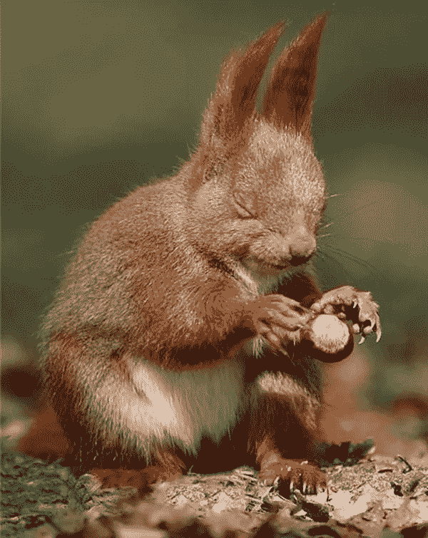
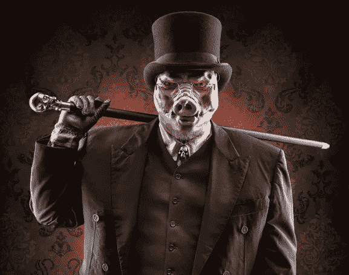

# 早午餐臭鼬和 10 种其他类型的秘密投资者

> 原文：<https://medium.com/hackernoon/brunch-skunks-and-11-other-types-of-crypto-investors-4e8f3ab14050>

现在不要看，但无论你看哪里，都有人在以某种方式投资加密货币。

如果你注意的话，这些“某人”并不是随机的角色，而是一系列直接来自核心角色的原型。

# 肮脏的富人和难以忍受的迷失

由于疯狂的预感或可笑的运气，在 2008 年 Satoshi 的白皮书发表后不久就表现强劲。从来没有磨练过一个生活技能。漫无目的地四处游荡，但却有能力买下你要去的整个岛屿。

# 早起的鸟儿

步入以太坊预售，把一个好看整洁的小窝蛋放在一起。避免了大部分的炒作，通常不会过分夸大他们的持股，而且不像有些人，实际上是为了谋生而工作。

# 双胞胎

就像在[中的温克尔斯](https://www.theguardian.com/technology/2014/may/19/winklevoss-twins-bitcoin-bigger-than-facebook-investors)。显然，他们了解到了[比特币](https://hackernoon.com/tagged/bitcoin)，因为这是他们确认伊比沙岛酒店预订的唯一方式。

现在你知道如果你赢了与脸书的官司该怎么做了。

# 单名基金经理

参见 [Ari](https://medium.com/u/b3452004c8a4?source=post_page-----4e8f3ab14050--------------------------------) 和 [Olaf](https://medium.com/u/8ca5a93ee80a?source=post_page-----4e8f3ab14050--------------------------------) 。

受到款待、尊敬和经常提及。

有点像麦当娜。

好消息是他们通常会送货上门(没有尖头胸罩)。

# 盲松鼠基金经理

能够筹集 500 万美元、1000 万美元或 1500 万美元，所以现在它们会鼓起毛茸茸的松鼠尾巴，停下来拍照。随着市场的成熟，你会通过他们漫无目的地寻找橡子时爪子抓地的疯狂声音来认识他们。

Blind Squirrel Finds an Acorn

# 会议荡妇

别急，别急……这和性无关。

穿梭于加密会议和加密会议之间的无聊的人。有点像[没有 MPPM 的早午餐](https://www.youtube.com/watch?v=x2buHuvI_-o)——也差不多一样有趣。

他们绝对富有——而且显然生来如此。

不清楚他们是否真的拥有 crypto。

Bob’s Burgers warns you about Brunch Skunks

# 趾勺

在 FOMO 过着疯狂的生活。不想错过，但又不能全进。会把你堵在鸡尾酒会的角落里，不停地谈论加密。

绝对有比特币基地账户。永远不会交换他们的 0.5 BTC。

# 变态的风险资本家

紧随其后的是弗雷德和 T2 和蒂姆，他们更新了 LP 协议以接受代币；一些大胆的人正在为他们的基金开发加密“袖子”——专门的投资领域。

会不会是 2017 年 crypto 项目融资比 VC 多 3.5 倍产生了影响？跑森林跑！

# Reddit 辩论者

主要是动量交易，偶尔在新闻上，但真的是在谣言和炒作上。这里聊一会儿，那里钓一会儿，你知道吗，钱就像牛奶和蜂蜜之地一样源源不断。

当动力音乐停止时，蜂蜜流将看起来更像蜂巢的群体崩溃。

# [坐在阿卡普尔科黄金上的小偷](https://startupsventurecapital.com/flipside-crypto-the-oxymorons-of-crypto-investing-4eb4e8247792)

没错。因为他们不能在美国运营。

显然他们在短裤的下摆绣了 MLM。

# 电报委员会猪

从 Telegram 的预售中分得 500 万美元。他们会以 20%的溢价卖给你。他们以 20%的溢价买下了它。

如果你想听到口吃，只需询问他们的经纪人/交易商执照。

The Commission Hog