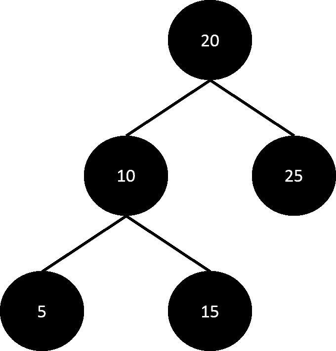
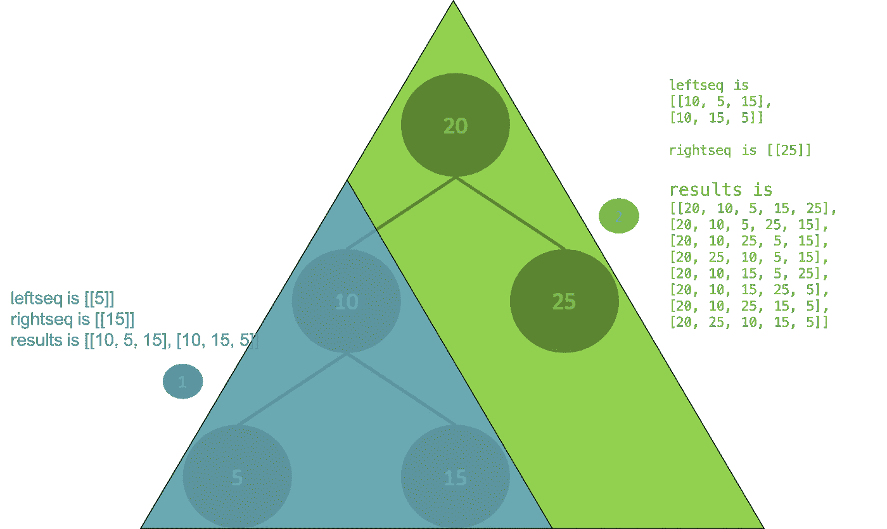

# Python 中的 BST 序列

> 原文：<https://medium.com/hackernoon/bst-sequences-in-python-c072c0e9b19f>

#开始背景

几年前，我踏上了在[编程](https://hackernoon.com/tagged/programming)领域认真提高技能的旅程，我开始在 Codecademy 上做教程，并在 Udemy 上注册课程。由于我的工作涉及到相当多的旅行，我把教程离线下载到我的 ipad 上，然后在飞机上学习。我一开始打算学习编程来构建有用的东西，尽管旅程的每一步都很艰难，但我意识到，直到我沉浸在数据结构和算法中，我才知道“困难”这个词的真正含义。

我是航空航天工程专业的学生，以一等荣誉毕业于新加坡。之后，我作为新产品工程师加入了 Schlumberger，从事油田泵的工作，并在北海安装设备。工作时间很长(每天 16 个小时很常见，周末也经常加班)，工资很低，但这种体验很棒，我不会用它来交换任何东西。直到今天，进行翻船训练、走下挪威逃生滑道以及乘坐直升机到钻井平台的生存训练都是美好的回忆，除非是油田工程师，否则人们不会经历这些。

在那之后，我加入了 P&G，成为一名研究护发品牌的研究员，在两次晋升之后，我开始意识到，虽然项目管理、利益相关者管理(确保和你一起工作的每个人都开心)和建立信誉可能很重要，而且实际上在任何地方都是最重要的，但我并没有在工作中获得做我非常热爱的事情所需的技能，即构思、制造有用的东西来解决问题和建立品牌。不过，我所处的环境超级棒，有支持我的同事和管理层。在这样的企业环境中工作让我意识到，关于一家公司如何运作，有多少东西需要学习；管理层如何在分配人员和资源以及整合不同部门的努力以建立和振兴品牌方面做出决策(无论是基于数据还是直觉，这就是为什么商业是一门如此美丽的科学，也是一门艺术)。神奇的东西。

我希望通过提供快速而准确的事实，帮助公司各级管理层和产品经理做出更明智的决策，这促使我开始编程，为大众创建一个抓取和数据挖掘工具，该工具一直为致力于十亿美元品牌(如 Pantene、Vicks、Tide、Head and Shoulders、SKII、Oral b 等)的团队提供有价值的消费者洞察。这个工具叫做 www.wheregottext.com(首字母缩略词 WGT)(我已经设置了认证，所以只有宝洁公司的员工可以创建账户)。

除了 WGT，我还开发了一个求职应用程序和一个识别超市产品的应用程序，并显示其他消费者的相关在线评分和评论，以便消费者在购买前做出更明智的决定，而不仅仅是与商店的销售代表交谈等。我还参与了 Android 和 iOS 应用程序开发，我将在另一个时间描述这一点。

无论如何，咆哮到此为止，我会在另一篇文章中介绍更多的内容。到目前为止，我遇到的一个比较困难的问题是:给定一个 BST，找出一个可以创建 BST 的列表。

#结束背景

我将使用 Gayle Laakmann McDowell 的《破解编码采访》中的例子来提供我的观点和解释，希望遇到这个问题的人不会像我一样在网上寻找有用的解释，但没有成功。我会用 [Python](https://hackernoon.com/tagged/python) 提供代码。书中的代码是用 Java 写的。



想想左边的二叉查找树。我们可以尝试手动列出一些可能的数组，这些数组包含可以插入以形成二叉查找树的元素。

[20,10,5,15,25]

[20,10,25,5,15]

[20, 25,10,15,5]

…

注意，对于每个子树(由三个节点组成),必须总是首先插入根，然后是任何顺序的子树，因为子树在同一层。

我解决这个问题的最初想法是首先对所有节点进行一次前序遍历，并将节点存储到一个列表中。然后，我将生成一个所有元素排列的列表，然后过滤掉以值 20 开始的列表，以及 10 在 5 和 15 之前的条件(因为 10 必须首先相加才能形成 BST)。这种想法有很多缺陷。这是一种非常手动的方法，如果 BST 较大，或者如果我们无法在上面的图表中显示 BST，那么确定节点的层次结构将会变得不必要的复杂。我们可以做一个 BFS，算出 10 必须在 5 和 15 之前，但是我宁愿遵循教科书的方法，而不是实现它。

我们知道，我们总是将问题分解成更小的问题，然后对于 BST，我们可以使用回收将解决方案扩展到更大的问题。在书中，使用了两个递归函数。一个叫做 weaveLists，另一个叫做 allSequences。

首先，我们来定义一个树类。我们需要能够进行插入，也能够得到根。

```
class Node:
    def __init__(self, val):
        self.l = None
        self.r = None
        self.v = valclass Tree:
    def __init__(self):
        self.root = Nonedef getRoot(self):
        return self.rootdef insert(self, val):
        if(self.root == None):
            self.root = Node(val)
        else:
            self._insert(val, self.root)def _insert(self, val, node):
        if(val < node.v):
            if(node.l != None):
                self._insert(val, node.l)
            else:
                node.l = Node(val)
        else:
            if(node.r != None):
                self._insert(val, node.r)
            else:
                node.r = Node(val)
```

此后，我们希望能够编织子树的元素。weaveList 函数如下(我在代码中直接添加了注释来解释发生了什么) :

#注意，在递归中，我们总是对第一、第二和前缀列表使用相同的引用，因此修改这些列表的操作必须就地完成。任何拷贝都必须使用 deepcopy 函数来完成。

###编辑到下面的代码:不要使用 result = prefix.copy()，而是使用:

```
import copy
result = copy.deepcopy(prefix)
```

自从。copy()是一个浅层副本。

感谢智勇指出这一点。

```
# 'first' list shall be referred to as first[]
# 'second' list shall be referred to as second[]
# 'prefix' list shall be referred to as prefix[]def weaveLists(first, second, results, prefix):
    # if first or second is an empty list
    if not first or not second:
        # ensuring that result is a CLONE and not a reference to prefix
        result = prefix.copy() ### EDIT HERE TO DEEPCOPY
        # add result to first or/ and second lists
        if first:
            result += first
        if second:
            result += second
        # append the weaved list which is result, to results
        results.append(result)
        return # add result to first or/ and second lists
        if first:
            result += first
        if second:
            result += second
        # append the weaved list which is result, to results
        results.append(result)
        return # this would be the method as described in the textbook
    # first, remove and store first element of first[]
    headFirst = first.pop(0)
    # append to prefix
    prefix.append(headFirst)
    ### add recursive call to operate on first[]
    weaveLists(first, second, results, prefix) 
    # exit when first[] is empty # reset prefix for second recursive call below by removing last element
    # IMPT to modify in-place
    del prefix[-1] 
    # reset first[] for second recursive call below by adding back first element
    # IMPT to modify in-place
    first.insert(0,headFirst) # do the same thing on the second[]
    headSecond = second.pop(0)
    prefix.append(headSecond)
    ### add recursive call to operate on first[] and second[]
    weaveLists(first, second, results, prefix)
    del prefix[-1]
    second.insert(0,headSecond)
```

我们希望 weaveList 函数能够对子树进行操作，并构建整个树。

因此，通常我们希望 weaveList 处理蓝色的子树 1，然后是绿色的整棵树。



因此，所有序列的代码是(带有解释注释):

```
def allSequences(node):
    # this is the final list of lists we want to output
    results = []
    # termination, append [] so that results will not be empty\
    # and the nested for loop will still execute since
    # leftSeq == [[]] and rightSeq == [[]] in termination
    if not node:
        results.append([])
        return results # prefix will always be root of subtree
    prefix = []
    prefix.append(node.v)
    # then represent the left and right subtrees
    leftSeq = allSequences(node.l)
    rightSeq = allSequences(node.r) # nested for loop and call weaveLists on each list in
    # leftSeq and rightSeq, which are list of lists
    # and each represents results of each subtree
    for left in leftSeq:
        for right in rightSeq:
            # make weaved an empty list, 
            # which is results in weaveList
            weaved = []
            weaveLists(left, right, weaved, prefix)
            # weaved is list of lists generated by left[] and right[]
            # add weaved list of lists to final 
            # results list of lists
            results += weavedreturn results
```

驱动程序的主要功能是:

```
if __name__ == "__main__": tree = Tree()

    tree.insert(20)
    tree.insert(10)
    tree.insert(25)
    tree.insert(5)
    tree.insert(15) allSeq = allSequences(tree.getRoot()) for each in allSeq:
        print (each)
    print (len(allSeq))
```

将所有代码复制到一个脚本中，然后运行它来查看结果。代码在 Python3 中。

如有任何意见、建议或问题，请随时联系我们。