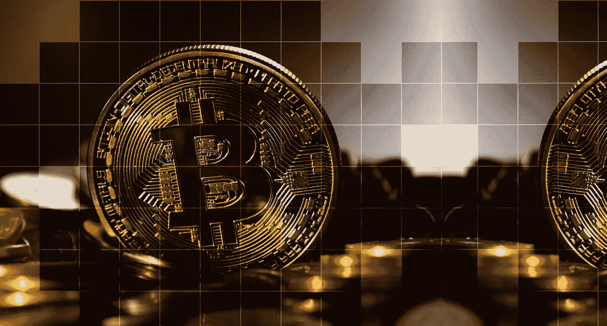

# BTC 对美元汇率上升——上升模式开启？

> 原文：<https://medium.com/hackernoon/btc-to-usd-goes-up-upward-mode-is-on-5685317605af>

除非你一直生活在岩石下，或者并不特别关注科技和金融行业，否则你很可能知道比特币。在过去一年左右的时间里，加密货币市场出现了爆炸式增长，这主要得益于比特币。

比特币是有史以来第一种被开发、创造和发行的加密货币，也是地球上最受欢迎的加密货币。其市值是第二名币以太坊的近 3 倍。然而，比特币并不总是锦上添花。经历了几个月的艰难时期后，它再次崛起，让投资者和支持者兴奋不已。

这篇文章将对过去一年比特币的生命周期进行一点观察，以及为什么它目前正在经历 BTC 对美元的复苏。

# 巨大的 2017 年

比特币自 2009 年创立以来就一直存在，但直到 2017 年才成为家喻户晓的名字和金融界的真正力量。在 2017 年之前，比特币的价值从未超过 800 美元。然而，到年底，一枚比特币已经花了[将近 14000 美元](https://coinmarketcap.com/currencies/bitcoin/historical-data/?start=20170810&end=20180810)。这是一个巨大的增长，数千名比特币持有者在 2017 年赚了一笔。

那么是什么导致了 2017 年比特币价值的大幅上涨呢？嗯，这主要是由于虚拟货币的日益普及和宣传。几乎所有的新闻媒体和出版物都在谈论加密货币，由于比特币是其中最大的一种，它的受欢迎程度大幅提升。此外，随着越来越多的地方开始接受比特币，它在许多人眼中变得更有价值。

比特币在整个 2017 年都是上涨的，但是最近一个月左右，就跌了一点点，这种下跌一直持续到 2018 年。

# 2018 年开局不利

不幸的是，就在比特币上涨的同时，它开始下跌。到二月初，比特币[的价值已经减半](https://www.forbes.com/sites/cbovaird/2018/02/05/bitcoin-falls-below-7000-down-more-than-60-from-all-time-high/)。2 月 6 日，比特币不到 7500 美元，与几周前相比，这绝对是一个巨大的跌幅。

虽然这对这个行业来说是一个小小的障碍，但这并不是终结。比特币的价格继续下跌，甚至跌破 6000 美元，这是自 2017 年 11 月初以来的最低水平。在此期间，许多投资者感到恐慌，而其他人则意识到加密货币的涨跌性质，因此预计在某个时候会下跌。

那么，是什么导致了比特币价格的大幅下跌，而仅仅几个月前，比特币的价格还比以往任何时候都高呢？嗯，有几件事可以归咎于。首先，加密货币作为一个整体的“病毒”开始减少，这严重损害了价格，因为许多人根本不再关心。从众心理是比特币上涨的重要原因，因此也是其价格下跌的重要原因。

另一个可能影响价格的因素是世界各地不同团体和国家的监管威胁。许多投资 crypto 的人并不喜欢监管，因此它的威胁肯定会吓跑一些投资者，并降低对比特币最终走向的预期。

# 2018 年年中复苏

虽然没有像 2017 年末那样快速上涨，但比特币的价格在 2018 年年中一直在缓慢上涨。它从徘徊在 6000 美元左右，上升到超过 8000 美元，这在投资者和支持者中带来了很多兴奋和信心。整个 7 月份都充满了持续的增长，而且这种增长在短期内没有停止的迹象。事实上，许多人认为，这种增长将使比特币回到去年能够达到的类似数字。但投资者的希望注定不会实现，至少目前不会。截至 8 月 10 日，比特币的价格定在 6400 美元，尽管有复苏的迹象。

那么比特币是怎么回来的，又开始往上爬了？嗯，这背后最大的催化剂之一是金融和技术领域的许多巨头正在寻求进入加密货币领域的消息。此外，围绕法规的好消息也有助于这种轻微的增长模式。预计围绕[比特币交易所交易基金](https://bitcoinmagazine.com/articles/sec-puts-decision-5-bitcoin-etfs-till-september-2018/)(交易所交易基金)也将获得批准，这可能会使市场投资变得更简单、更高效。

此外，很有可能价格上涨是因为更多的人投资于它，推动价格上涨。你看，当一项资产的价格变低时，许多人卖出，而另一些人则希望折价购买。因此，随着比特币价格跌至数月来的最低水平，许多人将此作为投资的理由。

总之，很难知道比特币或任何其他加密货币的未来会如何。但随着比特币的上涨，情况正在好转。这是一个受比特币投资者欢迎的迹象，因为该货币最近几个月一直在挣扎。虽然这并不能保证它将继续上升，但这是一个令人放心的情况，可能意味着上行模式确实开始了。

当然，在投资比特币(或任何其他加密货币或数字资产)之前，你应该做大量自己的独立研究。这些硬币非常不稳定，老实说，很难预测它们的涨跌。这篇文章绝不是试图让你投资比特币，我们只是在谈论比特币价格的历史以及为什么它可能会再次上涨。