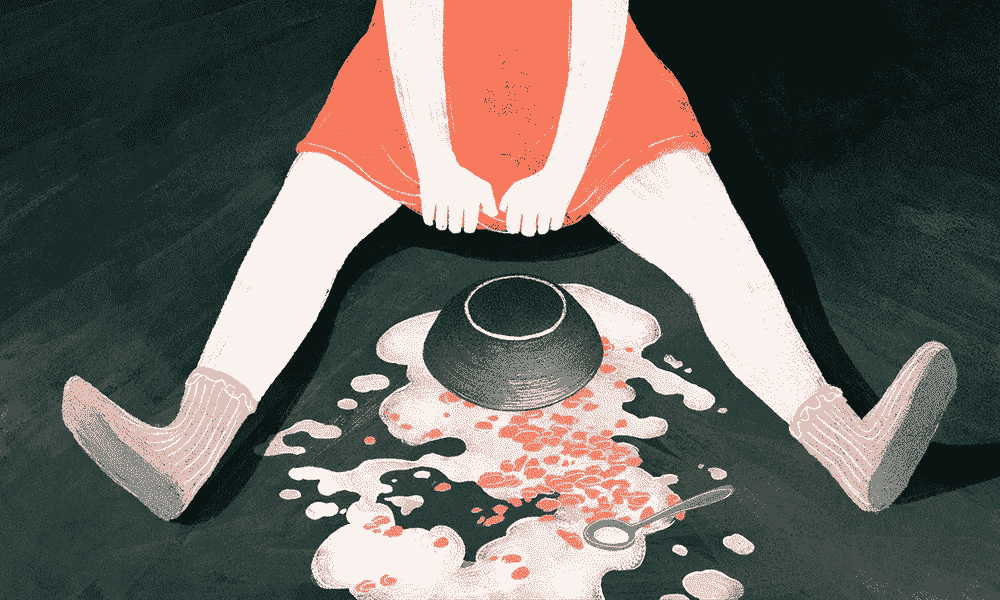

# 泡沫和崩溃。模式。

> 原文：<https://medium.com/hackernoon/bubbles-and-crashes-the-pattern-2d6452c0fa07>

Art by [Angelica Alzona](http://www.angelicaalzona.com/about/)

智能社会通过理解每一次新技术革命的潜力并设计如何部署来塑造未来。

但是为了建立自己的地位，新的需要取代旧的**。这并不容易，因为很多人喜欢老人。他们的成功，他们的财富，他们的生活都是基于过去的新事物，但现在已经过时了。**

**现在已经过时了。**

**这种来自旧市场和政府的自然**阻力**，加上吸收这些变化的困难，使得每一场伟大的革命都经历了泡沫和崩溃。**

## **如何识别一场革命**

**革命是由新的基础设施创造的，这些基础设施允许以更低的成本更广泛、更深入地渗透市场。从运河到铁路，到轮船，到高速公路和电力，到互联网。**

**富人、受过教育的年轻人往往是率先采用者，越来越多的社会阶层效仿他们。**

## **第一阶段—激动人心的时刻**

**技术革命一开始就吸引了私人投资者的投资。这些投资者为技术改造提供资金。他们支持新的创业公司，疯狂的公司，令人兴奋的公司。他们鼓励尝试新的商业模式，直到它与真实但过时的经济脱钩。**

**如上所述，在这一时期，新旧两极分化严重。旧的代表一个成熟、保守的市场，而新的适应自由市场意识形态，以鼓励放弃旧的做事方式。**

## **第二阶段——狂野西部🌵**

**现在，想象一下在一个“狂野西部”般的投资环境中。拥有大量资金和投机灵活性的环境；在那里，你不受法规和政府的约束。**

**最终，一切都越来越接近赌场般的金融工具，巨大的回报导致更多的投机。所有这些都创造了“纸”经济。**

**除此之外，这个投资狂潮阶段以在一个相对小的市场过度投资而告终。**

**赌场般的特征和小市场的过度投资最终导致了大市场的泡沫。最终，每个泡沫都会破裂…**

**几个例子包括导致[【1929 年华尔街崩盘】](https://en.wikipedia.org/wiki/Wall_Street_Crash_of_1929)[【咆哮的二十年代】](https://en.wikipedia.org/wiki/Roaring_Twenties)，2000 年[网络泡沫](https://en.wikipedia.org/wiki/Dot-com_bubble)，2007 年[次贷危机](https://en.wikipedia.org/wiki/Subprime_mortgage_crisis)。**

**我们刚刚在 2018 年经历的规模小得多的[比特币和 ICO 泡沫](https://www.wired.co.uk/article/ico-bubble-burst)。**

## **第三阶段——衰退，好消息和坏消息**

**好消息是，在狂热之后，由于私人投资，新技术的基础设施已经安装完毕，为整个经济的全面增长做好了准备。**

**坏消息是，紧随崩盘之后，私人投资者开始规避风险，不准备为扩张提供资金。**

**此外，在绝望、不平等和失业的地方，衰退时期总是接踵而至。**

## **第四阶段——政府介入**

**因此，在重大崩盘后，政府历来都会介入，在支持投资和增长方面发挥积极作用。这就是监管和机构资金(旧资金)流入的地方。**

**在这一阶段，政府给出了一个在全球传播新经济的方向。**

****重复。****

**你可以在这里阅读更多关于技术革命和泡沫的内容:**

**[技术进步和重大泡沫破裂:历史规律和今天的教训](http://www.carlotaperez.org/downloads/media/PEREZTechnologyandbubblesforEngelsbergseminar.pdf)卡洛塔·佩雷斯著。**