# #BUIDL to Win: ETHSingapore

> 原文：<https://medium.com/hackernoon/buidl-to-win-ethsingapore-1843e4f4ea19>

最近，我和另外三名来自 [Rate3](https://www.rate3.network) 的工程师(Waihon、吴迪和鲁宇)一起参加了 [ETHSingapore](https://ethsingapore.co/) 。Rate3 旨在通过跨链资产令牌化和身份管理的开放协议，将企业连接到[区块链](https://hackernoon.com/tagged/blockchain)。

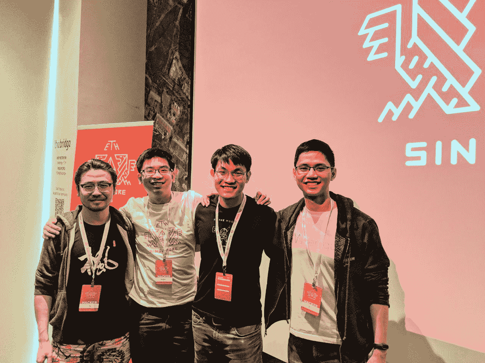

From left to right: Lu Yu, Waihon, Me and Wu Di (full stack engineer)

# 埃西辛加波勒

ETHSingapore 是东盟第一个以太坊[黑客马拉松](https://hackernoon.com/tagged/hackathon)，也是 [ETHGlobal](https://ethglobal.co) 2018 系列的一部分。

项目被要求在 36 小时内使用以太坊以及各种其他[赞助商项目](https://docs.google.com/document/d/10B_UjgYDP0A00QSbKyEvruFkgfuWc6LSvaEYHyloXUY/edit)的 API 进行协作和构建去中心化的应用程序，这些赞助商项目包括 Aragon、bZx、Celer、Giveth、Kyber、MakerDAO、NuCypher、Raiden、Set Protocol、Quantstamp 和 Status。

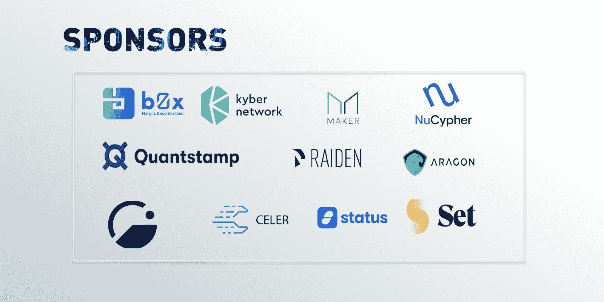

ETHSingapore 为我们提供了一个很好的机会，让我们留出一个周末来专注于一个新颖的、但人们仍然会使用的黑客技术。有了我们在以太坊和 Stellar 上的符号化和身份化经验，我们很高兴可以开始了。

# 第一天，晚上 9.30——构思

黑客马拉松正式开始，接下来是黑客马拉松最难的部分:决定黑客。

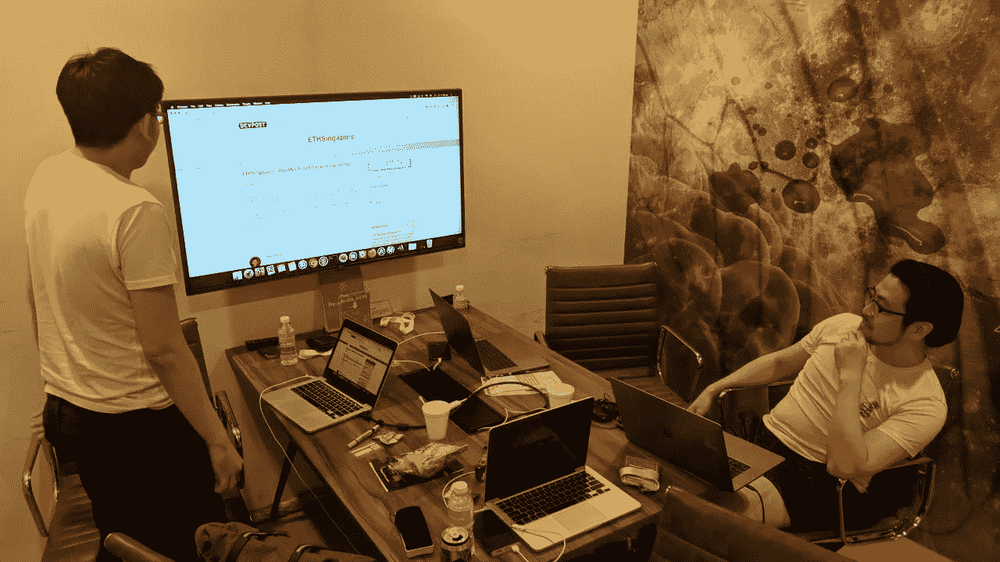

We managed to secure a cosy work room. Not in picture: whiteboard with lots of drawing.

以下是我们头脑风暴过程中的一些想法:

## 道治下的一箩筐马粪

[Set 协议](https://docs.setprotocol.com)允许对令牌进行抽象，即“Set”ERC20 令牌由一个或多个 er C20 令牌组成。它的工作原理是按照创建集合时确定的比率抵押基础令牌。

例如，可以创建一个 50%为 TUSD，50%为戴的美元集合。要获得 1 美元的代币，你需要抵押 0.5 TUSD 和 0.5 戴。

这对于项目开发自己的令牌集，按功能将令牌组合在一起，或者只是为了方便地管理多个令牌，确实非常有用。围绕“再平衡 Set”的更复杂的用例是 Set 代理、基金管理、robo advisor 等。

我们最有趣的想法是有一个分散的美元设置。这可以通过下放权力(在 Aragon 的帮助下)来实现，即哪些代币应该进入美元集合，集合的组成比例，以及通过进行荷兰式拍卖来选择何时重新平衡美元集合。

## 戴科与链上 KYC 索赔

DAICO(分散自主初始硬币发行)是一种通过结合 Dao 的优点来最小化复杂性和风险来改进 ICO 模型的想法。(在维塔利克·布特林的[主题帖](https://ethresear.ch/t/explanation-of-daicos/465)中阅读更多内容)

其中一个主要特性是`taps`,它决定了开发者每秒可以从 DAICO 合同的初始贡献中获得多少 wei。代币持有者可以对两种决议进行投票:

*   增加 tap:允许团队抽取更多乙醚
*   关闭和退款—永久自毁合同(或者，更准确地说，将合同置于撤销模式，在这种模式下，令牌持有者可以按比例撤销所有剩余的以太网)

自那以后，DAICO 机制得到了广泛的讨论。我们想尝试利用新的简化的 [ERC725 简单身份代理](https://github.com/ERC725Alliance/erc725/blob/master/docs/ERC-725.md)、 [ERC734 密钥管理](https://github.com/ERC725Alliance/erc725/blob/master/docs/ERC-734.md)和 [ERC735 声明持有人](https://github.com/ethereum/EIPs/issues/735)来实现戴科-KYC 的销售。身份代理将持有来自项目团队或第三方证明者的 KYC 声明，并且他们的令牌销售限额将是动态的。

## 钱包再平衡

想象一下，你持有多种代币(公用代币、资产支持代币、加密支持代币等)，当然还有以太币。目前，用一个钱包无缝交易多种资产相当具有挑战性。

我如何想象一个人目前可能尝试这样做——将资产从你的钱包转移(或批准代币转移)到代币交易的相应平台，进行交易并存入账户。复杂性和摩擦因持有的令牌数量和每个令牌支持的平台而成倍增加。现在，除此之外，如何在图片中添加尝试获得令牌之间和平台之间交易的最佳利率？

我们的想法是允许个人指定代币及其余额的最终状态，然后在一次交易中进行必要的交易。依靠分散的流动性提供者，如 0x T1 或 T2 凯伯网络 T3，在一次交易中进行多次互换，这是可能的。一种简单的方法是将“自上而下”的令牌从当前余额交换到指定结束状态的目标令牌，直到原始令牌用完。一个更复杂的多交易，0x-Kyber 优化系统，也是一个潜在的扩展。

## 通用支付

这一想法的灵感来自于卡支付的便利，发送者和接收者可以用任何支持的货币发送和接收。

如果我们可以发送我们钱包中的任何代币或以太网，并且接收者能够接收任何支持代币或以太网中的值，这将是有用的。同样，这将依赖于原子交易的智能合约互换。

## 多杠杆 CDP

[MakerDAO](https://developer.makerdao.com/) 的抵押债务头寸(CDP)是发行的抵押资产(醚)和 Dai(美元稳定币)的记录。CDP 所有者可以使用借入的 Dai 来开发更多的递归杠杆 CDP。

再次依靠分散流动性协议，我们可以创建一个易于使用的 UI，允许拥有 ETH 的用户创建任意数量的递归 CDP，并选择 ETH/token 剩余余额的数量。

(查看 [https://mkr.tools](https://mkr.tools/) 查看网络统计数据)

## 无气戴支付

想象一下，一个应用程序允许你将戴发送到任何钱包，而无需通过代理人(为你支付汽油的人)直接支付汽油费。

为什么是戴？嗯，它是一种稳定的美元货币——作为一种价值储存手段和交易媒介，它是很棒的。为什么要费尽周折让代表为你付油钱呢？考虑让你的朋友安装你最喜欢的以太坊钱包，只是因为你想给他们一个 200 戴的提前圣诞礼物。你这样做可能不会有问题，因为你已经熟悉了这个生态系统。现在，你的朋友能拿傣族怎么办？假设说，如果戴可以像真正的美元一样使用，他们可以用它来支付，但如果没有醚来支付交易，你的朋友将不能做任何事情。

天然气对以太坊生态系统至关重要，因为它是激励矿工的原生货币，但在不熟悉加密货币的人找到获得以太坊的简单方法之前，它是以太坊更广泛采用的障碍。

它是如何工作的是通过 [ERC865](https://github.com/ethereum/EIPs/issues/865) 的实现。发送者(没有醚)将离线签署阿呆交易，并将其传递给代理以提交给网络。协议的一部分是，如果有的话，代表将从戴的收入中抽取一部分来支付汽油费和其他费用。代表们将能够慢慢地把他们的醚转换成 Dai，选择持有，或者用另一种资产进行交易。

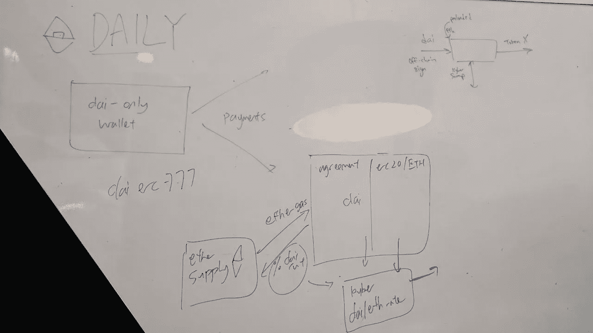

Yes we considered ERC965 but this means we also have to implement a ERC777 Dai

这个想法有一个啤酒背景故事。这一切都始于 MakerDao happy hour 活动，该活动是在镇上的一次黑客马拉松前聚会之后举行的。MakerDao 团队免费发放了 5 个 Dai，参与者可以用 1 个 Dai 换取一张精酿啤酒优惠券。有两个主要问题:

戴的兑换过程包括在 Kyber Network 网站上申请一个促销代码，在那里他们给你一个网络钱包，里面有代币可以通过 Kyber Swap(你猜对了)兑换成戴，还有一些乙醚可以进行兑换并送出代币。

用户在哪个过程中遇到的麻烦最多？

实际上是扫描二维码——这意味着扫描 Kyber 网站的代码([https://Kyber . network/swap](https://kyber.network/swap))。打开一个二维码扫描仪比输入它花费更多的时间)并将付款发送到团队的钱包中。二维码在移动设备上应该很好用吧？嗯，只有当网站和应用程序具有二维码扫描功能时，这才有效。

**成本** 为这些钱包生成许多一次性地址(想想成千上万个)和空投以太网，监视钱包的不活动状态并整合未使用的以太网，这可能是非常昂贵和复杂的。如果一个组织设立他们自己的代表，并代表他们管理的钱包支付汽油费，这将更加方便和便宜

因此，阿呆专用钱包应运而生。它需要易于使用，并应提供一个熟悉的移动 UX，顶部有一个二维码扫描仪；)

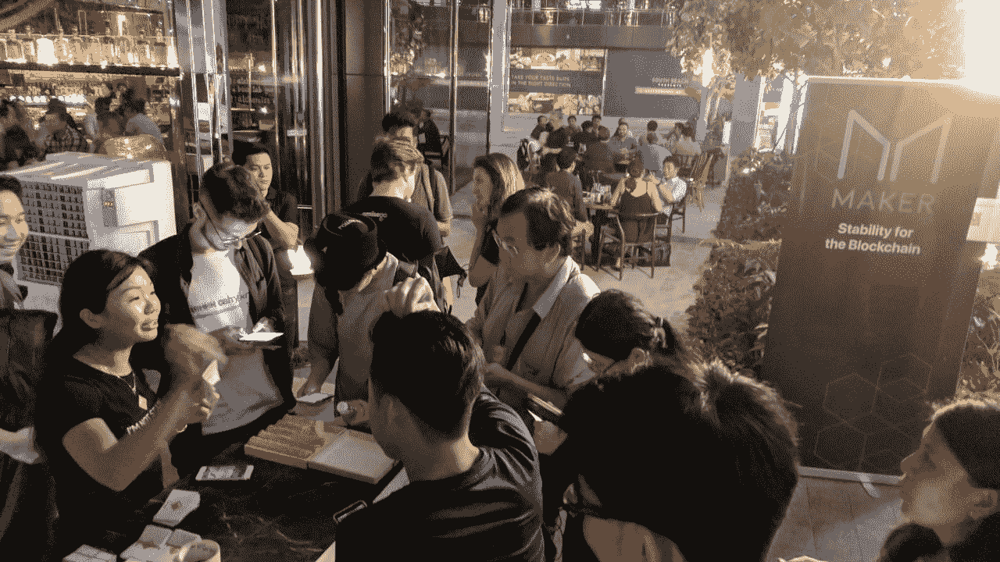

People learning how to use Kyber Swap and sending Dai :)

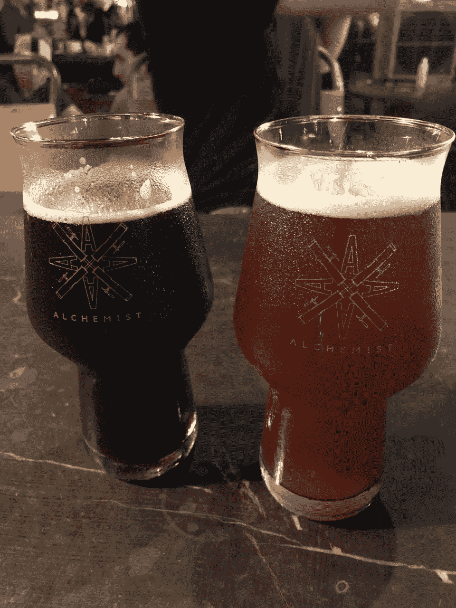

Beers worth the wait! Right outside Esplanade station

## 以太恒星

类似于 Metamask 的扩展，但它连接了恒星生态系统。

Etherstellar 的主要特征:

1.  允许通过一个应用程序管理以太坊和恒星账户
2.  充当恒星中的 dApp 桥
3.  充当以太坊上的流动性平台和 Stellar 中的锚的直接桥梁( [SEP-0006](https://github.com/stellar/stellar-protocol/blob/master/ecosystem/sep-0006.md) )
4.  允许用户自由地与以太坊和恒星 dApps 互动
5.  允许用户在以太坊和 Stellar 之间自由交换令牌(集中交换或散列时间锁合同)
6.  允许用户通过分散流动性协议(以太坊)或本地 DEX (Stellar)在各自网络中交易代币

## 新加坡相关(付款、身份证等)

既然是在新加坡，为什么不考虑一些新加坡独有的黑客技术呢？

它可以从集成支付 API (PayNow、DBS、OCBC 等)到提供一个简单的加密-菲亚特桥(仅从技术角度来看)。就当是用菲亚特新币扩充以太坊钱包吧。我们甚至考虑创建一个 SGD stablecoin 作为事务层，而 on/off ramp 可以通过 DBS API 集成来实现。区块链上的 GrabPay？在区块链创建一个新加坡文莫？

## 决定，决定

我们对自己的想法非常兴奋，但不幸的是，我们几乎花了 36 个小时的一半时间构思和思考(直到凌晨 4 点，第二天继续吃午饭)。

鉴于我们最初的目标是打造人们会使用的东西，随着时间的推移，我们只剩下:**钱包平衡**、**通用支付、无油的戴支付、与新加坡相关的黑客。**

我们必须消除与新加坡相关的黑客攻击，因为当我们尝试使用 DBS Developers playground 时，它对我们不起作用，而且如果不通过银行\_(ツ)_/(一种开放的新加坡支付协议，也许是另一个项目，另一个时间)，就无法沙箱化 PayNow API(通过电话或银行注册的 id 号支付)

没有汽油的戴最终被选中，因为每个成功的故事都需要一个背景故事。我们也更有动力去构建一个黑客来解决两天前我们个人面临的一个问题。

我们也毫不费力地想到了这个黑客的名字: [**戴. ly**](https://devpost.com/software/dai-ly)**——**戴的日常无线支付。

# 第 2 天，下午 4.30—实施

有了这个想法，我们开始计划我们的实施范围和任务分配。

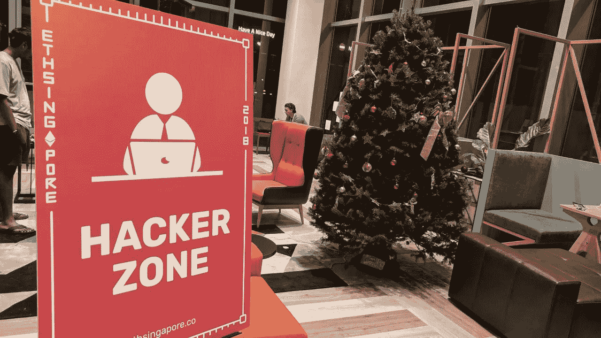

One of the three hacker zones. We picked this one because of the Christmas tree, obviously.

以下是概要:

## 用户界面

用户界面应该是一个 web 应用程序，以便它可以在移动和计算机上使用。该应用程序还应该易于构建和使用，同时对试用它的用户具有吸引力。我们决定在 React 应用程序中使用谷歌的材料设计，给人以光滑的外观和感觉，并添加一些动画来增加它的味道。

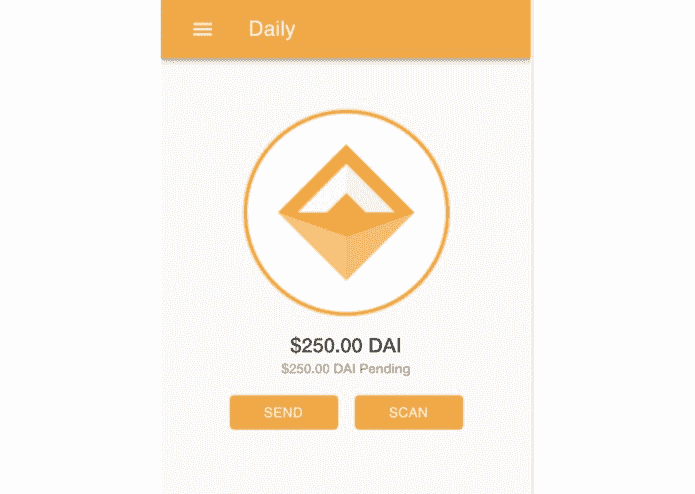

Presenting the Dai.ly app

## 智能合同

执行 [ERC865](https://github.com/ethereum/EIPs/issues/865) 。这意味着将建议的接口添加到当前的 Dai 令牌代码中，并编写测试来确保它实际上可以工作。我们发现已经有一个非常有用的实现参考。我们还想将它与 MakerDao 和 Kyber APIs 集成在一起。

然而，在实施过程中，我们面临几个问题。实现代码有编译错误，`ecrecover`代码已经过时，一些方法的散列是错误的。ERC865 强制现有的 ERC20 令牌也升级它们的令牌。这使得我们无法在 Ropsten testnet 上与预期的 Makerdao 和 Kyber Swap API(CDP 和 swaps)进行完整的工作集成。如果我们有更多的时间，我们可以部署他们的合同来支持我们的自定义令牌。

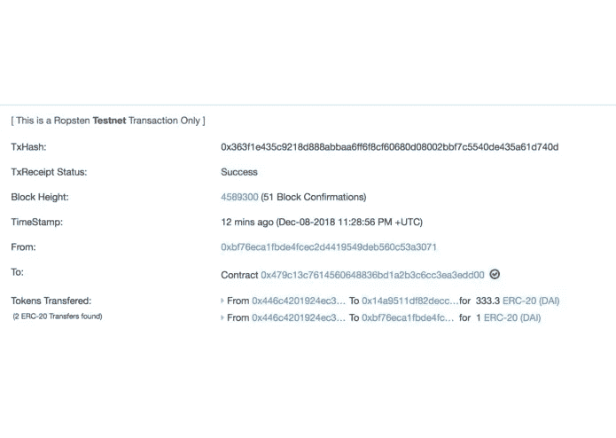

Look Ma, no ethers! 1 Dai is sent to delegate 0xbf7… as fees

## 后端:

我们需要一个 web 服务器作为发送者和代表的离线匹配，并跟踪尚未提交到网络的已签名事务。自从我们使用 Go 以来，我们用 geth 库实现了事务监控和重试。

对于简单的事务和查询，为契约方法自动生成的 Go 包装器仍然很难使用。 [Go 以太坊书](http://goethereumbook.org)是一本用 Go 开发以太坊应用的很棒的指南书。在构建技术演示时，我们一直依赖 web3.js 或在一些罕见的情况下依赖 Etherscan API 来提交和查询事务，管理事件。这种实践经验给了我们更多关于使用 Go server 作为以太坊事务管理器的见解和知识。

所有代码都可以在[https://github.com/rate-engineering/dai-ly](https://github.com/rate-engineering/dai-ly)找到

# 第 3 天，上午 9:30—提交

在长时间消耗由谷物、小吃、虎牌啤酒/Milo/红牛/100 Plus 提供的美食后，我们设法完成了我们的 MVP。

我们在 IPFS[托管了客户端](https://cloudflare-ipfs.com/ipfs/Qmb9PSiFEvUTe1f8GDXTxJyjg2ZeyTaRxxpJXkZYmfqz58)服务器托管在我的装有老版 ngrok 的机器上。在我们提交作品并接受评审后，我们终于设法睡了一会儿，直到下午 1:30 的闭幕式

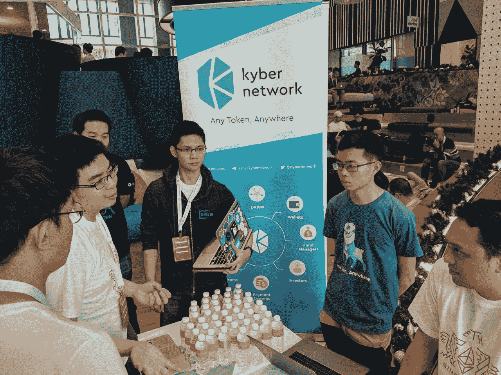

Sharing our idea with guys from Kyber Network

Thankfully we were one of the first to be judged. More rest time!

# 第三天下午 1:30 闭幕式

随着[黑客马拉松](https://hackernoon.com/tagged/hackathon)接近尾声，在闭幕式开始之前，我们收到一条消息，我们被选为决赛选手之一！我们太累了，没有庆祝，而是把所有的精力都放在测试我们的应用程序上，以确保一切正常。

那天演示神对我们微笑。在 Vitalik Buterin 面前演示黑客技术绝对是一个难忘的时刻。我们还设法赢得了 MakerDao 的一个奖项(也许我们在他们的社区开发工作中取得了成功)，并从 Gitcoin 团队获得了一个 ERC721。

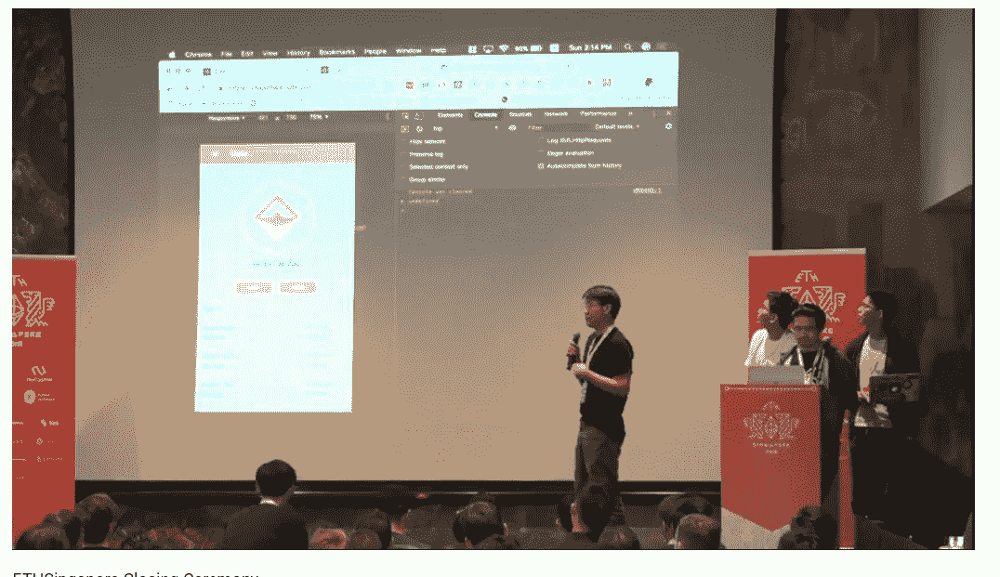

回顾过去，我们留下了许多美好的回忆，结交了许多同样热衷于开发以太坊生态系统的朋友。在我们参加过的所有黑客马拉松中，我们敢说 ETHSingapore 是组织得最好的，氛围和体验也是最好的！

Waihon sharing to [Zero Knowledge](https://www.zeroknowledge.fm/) blockchain podcast with [@AnnaRRose](https://twitter.com/AnnaRRose)

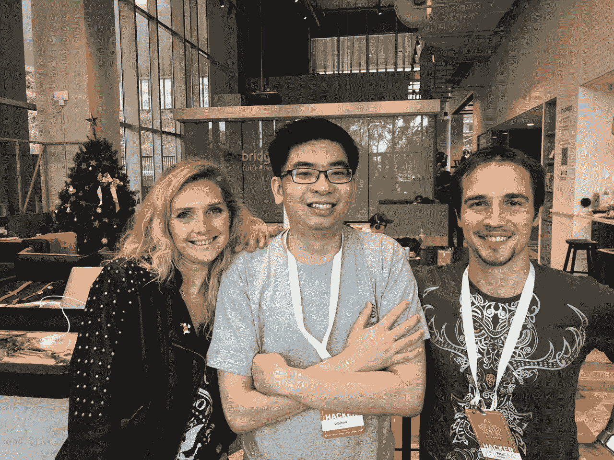

And hearing more about the Plasma implementation being done by the [Matter Inc](https://thematter.io/) team

希望在不久的将来，我们会在东盟看到更多这样质量的区块链黑客马拉松。

如果你跃跃欲试想要加入，下面这些即将到来的全球黑客马拉松可能会让你感兴趣:
[https://www.ethdenver.com](https://www.ethdenver.com/)
[https://ethcapetown.com/](https://ethcapetown.com/)

*戴维斯·盖伊是 Rate3 的首席技术官和联合创始人。*