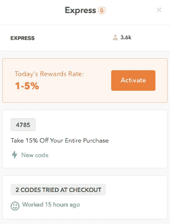
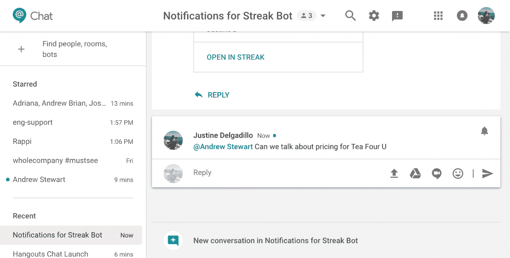

# Build-A-Bot 101:基本的 Bot 类型区别

> 原文：<https://medium.com/hackernoon/build-a-bot-101-the-basic-bot-type-distinctions-d901ecf00330>

看起来我们对机器人以及它们当前和未来的应用永远都不会满足。尽管推测未来很酷，但我们认为让它回归基础并讨论从头开始创建一个[机器人](https://hackernoon.com/tagged/bot)需要什么是有用的。这正是我们在 kea 正在做的事情:建立一个对话式人工智能系统，这基本上是一种语音自动化机器人的花哨说法。我们最近对我们的 kea 语音机器人进行了彻底的检查，以创建一个新的人工智能个性，让我们告诉你-这需要做很多决策。人们将如何使用声音？声音应该激发什么感受？它应该解决哪些问题？诸如此类。

这一切都从构建机器人的高级属性开始。这些基本上是人工智能背后的机制，是其他一切构建的基础。以下是一些需要做出的决定:

**个人、团队或公共 Bot**

当决定你的机器人的特征时，你必须考虑它将被用在什么水平上。是一个人与自动化系统进行交互，就像一个人用 ke a 的电话订购机器人订购午餐，还是一个调度机器人在 Slack 上发出会议提醒？或者是像人工智能电话会议服务或集体度假计划机器人那样的团队水平？有些程序甚至可以用于个人和团队层面，比如 Slack。无论你的机器人做其中一个还是两个，这通常是第一个决定，并嵌入在系统的初始计划中。

**超级机器人或特定领域机器人**

这个问题是围绕 bot 的功能展开的。特定领域机器人是面向特定服务的，比如 Stella，这是一个求职机器人，可以帮助雇主根据匹配的技能集为空缺职位找到合格的候选人。通用是指它被许多受众以多种方式使用，比如谷歌助手。这是一个机器人，但它可以告诉你天气，找到最近的拉面店，等等。kea 是一个特定领域的机器人，因为它的工作是代表餐馆接受电话订单，它不会给你驾驶方向或今天棒球比赛的比分。

**面向消费者或企业的机器人**

就像一个如果你忘了关车库门就会自动提醒你的家用系统一样，kea 的系统是以消费者为中心的。消费机器人可以提供各种各样的功能，它们可以帮助我们自动在我们最喜欢的购物网站上找到折扣，如 Honey，提醒我们该锻炼了，或者提醒我们去我们的遗愿清单目的地的旅行交易。专注于业务的机器人，如费用申报或工作流程自动化软件，与消费者机器人有着完全不同的目标。商业机器人被设计成直奔主题，尽可能高效地完成任务。然而，一个消费机器人有展示一点个性的空间:幽默、自省、智慧等等。

**语音或文字机器人**

kea 系统是语音界面的一个明显的例子，使用对话式人工智能为客户接受电话订单。还有其他一些流行的例子，比如苹果的 Siri、亚马逊的 Alexa 和谷歌 Home。以 Alexa 为例，她是一个语音机器人，可以改变你家里的温度，播放你的“经典 80 年代”播放列表，并设置提醒从烤箱中取出火鸡。还有文本机器人，比如当你需要退货标签时，可以在电子商务网站上帮助你的聊天机器人，或者出现在通信应用程序中的文本机器人，比如 Slack、Facebook Messenger 和微信。

**遗留整合还是小说系统**

kea 的系统可以与餐馆现有的 POS 系统配合使用，这意味着它可以与餐馆已经采用的票务技术集成或改装。这是传统集成机器人的一个例子，其他例子包括用于 G-mail 的 Streak 机器人，它将聊天对话中的重要信息输入到其数据管理工具中。一些像 Pypestream 这样的机器人是从零开始构建的，从上到下使用专有技术。

这是本周足够的技术话题。下周，我们将深入探讨为机器人塑造个性的细节，不久之后，我们将推出我们的新 kea 语音机器人，我们已经为此努力了几个月。我们不能等待-聊天(机器人)很快！