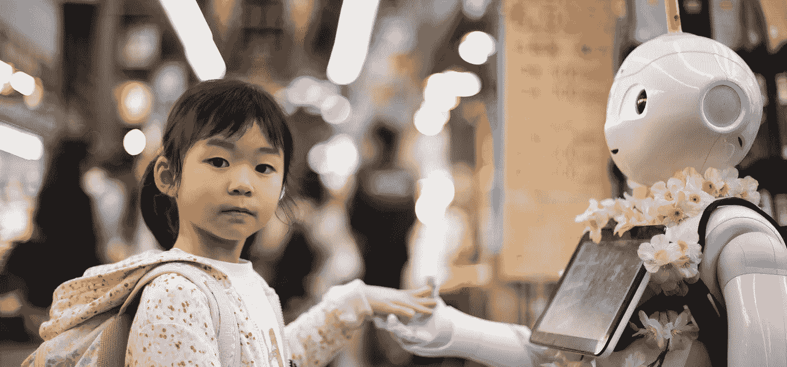
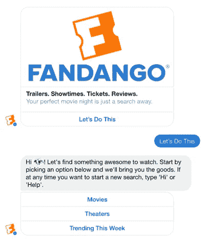
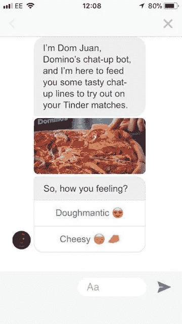
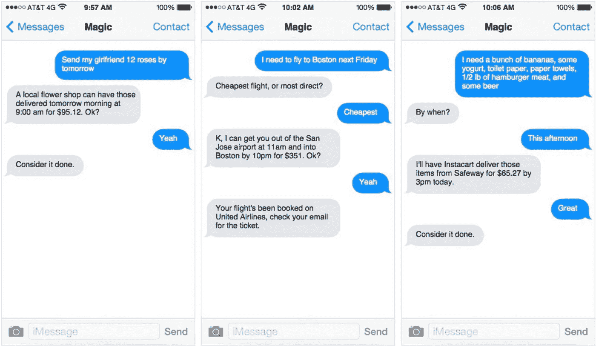

# 建造机器人 102:创造个性

> 原文：<https://medium.com/hackernoon/build-a-bot-102-creating-a-personality-b20e31df8c61>

上周，我们深入探讨了构建机器人的高级属性，从决定它是以消费者为中心还是以商业为中心，到在语音或文本平台上创建它。与决定机器人如何工作的构件一样重要的是决定如何创造它独特的个性。在决定了机器人的使用环境后，创造出能为用户优化其价值的特征是至关重要的。对于 kea 来说，我们的机器人的工作是自动接受餐馆的电话订单，我们希望我们的[机器人](https://hackernoon.com/tagged/bot)具有使这变得容易的个性。以下是我们在塑造这种个性时要考虑的因素:

**环境**

构建机器人角色的第一个决定实际上与决定其高级属性的决定相同:关注点是面向消费者还是面向商业。一个面向消费者的机器人可能更幽默，有离题的自由，因此可能比商业机器人更有个性。即使 bot 完全面向消费者，也需要根据上下文进行某些调整。例如，一个正在帮助用户度过艰难时期的治疗机器人，应该感同身受，并知道避免幽默。

**观众**

这里要指出的第一点也是最重要的一点是:从来没有一种情况下**每个人**都是正确的受众——即使对于像谷歌这样的超级机器人也是如此。更成熟的观众使用的语音机器人可能会避免使用社交媒体缩写和俚语，如 HMU 或 WFH。例如，提醒用户开会的 Meekan 日程安排机器人的受众将与 Domino 漂亮的披萨订购机器人 Dom 的受众不同。机器人的个性应该反映其观众的具体需求。

**要做的工作**

Fandango’s Facebook Messenger Bot

机器人可以负责任何数量的任务，从在必要时发出重要的天气警报，到建议晚餐食谱，等等。对于每一项需要完成的工作，即使是非常细微的工作，也需要完全不同的方法才能成功。一些机器人甚至可以做多种工作，比如 Fandango 的脸书信使机器人可以显示预告片，并根据邮政编码推荐附近的影院。对 kea 来说，手头的任务很简单:在餐馆里为饥饿的顾客接电话订单，快速而轻松。我们吃饭吧！

**运行时变化**

即使在一个机器人个性中，机器人处理任务的方式也可能有所不同，这取决于环境。例如，一个发送新闻的机器人在分享一个关于顽皮小狗的可爱视频时，应该有不同的语气，而不是在分享一场致命的飞机事故的新闻时。在某些情况下，像丝芙兰教授化妆教程的 Kik 应用程序，不会有任何运行时的变化，个性大多保持不变。

**当地相关的社会接受度**

在决定最适合机器人个性的文化时，必须考虑地理位置、社会经济地位和其他因素。对一个地方来说可能是亲切的称呼，对另一个地方来说可能是完全令人讨厌的。例如，像“老兄”或“亲爱的”这样的称呼，根据特定文化中的社会接受程度而产生不同的共鸣。然而，像 Siri 这样的一些机器人与各种各样的文化互动，必须有广泛的社会接受度。

**现有品牌**

Domino’s “Dom Juan”

对于每一个使用机器人的公司来说，机器人是现有品牌的直接反映是至关重要的。这包括社交媒体语气、网站内容以及媒体和营销宣传材料中使用的声音。例如，达美乐的品牌个性是年轻、乐于助人和高效。这反映在 Dom pizza 订购机器人上，当它说它正在为你做“美味”的订单，甚至在“Dom Juan”下创建自己的 Tinder 配置文件。

**值**

是什么让你的机器人滴答作响？这是一个通过考虑你提供的服务而固有地回答的问题。对于 concierge-bot，Magic，服务基本上是你想要的任何东西，从寻找异国美食到为最后一分钟的聚会预订杂技表演。机器人的个性反映了其服务的“能做”态度，即使是最复杂的请求也会做出“认为它完成了”的响应。

准备好打造自己的机器人了吗？我们希望我们已经给你指明了方向。请记住，机器人个性的核心是你的公司:它是愿景、目标和价值观。对 kea 来说，这让餐馆老板的工作变得更容易，同时让饥饿的顾客毫不延迟地得到他们的食物。我们希望我们的机器人友好、乐于助人、幽默，同时不要忘记让顾客更快进食是多么重要。