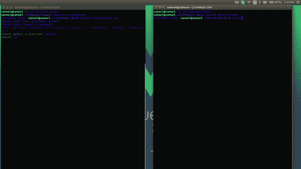

# 使用 Python 在终端中构建一个聊天应用

> 原文：<https://medium.com/hackernoon/build-a-chat-app-in-the-terminal-using-python-9f306e57db8f>

> [**推手**](http://bit.ly/2lCXscm) ，我们的每周赞助商，开发通信和协作 API，为世界各地的应用提供支持，由易于集成的 SDK 支持，用于 web、移动设备以及最受欢迎的后端堆栈。 [**入门。**](http://bit.ly/2lCXscm)

实时聊天实际上是提供从发送者到接收者的文本消息的实时或现场传输的任何在线通信。本教程将向您展示如何使用 [Python](https://hackernoon.com/tagged/python) 和 Pusher 通道构建一个[实时](https://hackernoon.com/tagged/realtime)终端聊天。

使用终端聊天是轻量级的，因为不需要打开浏览器，加载 JS 库或任何前端代码。此外，它允许我们快速测试我们的想法，而不用担心用户界面会是什么样子。

> *本教程中的 Python 指的是 Python 3.x*

# 先决条件

阅读本教程需要对 Python 有一个基本的了解。您还需要在您的机器上安装和配置 Python 3 和 pip。

# 在 Pusher 上设置一个应用程序

[Pusher](https://pusher.com/) 是一种托管服务，可以非常容易地将实时数据和功能添加到 web 和移动应用程序中。

Pusher 充当服务器和客户端之间的实时层。Pusher 保持与客户端的持久连接——如果可能的话，通过 Web-socket 连接，并退回到基于 HTTP 的连接——这样，一旦您的服务器有了新数据，它们就可以通过 Pusher 将数据推送到客户端。

如果你还没有，去 Pusher 创建一个免费账户。我们将在仪表板上注册一个新的应用程序。唯一必须的选项是应用程序名称和集群。一个集群代表 Pusher 服务器的物理位置，它将处理您的应用程序的请求。此外，从应用程序密钥部分复制出你的应用程序 ID、密钥和密码，因为我们稍后会用到它们。

# 创建我们的应用程序

# 初始步骤

首先，我们需要安装一个名为`virtualenv`的包。Virtualenv 帮助管理 Python 中的环境。这样我们就不会因为项目间的安装操作而导致库冲突。要安装 Virtualenv，我们运行:

对于 Windows 用户，以管理员身份打开 Powershell，并运行:

安装完成后，我们可以通过运行以下命令进行验证:

接下来，让我们用 Virtualenv 创建一个新环境:

环境创建完成后，我们进入创建的新目录，并激活环境:

对于 Windows 用户，您可以通过运行以下命令来激活:

我们需要安装库，我们将在这个项目中使用。要安装它们，请运行:

我们安装的这些包是什么？他们做什么？我会解释的。

*   `termcolor`:终端输出的 ANSII 颜色格式。这个包将格式化输出到终端的颜色。请注意，这些颜色不会显示在 Powershell 或 Windows 命令提示符中。
*   `pusher`:官方 Python 库，用于与 Pusher HTTP API 交互。
*   `pysher`:用于处理 pusher WebSockets 的 Python 模块。这将使用 Pusher 处理事件订阅
*   `python-dotenv` : Python 模块，从`.env`文件中读取键、值对，并将它们添加到环境变量中。

# 创建入口点

让我们创建一个新的`.env`文件，它将保存我们的环境变量，这些变量将用于连接到 Pusher。创建一个名为`.env`的新文件，并分别添加您的 pusher 应用 id、密钥、机密和集群:

接下来，创建一个名为`terminalChat.py`的文件并添加:

上面的代码是怎么回事？

我们导入了 colored 模块，它将为我们的控制台输出提供颜色，还导入了`load_env`模块，以便从我们的`.env`文件中加载环境变量。然后我们调用了`load_env`函数。

然后定义了`terminalChat`类，具有一些属性:

*   `pusher`:一旦 Pusher 服务器实例可用，该属性将保存它。
*   `channel`:该属性将保存订阅的通道的 Pusher 实例。
*   `chatroom`:该属性将保存用户想要聊天的频道名称。
*   `clientPusher`:一旦 Pusher 客户端实例可用，该属性将保存它。
*   `user`:该属性将保存当前登录用户的详细信息。
*   `users`:这个属性保存了可以登录的用户的静态列表，以他们的值作为密码。在现实世界的应用程序中，这通常是从一些数据库中获得的
*   这个属性保存了一个人可以加入的所有可用聊天室的列表。

# 理解定义的函数

我们定义了四个函数，我将分别解释它们是如何工作的:

这是我们应用程序的入口点。这里，我们调用函数来登录，调用函数来选择一个聊天室。在这之后，我们有一个 while 循环来调用`getInput`函数。这个 while 循环意味着`getInput`函数将一直运行。这是为了使我们总是有一个输入，以键入新的消息到终端。

`login`:登录功能顾名思义简单。它用于管理应用程序的登录。在函数中，我们要求输入用户的用户名和密码。接下来，我们检查用户名是否存在于我们用户的字典中。此外，我们检查密码是否与用户的密码相关。如果一切正常，我们将用户变量赋给用户输入的值。

> *注意:为了这个教程，我们有一个预定义的用户字典。在您的应用程序中，您可能需要验证数据库中是否存在该用户。*

`selectChatroom`:顾名思义，这个功能可以让用户选择一个聊天室。首先，它通知用户可用的聊天室，然后让我们选择一个聊天室。一旦选择了一个有效的聊天室，我们就将聊天室变量分配给所选的聊天室，并调用一个名为`initPusher`的方法(我们将很快创建它)，该方法初始化并设置 Pusher 来发送和接收消息。

`getInput`:这个功能很简单。它显示一个输入，前面是登录的用户名，等待用户输入消息并发送。目前，它对消息没有任何作用，一旦 Pusher 设置正确，我们将重新访问该功能。

# 将推送服务器和客户端连接到我们的应用程序

如果我们还记得，在前面的部分中，我们讨论了初始化和设置 Pusher 来发送和接收消息的`initPusher`方法。这里是我们实现该功能的地方。首先，我们需要将以下导入添加到文件的顶部:

接下来，让我们继续在 terminalChat 类中定义`initPusher`和其他一些函数:

在 init 函数中，我们将新的 Pusher 实例初始化为变量`pusher`，分别传入我们的`APP_ID`、`APP_KEY`、`APP_SECRET`和`APP_CLUSTER`。接下来，我们为 Pusher 初始化一个新的`Pysher`客户端，传入我们的`APP_KEY`。然后我们绑定到连接，即`pusher:connection_established`事件，并在回调时传递`connectHandler`函数。我们这样做的原因是为了确保在我们尝试订阅频道之前客户端已经连接。这样做之后，我们在`clientPusher`上调用`connect`。

> *你可能想知道为什么我们在这里使用*[*py sher*](https://github.com/nlsdfnbch/Pysher)*作为 Pusher 的客户端库。这是因为默认的 Pusher 库只允许触发事件，而不允许订阅事件。Pysher* *是一个社区库，允许我们在服务器上使用 Python 订阅事件。*

在`connectHandler`函数中，我们收到一个名为`data`的参数。这包括来自推动器网络插座之间建立的连接的连接数据。我们订阅用 Pusher 选择的通道，然后绑定到一个名为`newmessage`的事件，在回调时传入`pusherCallback`函数。

在`pusherCallback`方法中，我们接收一个名为`message`的参数，它返回从 Pusher 接收的新消息的对象。在这里，我们将消息转换成 Python 可读的 JSON 格式，然后在将消息打印到屏幕上发送者姓名旁边之前，检查消息是否不是给当前登录用户的。我们还将登录用户的名字打印到屏幕上，前面有一个冒号，这样用户就知道他仍然可以输入。

# 更新 getInput 函数

让我们更新我们的`getInput`函数，这样一旦收到消息，我们就可以触发消息给 Pusher:

这里，收到消息后，我们触发一个`newmesage`事件到当前聊天室，传递当前用户和发送的消息。

# 将所有这些整合为一个整体

这是我们的`terminalChat.py`的样子:

以下是我们运行`python terminalChat.py`后的聊天内容:

# 结论

我们已经看到，由于推送通道，在我们的终端上添加实时聊天是多么简单。我们的演示应用程序是一个简单的例子。相同的功能可以用在许多真实的场景中。您可以在 [GitHub](https://github.com/samuelayo/terminal-chat) 上查看完整应用程序的源代码，并在这里深入了解 Pusher 服务[。](https://pusher.com/docs)

> 我们的每周赞助商 [**Pusher**](http://bit.ly/2lCXscm) 开发通信和协作 API，为世界各地的应用提供支持，并由易于集成的 SDK 提供支持，用于 web、移动设备以及最受欢迎的后端堆栈。 [**入门。**](http://bit.ly/2lCXscm)