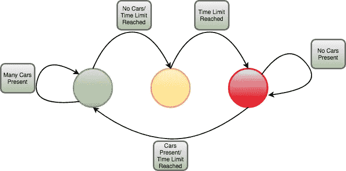
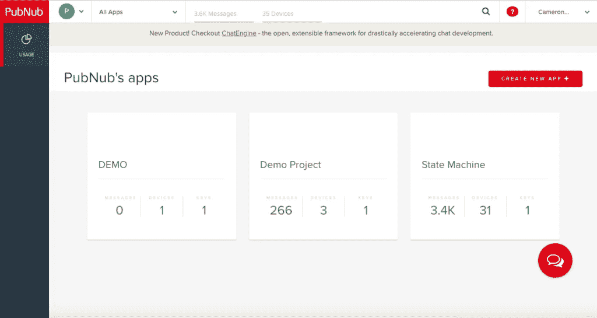
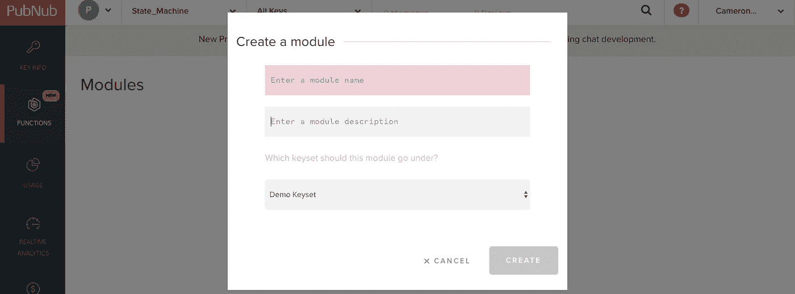
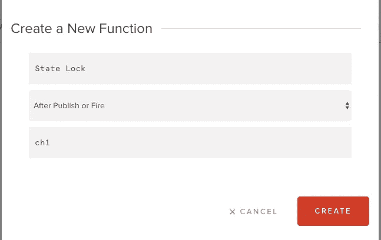

# 构建一个具有 PubNub 功能的云服务器状态机

> 原文：<https://medium.com/hackernoon/build-a-cloud-server-state-machine-with-pubnub-functions-205f5eee5a99>

在本教程中，我们将向您展示如何使用 PubNub 函数创建一个简单的状态机；然而，在我们这样做之前，让我们解释一下什么是状态机以及它们的重要性。

# 什么是状态机？

首先，状态机是一种数学抽象，它允许设备处于一组稳定条件中的一个，这取决于其先前的条件和其输入的当前值。交通信号灯是状态机的一个例子，根据是否有汽车存在，改变它的状态为绿色、黄色或红色。



状态机是计算机编程的基本工具，也是嵌入式设备的高效基础设施，尤其是在物联网领域。由于大多数物联网设备都处于收集不同数量和类型的数据进行处理的情况下，**状态机允许将代码划分为更小的状态，因此不必同时运行所有代码**。例如，为了延长电池寿命，当没有数据传入时，物联网设备可以通过进入“低功耗状态”来节能。

此外，状态机允许代码具有很强的可读性，因为代码可以分解成非常小且易于管理的块，其他用户可以快速浏览。如果物联网设备运行不正常，开发人员可以从物理上识别哪个状态不正常，并快速修复与该状态相关的有问题的代码。

# 为什么要用 PubNub 函数来实现状态机？

虽然状态机可以通过多种方式实现，但将 PubNub 嵌入到您的状态机设计中对于物联网嵌入式系统来说将证明是非常高效和有效的。

使用 PubNub 功能允许开发人员将所有繁重的计算和逻辑外包给云，这为物联网设备释放了许多资源。这允许设备的更好的电池寿命，并且开启了使用更便宜和/或更小的设备的可能性。

此外，PubNub Functions 是云中的一个独立模块，可以在几秒钟内进行全局部署。这意味着，您可以让数百万台物联网设备立即接收代码和状态机的代码更新。

如果应用正确，一个聪明的农民将会有数千个廉价的物联网灌溉设备分布在他的田地里，只需一个互联网连接，几千字节的存储空间和一个开关阀。该农民所要做的就是在 PubNub 函数中快速编写一个状态机，立即部署到他的所有设备上，并让他的所有设备最大限度地提高他的土地效率。他甚至可以在每个设备上安装湿度传感器，以监控植物何时需要浇水，并在天气/季节变化时对每个设备进行更新。

这里有一个小演示:

# 代码走查

# 第一步:计划

实现状态机的最关键的步骤之一是弄清楚它的设计，以及如何优化它，以获得它可以为您的场景提供的最大好处。你必须问自己:我需要多少个状态(变量值的数量)？我需要做什么来记住解释我的输入或产生我的输出？使用的“步骤”或“模式”是否有明确的顺序？我真的需要一个州吗？

在这次演示中，我想创建一个 4 按钮的物联网锁，需要正确的 4 位数字组合才能解锁。由于我将使用 led 来显示我所处的状态，我知道我总共需要 5 种状态(关闭，1 种正确，2 种正确，3 种正确，解锁！).我还记录了代码优化的状态转换，您可以在下一步中看到。

# 第二步:抽出来

有了可靠的计划，就有了可靠的图表，这将使您的代码更容易编写和调试。想出一个状态图来解决问题:

*   写出解决问题的算法或一系列步骤
*   算法中的每一步通常是图中的一个状态
*   问问你自己什么过去的输入需要被记住，什么通常会导致一个状态表示

下面是我的场景中完成的流程图:


请注意，当按下“a”时，它会将状态恢复到正确的状态，这与其他输入不同，因为这可能是下一个输入序列的开始。

# 第 3 部分:PubNub 函数

如果您花时间完成第 1 和第 2 部分，编写实际的状态机将是小菜一碟！如果你以前编码过状态机，这个过程是非常相似的，除了一些使云计算如此有价值的关键区别。

首先，你需要在这里注册一个免费账户。

接下来，创建一个 PubNub 函数:



点击


右上角的“创建新应用程序”

命名您的应用程序，然后创建您的模块。如果需要，选择生成应用程序时给你的“演示”键集。



最后，创建您的函数，命名您的通道，并确保选择“发布或发射后”选项



既然您已经创建了容纳我们代码的不动产，我们可以开始从设备到云的外包或状态机。在 PubNub 函数中实现状态机的关键在于 [KV store](https://www.pubnub.com/docs/blocks/kvstore-module) 特性。KV store 允许您在函数中保存一个变量，该变量不会在每个函数被触发后重置其值。这对于状态变量和记住我们的输入来执行特定的输出是完美的。

要使用 KV store 和一些 PubNub 功能，我们稍后需要发布到我们的物联网设备，包括这些库

```
const db = require("kvstore"); 
const pubnub = require('pubnub');
```

KV store 的工作方式是将变量存储在 PubNub Functions 服务器中，要访问该变量，必须向该服务器发出 GET 和 SET 请求。因此，要让我们的函数首先读取状态变量，看看状态是否已经改变，您必须做出这样的承诺，

```
//retrieve state variable from kv store return db.get("state").then((state) => {<State machine code>}
```

状态机的结构如下:外部 if 语句检查状态，内部 if 语句检查输入。所以外部结构应该这样实现:

```
// !state checks if state is null, in case nothing has ever been written to the state before
if(state == 0 || !state){} else if (state == 1){} 
else if (state == 2){} 
else if (state == 3){}
```

要实现输入，请参考您之前创建的流程图。每个 if 语句都是图中的一个块，因此您必须检查箭头以了解每个输入如何影响状态。然后，根据每个状态实现内部 if 语句。

对于本演示，由于数据输入来自以“文本”结构表示的消息，后面是来自远程按钮的“a”、“b”、“c”或“d”，我们必须像这样打开消息:

```
if(request.message.text == "a"){}
```

我们将在下一节更多地讨论发布按钮消息的结构。

根据您的输入，您可能希望更改您的状态，并在您设备的频道上发布一条消息，让它知道应该做什么。通常，您会希望将消息发布回第二个通道，这样消息就不会与从设备发布的消息冲突。

```
pubnub.publish({ 
     "channel": "ch2", 
     "message": "a" 
     }).then((publishResponse) => { 
     console.log(`Publish Status:   
     ${publishResponse[0]}:${publishResponse[1]} with TT
     ${publishResponse[2]}`); });
```

最后，如果状态变量已经更改，您将希望将它存储到 KV 存储中。您可能希望在 Outer (state) if 语句的末尾，紧接在 Inner (data input) if 语句之后执行此操作。

```
//store state in kv store 
db.set("state", state) //error handling 
.catch((err) => { 
console.log("An error occured.", err); 
});
```

这些都是制作 PubNub 状态机所需的工具。如果你想看演示项目的全部代码，这里有 GitHub 库的链接:[https://github.com/Cakhavan/PubNubStateMachine.git](https://github.com/Cakhavan/PubNubStateMachine.git)

# 第 4 部分:客户端代码

现在，您将从客户端设备的角度看到使用 PubNub 状态机的好处。由于所有的逻辑都在云中处理，我们需要做的就是确保我们的设备可以发布和订阅消息，这让 PubNub 变得更加简单！

在这个演示中，我选择用 JavaScript 编写一个 Arduino，这意味着我需要使用 Johnny-Five 平台来允许程序与设备通信。你可以通过运行终端 [npm](https://www.npmjs.com/get-npm) 命令下载 Johnny-Five

```
npm install johnny-five
```

根据你的电路设置，Johnny-five 提供了许多不同的实现方式，甚至电路图来帮助你弄清楚你想做什么:【http://johnny-five.io/examples/

在我的演示中，我将 4 个上拉按钮连接到输入 A2-A5，将 3 个 led 连接到输入 11-13。

一旦你想好了要构建什么样的电路，就在你的代码中包含你的库。

```
var five = require("johnny-five"), board, button; 
board = new five.Board(); 
var PubNub = require('pubnub');
```

打开 Johnny-five 板以连接 Arduino

```
board.on("ready", function(){<your code>}
```

然后，按照 Johnny-Five 语法声明您的按钮和 led

```
// Create a new 'LED' hardware instance. 
var led_1 = new five.Led(13); 
var led_2 = new five.Led(12); 
var led_3 = new five.Led(11); // Create a new `button` hardware instance.
var button_1 = new five.Button({ pin: "A5", isPullup: true });
var button_2 = new five.Button({ pin: "A4", isPullup: true }); 
var button_3 = new five.Button({ pin: "A3", isPullup: true }); 
var button_4 = new five.Button({ pin: "A2", isPullup: true });
```

使用您的键集初始化您的 PubNub 实例以发布和订阅消息

```
pubnub = new PubNub({ 
publishKey : 'pub-c-2bda6cf3-c455-4b28-bbed-00611b461f98', subscribeKey : 'sub-c-5bdd008c-6d97-11e8-a49b-66b3abd5adf6', 
});
```

然后，创建一个要调用的函数，并能够根据您想要的任何格式和通道发布消息。

```
function publish(x){ //x is the message passed to be published var publishConfig = {channel : "ch1", message : 
{ "text": x //publish messages of the format message.text.x } } pubnub.publish(publishConfig, function(status, response){   
     console.log(status, response); }); };
```

接下来，配置按钮来发布状态机输入的数据

```
// "down" the button is pressed 
button_1.on("down", function(){ publish("a"); }); button_2.on("down", function(){ publish("b"); }); button_3.on("down", function(){ publish("c"); }); button_4.on("down", function(){ publish("d"); });
```

然后，订阅接收状态机发布的消息的第二个通道，让设备知道状态已被更改。

```
console.log("Subscribing"); 
pubnub.subscribe({ channels: ['ch2'] });
```

最后，创建您的监听器来根据云告诉它的状态执行适当的命令。

```
pubnub.addListener({ 
message: function(message){ 
     console.log(message.message); 
if(message.message == "a"){ 
led_1.stop().off(); 
led_2.stop().off(); 
led_3.stop().off(); 
led_1.on(); }else if(message.message == "b"){ 
led_1.stop().off(); 
led_2.stop().off(); 
led_3.stop().off(); 
led_1.on(); 
led_2.on(); }else if(message.message == "c"){ 
led_1.stop().off(); 
led_2.stop().off(); 
led_3.stop().off(); 
led_1.on(); 
led_2.on(); 
led_3.on(); }else if(message.message == "Unlocked!"){
led_1.stop().off(); 
led_2.stop().off(); 
led_3.stop().off(); 
led_1.blink(); 
led_2.blink(); 
led_3.blink(); }else if(message.message == "off"){ 
led_1.stop().off(); 
led_2.stop().off(); 
led_3.stop().off(); } } });
```

完整的代码在下面的 GitHub repo 中:[https://github.com/Cakhavan/PubNubStateMachine](https://github.com/Cakhavan/PubNubStateMachine)

就是这样！这些都是实现具有 PubNub 功能的高效云状态机所需的工具！

*最初发表于*[T5【www.pubnub.com】](https://www.pubnub.com/blog/cloud-server-state-machine-pubnub-functions/?utm_source=Syndication&utm_medium=Medium&utm_campaign=SYN-CY18-Q2-Medium-July-9)*。*