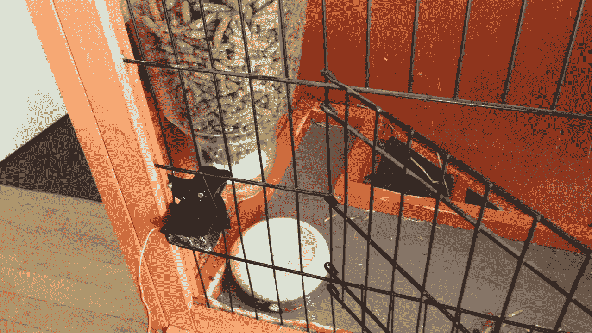
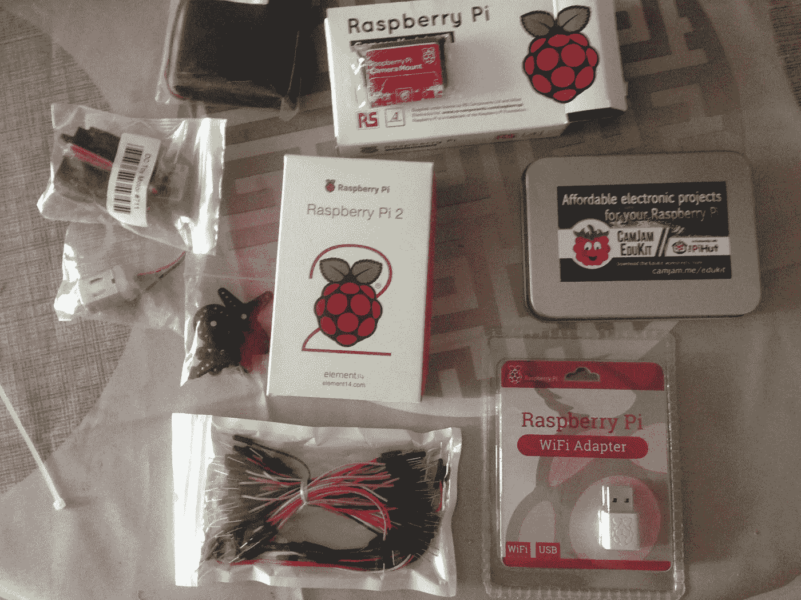
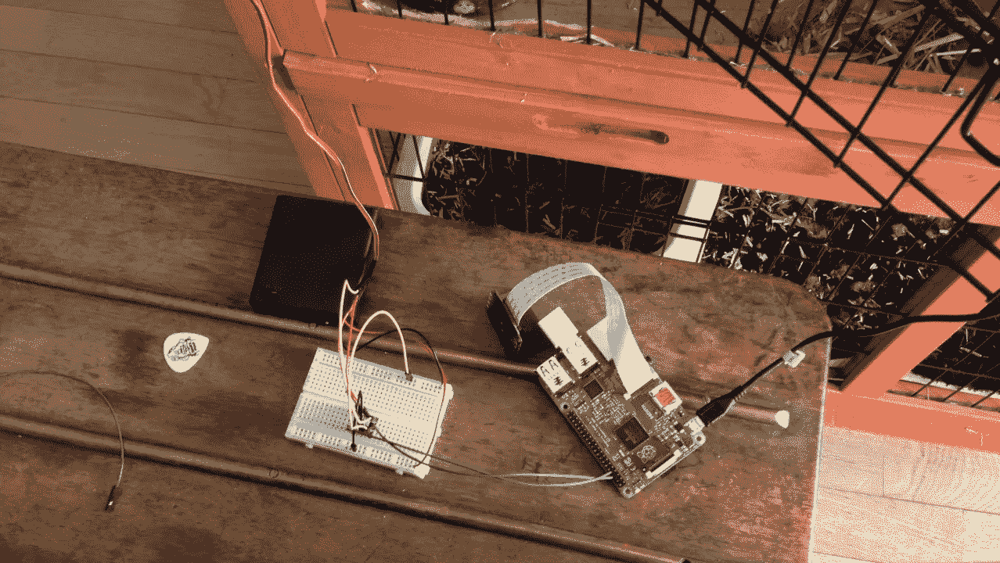
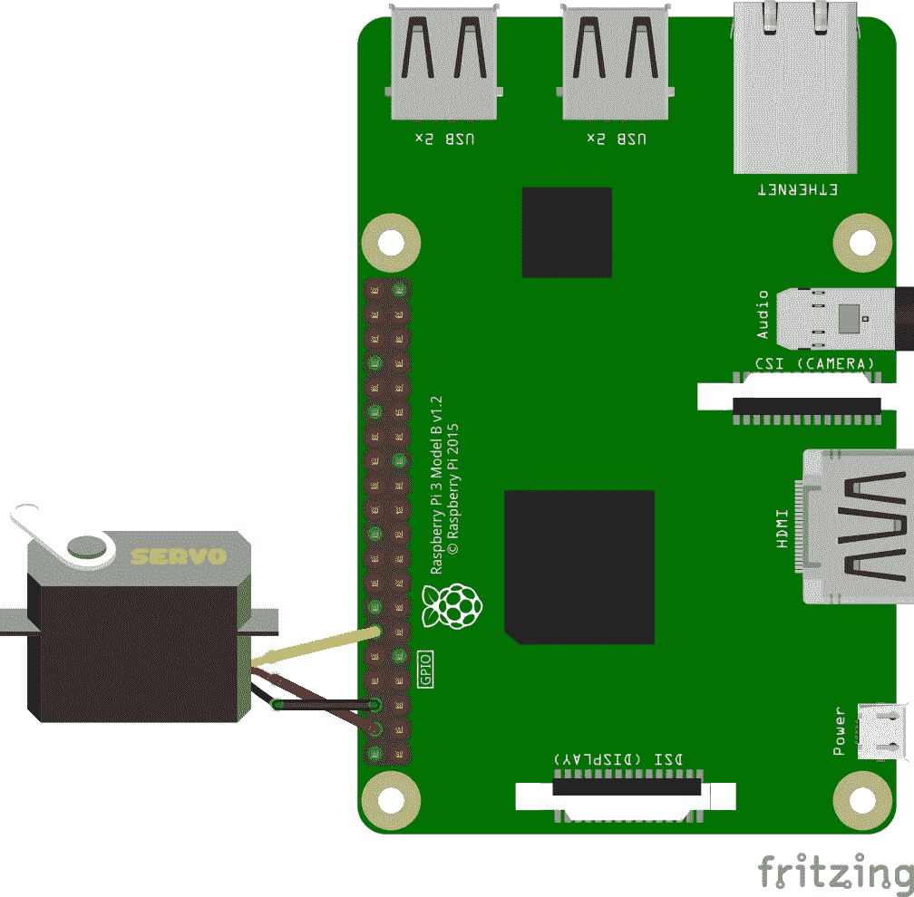
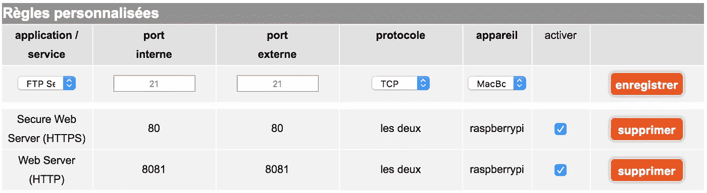
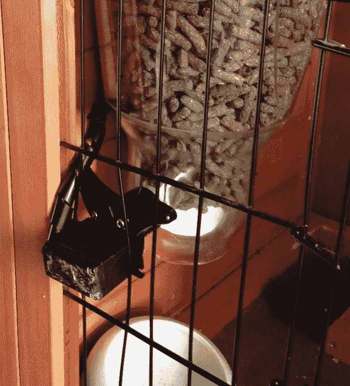

# 用树莓派构建一个连接的食物分发器

> 原文：<https://medium.com/hackernoon/build-a-connected-food-dispenser-with-raspberry-pi-19f5cdcc1541>



My bunny food dispenser

这篇文章是关于如何用树莓派窥探你的宠物的系列文章的一部分，不要错过第一步！

*   [**用树莓派相机服务器窥探你的宠物**](https://hackernoon.com/spy-your-pet-with-a-raspberry-pi-camera-server-e71bb74f79ea) 我在这里描述如何设置树莓派和相机流服务器！
*   [**如何从任何地方访问您的 Raspberry Pi 相机**](/@michelparreno/how-to-access-your-raspberry-pi-camera-from-anywhere-544ab9e5bacc) 在这里，您将学习如何配置一切以进行远程控制。

在之前的文章中，我们学习了如何构建一个摄像机服务器并从任何地方访问它。但是现在有一台照相机是非常基本的东西，对吗？为你家里的同伴启动食物分发器该有多酷啊！

# 所需材料



让我们来总结一下你必须要买的材料。

1.  一个树莓派和一个配置好的无线加密狗
2.  当然是食物自动售货机。在法国找到一个这样的人是一个相当大的挑战。我建议买一个小的，有硬塑料刀片的。不要忘记，你将不得不大力粘贴或螺丝旋转电机。所以你可能不想要金属的！
3.  一个足够强的电机来旋转旋转器，但不是为了与 Raspberry Pi 电压(5V)自然兼容。

> 关于马达:马达有很多种。简单的旋转汽车被称为 DC 汽车。然后，步进电机可以停在特定的位置。最后，伺服电机的位置一般可以精确地设置在 0°和 180°之间。(但是，360 伺服电机也存在)。更多详情，请查看[这篇精彩的摘要](https://www.modmypi.com/blog/whats-the-difference-between-dc-servo-stepper-motors)。

因为我想有可能触发我的兔子不同的食物剂量，我决定去伺服电机。我选择了[Adafruit 连续旋转伺服](https://thepihut.com/products/adafruit-continuous-rotation-servo-feetech-fs5103r?variant=27739449425)，因为它非常适合树莓 Pi GPIO 电压。

**为了习惯** [**树莓派电子引脚**](https://www.raspberrypi.org/documentation/usage/gpio/) ，我强烈推荐你购买一个教程套件，它会让你很舒服地使用 GPIO 引脚！CamJam 套件非常适合这种情况！

# 把所有东西都插上！



很好！我们都准备好插入一切，并开始编写我们的第一个 python 脚本来激活伺服电机。让我们首先按照这个方案正确地插入所有东西。



很直接，对吧？让我们总结一下

*   将伺服正极红线插入 Pi 5V 引脚
*   将伺服负极黑线插入其中一个 Pi 接地
*   将橙色控制线插入其中一个 Pi GPIO(例如:图中的 BCM18)。

如何识别引脚名称？转到[书签这一页](https://pinout.xyz/)

# (可选)配置您的开发环境

在下一章中，我们将编写脚本并启动许多命令。知道每次从我们的计算机切换到我们的 Pi 会很累。如果你想配置你的电脑，这样你就可以**使用你最喜欢的代码编辑器在你的 Pi 上远程开发和启动命令**，我强烈推荐你遵循这个伟大的教程:[在不到 10 分钟的时间内开始使用 raspberry Pi](https://blog.theodo.fr/2017/03/getting-started-headless-on-raspberry-pi-in-10-minutes/)

# 用 Python 创建旋转脚本

现在让我们回到我们的伺服！我们需要构建触发它的脚本。当 RaspberryPi (& Raspian)开箱即用地运行 Python 时，您需要安装 **pip** 来轻松安装/移除包。在您的 raspberry Pi 上，键入:

```
# Install python pip package manager 
curl [https://bootstrap.pypa.io/get-pip.py](https://bootstrap.pypa.io/get-pip.py) -o get-pip.py
```

多亏了 pip，我们现在能够下载并使用一个超级有用的库，通过编码来操作 raspberry PI 电子 pin。

```
pip install RPi.GPIO
```

现在让我们创建我们的伺服脚本！

```
# Create the directory
mkdir pet-feeder
cd pet-feeder# Create the file with execution rights
touch feed.py
chmod +x feed.py
```

## 如何使用伺服控制器

一切准备就绪，我们可以开始编码了。我们想做的是通过向伺服系统的控制线发送电脉冲来控制伺服系统。这就是工作的方式。参考 Adafruit 文档，我们有以下内容:

```
Position "90" (1.5ms pulse) is stop, "180" (2ms pulse) is full speed forward, "0" (1ms pulse) is full speed backwards
```

这意味着，只要控制线正在接收电脉冲(每个脉冲持续时间为 2 毫秒)，伺服系统将继续全速前进。

> 但是..Pi 只能通过 GPIOs 提供 3V 的恒定电流，我要如何产生脉冲？

图书馆 RPi。我们之前安装的 GPIO 拥有我们需要的一切！我们要用的叫做“[脉波调制](https://sourceforge.net/p/raspberry-gpio-python/wiki/PWM/)”。您可以像这样将其导入 Python 脚本中。

```
##!/usr/bin/env python
import RPi.GPIO as GPIO
```

现在，让我们用插上的伺服配置库。首先，将模式设置为 BCM，以使您的管脚匹配 [GPIO 名称](https://pinout.xyz/)而不是物理位置。

```
GPIO.setmode(GPIO.BCM)
```

接下来，让我们设置哪个引脚在我们的控制之下。如果你拿的是 BCM18，如上图所示，那么:

```
FEED_SERVO_CONTROL_PIN = 18
GPIO.setup(FEED_SERVO_CONTROL_PIN, GPIO.OUT)
```

最后，让我们启动脉冲波调制来激活伺服向前运动。要做到这一点，你必须考虑两个变量:**频率**和**占空比**以达到所需的脉冲。(1.5 毫秒脉冲停止，2 毫秒脉冲向前，1 毫秒脉冲向后)

**频率**是每秒钟的脉冲数量。它总是用赫兹表示。示例:

*   1 赫兹= 1 脉冲/秒→ 1 脉冲= 1 秒
*   100 赫兹=每秒 100 个脉冲→ 1 个脉冲= 10 毫秒

**占空比**是信号有效的一个周期的一部分。简单地说，就是一个脉冲中有效信号的百分比。示例:

*   占空比为 10%的 10ms 脉冲是 1ms 的有效信号
*   占空比为 20%的 10ms 脉冲是 2ms 的有效信号

> 等等…这不正是我们要找的脉冲吗？是啊！！我们已经设置好变量了！

```
# Import time to manage servo activation duration
import time# Let's set the frequency and dutycycle
PWM_FREQUENCY = 100
FULL_SPEED_FORWARD_DC = 20
FULL_SPEED_BACKWARD_DC = 10# Activate the servo !
pwm = GPIO.PWM(FEED_SERVO_CONTROL_PIN, PWM_FREQUENCY)
pwm.start(FULL_SPEED_FORWARD_DC)# Let it run for 3 seconds
time.sleep(3)# Let's go backward now !
pwm.ChangeDutyCycle(FULL_SPEED_BACKWARD_DC)
time.sleep(3)# Stop and Clean everything
pwm.stop()
time.sleep(0.5)
GPIO.cleanup() # Very important !
```

准备好尝试你的剧本了吗？保存您的代码并使用以下命令启动它:

```
# and the magic appears
python feed.py
```

## 脚本摘要

# 从浏览器启动您的脚本

让我们进一步通过浏览器启动我们的脚本，而不是在终端中键入命令行。首先，我们需要在我们的 Pi 上有一个本地服务器，能够运行 python 脚本。

## 在 Raspberry Pi 上下载并安装 Apache

```
# Install apache
sudo apt-get install apache2
# Make it Python friendly
sudo a2enmod cgid
```

默认情况下，Apache 将在/var/www/html/index.html 下创建一个测试文件。

```
mv ~/pet-feeder /var/www/html
```

最后，让 Apache 能够读取这个特定文件夹中的脚本。

```
# open the file as root
sudo vim /etc/apache2/sites-enabled/000-default
```

向其中添加 python cgi 脚本处理程序。

最后重启 apache，直接测试你电脑浏览器里的一切！

```
# Restart Apache
sudo service apache2 reload# Find out your Pi IP address
ip addr show wlan0 | grep inet# Go to your computer browser
http:<IP_ADDR>/pet-feeder/feed.py
```

Launching the script through my browser

# 从互联网启动脚本(路由器和服务器配置)

如果你没有按照[之前的教程](/@michelparreno/how-to-access-your-raspberry-pi-camera-from-anywhere-544ab9e5bacc)，强烈推荐你去看看。你必须做完全一样的事情！但是这一次，我们将更改重定向端口。以前，我们处理来自端口 8081 的请求，因为它是摄像机流服务器。现在，我们还想处理来自端口 80 的请求，因为它是 apache 的默认端口。

为此，我们只需向路由器添加另一个**端口转发**规则。请在[“配置到您的 PI 的端口转发”](/@michelparreno/how-to-access-your-raspberry-pi-camera-from-anywhere-544ab9e5bacc)部分找到所有解释。最后，它应该是这样的。



The important part here is the redirecting rule 80:80

> 我们实际上是在告诉我们的路由器:请将所有通过端口 80 进入的外界请求重定向到端口 80 上的 raspberry Pi。

重新启动路由器以考虑新的端口转发规则。让我们看看它是否有效！

```
https://**<your_ddns_name>**.dyndns.com:**80/pet-feeder/feed.py**
```

就像上一个教程一样，尝试使用不同于您家的连接。比如在你的智能手机 4G 上。当在本地网络中时，尝试使用 DDNS 可能不起作用。这是**路由器**的一个限制。



VICTORY !

# (可选)想要一点额外的吗？

每天做一件事，每隔几个小时给我们的宠物一次款待，怎么样？听起来很酷吗🐇？给你！

## Crontasks

[Crontasks](https://help.ubuntu.com/community/CronHowto) 是一些指令，您可以配置它们在指定的时间执行所需的任务(在后台)。

```
# Open the crontab panel
crontab -e# Add your feeding task
# FEED PET EVERY DAY AT 9AM AND 6PM
0 9,18 * * * python /var/www/html/pet-feeder/feed.py >/dev/null 2>&1
```

五个时间和日期字段如下:分钟(0–59)、小时(0–23，0 =午夜)、天(1–31)、月(1–12)、工作日(0–6，0 =星期日)。

Mochi chilling in deluxe cage

OMG！终于来了！我们终于有办法通过一个相连的笼子看到并喂养我们的小伙伴了！

为什么不更进一步呢？[在下一个教程中，我们将学习如何通过在笼子上添加按钮来整合更多的电子设备。](/@michelparreno/pimp-your-pet-cage-with-raspberry-pi-716945e3f9a4)看看吧🙌！