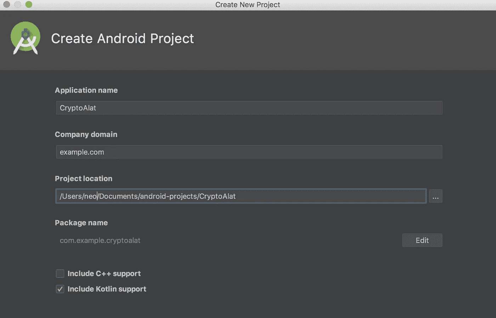
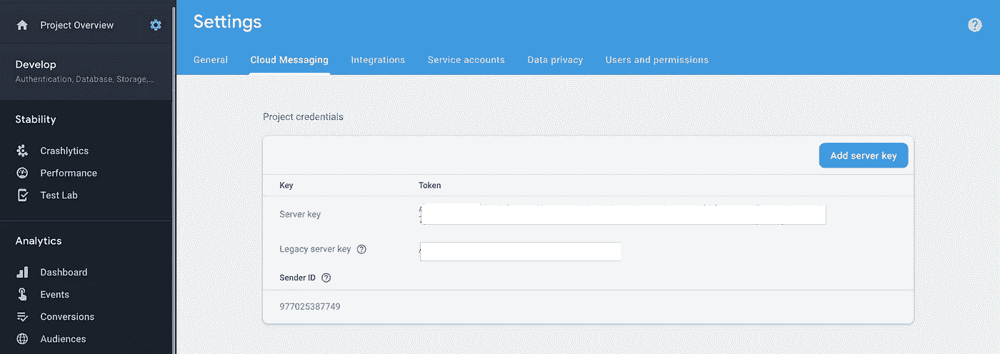
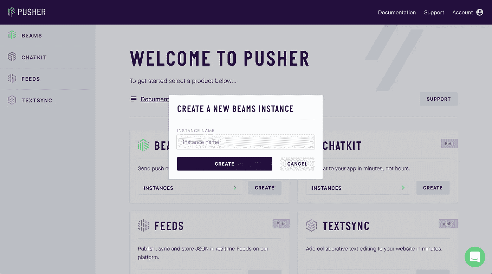

# 使用 Kotlin 和 Go 构建加密货币警报应用程序:第 1 部分—前端

> 原文：<https://medium.com/hackernoon/build-a-cryptocurrency-alert-app-using-kotlin-and-go-part-1-the-frontend-3b240cf75672>

> 你需要在你的机器上安装 Android Studio 3+和 Go 1.10.2+。你应该熟悉 Android 开发和 Kotlin 语言。

加密货币是当今的热门话题之一，因此，许多人购买了许多加密货币。然而，市场是不可预测的，经常变化，所以人们倾向于关注他们资产价格的变化。

在这篇文章中，我们将创建一个应用程序，实时观察加密货币的价值变化，并在变化发生时通知用户。我们将重点关注两种非常流行的加密货币——比特币和以太坊。当我们完成后，当比特币和以太坊的价值超过或低于您在应用程序设置中指定的值时，您的手机会收到推送通知。

下面是我们将要构建的内容的屏幕记录:


# 先决条件

要继续操作，您需要安装以下软件:

*   机器上安装的 Android Studio(v3 . x 或更高版本)。[在这里下载](https://developer.android.com/studio/index.html)。
*   Go 版本 1.10.2 或更高版本[已安装](https://golang.org/doc/install#install)。
*   [SQLite 安装](http://www.sqlitetutorial.net/download-install-sqlite/)在你的机器上。
*   使用 Android Studio IDE 的基本知识。
*   Kotlin 编程语言基础知识。见[正式文件](https://kotlinlang.org/docs/reference/)。
*   Go 和 [Echo 框架](https://echo.labstack.com/)的基础知识。

# 构建我们的 Android 应用程序

首先，启动 Android Studio 并创建一个新的应用程序。输入应用程序的名称，例如 **CryptoAlert** ，然后输入软件包名称。确保**启用 Kotlin 支持**复选框被选中。选择最小 SDK，点击**下一步，**选择一个**空活动**模板，坚持主活动命名方案，然后点击**完成**。



## 创建推杆梁应用程序

由于推杆梁依赖于 Firebase，我们需要一个 FCM 密钥和一个`google-services.json`文件。进入你的 [Firebase 控制台](https://console.firebase.google.com/u/0/)，点击**添加**项目**卡片，初始化 app 创建向导。**

添加项目名称，例如，`crypto-`` alert `，阅读并接受条件条款。此后，您将被引导至项目概述屏幕。选择**将 Firebase 添加到您的 Android 应用程序**选项。

下一个屏幕将要求您的应用程序的包名。你可以在你的 app-module `build.gradle`文件中找到你的应用的包名。留意`applicationId`值。输入包名，点击**下一步**。系统会提示您下载一个`google-services.json`文件。下载文件并跳过剩余的过程。将下载的文件添加到您的项目- `name-of-project/app`的 app 文件夹中。

要获取 FCM 密钥，请转到 Firebase 上的项目设置，在云消息选项卡下，您应该会看到服务器密钥。



接下来，登录新的[推杆仪表板](https://dash.pusher.com/)。如果您还没有帐户，您应该注册。

打开推杆梁仪表板，创建一个新的推杆梁应用程序。



创建实例后，您将看到一个快速入门指南。选择**安卓快速入门**。添加 FCM 密钥后，您可以退出快速入门指南。

## 向我们的应用程序添加功能

为了让我们的应用程序工作，我们需要引入几个依赖项。为此，将以下内容添加到项目`build-gradle`文件中:

```
*// File: ./build.gradle*
    buildscript {
        *// [...]* dependencies {
            *// [...]* classpath 'com.google.gms:google-services:4.0.0'
        }
    } *// [...]*
```

接下来，将以下内容添加到应用程序模块`build.gradle`文件中:

```
*// File: ./app/build.gradle*
    dependencies {
        implementation 'com.squareup.retrofit2:retrofit:2.4.0'
        implementation 'com.squareup.retrofit2:converter-scalars:2.4.0'
        implementation 'com.google.firebase:firebase-messaging:17.1.0'
        implementation 'com.pusher:push-notifications-android:0.10.0'
        [...]
    } *// Add this line to the end of the file*
    apply plugin: 'com.google.gms.google-services'
```

上面我们包括了[改型](https://github.com/square/retrofit)——一个用于打网络电话的包，然后是用于发送推送通知的 Pusher Beams 包。附加的 Google 服务是 Pusher Beams 包的依赖项。同步您的 gradle 文件，使库可供使用。

接下来，创建一个名为`ApiService`的新接口，并粘贴下面的代码:

```
*// File: ./app/src/main/java/{package-name}/ApiService.kt* import okhttp3.RequestBody
    import retrofit2.Call
    import retrofit2.http.Body
    import retrofit2.http.GET
    import retrofit2.http.POST interface ApiService { **@POST("/btc-pref")**
      fun saveBTCLimit(**@Body** body: RequestBody): Call<String> **@POST("/eth-pref")**
      fun saveETHLimit(**@Body** body: RequestBody): Call<String> **@GET("/fetch-values")**
      fun getValues():Call<String> }
```

该文件用于通过改造来了解要访问的端点。第一个端点`/btc-pref`用于设置比特币限额。下一个端点`/eth-pref`用于保存以太坊限制。最后一个端点`/fetch-values`用于获取加密货币的当前值。

要在您的应用程序中使用网络服务，请在您的`AndroidManifest.xml`文件中添加 internet 权限，如下所示:

```
<manifest xmlns:android="http://schemas.android.com/apk/res/android"
      package="com.example.cryptoalat"> <uses-permission android:name="android.permission.INTERNET"/>
      [...] </manifest>
```

接下来，我们将在应用程序中管理通知。创建一个名为`NotificationsMessagingService`的新服务并粘贴它:

```
*// File: ./app/src/main/java/{package-name}/NotificationsMessagingService.kt*
    import android.app.NotificationChannel
    import android.app.NotificationManager
    import android.app.PendingIntent
    import android.content.Intent
    import android.os.Build
    import android.support.v4.app.NotificationCompat
    import android.support.v4.app.NotificationManagerCompat
    import com.google.firebase.messaging.RemoteMessage
    import com.pusher.pushnotifications.fcm.MessagingService class NotificationsMessagingService : MessagingService() { override fun onMessageReceived(remoteMessage: RemoteMessage) {
            val notificationId = 10
            val channelId  = "crypto_channel"
            lateinit var channel: NotificationChannel
            val intent = Intent(this, MainActivity::class.java)
            intent.flags = Intent.FLAG_ACTIVITY_NEW_TASK or Intent.FLAG_ACTIVITY_CLEAR_TASK
            val pendingIntent = PendingIntent.getActivity(this, 0, intent, 0) val mBuilder = NotificationCompat.Builder(this, channelId)
                    .setSmallIcon(R.mipmap.ic_launcher)
                    .setContentTitle(remoteMessage.notification!!.title!!)
                    .setContentText(remoteMessage.notification!!.body!!)
                    .setContentIntent(pendingIntent)
                    .setPriority(NotificationCompat.PRIORITY_DEFAULT)
                    .setAutoCancel(true) if (Build.VERSION.SDK_INT >= Build.VERSION_CODES.O) {
                val notificationManager = applicationContext.getSystemService(NotificationManager::class.java)
                val name = getString(R.string.channel_name)
                val description = getString(R.string.channel_description)
                val importance = NotificationManager.IMPORTANCE_DEFAULT
                channel = NotificationChannel("crypto_channel", name, importance)
                channel.description = description
                notificationManager!!.createNotificationChannel(channel)
                notificationManager.notify(notificationId, mBuilder.build())
            } else {
                val notificationManager =  NotificationManagerCompat.from(this)
                notificationManager.notify(notificationId, mBuilder.build())
            }
        }
    }
```

因为 Android O 中推送通知有重大变化，所以我们在处理通知之前检查了 Android 版本。如果我们使用 Android O 或更新版本，我们必须创建一个通知通道，用于对我们发送的通知类型进行分类。这对于发送不同类型通知的应用程序特别有用。

我们还利用存储在`strings.xml`文件中的一些文件来描述通知通道描述和通道名称。将这些添加到`strings.xml`文件中:

```
*<!-- File: /app/src/main/res/values/strings.xml -->*
    <string name="channel_name">Crypto</string>
    <string name="channel_description">To receive updates about changes in cryptocurrency value</string>
```

在`AndroidManifest.xml`文件中注册服务:

```
<application
      >
      [...]
      <service android:name=".NotificationsMessagingService">
          <intent-filter android:priority="1">
              <action android:name="com.google.firebase.MESSAGING_EVENT" />
          </intent-filter>
      </service>
    </application>
```

现在，让我们准备我们的布局。首先，我们将设计活动的布局。创建应用程序时，`activity_main.xml`文件应该已经存在于布局文件夹中。打开它并替换为:

```
*<!-- File: ./app/src/main/res/layout/activity_main.xml -->*
    **<?**xml version="1.0" encoding="utf-8"**?>**
    <android.support.constraint.ConstraintLayout xmlns:android="http://schemas.android.com/apk/res/android"
      xmlns:app="http://schemas.android.com/apk/res-auto"
      xmlns:tools="http://schemas.android.com/tools"
      android:layout_width="match_parent"
      android:layout_height="match_parent"
      tools:context=".MainActivity"> <TextView
        android:id="@+id/bitcoinValue"
        android:padding="20dp"
        android:layout_width="match_parent"
        android:layout_height="wrap_content"
        android:layout_marginStart="8dp"
        android:layout_marginTop="8dp"
        android:text="1 BTC"
        android:textSize="16sp"
        app:layout_constraintStart_toStartOf="parent"
        app:layout_constraintTop_toTopOf="parent" /> <TextView
        android:id="@+id/etherumValue"
        android:padding="20dp"
        android:layout_width="match_parent"
        android:layout_height="wrap_content"
        android:layout_marginTop="16dp"
        android:layout_marginStart="8dp"
        android:text="1 ETH"
        android:textSize="16sp"
        app:layout_constraintStart_toStartOf="parent"
        app:layout_constraintTop_toBottomOf="@+id/bitcoinValue"/> </android.support.constraint.ConstraintLayout>
```

该布局包含两个显示比特币和以太坊价格的`TextView`。我们还使这些`TextView`可点击，这样我们可以设置限制，以便在超过限制时得到通知。

接下来，我们将设计警报对话框的布局。创建一个名为`alert_layout`的新布局文件并粘贴:

```
*<!-- File: ./app/src/main/res/layout/alert_layout.xml -->*
    **<?**xml version="1.0" encoding="utf-8"**?>**
    <LinearLayout xmlns:android="http://schemas.android.com/apk/res/android"
      android:orientation="vertical" android:layout_width="match_parent"
      android:padding="20dp"
      android:layout_height="match_parent"> <EditText
        android:id="@+id/minimumValue"
        android:background="@drawable/text_background"
        android:hint="Minimum value"
        android:paddingStart="10dp"
        android:paddingEnd="10dp"
        android:inputType="number"
        android:layout_width="match_parent"
        android:layout_height="60dp" /> <EditText
        android:layout_marginTop="10dp"
        android:background="@drawable/text_background"
        android:hint="Maximum value"
        android:inputType="number"
        android:id="@+id/maximumValue"
        android:layout_width="match_parent"
        android:paddingStart="10dp"
        android:paddingEnd="10dp"
        android:layout_height="60dp" /> <Button
        android:id="@+id/save"
        android:layout_marginTop="10dp"
        android:layout_gravity="center"
        android:text="SAVE"
        android:layout_width="wrap_content"
        android:layout_height="wrap_content" /> </LinearLayout>
```

这将是对话框显示的布局。它包含两个文本字段和一个**保存**按钮，我们为`TextView` s 使用了一个自定义设计的背景。创建一个名为`text_background`的新的可绘制文件并粘贴它:

```
*<!-- File: /app/src/main/res/drawable/text_background.xml -->*
    <shape xmlns:android="http://schemas.android.com/apk/res/android" android:shape="rectangle" >
      <solid android:color="@android:color/white" />
      <stroke android:width="1dip" android:color="@android:color/darker_gray"/>
    </shape>
```

我们将转到`MainActivity`来完成我们应用程序的功能。打开您的`MainActivity`，用以下内容替换内容:

```
*// File: ./app/src/main/java/{package-name}/MainActivity.Kt*
    import android.os.Bundle
    import okhttp3.MediaType
    import okhttp3.RequestBody
    import org.json.JSONObject
    import retrofit2.Call
    import retrofit2.Callback
    import retrofit2.Response
    import android.support.v7.app.AlertDialog
    import android.support.v7.app.AppCompatActivity
    import android.util.Log
    import android.view.LayoutInflater
    import android.widget.Button
    import android.widget.EditText
    import com.pusher.pushnotifications.PushNotifications
    import kotlinx.android.synthetic.main.activity_main.*
    import okhttp3.OkHttpClient
    import retrofit2.Retrofit
    import retrofit2.converter.scalars.ScalarsConverterFactory class MainActivity : AppCompatActivity() { private var prefs: Prefs? = null private val retrofit: ApiService by lazy {
            val httpClient = OkHttpClient.Builder()
            val builder = Retrofit.Builder()
                    .baseUrl("http://10.0.2.2:9000/")
                    .addConverterFactory(ScalarsConverterFactory.create()) val retrofit = builder
                    .client(httpClient.build())
                    .build()
            retrofit.create(ApiService::class.java)
        } override fun onCreate(savedInstanceState: Bundle?) {
            super.onCreate(savedInstanceState)
            setContentView(R.layout.activity_main)
            fetchCurrentPrice()
            setupPushNotifications()
            setupClickListeners()
        }
    }
```

> *上面使用的* `*URL*` *，* `*http://10.0.2.2:9000/*` *，是 Android 模拟器识别为 localhost 的 URL。*

上面，我们创建了一个用于网络调用的`retrofit`对象。设置完`retrofit`对象后，我们在`onCreate`方法中添加布局，并调用其他三个函数:

1.  `fetchCurrentPrice` -该函数将从我们的服务器获取比特币和以太坊的当前价格。在类中创建一个新函数，并像这样设置它:

```
*// File: /app/src/main/java/{package-name}/MainActivity.kt*
    private fun fetchCurrentPrice() {
        retrofit.getValues().enqueue(object: Callback<String> {
            override fun onResponse(call: Call<String>?, response: Response<String>?) {
                val jsonObject = JSONObject(response!!.body())
                bitcoinValue.text = "1 BTC = $"+ jsonObject.getJSONObject("BTC").getString("USD")
                etherumValue.text = "1 ETH = $"+ jsonObject.getJSONObject("ETH").getString("USD")
            } override fun onFailure(call: Call<String>?, t: Throwable?) {
                Log.e("MainActivity",t!!.localizedMessage)
            }
        })
    }
```

上图中，进行了一个网络调用来获取当前的比特币和以太坊的美元价格。当收到响应时，我们解析 JSON 数据，并通过在布局中设置文本视图的文本将其显示在屏幕上。

1.  `setupPushNotifications` -此功能是我们开始收听我们选择接收通知的兴趣所在。利息名称是这样的格式**{ device _ uuid } _ { currency } _ changed**。 **** 我们注册两个利息，每种货币一个。打开`MainActivity`类并添加以下方法:

```
*// File: /app/src/main/java/{package-name}/MainActivity.Kt*
    private fun setupPushNotifications() {
        PushNotifications.start(applicationContext, "PUSHER_BEAMS_INSTANCE_ID")
        val fmt = "%s_%s_changed"
        PushNotifications.subscribe(java.lang.String.format(fmt, deviceUuid(), "BTC"))
        PushNotifications.subscribe(java.lang.String.format(fmt, deviceUuid(), "ETH"))
    }
```

> *将* `*PUSHER_BEAMS_INSTANCE_ID*` *替换为推杆梁仪表板上的实例 ID。*

1.  `setupClickListeners` -在这个函数中，我们将为布局中的文本视图设置点击监听器。在同一个`MainActivity`类中，添加以下方法:

```
*// File: /app/src/main/java/{package-name}/MainActivity.Kt*
    private fun setupClickListeners() {
        bitcoinValue.setOnClickListener {
            createDialog("BTC")
        } etherumValue.setOnClickListener {
            createDialog("ETH")
        }
    }
```

当任何文本视图被点击时，我们调用`createDialog`方法，然后打开一个布局让用户输入限制。

在`MainActivity`类中，添加方法`createDialog`，如下所示:

```
*// File: /app/src/main/java/{package-name}/MainActivity.Kt*
    private fun createDialog(source:String){
      val builder: AlertDialog.Builder = AlertDialog.Builder(this)
      val view = LayoutInflater.from(this).inflate(R.layout.alert_layout,null) builder.setTitle("Set limits")
          .setMessage("")
          .setView(view) val dialog = builder.create()
      val minEditText: EditText = view.findViewById(R.id.minimumValue)
      val maxEditText: EditText = view.findViewById(R.id.maximumValue) view.findViewById<Button>(R.id.save).setOnClickListener {
        if (source == "BTC"){
          saveBTCPref(minEditText.text.toString(), maxEditText.text.toString())
        } else {
          saveETHPref(minEditText.text.toString(), maxEditText.text.toString())
        }
        dialog.dismiss()
      }
      dialog.show()
    }
```

该对话框获取最小值和最大值，并将其发送到后端服务器。这样做是为了当加密货币的价格变化时，如果它在设定的限制范围内，我们会收到推送通知。

在上面的函数中，我们调用了两个新方法。在`MainActivity`类中添加两个方法，如下所示:

```
*// File: /app/src/main/java/{package-name}/MainActivity.Kt*
    private fun saveBTCPref(min:String, max:String){
        val jsonObject = JSONObject()
        jsonObject.put("minBTC", min)
        jsonObject.put("maxBTC", max)
        jsonObject.put("uuid", deviceUuid()) val body = RequestBody.create(
                MediaType.parse("application/json"),
                jsonObject.toString()
        ) retrofit.saveBTCLimit(body).enqueue(object: Callback<String> {
            override fun onResponse(call: Call<String>?, response: Response<String>?) {}
            override fun onFailure(call: Call<String>?, t: Throwable?) {}
        })
    } private fun saveETHPref(min:String, max:String){
        val jsonObject = JSONObject()
        jsonObject.put("minETH",min)
        jsonObject.put("maxETH",max)
        jsonObject.put("uuid", deviceUuid()) val body = RequestBody.create(
                MediaType.parse("application/json"),
                jsonObject.toString()
        ) retrofit.saveETHLimit(body).enqueue(object: Callback<String> {
            override fun onResponse(call: Call<String>?, response: Response<String>?) {}
            override fun onFailure(call: Call<String>?, t: Throwable?) {}
        })
    }
```

在`saveBTCPref`和`saveETHPref`中，我们试图将用户设置的限制发送给 API，以便为该用户保存。

在发送的同时，我们还发送了设备的唯一标识符`uuid`。让我们创建将为每个设备生成并保存这个 UUID 的`deviceUuid()`方法。在`MainActivity`类中，添加以下代码:

```
*// File: /app/src/main/java/{package-name}/MainActivity.Kt*
    private fun deviceUuid() : String {
        prefs = Prefs(this)
        var uuid: String = prefs!!.deviceUuid if (uuid == "") {
            uuid = java.util.UUID.randomUUID().toString().replace("-", "_")
            prefs!!.deviceUuid = uuid
        } return uuid
    }
```

现在在这个函数中，我们引用了一个`Prefs`类。创建一个新的`Prefs`类，并将以下代码粘贴到其中:

```
*// File: /app/src/main/java/{package-name}/Prefs.Kt*
    import android.content.Context
    import android.content.SharedPreferences class Prefs (context: Context) {
        val PREFS_FILENAME = "com.example.coinalert.prefs"
        val DEVICE_UUID = "device_uuid"
        val prefs: SharedPreferences = context.getSharedPreferences(PREFS_FILENAME, 0); var deviceUuid: String
            get() = prefs.getString(DEVICE_UUID, "")
            set(value) = prefs.edit().putString(DEVICE_UUID, value).apply() }
```

申请到此为止。此时，应用程序应该能够成功构建，但是不能按预期运行。在下一部分的[中，我们将构建应用程序的后端，这样它就可以按预期工作。](https://pusher.com/tutorials/cryptocurrency-kotlin-go-part-2)

# 结论

在本文中，我们学习了如何使用推送光束来通知用户对加密货币的更改。您可以在这里找到本文中构建的应用程序的存储库。

这篇文章最初出现在 [Pusher 博客](https://pusher.com/tutorials/cryptocurrency-kotlin-go-part-1)上。