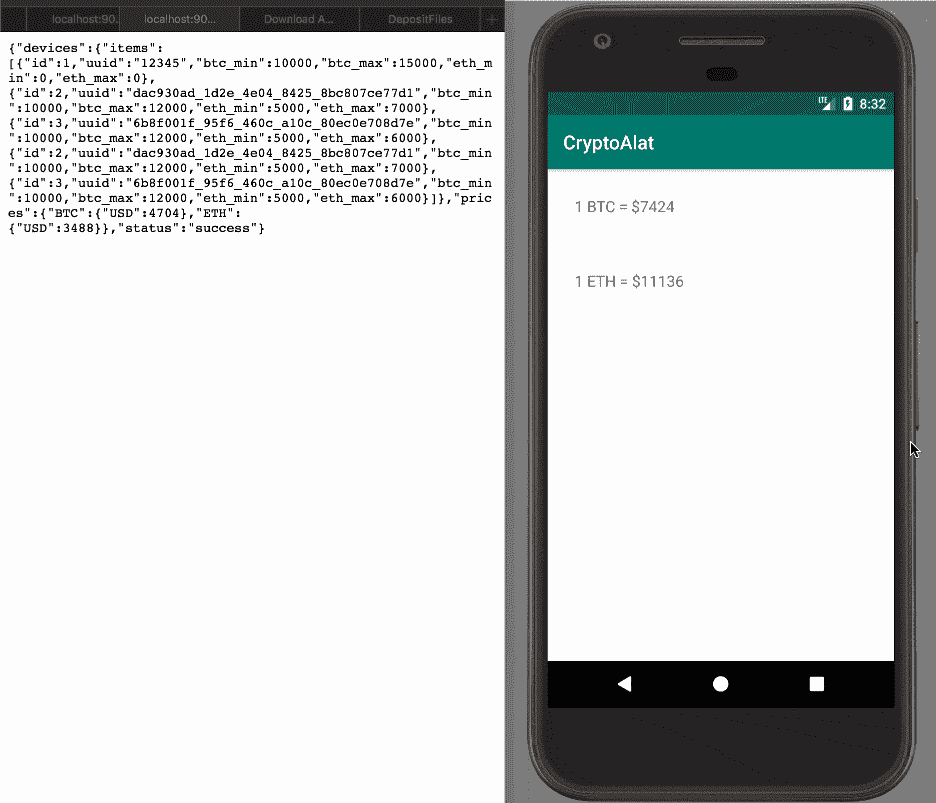
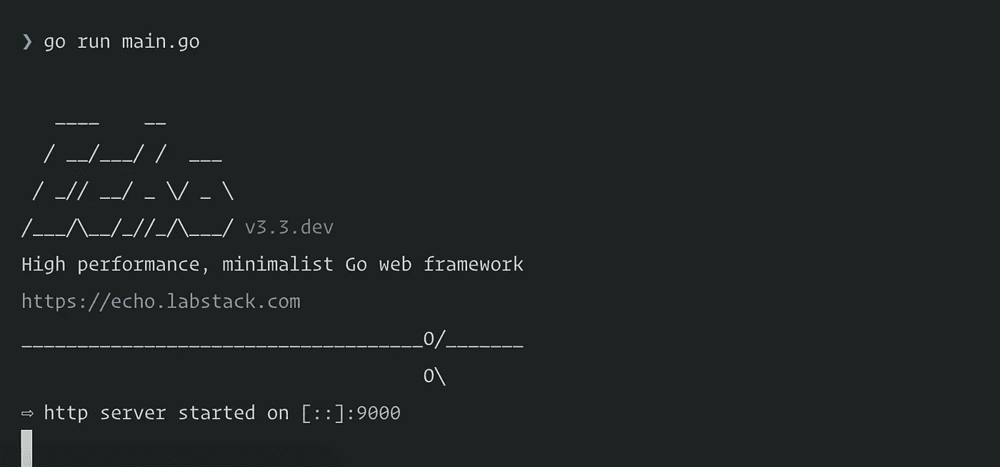

# 使用 Kotlin 和 Go 构建加密货币警报应用程序:第 2 部分—后端

> 原文：<https://medium.com/hackernoon/build-a-cryptocurrency-alert-app-using-kotlin-and-go-part-2-the-backend-fef4c92c70f6>

> 你需要在你的机器上安装 Android Studio 3+和 Go 1.10.2+。你应该熟悉 Android 开发和 Kotlin 语言。

在本文的第一部分[中，我们通过创建我们的 Android 应用程序开始构建我们的服务。然而，该应用程序需要后端才能正常工作。所以在这一部分，我们将创建应用程序的后端。](https://pusher.com/tutorials/cryptocurrency-kotlin-go-part-1)

我们将使用 Go 来构建应用程序的后端。我们将在 Go 中使用的框架是 [Echo](https://echo.labstack.com/) 。

作为一个总结，这里是一个屏幕记录，当我们完成时，我们将建立什么:



# 先决条件

要跟进，您需要:

*   完成文章的第一部分。
*   机器上安装的 Android Studio(v3 . x 或更高版本)。[此处下载](https://developer.android.com/studio/index.html)。
*   Go 版本 1.10.2 或更高版本[已安装](https://golang.org/doc/install#install)。
*   [SQLite 安装在您的机器上](http://www.sqlitetutorial.net/download-install-sqlite/)。
*   使用 Android Studio IDE 的基本知识。
*   Kotlin 编程语言基础知识。见[官方文件](https://kotlinlang.org/docs/reference/)。
*   Go 和 [Echo 框架](https://echo.labstack.com/)的基础知识。

# 构建我们的 Go API

## 安装

首先，为您的应用程序创建一个新的项目目录。我们将创建一个名为`backend`的。建议您在您的`$GOPATH`中创建它，但是这不是必需的。

在项目目录中，创建三个新目录:

1.  数据库
2.  通知
3.  路线

在`database`目录中，创建一个名为`model`的新目录。在这个`database`目录中，我们将存储所有与数据库相关的东西，包括 SQLite 数据库文件、`model`和`database`包。

在`notification`目录中，我们将有一个包，其中包含向设备发送推送通知所需的一切。

最后，在`routes`目录中，我们将拥有`routes`包，其中包含每个 HTTP 请求的逻辑。

现在让我们开始构建应用程序。

在项目的根目录下创建一个新的`main.go`文件。在这个文件中，我们将添加项目的核心。我们将设置路由、中间件和数据库。

在`main.go`文件中，粘贴以下代码:

```
*// File: ./main.go*
    package main import (
        "./database"
        "./routes" "github.com/labstack/echo"
        "github.com/labstack/echo/middleware"
    ) func main() {
        db := database.Initialize("./database/db.sqlite")
        database.Migrate(db) e := echo.New() e.Use(middleware.Logger())
        e.Use(middleware.Recover()) e.GET("/fetch-values", routes.GetPrices())
        e.POST("/btc-pref", routes.SaveDeviceSettings(db))
        e.POST("/eth-pref", routes.SaveDeviceSettings(db))
        e.GET("/simulate", routes.SimulatePriceChanges(db)) e.Start(":9000")
    }
```

在上面的代码中，我们首先导入了一些包，Go 脚本将需要这些包才能工作。然后我们使用导入的`database`子包实例化数据库。接下来，我们在`db`实例上运行迁移。这将创建应用程序需要运行的数据库表(如果它还不存在)。

接下来，我们创建一个新的 Echo 实例`e`。然后，我们使用该实例注册[记录器](https://echo.labstack.com/middleware/logger)中间件和[恢复](https://echo.labstack.com/middleware/recover)中间件。

> *日志记录器中间件记录关于每个 HTTP 请求的信息。*
> 
> *恢复中间件从链中任何地方的死机中恢复，打印堆栈跟踪并将控制处理给集中式*[*HTTPErrorHandler*](https://echo.labstack.com/guide/customization#http-error-handler)*。*

然后，我们注册我们的路由，并使用我们导入的`routes`包将一个处理程序映射到它们。这些路线是:

1.  `GET /fetch-values` -获取所有受支持货币的当前价格，并返回一个 JSON 响应。
2.  `POST /btc-pref` -存储 BTC 在收到通知并返回 JSON 响应之前必须为设备支付的最低和最高价格。
3.  `POST /eth-pref` -存储设备在收到通知并返回 JSON 响应之前 ETH 必须超过的最低和最高价格。
4.  `GET /simulate` -模拟受支持货币的价格变化。

完成路由后，我们在端口 9000 上启动服务器。

> 如果正在使用 9000，您可以选择不同的端口，只要记得在您的 `*MainActivity.kt*` *文件中也进行更改即可。*

现在我们有了`main.go`文件，让我们引入脚本需要的所有导入。打开您的终端并运行以下命令:

```
$ go get github.com/labstack/echo
    $ go get github.com/labstack/echo/middleware
```

这将引入 Echo 包和 Echo 中间件包。对于另外两个包，`database`和`routes`，我们将手动创建它们。让我们现在做那件事。

## 创建内部 Go 包

如前所述，我们将创建一些内部包，使应用程序更加模块化，所以让我们从`database`包开始。

在`database`目录下，创建一个新的`init.go`文件，并粘贴以下代码:

```
*// File: ./database/init.go*
    package database import (
        "database/sql" _ "github.com/mattn/go-sqlite3"
    ) *// Initialize initialises the database*
    func Initialize(filepath string) *sql.DB {
        db, err := sql.Open("sqlite3", filepath)
        if err != nil || db == nil {
            panic("Error connecting to database")
        } return db
    } *// Migrate migrates the database*
    func Migrate(db *sql.DB) {
        sql := `
            CREATE TABLE IF NOT EXISTS devices(
                    id INTEGER NOT NULL PRIMARY KEY AUTOINCREMENT,
                    uuid VARCHAR NOT NULL,
                    btc_min INTEGER,
                    btc_max INTEGER,
                    eth_min INTEGER,
                    eth_max INTEGER
            );
       ` _, err := db.Exec(sql)
        if err != nil {
            panic(err)
        }
    }
```

在上面的文件中，我们首先导入两个包，一个是内置的`database/sql`，另一个是 [mattn/go-sqlite3](http://github.com/mattn/go-sqlite3) 包，这是一个使用`database/sql`的 go 的 sqlite3 驱动程序。打开终端并运行以下命令:

```
$ go get github.com/mattn/go-sqlite3
```

接下来，我们创建了一个名为`Initialize`的函数，在这个函数中，我们初始化了 SQLite 数据库。如果数据库文件不存在，这将创建一个新的数据库文件，或者使用现有的文件。

我们还有一个`Migrate`函数，用于指定应用程序初始化时要运行的 SQL 查询。从查询中可以看出，只有当表`devices`不存在时，我们才创建它。

`init.go`文件到此为止。

在`routes`目录下创建一个新的`routes.go`文件，并粘贴以下代码:

```
*// File: ./routes/routes.go*
    package routes import (
        "database/sql"
        "errors"
        "net/http"
        "strconv" "../database/model" "github.com/labstack/echo"
    )
```

现在让我们开始定义在`main.go`文件中使用的路由处理器。

首先，我们将添加`GetPrices`功能。在同一文件的底部粘贴以下代码:

```
*// GetPrices returns the coin prices*
    func GetPrices() echo.HandlerFunc {
        return func(c echo.Context) error {
            prices, err := model.GetCoinPrices(true)
            if err != nil {
                return c.JSON(http.StatusBadGateway, err)
            } return c.JSON(http.StatusOK, prices)
        }
    }
```

上面的函数很简单。我们只是从`model.GetCoinPrices`函数中获取价格，并将其作为 JSON 响应返回。

注意，我们向`GetCoinPrices`函数传递了一个布尔值。这个布尔值用来标记是模拟价格还是直接从 API 获取。因为我们正在测试，我们想模拟价格，所以它经常变化。

添加到`routes.go`文件的下一个函数是`SaveDeviceSettings`函数。在同一文件中，将以下代码粘贴到文件的底部:

```
var postedSettings map[string]string func formValue(c echo.Context, key string) (string, error) {
        if postedSettings == nil {
            if err := c.Bind(&postedSettings); err != nil {
                return "", err
            }
        } return postedSettings[key], nil
    } func getCoinValueFromRequest(key string, c echo.Context) (int64, error) {
        value, _ := formValue(c, key)
        if value != "" {
            setting, err := strconv.ParseInt(value, 10, 64)
            if err == nil {
                return setting, nil
            }
        } return 0, errors.New("Invalid or empty key for: " + key)
    } *// SaveDeviceSettings saves the device settings*
    func SaveDeviceSettings(db *sql.DB) echo.HandlerFunc {
        return func(c echo.Context) error {
            uuid, _ := formValue(c, "uuid")        
            field := make(map[string]int64) if btcmin, err := getCoinValueFromRequest("minBTC", c); err == nil {
                field["btc_min"] = btcmin
            } if btcmax, err := getCoinValueFromRequest("maxBTC", c); err == nil {
                field["btc_max"] = btcmax
            } if ethmin, err := getCoinValueFromRequest("minETH", c); err == nil {
                field["eth_min"] = ethmin
            } if ethmax, err := getCoinValueFromRequest("maxETH", c); err == nil {
                field["eth_max"] = ethmax
            } defer func() { postedSettings = nil }() device, err := model.SaveSettings(db, uuid, field)
            if err != nil {
                return c.JSON(http.StatusBadRequest, err)
            } return c.JSON(http.StatusOK, device)
        }
    }
```

在上面的代码中，我们有三个函数。前两个是助手函数。我们需要它们从请求中获取已发布的表单值。

在`SaveDeviceSettings`函数中，我们获取设备的`uuid`，并有条件地获取硬币的最小值和最大值。我们使用`model.SaveSettings`函数将值保存到数据库中，并返回一个 JSON 响应。

要添加的最后一个函数是`Simulate`函数。将以下代码添加到文件的底部:

```
*// SimulatePriceChanges simulates the prices changes*
    func SimulatePriceChanges(db *sql.DB) echo.HandlerFunc {
        return func(c echo.Context) error {
            prices, err := model.GetCoinPrices(true)
            if err != nil {
                panic(err)
            } devices, err := model.NotifyDevicesOfPriceChange(db, prices)
            if err != nil {
                panic(err)
            } resp := map[string]interface{}{
                "prices":  prices,
                "devices": devices,
                "status":  "success",
            } return c.JSON(http.StatusOK, resp)
        }
    }
```

在上面的函数中，我们获取硬币的价格，然后将其发送给`model.NotifyDevicesOfPriceChange`函数，该函数找到符合条件的设备，并向它们发送推送通知。然后我们返回一个`prices`、`devices`和`status`的 JSON 响应。

路线就这些了。

最后，让我们定义模型。在`database/model`目录下创建一个新的`models.go`文件，并粘贴以下代码:

```
*// File: ./database/model/models.go*
    package model import (
        "database/sql"
        "encoding/json"
        "fmt"
        "io/ioutil"
        "math/big"
        "math/rand"
        "net/http"
        "time" "errors" "../../notification"
    )
```

接下来，让我们定义对象资源的结构。在同一文件中，将以下内容粘贴到底部:

```
*// CoinPrice represents a single coin resource*
    type CoinPrice map[string]interface{} *// Device represents a single device resource*
    type Device struct {
        ID     int64  `json:"id"`
        UUID   string `json:"uuid"`
        BTCMin int64  `json:"btc_min"`
        BTCMax int64  `json:"btc_max"`
        ETHMin int64  `json:"eth_min"`
        ETHMax int64  `json:"eth_max"`
    } *// Devices represents a collection of Devices*
    type Devices struct {
        Devices []Device `json:"items"`
    }
```

以上，我们有`CoinPrice`图。这将用于处理来自我们的应用程序将使用的 API 的响应。当得到来自 API 的响应时，我们将其绑定到`CoinPrice`映射。

下一个是`Device`结构。这代表设备资源。它与我们在本文前面创建的表的 SQL 模式相匹配。当我们想要创建一个新的设备资源来存储在数据库中或者检索一个时，我们将使用`Device`结构。

最后，我们有一个`Devices`结构，它只是多个`Device`结构的集合。如果我们想返回一个`Device`的集合，我们就用这个。

> *Go 不允许在结构名中使用下划线，所以我们将使用*`*json:`*`*`*key_name*`*" `格式来自动与指定键的属性相互转换。**

*让我们开始定义我们的模型函数。*

*在同一文件中，将以下代码粘贴到页面底部:*

```
**// CreateSettings creates a new device and saves it to the db*
    func CreateSettings(db *sql.DB, uuid string) (Device, error) {
        device := Device{UUID: uuid, BTCMin: 0, BTCMax: 0, ETHMin: 0, ETHMax: 0} stmt, err := db.Prepare("INSERT INTO devices (uuid, btc_min, btc_max, eth_min, eth_max) VALUES (?, ?, ?, ?, ?)")
        if err != nil {
            return device, err
        } res, err := stmt.Exec(device.UUID, device.BTCMin, device.BTCMax, device.ETHMin, device.ETHMax)
        if err != nil {
            return device, err
        } lastID, err := res.LastInsertId()
        if err != nil {
            return device, err
        } device.ID = lastID return device, nil
    }*
```

*上述功能用于为新设备创建设置。在该函数中，使用`Device`结构创建了一个新设备。然后，我们编写想要用来创建新设备的 SQL 查询。*

*我们对 SQL 查询运行`Exec`来执行查询。如果没有错误，我们从查询中获取最后插入的 ID，并将其分配给我们之前创建的`Device`结构。然后我们返回被创造的`Device`。*

*让我们添加下一个函数。在同一文件中，将以下代码粘贴到底部:*

```
**// GetSettings fetches the settings for a single user from the db*
    func GetSettings(db *sql.DB, uuid string) (Device, error) {
        device := Device{} if len(uuid) <= 0 {
            return device, errors.New("Invalid device UUID")
        } err := db.QueryRow("SELECT * FROM devices WHERE uuid=?", uuid).Scan(
            &device.ID,
            &device.UUID,
            &device.BTCMin,
            &device.BTCMax,
            &device.ETHMin,
            &device.ETHMax) if err != nil {
            return CreateSettings(db, uuid)
        } return device, nil
    }*
```

*在上面的`GetSettings`函数中，我们创建了一个空的`Device`结构。我们运行查询，从`devices`表中获取与`uuid`匹配的设备。然后，我们使用数据库包的`Scan`方法将行值保存到`Device`实例中。*

*如果没有找到设备，使用我们之前创建的`CreateSettings`函数创建一个新设备，否则返回找到的设备。*

*让我们添加下一个函数。在同一文件中，将以下代码粘贴到底部:*

```
**// SaveSettings saves the devices settings*
    func SaveSettings(db *sql.DB, uuid string, field map[string]int64) (Device, error) {
        device, err := GetSettings(db, uuid)
        if err != nil {
            return Device{}, err
        } if btcmin, isset := field["btc_min"]; isset {
            device.BTCMin = btcmin
        } if btcmax, isset := field["btc_max"]; isset {
            device.BTCMax = btcmax
        } if ethmin, isset := field["eth_min"]; isset {
            device.ETHMin = ethmin
        } if ethmax, isset := field["eth_max"]; isset {
            device.ETHMax = ethmax
        } stmt, err := db.Prepare("UPDATE devices SET btc_min = ?, btc_max = ?, eth_min = ?, eth_max = ? WHERE uuid = ?")
        if err != nil {
            return Device{}, err
        } _, err = stmt.Exec(device.BTCMin, device.BTCMax, device.ETHMin, device.ETHMax, device.UUID)
        if err != nil {
            return Device{}, err
        } return device, nil
    }*
```

*在上面的`SaveSettings`函数中，我们使用`GetSettings`函数获取现有设置，然后有条件地更新现有值。然后，我们编写一个 SQL 查询，用新值更新数据库。在这之后，我们返回`Device`结构。*

*让我们添加下一个函数。在同一文件中，将以下代码粘贴到底部:*

```
**// GetCoinPrices gets the current coin prices*
    func GetCoinPrices(simulate bool) (CoinPrice, error) {
        coinPrice := make(CoinPrice)
        currencies := [2]string{"ETH", "BTC"} for _, curr := range currencies {
            if simulate == true {
                min := 1000.0
                max := 15000.0
                price, _ := big.NewFloat(min + rand.Float64()*(max-min)).SetPrec(8).Float64()
                coinPrice[curr] = map[string]interface{}{"USD": price}
                continue
            } url := fmt.Sprintf("https://min-api.cryptocompare.com/data/pricehistorical?fsym=%s&tsyms=USD&ts=%d", curr, time.Now().Unix())
            res, err := http.Get(url)
            if err != nil {
                return coinPrice, err
            } defer res.Body.Close() body, err := ioutil.ReadAll(res.Body)
            if err != nil {
                return coinPrice, err
            } var f interface{} err = json.Unmarshal([]byte(body), &f)
            if err != nil {
                return coinPrice, err
            } priceMap := f.(map[string]interface{})[curr]
            for _, price := range priceMap.(map[string]interface{}) {
                coinPrice[curr] = map[string]interface{}{"USD": price.(float64)}
            }
        } return coinPrice, nil
    }*
```

*在上面的函数中，我们创建了一个新的`coinPrice`实例，然后我们创建了一个数组，包含我们想要获取的两种货币，ETH 和 BTC。然后我们遍历货币，如果`simulate`是`true`，我们就返回硬币的模拟价格。如果是`false`，那么对于每种货币，我们执行以下操作:*

*   *从 API 获取货币的价格。*
*   *将货币价格添加到`coinPrice`地图中。*

*完成后，我们返回价格。*

*我们要添加的下一个也是最后一个函数是`NotifyDevicesOfPriceChange`函数。它负责获取与最小和最大阈值匹配的设备，并向它们发送推送通知。*

*在同一个文件中，粘贴以下代码:*

```
*func minMaxQuery(curr string) string {
        return `(` + curr + `_min > 0 AND ` + curr + `_min > ?) OR (` + curr + `_max > 0 AND ` + curr + `_max < ?)`
    } *// NotifyDevicesOfPriceChange returns the devices that are within the range*
    func NotifyDevicesOfPriceChange(db *sql.DB, prices CoinPrice) (Devices, error) {
        devices := Devices{}
        for currency, price := range prices {
            pricing := price.(map[string]interface{})
            rows, err := db.Query("SELECT * FROM devices WHERE "+minMaxQuery(currency), pricing["USD"], pricing["USD"])
            if err != nil {
                return devices, err
            }
            defer rows.Close()
            for rows.Next() {
                device := Device{}
                err = rows.Scan(&device.ID, &device.UUID, &device.BTCMin, &device.BTCMax, &device.ETHMin, &device.ETHMax)
                if err != nil {
                    return devices, err
                }
                devices.Devices = append(devices.Devices, device)
                notification.SendNotification(currency, pricing["USD"].(float64), device.UUID)
            }
        }
        return devices, nil
    }*
```

*在上面的代码中，我们有两个函数，第一个是`minMaxQuery`，它是一个帮助函数，帮助我们为货币的最小值和最大值生成 SQL 查询。*

*第二个功能是`NotifyDevicesOfPriceChange`功能。在这里，我们循环遍历货币价格，对于每个价格，我们检查数据库中匹配最低和最高价格的设备。*

*当我们有了设备后，我们循环访问它们，并使用`notification.SendNotification`方法发送推送通知。然后，我们返回我们发送通知的设备。*

*模特套餐到此为止。我们还有最后一个要添加的包，那就是`notification`包。我们在上面的代码中使用它来发送推送通知，所以让我们来定义它。*

*在`notifications`目录下，创建一个`push.go`文件并粘贴以下代码:*

```
**// File: ./notification/push.go*
    package notification import (
        "fmt"
        "strconv" "github.com/pusher/push-notifications-go"
    ) const (
        instanceID = "PUSHER_BEAMS_INSTANCE_ID"
        secretKey  = "PUSHER_BEAMS_SECRET_KEY"
    ) *// SendNotification sends push notification to devices*
    func SendNotification(currency string, price float64, uuid string) error {
        notifications, err := pushnotifications.New(instanceID, secretKey)
        if err != nil {
            return err
        } publishRequest := map[string]interface{}{
            "fcm": map[string]interface{}{
                "notification": map[string]interface{}{
                    "title": currency + " Price Change",
                    "body":  fmt.Sprintf("The price of %s has changed to $%s", currency, strconv.FormatFloat(price, 'f', 2, 64)),
                },
            },
        } interest := fmt.Sprintf("%s_%s_changed", uuid, currency) _, err = notifications.Publish([]string{interest}, publishRequest)
        if err != nil {
            return err
        } return nil
    }*
```

> **将* `*PUSHER_BEAMS_**` *键替换为 Pusher 仪表盘中的凭证。**

*在上面的代码中，我们有`SendNotification`函数。在这里，我们使用函数上面定义的`InstanceID`和`secretKey`实例化一个新的推杆梁实例。*

*然后我们创建一个包含 Android 通知负载的`publishRequest`变量。这个有效载荷就是我们将发送到 Pusher Beams 后端的内容，它将包含向 Android 设备发送通知所需的所有内容。*

*接下来，我们创建一个`interest`变量，它将是我们想要向其推送通知的兴趣。兴趣的格式将与我们在本教程第一部分中订阅的格式相匹配。接下来，我们调用 Pusher Beams 包的`Publish`函数向设备发送通知。*

*我们需要做的最后一件事是将推杆组件拉入我们的`$GOPATH`中。打开您的终端并运行以下命令:*

```
*$ go get github.com/pusher/push-notifications-go*
```

*当命令成功执行后，我们现在可以运行应用程序了。*

# *运行应用程序*

*现在我们已经完成了应用程序的构建，我们需要运行后端和 Android 应用程序。*

*打开您的终端，从项目的根目录执行以下命令来运行 Go 应用程序:*

```
*$ go run main.go*
```

*这应该会在端口 9000 上启动服务器。*

**

*接下来，进入 Android Studio，启动你的 Android 项目。现在，您可以看到这个应用程序了。您可以继续设置 BTC 和瑞士法郎的最小和最大限额。*

*现在最小化模拟器中的应用程序，打开通知中心。访问网址[http://localhost:9000/simulate](http://localhost:9000/simulate)模拟货币变化。您应该会看到通知进入设备，如下所示:*

**

# *结论*

*在本文中，我们已经能够看到如何使用 Pusher Beams 和 Go 为 Android 创建加密货币观察器应用程序。这个教程在 iOS 上也有[这里](https://pusher.com/tutorials/cryptocurrency-tracking-swift-laravel-part-1)。*

*本文中构建的应用程序的源代码可以在 [GitHub](https://github.com/neoighodaro/kotlin-cryptocurrency-watcher-with-push-notification) 上获得。*

*这篇文章最初出现在[的博客](https://pushcomer./tutorials/cryptocurrency-kotlin-go-part-2)上。*