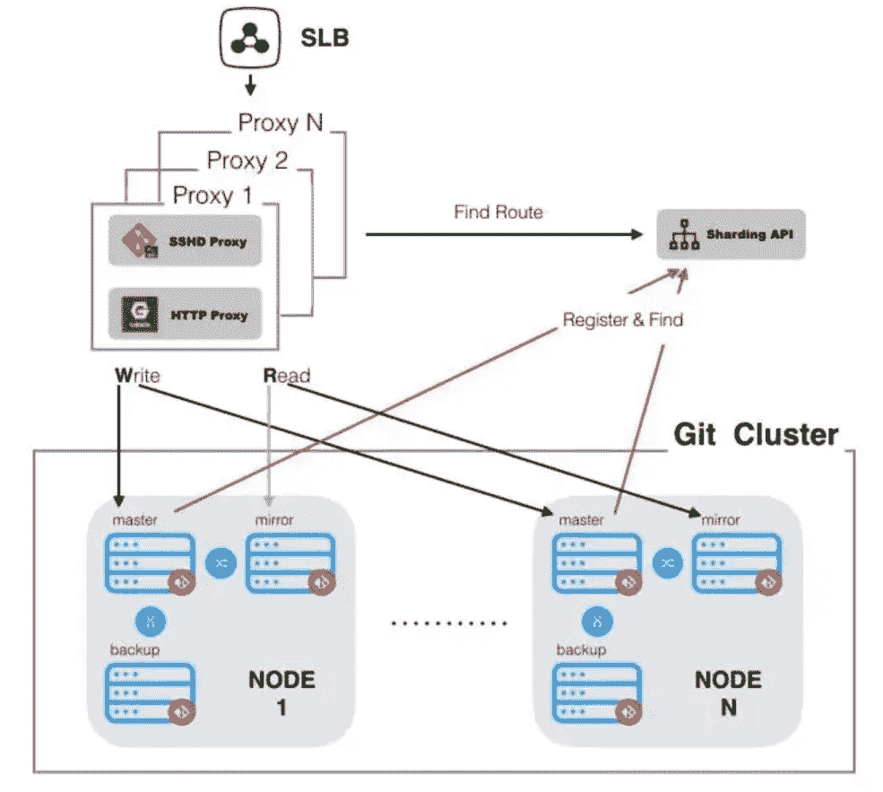
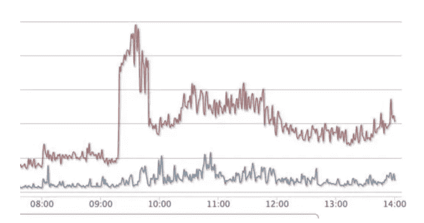
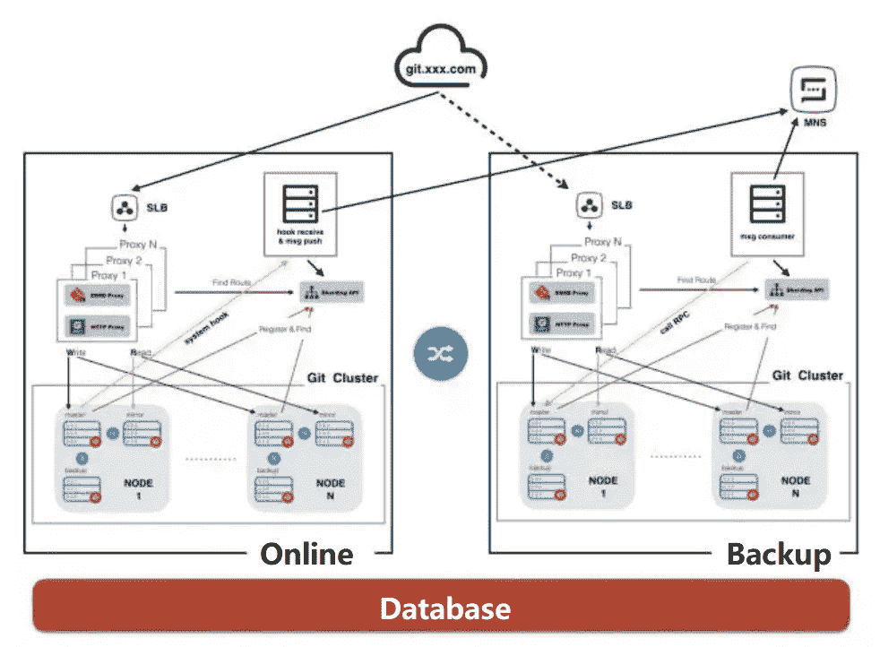

# 构建支持数百万用户的分布式代码托管平台

> 原文：<https://medium.com/hackernoon/build-a-distributed-code-hosting-platform-that-supports-millions-of-users-1bef2cc1f59b>

*阿里巴巴技术团队的最佳实践*

在过去的一年里，阿里巴巴的 GitLab 请求量增长了 4 倍，项目数量增长了 130%，用户数量增长了 56%。然而，尽管如此快速的增长，系统调用的准确率实际上已经从 99.5%提高到 99.99%以上。

这种成功归结于阿里巴巴的创新设计；GitLab 架构是基于 GitLab Community Edition v8.3 开发的，目前支持公司 R&D 团队的数万名成员。

# 挑战

到目前为止，已经创建了数十万个项目，每天有数千万个请求，存储达到了 TB 级。这些数字大大超过了 GitLab 独立版承诺的容量上限，并且还在快速增长。

面对这一挑战，合理的方法是简单地扩展容量。然而，不幸的是，GitLab Community Edition 是基于“独立”模式设计的，由于存储和独立负载的瓶颈，很难扩展容量。

这是因为 GitLab 的设计不符合 Heroku 所信奉的十二因素应用程序的第四个因素，即把后台服务视为附属资源。因此，git 仓库数据存储在本地服务器上，GitLab 所依赖的三个主要组件(libgit2、Git 和 grit)直接在文件系统上运行。

# **那么，阿里巴巴技术团队的解决方案是什么？**

2015 年初，阿里巴巴 GitLab 的独立负载开始严重不堪重负。此时，解决方案是同步多台服务器上的所有仓库数据，并分发请求以减少单个服务器上的负载。然而，这种方法只是治标不治本，并没有真正解决核心问题。

即因为系统运行期间的数据同步消耗资源和时间，使得不可能无限制地扩展服务器，并且因为虽然它只是暂时缓解了独立负载的问题，但是对于解决独立存储限制的问题没有任何帮助。

2015 年年中，该团队正式启动了首次改造尝试，想法是摆脱对本地文件系统的依赖，转而使用共享网络存储。

然而，由于本地缓存等问题的限制，共享网络存储解决方案存在明显的性能问题，并且大多数是基于 C/C++的底层更改，转换成本极高。

当时，该集团的 GitLab 服务器经常看到 95%甚至更高的 CPU 利用率超过警报阈值，这种负载也导致了很高比例的错误请求。这对下游应用程序的稳定性和用户体验都提出了严峻的挑战。

于是，2016 年 8 月，开始了新一轮的转型。由于共享存储不能解决问题，注意力转向了分布式或切片存储。

团队注意到 GitLab 中仓库的特征名称是“namespace_path/repo_path ”,这包含在几乎每个请求的 URL 或 ID 信息中。

然后，这个名称可以用作切片的基础，将不同名称的仓库路由到不同的服务器，并将与仓库相关的请求路由到相应的服务器。因此，服务可以横向扩展。下图说明了阿里巴巴目前在单个数据中心的 GitLab 的架构。

# **组件**

## Sharding-Proxy-Api 用于记录仓库和目标服务器之间的通信。

## 代理负责统一处理请求，并通过分片代理 Api 访问信息，从而将请求路由到正确的目标服务器。

## Git 集群由多个节点组成，每个节点有三个服务器，即主服务器、镜像服务器和备份服务器:

*   主机主要负责处理写(POST/PUT/DELETE)请求
*   镜像主要负责处理读取(GET)请求
*   备份充当节点内的热备份服务器。

# **程序**

在 Master 处理完写请求后，它会同时将更新更改同步到 Mirror 和 Backup/这确保了热备份服务器上读取请求和数据的准确性(没有使用双主模式，因为双向同步可能会导致相互覆盖，从而导致脏数据)。

## **如何保证切片信息正确**

基于 Martini 架构开发的 Sharding-Proxy-Api 实时接收来自 GitLab 的通知，以动态更新仓库信息。这确保了在名称空间或项目添加、删除或修改、名称空间路径更改或仓库转移的情况下数据的准确性。

在这样的场景中，每个请求都要添加一个或多个与分片代理 Api 的交互。最初，有人担心这会对性能产生影响。然而，由于 Golang 在高并发性下更简单的逻辑和出色的性能，目前 Sharding-Proxy-Api 的响应时间在 5 毫秒以内。

## **如何保证切片的合理性**

在海量数据的情况下，完全可以以 namespace_path 的第一个字母作为切片的基础进行哈希。然而，由于一些名称的特殊性质，可能会出现热库(即，一些名称空间具有非常大的存储或大量的相应请求)。为了解决这个问题，相应的权重被分配给存储和请求的数量，并且根据加权的结果执行切片。这在负载和存储资源消耗方面平衡了三个节点。

## **如何处理跨片请求**

除了对单个名称空间或项目的操作，GitLab 还有对多个名称空间和项目的操作，包括转移项目、分叉项目和跨项目合并请求。但是，系统不能保证这些操作所需的名称空间或项目信息会存储在同一个服务器上。

为此，修改了用于这些场景的 GitLab 代码，以便在请求落在服务器上并且需要来自另一个服务器上的名称空间或项目的信息时，以 SSH 或 HTTP 请求的形式获取信息。在这样的场景中，团队的最终目标是使用 RPC 调用。

## **如何提高性能**

1.SSH 协议的替换

目前，阿里巴巴的 GitLab 同时提供了 SSH 协议和 HTTP 协议，供用户对代码库进行取数和推送操作。其中，原生 SSH 协议是基于操作系统的 SSHD 服务实现的，然而，在大量并发 GitLab SSH 请求的情况下，可能会出现一些 bug。这可能导致用户获取和推送代码或使用 SSH 协议登录服务器的速度变慢。

为了解决这个问题，该团队采用 Golang 重写了基于 SSH 协议的代码数据传输能力，并将其部署在不同节点组中的代理服务器和 GitLab 服务器上。这意味着服务器负载显著降低，错误被消除，并且在 SSH 服务出现问题时，仍然可以通过 SSH(使用本地 SSH)登录到服务器，并且重新启动 SSHD 服务不会影响服务器本身。

下图显示了使用新的 SSHD 服务后代理服务器的 CPU 使用情况:

2.个体请求的优化和重写

对于大型请求，如通过 SSH 密钥进行身份验证和访问用户信息的接口，目前使用 text-to-MD5 或索引方法来优化性能，并使用 Golang 或 Java 进行重写。

## **如何保证数据安全**

1.一个主服务器和多个备份服务器

阿里巴巴 GitLab 的每个切片节点包含三个服务器，因此维护了相应仓库中数据的三个副本。即使一台或两台服务器发生不可恢复的磁盘故障，数据检索仍然可用。

2.跨数据中心备份

2017 年 3 月，为阿里巴巴的 GitLab 完成了一次跨数据中心切换演练，模拟数据中心故障情况下的应对策略。在故障发生后的 1 分钟内收到警报通知，并且在手动干预(DNS 切换)的 5 分钟内跨数据中心切换流量。

多数据中心灾难恢复架构如下所示:

确保仓库数据的准实时同步是数据中心切换背后的原因，该团队的目标是使灾难恢复数据中心根据实际需要主动启动数据同步过程。基本步骤如下:

1.  GitLab 的系统钩子被用于在仓库信息被改变的所有场景中发布消息(包括事件类型、时间、数据等。)
2.  Hook 接收服务部署在同一个数据中心。接收到钩子请求后，数据被格式化，消息被发送到阿里云的消息通知服务(MNS)的相关主题
3.  灾难恢复数据中心部署了消息消费服务，订阅相关 MNS 主题，通过在线数据中心实时获取消息。收到消息后，调用 RPC 服务(部署在灾难恢复数据中心的 GitLab 节点服务器上)主动发起并实现数据同步逻辑。

> GitLab 节点服务器上的钩子接收、消息消费和 RPC 服务都是使用 Golang 实现的。RPC 服务基于 grpc-go，使用 protobuf 来序列化数据。

经过操作和演练，确定该解决方案是可行的。在数据验证和监控人员的配合下，灾难恢复数据中心可以准实时同步在线数据中心的数据，并确保 99.9%到 99.99%的数据一致性。

# **蜂窝部署**

蜂窝架构是从并行计算领域发展而来的。在分布式服务设计领域，单元是一个自包含的安装，它满足一个碎片的所有业务操作。另一方面，碎片是整个数据集中的一个子集。如果使用结束编号对用户进行排序，则编号相同的用户可以被视为一个碎片。单元化是重新设计服务以适应单元特征的过程。

对于技术团队来说，从一开始就考虑到了这一点。例如，在跨数据中心备份中，当使用消息的应用程序需要调用分片代理 Api 来获取 RPC 服务的地址时，数据可以在一个数据中心的闭环内循环。这样，在满足单元化要求的同时，在数据中心出现故障的情况下，在消费已经在队列中的消息的过程中，尽可能地避免数据中断。

这意味着，阿里巴巴的 GitLab 基本具备了嵌入架构的蜂窝部署能力。这样一来，无论是后续与阿里云合作对外提供服务，还是新收购海外公司不得不搭建单独服务，事情都可以顺利进行，不会出现问题。

# **展望未来**

尽管数量、项目和用户大幅增加，但该系统的成功明显体现在准确性的提高上。尽管如此，技术团队认为还有许多可以改进的地方，包括全自动发布和扩展机制，以处理更多服务器的部署。

此外，只有当全球 RPC 服务的最终替代实现时，web 服务和 GitLab 本身消耗的资源才能分开，阿里巴巴 GitLab 的分布式转型才算完成。

尽管如此，阿里巴巴目前的 GitLab 架构仍然强大到足以支持数百万用户，并将通过阿里云在云中创建一个基于 R&D 云的协作生态系统的任务，逐步服务于更多的云开发者。

(李斌原创文章)

# 阿里巴巴科技

关于阿里巴巴最新技术的第一手、详细、深入的信息。

**关注我们**:【www.facebook.com/AlibabaTechnology 

或者在**脸书**上搜索**“阿里科技”**