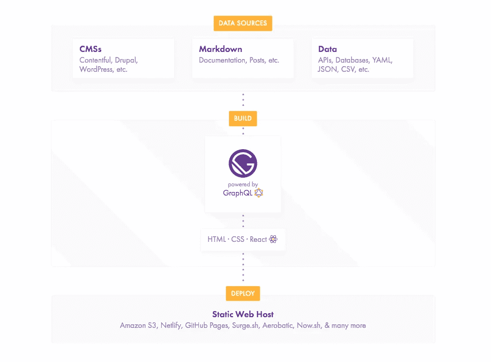
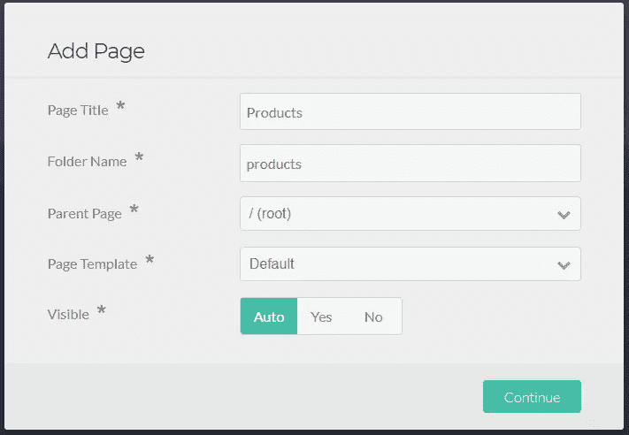
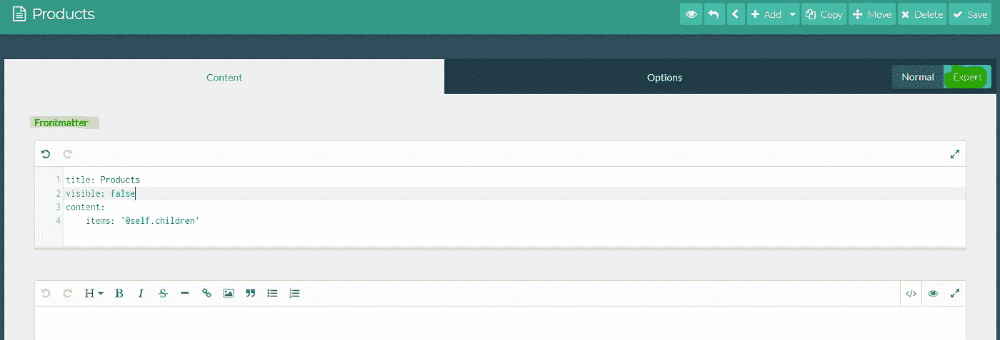
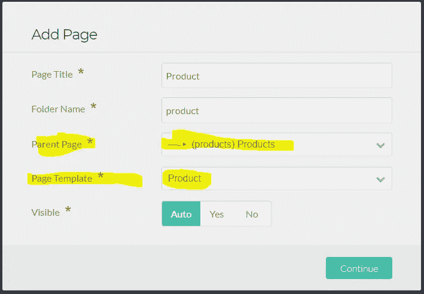
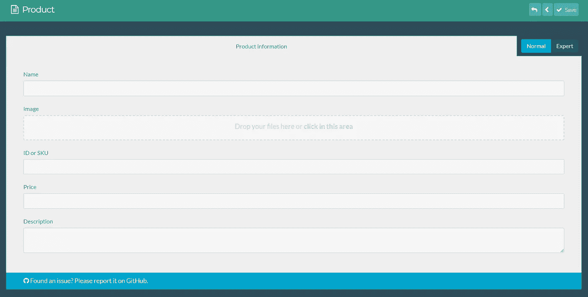
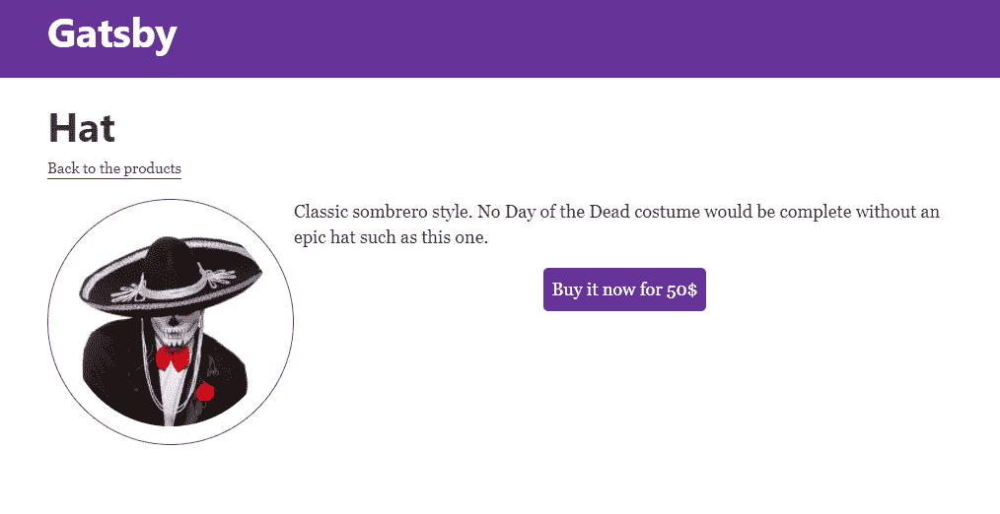
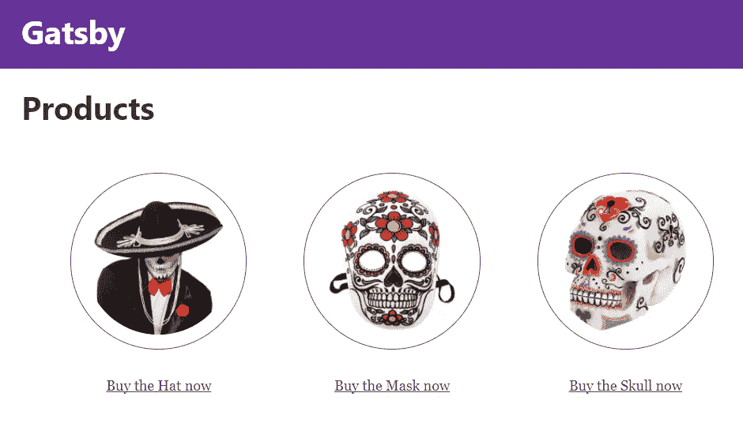

# 在一个无头的 CMS 上构建一个 Gatsby & GraphQL 应用程序

> 原文：<https://medium.com/hackernoon/build-a-gatsby-graphql-app-on-top-of-a-headless-cms-2eb3f78e1dc5>


Photo by [Dhaval Parmar](https://unsplash.com/photos/dnPniNPUe4o?utm_source=unsplash&utm_medium=referral&utm_content=creditCopyText) on [Unsplash](https://unsplash.com/search/photos/code?utm_source=unsplash&utm_medium=referral&utm_content=creditCopyText)

对于像我们这样的开发者来说，去年是非常激动人心的一年。

一大堆有前途的新兴技术已经成为 T2 的焦点。

甚至可能多到很难跟上。

为了保持理智，我想我们都有自己喜欢的东西需要关注。

我和我的团队都是与 [JAMstack](https://snipcart.com/blog/jamstack-clients-static-site-cms) 、[headless](https://snipcart.com/blog/cockpit-cms-tutorial-nuxtjs)、&、[静态站点生成器](https://youtu.be/hhwAVZz3CWo)相关的一切的忠实粉丝。

因此，让我们继续前进，用我们在过去几个月中探索的一些伟大的工具来推动新的边界。

在这篇文章中，我将向你展示如何:

*   将 **Grav CMS** 设置为无头 CMS。
*   安装反作用供电的静态现场发电机**盖茨比**。
*   创建一个源插件，用 **GraphQL** 查询 API。
*   结果呢？由 **Snipcart** 驱动的小型演示商店。

听起来很重？

听我说，会很有趣的。

让我们从快速介绍这些工具开始。

# Grav CMS 是什么？

简单来说， [**Grav**](https://getgrav.org/) **是一款现代开源的平面文件 CMS** 。它实际上获得了 2016 年 CMS 评论家奖“最佳开源 CMS”。


在这种情况下，我将只使用它进行内容管理，将后端与前端分离，或者我们喜欢称之为*无头 CMS* 。

你可能会问，为什么要这么做呢？

主要是因为这是一种将 CMS 的后端功能与一些令人惊叹的前端 JS 框架相结合的好方法(在我们的例子中是 React)。

*更多信息，我们已经在另一篇博文* *中介绍了使用无头 CMS 的所有好处。*

这次我想试试 Grav，因为它漂亮且可扩展的管理面板使它成为管理一个简单网站的绝佳选择。

这也是一个非常容易安装，容易学习的 [*平面文件 CMS*](https://snipcart.com/blog/flat-file-cms-php-kirby-tutorial) 是 WordPress 或 Drupal 等较重系统的一个很好的替代品。

# 用盖茨比反应静态站点..和 GraphQL

在我让我的解耦 CMS 运行之后，我将继续在它上面捆绑静态站点生成器 [Gatsby](https://www.gatsbyjs.org/docs/netlify-cms/) 。

Gatsby 是由 React 驱动的最流行的静态站点生成器。我已经[用它](https://snipcart.com/blog/snipcart-reactjs-static-ecommerce-gatsby)玩过一点了，但这次我会试着把它推得更远。

主要是因为我认为它很棒，值得探索。



在这里，我想使用 Gatsby 的一个重要特性，它允许我们从数据库、SaaS 服务、API 以及无头 CMSs 中获取自己的数据。

使用 GraphQL 将这些数据直接推送到我们的页面中。

在我们关于这项新技术的第一篇博客文章中，我们提到 GraphQL 可能不仅仅是一个流行的工具，而且它会一直存在下去。

看起来确实如此，因为它可能会在 2018 年变得更大。

很高兴看到它被像 Gatsby 这样的伟大工具所实现，今天我真的很想再试一次。

好了，这将是一个漫长的，所以没有进一步的废话，让我们开始工作！

# Grav as headless CMS 教程

# Grav 安装

Grav 非常容易安装。我用`composer`来这样做。只需打开一个终端并键入以下命令:

```
composer create-project getgrav/grav snipcart-grav-headless
```

然后，我们想启动一个 web 服务器，我选择了内置 PHP 开发 web 服务器。*注意我在 Windows 上*。

```
cd snipcart-grav-headless php -S localhost:8000 .\system\router.php
```

这将在运行 Grav 的机器上启动一个 web 服务器。您可以在浏览器中打开`http://localhost:8000`,您应该可以看到它的运行。

# Grav CMS 作为无头设置

我们现在有了一个工作的 Grav 实例。我们要做的第一件事是添加他们的真棒管理面板。

我非常喜欢 Grav 的一点是，它的一切都是插件，甚至是管理面板。；)

我们将通过他们自己的软件包管理器安装它。

```
php .\bin\gpm install admin
```

安装完成后，打开浏览器进入`http://localhost:8000/admin`。您需要填写一个小表格来创建您的初始用户，然后登录。

我们还将添加另一个插件，这个插件将负责为我们在 JSON 的 Grav 中添加的内容提供服务。在本教程的后面部分，我们将能够在 Gatsby 应用程序中使用这些数据。

*说实话，我还不认为 Grav CMS 是这样被广泛使用的。我很难找到一个插件来完成这项工作，并且有一些文档。*

我从查看 Grav 团队的`[feed](https://github.com/getgrav/grav-plugin-feed)`开始，但是，它没有导出我需要的所有数据。这个插件真正的目的是为 RSS 阅读器和类似的东西生成一个 feed 文件。

我拍的是`[page-as-data](https://github.com/btopro/page-as-data)`。虽然它似乎不再被维护，但它确实有用。它生成一个 JSON 文件，其中包含我将 Grav 用作无头 CMS 所需的一切。

# 在 Grav 中定义产品

最后一步将是定义我们的产品*蓝图*。Grav 中的蓝图允许您定义内容的结构。在我们的例子中，我们将创建一个定义什么是 Snipcart 必需选项的产品。

对于这一步，我更喜欢在 VS 代码(或任何其他编辑器)中打开文件夹，并手动编辑它。你需要去你的主题文件夹。在我的例子中，我保留了缺省值，因为我不会真正使用 Grav 来显示任何东西。

所以我不得不在`/users/themes/antimatter/blueprints`中创建这个文件。

这个新的蓝图将在 Grav CMS 中为我们提供一个新的“内容类型”,带有一些默认字段，将产品信息保存在 Grav 中。

# 在 Grav 中添加内容

我们现在有了让 Grav 按我们预期的那样工作所需的一切。我们会添加一些内容。

我们将首先创建一个新页面，它将成为我们将要添加的每个产品的父页面。

登录 Grav 管理面板，网址应该是:`[http://localhost:8000/admin](http://localhost:8000/admin.)` [。](http://localhost:8000/admin.)

转到**页面**部分，点击右上角的**添加**按钮，创建一个新页面:



我们可以保留默认的页面模板。因为我们不会使用 Grav 来呈现内容，所以这并不重要。然而，我们需要指示页面的内容。

在**专家**模式下打开页面，进入*首页*并粘贴:



一旦创建并配置了页面，我们将定义产品。

再次单击添加按钮:



确保选择正确的父页面和模板。

一旦页面生成，您将得到一个表单，它使用了我们在本文前面的蓝图中定义的字段。

您可以在那里设置产品属性，然后点击保存按钮。**确保你处于普通模式，而不是专家模式**。



现在我们已经有了内容，我们可以在浏览器中打开这个 URL:`[http://localhost:8000/products?return-as=json](http://localhost:8000/products?return-as=json.)`[。](http://localhost:8000/products?return-as=json.)

`page-as-data`插件将捕捉这个请求并返回一个包含我们数据的 JSON 对象。这正是我们在 Gatsby 项目中要使用的数据源。

# 使用 GraphQL 模式的 Gatsby 设置

# 安装盖茨比

我们的第一步是安装盖茨比。[他们的文档](https://www.gatsbyjs.org/docs/)做得很好，如果你想了解更多信息，可以参考一下。

确保你已经安装了经典的 NodeJS 栈，并且可以访问`npm`，然后打开一个命令行。

我们将安装`gatsby-cli`包，这个包将公开一些与 Gatsby 相关的命令。

```
npm install --global gatsby-cli
```

然后，我们将搭建我们的新项目:

```
gatsby new gatsby-site
```

这将克隆必要的文件并安装默认的启动程序。

# 创建一个源代码插件来查询我们的 API

为了访问我们在 Gatsby 中的数据，我们需要制作一个源代码插件。该插件允许将数据“来源”到节点中，这是 Gatsby 内置的一个概念。这些节点将生成一个 GraphQL 模式，它将能够在我们的组件中进行查询。

我不得不说，这是一个非常好的方法。我喜欢在《盖茨比》中以如此有趣和简单的方式使用 GraphQL。

首先在你的工作区的根目录下创建一个`plugins`文件夹。如果您愿意，也可以使用独立的 NPM 包，但是我决定在这个例子中使用最简单的方法。

我的树看起来是这样的(注意，我在文件夹中运行了`npm init`来创建`package.json`文件):

你可以把`gatsby-node.js`当做包的`index.js`。这是插件代码开始的地方。

我们的插件基本上会对我们用 Grav 构建的`/products`端点进行 HTTP 调用。然后，它将使用响应有效负载并构造节点，Gatsby 将使用这些节点来生成我们的 GraphQL 模式。

我们将为此使用两个包。第一个是`[axios](https://github.com/axios/axios)`，它是节点社区中非常有名的 HTTP 客户端。

然后，`[gatsby-node-helpers](https://github.com/angeloashmore/gatsby-node-helpers)`这将是非常有用的生成节点。Gatsby 中的一个节点包含一些必须被散列的内部数据。使用助手将为我们节省大量代码。

```
npm install --save axios gatsby-node-helpers
```

我们的 Gatsby 插件必须导出一个名为`sourceNodes`的函数，这个函数将调用我们的 API 并创建节点。

在你的项目中添加一个名为`gatsby-node.js`的文件(如果还没有的话),并在其中添加以下代码:

我认为代码非常简单明了，所以我不会一步一步地解释它。

一旦完成，我们必须让盖茨比知道我们的插件。

打开`gatsby-config.js`文件。该文件应该位于您的工作区根目录下。在`plugins`数组中，添加`'grav-headless-plugin'`。

我的配置文件如下所示:

然后，您可以启动您的 Gatsby 开发服务器:

```
gatsby develop --port 8001
```

Gatsby 附带了一个预配置的 **GraphiQL** 。

这是一个非常干净的 GraphQL 客户端，使您能够直接在浏览器中执行查询。在浏览器中导航至`http://localhost:8001/___graphql`。

然后，您可以运行以下查询:

这将返回一个 JSON 对象:

这些数据来自 Grav，现在可以在您的 Gatsby 网站上找到！

太棒了，不是吗？

# 生成网站

我们要做的第一件事是添加 Snipcart 依赖项。

*为此你需要一个* [*Snipcart 账号*](https://app.snipcart.com/register) *(在测试模式下永远免费)。*

打开`layouts/index.js`文件，并将这些行添加到`<Helmet>`组件中:

这将向您的站点添加所需的文件，Snipcart 将在我们需要时工作。:)

因为我们想创建一个静态网站，我们需要为每个产品制作一个页面。幸运的是，Gatsby 涵盖了这一点，并公开了一些我们可以使用的方法。

基本上，我们将通过 GraphQL 查询我们所有的产品，然后我们将使用通用组件为每个产品动态生成一个页面。

为此，打开工作空间根目录下的`gatsby-node.js`文件(不是我们制作的插件中的那个)。这是我们生成页面的地方。

我们希望运行这个 GraphQL 查询，并为每个结果创建一个页面:

在`gatsby-node.js`文件中，我们可以导出一个函数来创建这些动态页面。该功能被命名为`createPages`。

```
exports.createPages = async ({graphql, boundActionCreators}) => { }
```

复制上面的两行。注意，我们注入了用于查询数据存储的`graphql`和用于构建页面的`boundActionCreators`。

我们将首先得到我们的产品:

有了这些结果，我们将自动创建页面。为此，我们需要两个依赖项，Node 自带的`path`和正确处理 Windows 文件系统的`slash`。

你必须通过 npm 安装这个。

```
npm install slash --save-dev
```

在文件的顶部包含这两个依赖项:

```
const slash = require('slash') 
const path = require('path')
```

现在我们将使用`boundActionCreators`中可用的`createPage`方法来生成页面:

正如你所看到的，我们得到了所有的产品，然后为每个产品创建了一个页面。我们将产品 ID 传递给上下文，它将在`Product`组件数据中可用。

我的整个`gatsby-node.js`文件如下所示:

说到`Product`组件，这是我们接下来要做的。该组件将用于呈现每个产品页面。

在您的`src/components`文件夹中创建一个名为`product.js`的文件。

该文件将包含 Snipcart 购买按钮和产品的一般信息。我不会过多地探究 React 和样式化的东西，但这里是我的组件代码:

注意，我们也使用 GraphQL 通过 ID 获取产品。`id`值来自我们在`gatsby-node.js`文件中时在`context`中设置的值。

我使用 CSS 模块来管理我的组件。我建议你读读 [*这篇关于此事的优秀教程*](https://www.gatsbyjs.org/tutorial/part-two/#css-modules) *。*

我们还导入了`Link`组件。您会想用它来添加 Gatsby 生成的页面之间的链接。

一旦你的站点被加载，React router 将负责路由，它将创建一个非常流畅的体验。没有满负荷，只有速度！

如果你点击这个页面(确保你的 Gatsby dev 服务器运行了`gatsby develop` ): `http://localhost:8001/products/hat-hat`你应该会看到一个很棒的产品页面。



注意到`Back to products`链接了吗？这是为了重定向到我们的产品页面还不存在。

让我们为它制作一个页面，在`pages`文件夹中，创建一个名为`products.js`的新文件:

正如我们前面所做的，我们再次使用 GraphQL 来查询我们的产品。产品将在组件`data`对象中可用，我们将能够呈现每个产品。

如果你去`http://localhost:8001/products`，你现在应该有一个很棒的产品列表页面。:)

# 现场演示和 GitHub 回购



> [*参见 GitHub 上的开源回购*](https://github.com/snipcart/snipcart-gatsby-grav) *。*
> 
> [*看现场试玩这里*](https://snipcart-gatsby-grav.netlify.com/) *！*

# 结束语

我做这个教程玩得很开心！

我喜欢 Grav 的简单性，我只用了几分钟就让它运行起来了。最困难的部分是找到我要把它用作无头 CMS 的插件，老实说，我在演示中使用的插件是有限的。

我认为 Grav 对于一个非常基本的场景可能是一个很好的解决方案，但不如我们在以前的帖子中看到的其他选项，如 Directus 或 GraphCMS。

也就是说，我很清楚这不是大多数人使用 Grav 的方式。；)

对于盖茨比的前端部分，再次使用是一种真正的快乐。这真的是一个很棒的软件。文档是中肯的，而且执行得非常好。

GraphQL 实现使得整个体验更加特别。

我也没摸反应过来很多，只跟[前阵子的几个教程](https://snipcart.com/blog/reactjs-wordpress-rest-api-example)。不过，《盖茨比》很容易学，让我想更深入地研究 React。

*如果你喜欢这篇文章，请花点时间在推特* *上分享一下。有意见或问题吗？点击下面的部分！*

我最初在 Snipcart 博客上发表了这篇文章，并在我们的时事通讯上分享了它。