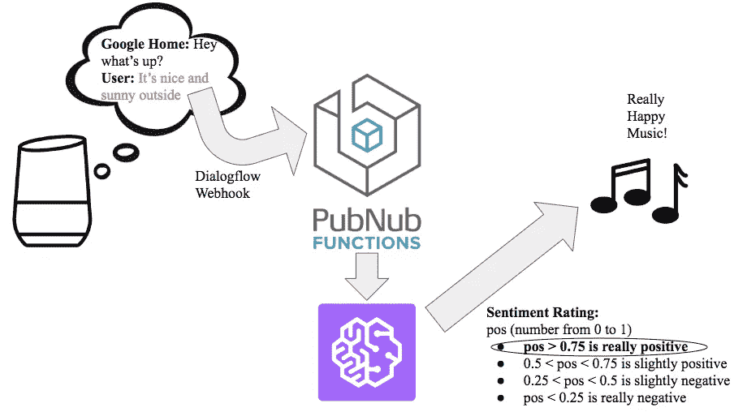
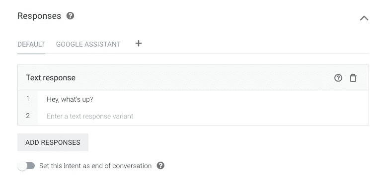
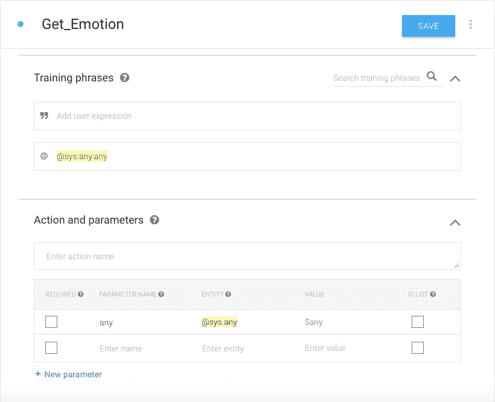
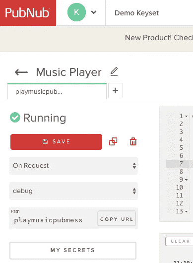
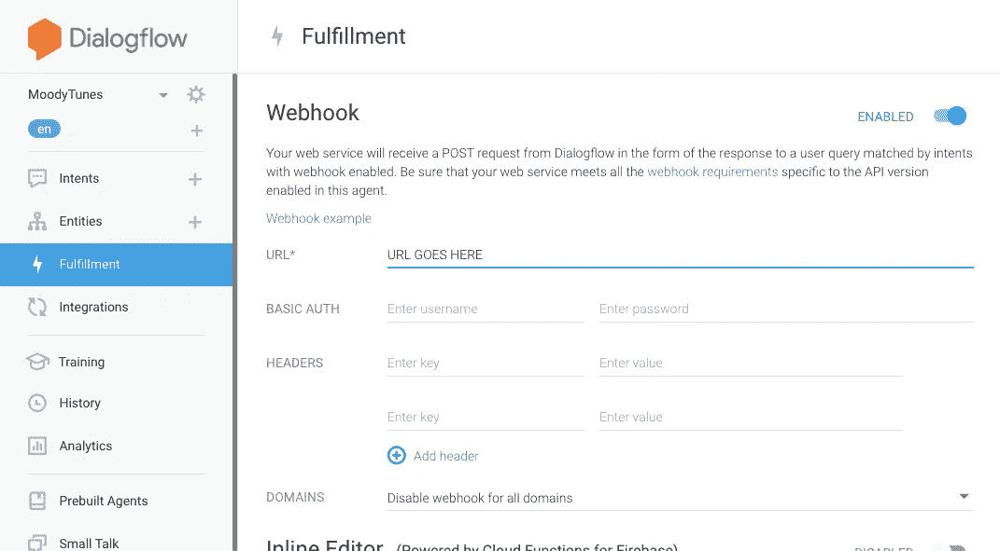
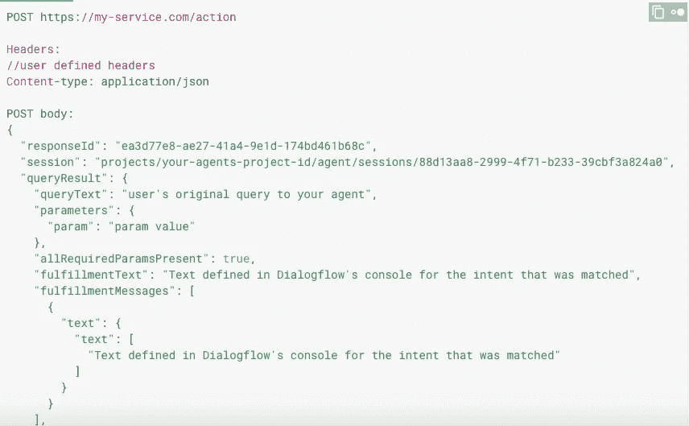
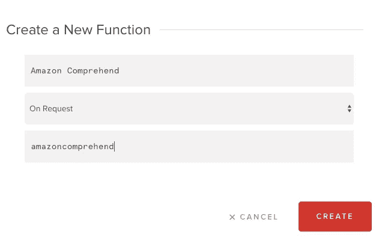
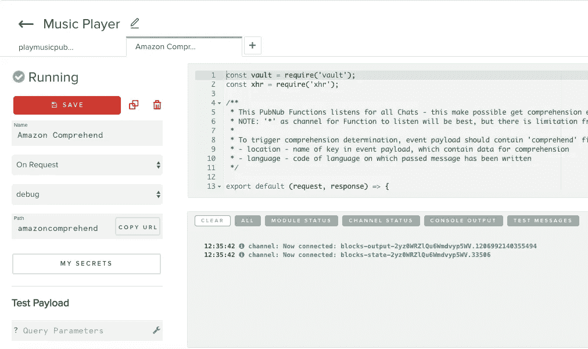
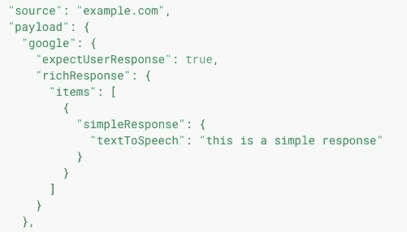

# 建立一个具有 PubNub 功能的 Google Home 应用程序

> 原文：<https://medium.com/hackernoon/build-a-google-home-app-with-pubnub-functions-10188479699d>


人工智能驱动的语音应用程序已经成为最近智能家居运动的关键角色。借助谷歌的 Dialogflow，开发者可以快速创建对话式应用，为用户完成任务提供便利。然而，Dialogflow 没有提供的是一个易于实现的服务器，它允许开发人员使用用户数据执行某些功能。

在这个演示中，我们将利用 PubNub 函数和 Dialogflow 来创建一个示例应用程序，根据用户当前的心情为他们播放正确的音乐。Dialogflow 不提供任何分析用户语音输入情绪的手段，但通过 PubNub 函数和我们的[Amazon imperstand BLOCK](https://www.pubnub.com/docs/blocks-catalog/amazon-comprehend)，开发人员可以轻松分析用户语音输入的情绪，并根据结果执行特定的操作。

Demo of MoodTunes

# 教程概述

一旦我们的演示应用 MoodTunes 被激活，它会问用户“嘿，怎么了？”用户将用一两句话来描述他们的整体情绪。然后，该应用程序将获得用户的语音输入，并对其进行分析，以使用理解块来确定用户的情绪。

最后，它会将情绪分为真正积极、稍微积极、稍微消极或真正消极。下图显示了应用程序的结构和测试响应。



# 初始设置

我们的第一步将是在 [Dialogflow 控制台](https://console.dialogflow.com/)上创建一个新的**代理**。代理是你的应用程序的术语，因为它帮助用户执行某个动作。

让我们命名我们的代理**情绪曲调**。

默认情况下，这个新代理将有两个意图:**默认回退意图**和**默认欢迎意图**。把意图想象成当用户说出某个短语时触发的整个对话的一个特定部分。当用户通过说出“与(座席名称)交谈”来调用您的应用程序时，会触发默认的欢迎意图；当用户说出应用程序不理解或未经培训无法响应的内容时，会触发默认的回退意图。

对于我们的演示，我们将只使用两个意图:默认的欢迎意图和另一个我们将创建的名为 **Get_Emotion 的意图。**在我们默认的欢迎意图中，我们将添加一个标准的文本响应“嘿，怎么了？”，这将提示用户用一两句话描述他们的感受。



这个新的演讲将会引发我们新的情绪。要创建新的意向，请单击控制台侧面导航栏上的加号按钮。我们希望我们的用户能够说出任何没有特定模式的句子来触发我们的 Get_Emotion 意图。因此，我们必须在意图的训练短语部分中指定这一点。我们将通过单击**"图标**将其更改为 **@图标**，然后键入 **@sys.any:any 来完成此操作。**



最后，我们必须向下滚动到 fulfillment 部分，并单击切换按钮**为 Get_Emotion 意图启用 webhook 调用**。webhook 调用将允许我们在 Dialogflow 应用程序和 PubNub functions 服务器之间建立连接，这样我们的功能就可以在用户描述他们的感受后被激活。

现在我们将前往 [PubNub 管理仪表板](https://admin.pubnub.com/)，创建一个名为 MoodTunes 的新项目。在这个新项目中，我们将导航到侧栏并单击 functions。这里，我们将创建一个名为**音乐播放器**的模块，并在该模块中创建一个 **onRequest** 函数，我们称之为 **playmusic** 。单击复制 URL 按钮复制函数的路径。然后，我们会将此 URL 粘贴到我们的 Dialogflow 应用程序的 fulfillment 选项卡中，在 Webhook 下显示 URL 的位置。



现在，我们已经成功地设置了我们的 Dialogflow 应用程序，并通过 webhook 将其连接到我们的 PubNub 函数。在本教程的剩余部分，我们将在 PubNub 函数编辑器中编写应用程序的 JavaScript 代码。

# PubNub 函数

我们可以将 PubNub 函数分解为三个部分。

1.  从 Dialogflow 接收 webhook 请求
2.  处理来自请求的数据
3.  正在形成发送到对话流的响应

在我们的 PubNub 函数中，我们有两个参数，`request`和`response`。来自 Dialogflow 的请求将采用 JSON 的形式，它包含我们必须提取的用户语音输入。根据 Google 的文档，JSON 请求的结构如下所示。



为了从这个请求中获得 queryText 值，我们必须首先解析它的主体，使它采用正确的 JSON 格式。我们将使用`JSON.parse()`来做到这一点。既然它是正确的 JSON 格式，我们可以提取`queryResult`值，然后提取`queryText`值。这显示在下面的行中。

```
var text = JSON.parse(request.body).queryResult.queryText;
```

现在，我们有了对用户语音输入的引用，下一步是处理这些数据。我们将通过将它传递到我们的 Amazon 理解块中来实现这一点。要将块添加到项目中，请单击加号按钮，系统会提示您将函数添加到模块中。我们将我们的函数命名为**Amazon understand**，并将事件类型设置为 **onRequest** 。然后将 URL 路径设置为 **amazoncomprehend** 。默认的 Amazon understand 块代码是针对发布前处理程序的。然而，我们希望我们的块是一个 OnRequest 处理程序，所以将这个[代码](https://github.com/kaushikravikumar/MoodTunes/blob/master/amazoncomprehend-function.js)复制并粘贴到您的编辑器中。



接下来，如果您还没有 AWS 帐户，我们将创建一个。我们需要获得以下凭证:理解**访问密钥**和**秘密密钥** ( [在此了解如何](https://docs.aws.amazon.com/comprehend/latest/dg/comprehend-api-permissions-ref.html))。一旦我们有了这些凭证，我们将把它们输入到 PubNub 的 **My Secrets** 键值存储中。你可以在你的模块视图的左侧一个标有“我的秘密”的大按钮中找到它访问密钥的密钥必须是 **AWS_access_key** ，秘密密钥的密钥必须是 **AWS_secret_key** 。然后输入相应的值并点击**保存**，这样您就知道您的凭证在您的功能代码中的 vault reference 是正确的。

设置好 Amazon understand 函数后，我们现在必须使用 PubNub 函数提供的 **xhr 模块**向它发出 HTTP 请求。使用`xhr.fetch`方法，我们可以向指定的 URL 发出 HTTP 请求，同时传递一个定义了类型、主体参数和头参数的对象。从 Amazon understand 函数上的 copy URL 按钮获取 URL，并将其存储在变量`amazon_url`中。在下面的代码中，我们的`amazon_request_options`为 HTTP 请求定义了必要的参数。

我们在键中传递我们想要分析的文本，`speechInput`。我们还必须在名为`comprehend`的字段中指定键`language`和`location`。语言就是文本所在的语言(en 代表英语)，位置是请求中保存要分析的文本的键的名称(在我们的例子中是 speechInput)。我们还必须指定 POST 请求的类型，作为`method`键的值。将 amazon_url 和 amazon_request_options 对象传递到 xhr.fetch 方法中，我们使用一个承诺来获得对 HTTP 请求的 JSON 响应，一旦它准备好了。

既然我们已经将我们的响应存储在变量`sentiment_response`中，我们现在必须解析它，这样我们就可以获得用户语音输入的积极程度。JSON 响应的主体应该包含一个字段`sentiment`，该字段将包含键`SentimentScore`，该键将包含键`Positive`。如果您使用控制台记录响应的主体，就可以看到这一点。因此，为了获得这个从 0 到 1 的数值来显示用户语音输入的积极程度，我们必须使用下面的代码行。

接下来，我们将使用这个值和 if-else 逻辑来选择为用户播放哪首歌曲。如前所述，如果`positive_measure`大于 0.75，我们将播放我们真正积极的歌曲。在 0.5 到 0.75 之间的情况下，我们就放我们稍微积极一点的歌。如果它在 0.25 和 0.5 之间，我们将播放我们稍微消极的歌曲，如果它小于 0.25，我们播放我们真正消极的歌曲。相应的歌曲都存放在我的 GitHub 项目中，位于下面代码片段所示的 URL 下。

完成对用户语音输入的分析后，我们为应用程序的最后一步做好了准备，这就是形成发送到 Dialogflow 的响应。在这个响应中，我们需要传递将在 Google Home 设备上播放正确歌曲的 URL。按照 Google 文档中的规定，该响应必须类似于以下格式。



在我们的例子中，键`expectUserResponse`的值应该为 false，因为音乐的播放是用户与我们应用程序对话的结束。此外，我们将有我们的`simpleResponse`，让用户知道他们的音乐正在播放。我们还将包括一个`mediaResponse`字段，它将包含一个`mediaObjects`数组，带有键`name`、`description`和`contentUrl`。

按键名称和描述将用于音乐播放器视图，当用户在带有显示屏的谷歌助手设备上使用我们的应用程序时，该视图会显示出来。contentUrl 将是我们要播放的歌曲的 Url(我们将把它设置为我们之前设置的变量 song_url)。根据 Google 的文档，在 richResponse 中，我们必须包含一个`suggestions`数组。然而，由于它与我们的应用程序无关，我们将把它作为一个空数组。这个 JSON 响应必须是一个字符串，因为`response.send`只接受字符串，所以我们将使用方法`JSON.stringify`。这些都显示在下面的代码中。

# 恭喜你。

现在，我们已经通过 Dialogflow webhook 请求获得了用户的语音输入，使用 PubNub 函数的 Amazon intensive 块分析了它的情绪，并形成了播放符合用户情绪的歌曲的响应，我们已经完成了 MoodTunes。

如果您正在测试您的应用程序，请确保您已经启动了您的功能模块，以便服务器端代码能够实时运行和部署。为了在 Google Home 设备上测试你的应用，确保你已经完成了这些[步骤](https://developers.google.com/actions/smarthome/testing-deploying)。点击这里查看[完整源代码](https://github.com/kaushikravikumar/MoodTunes)。