# 使用 Express 从头构建 GraphQL 服务器的最简单方法-(第 1 部分)

> 原文：<https://medium.com/hackernoon/build-a-graphql-server-from-scratch-using-express-part-1-304341f9adba>

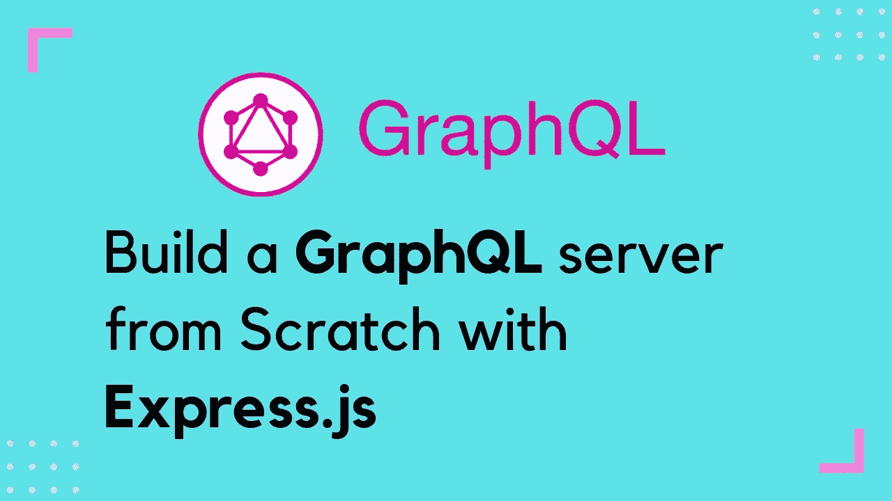

可以说，GraphQL 是为前端获取或呈现数据，甚至为后端存储和更新数据的最流行的约定之一。嗯，Rest-API 也是 GraphQL 的一个替代方案，但是使用 Rest-API 约定有很多缺点。

我不会深入探究 GraphQL 和 Rest-API 之间的区别，因为这个主题是关于构建一个 GraphQL 服务器的。

我们将制作一个 GraphQL 服务器，并将使用 Express 来托管我们的服务器，其余的将使用 GraphQL 来操作。

首先**打开你的终端**并确保你的机器上安装了 Nodejs。您可以使用 node -v 或 npm - v 命令进行交叉检查，这将显示 node 的工作版本。

使用命令 **mkdir** 创建一个名为 **gserver** 的目录，然后将 cd 放入 gserver 文件夹。

接下来点击命令 NPM init--是的，这将为我们的项目创建一个 json 包。

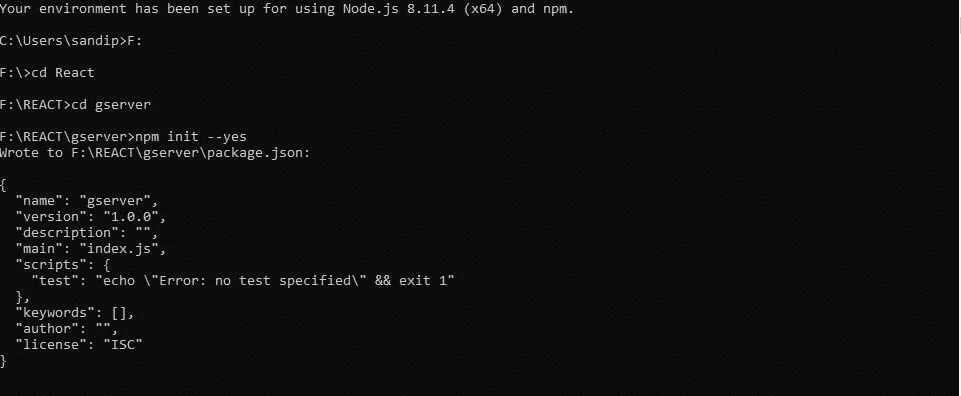

Building up the Package.json

下一步是将 **Express** 添加到我们的项目中，因此运行 **npm install express - save** ，

在代码编辑器中创建一个名为 server.js 的**新文件。这是我们的服务器将要执行的主文件，所以请访问 **package.json** 并更改**

**“main”:“index . js”到“main”:“server . js”。**

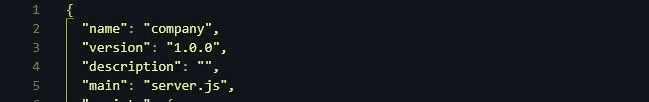

renaming index.js to server.js

打开 server.js 文件夹，键入以下代码:

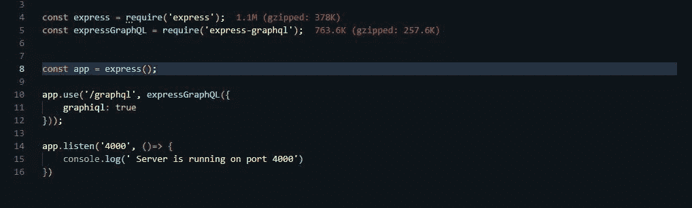

starter code

首先，我们需要安装 2 个依赖 express-graphql 和 graphql，因此在您的终端上运行:**NPM I express-graph QL graph QL**

运行我们的 express 服务器需要 express，express-graphql 将与 graphql 和 Express 进行桥接。

我们使用 const app = express()创建应用程序的实例；

app.use()像我们传入 app.use 的任何东西一样充当中间件，函数将充当 GraphQL 和 Express 的连接。

app.use 接受两个参数，一个是路由，另一个是将在路由中使用的文件，现在，我们有设置为 true 的 graphql。这是一个基本的代码，你必须为即将开始的项目编写。

app.listen()用于指示我们的应用程序将在哪个端口上运行。

要运行我们的服务器，运行:node server.js

现在我们的基本服务器已经准备好运行了，但是你会在你的 **localhost: 4000/graphql** 上看到一个错误，但是我希望你运行并检查这个错误，因为理解错误会使你成为一个更好的学习者。

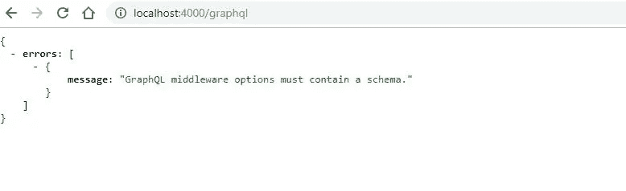

GraphQL middleware doesn't have a schema.

您会看到一个错误，指出 GraphQL 中间件不包含模式文件，所以现在我们必须创建一个模式文件。

那么这个**模式文件**是什么呢？简单地说，模式文件是我们的 graphQL 将包含的结构，准确地说，它就像一本书的内容或一个项目的索引。

因此，我们在您的项目文件夹上创建一个文件夹，并在其中创建一个 schema.js 文件(Schema folder -> schema.js

在模式文件中，我们将导入到目前为止的需求表达和 GraphQL 依赖项。

在 schema.js 文件中键入代码:

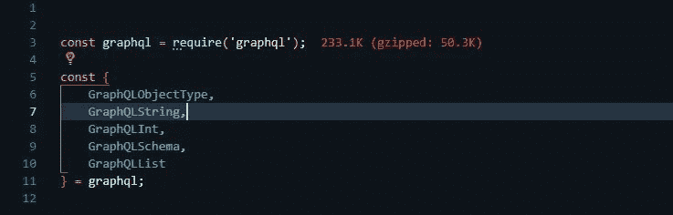

Schema.js

不要太担心我们为什么要把所有的内容都析构到 graphql，现在只需要知道我们以后会需要所有这些东西。

现在让我们做点别的事情来构建我们的 JSON 数据服务器， **Json-server** 是我们制作一个伪 API 数据库所需要的依赖项。

所以在 windows 上按 ctrl+C，在 mac 上按 command+C，就可以停止终端中当前正在运行的程序。

添加-> npm 安装 JSON-服务器-保存

现在在 gserver 文件夹中创建一个 db.json 文件。

在 db.json 中键入以下代码:-

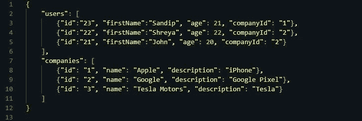

db.json

我们将有两种类型的领域用户和公司。

仔细阅读一遍有数据的 JSON 文件，了解用户和公司的领域。你可以看到用户和公司都有一个 id 字段，这是最重要的，因为用户或公司的 ID 可以告诉你所有的细节。

我在用户内部添加了一个**“公司 id”**字段，这样我们也可以从用户字段本身评估哪个用户在哪个公司工作。

我们将进一步努力与用户和公司建立关系。

现在，让我们添加第二台服务器来托管 JSON 数据库，打开第二台终端并运行命令**JSON-server--watch db . JSON .**

在您的网络浏览器上访问:[http://localhost:3000/users](http://localhost:3000/users)或公司以查看其字段。

现在让我们构建我们的 schema.js，打开 schema.js 并创建用户字段。

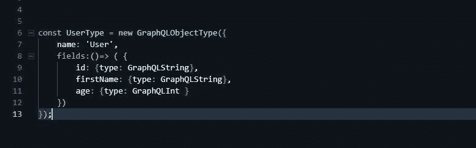

user.js

我们正在创建一个新的构造函数，将一个名称和一个字段作为对象传递。在字段内部，我们将输入字段及其类型作为对象。

您一定想知道为什么我们在 fields 对象内部传递一个匿名函数，我们这样做是因为 javascript 闭包。因为我们将用户链接到公司，也将公司链接到用户，所以我们需要使用 As 函数来避免错误。

接下来的工作是创建一个根查询，根查询是查询字段首先被执行的地方，然后根查询将决定把查询传递到哪里。

**示例:** -假设您传递一个查询来查找一个 id 为“23”的用户，因此该查询将传递给 RootQuery，在那里我们有一个称为解析器的东西，解析器将检查将查询传递到哪里，然后它将查询传递给相关的字段，然后执行该字段。

接下来，我们可以使用 fetch()或 axios.get()从 JSON 服务器获取数据，这里我将使用我最喜欢的 axios.get()。

因此，在终端上输入 **npm install axios - save 来安装 axios。**

通过在 schema.js 上键入这一行进行下一次导入:

**const axios = require(' axios ')；**

现在在 schema 中输入这段代码。用户类型下的 js:

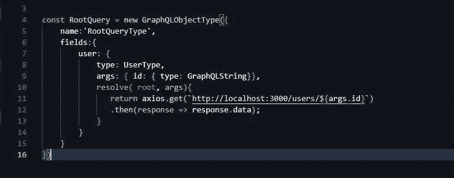

User’s resolver

我们对 RootQuery 做了同样的事情，让构造函数传递两个对象作为名称和字段。

在字段中，我们有 user，因为我们将为 user 创建解析器，在字段中，我们有一个类型:UserType，与构造函数的名称相同。

args 基本上是我们希望查询执行的参数，这里我们希望 graphQl 查询 id。

之后我们有了主解析器，我们传递了两个参数 root 和 args，在大多数情况下，在 RootQuery 中，我们不会使用 root，但我们必须将它作为一个参数。

之后，我们简单地用 axios 获取 id，因为我们将 id 作为参数传递。

现在，最后，您必须导出 RootQuery，因为这是我们的主查询。将此添加到 **schema.js** 文件的最后:

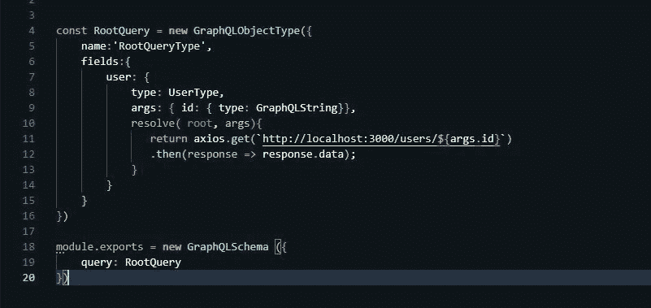

module.exports

要运行，我们必须在 server.js 中做另一件事，记得当我们第一次尝试运行 graphQL 服务器时我们得到一个错误，我们得到一个错误，比如中间件的 schema missing，它需要将我们刚刚创建的 schema 导入 server.js

将 schema 文件导入 server.js 并将 schema 添加到中间件中，注意:schema 在中间件中是区分大小写的，它始终是小写的 schema。

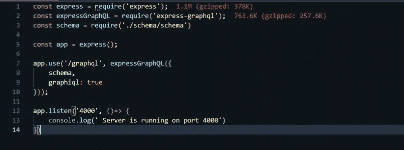

importing schema to server.js

现在让我们运行我们的 GraphQl 服务器，在我们的浏览器上再次打开链接:[**http://localhost:4000/graph QL**](http://localhost:4000/graphql)**。**你会看到 GraphQL 游乐场即将到来。

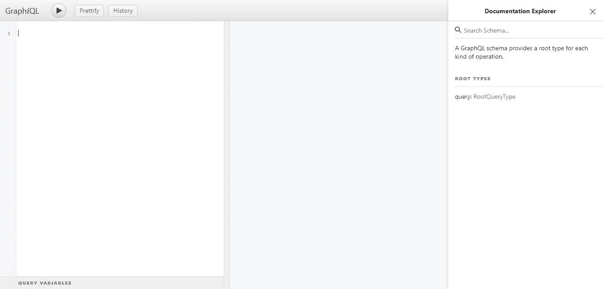

GraphQL server

这是我们的 GraphQL 游乐场，我们可以在这里编写查询。在右边，你可以看到文档浏览器:当我们编写复杂的查询时，它非常有用，它显示了我们字段的总体结构。

点击 RootQueryType，你会看到这个:**用户(id: String):用户**

我们准备运行我们的第一个查询:

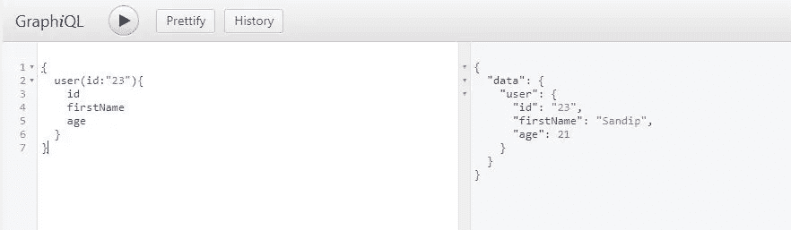

Query

左边是我们的查询，右边是我们从查询中获取的数据。我们得到的数据只是一个 JSON 对象。

如果您得到类似于 **user: null** 的消息，请再次检查代码或书面查询。

哇，仅仅是运行我们的第一个查询就已经是一个很大的任务了，我承认当你第一次输入这个查询时，它看起来很大，但是一旦你输入了你的查询，你会发现一切都是重复的。

接下来是你的工作，我希望你自己编码的公司字段看用户字段。这和我们将要做的几乎是一样的。

**在 Github 上关注我:-**[**https://github.com/sandipguchait**](https://github.com/sandipguchait)

下面是下一部分:

 [## 使用 Express 从头构建 GraphQL 服务器的最简单方法-(第 2 部分)

### 在上一篇文章中，我们成功地编写了用户字段，并在图形中运行了我们的查询

medium.com](/@sandip21/easiest-way-to-build-a-graphql-server-from-scratch-using-express-part-2-6758dcd7154)