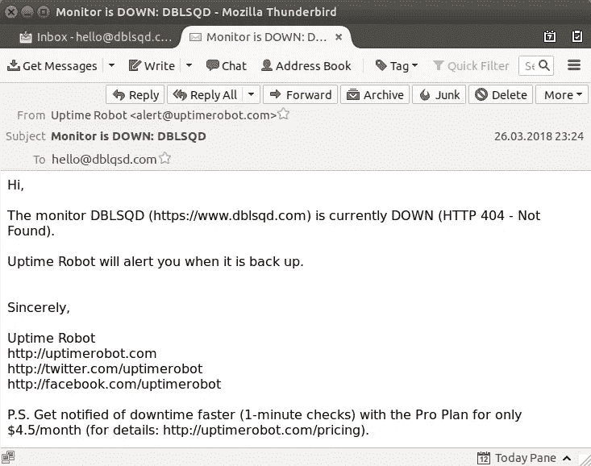
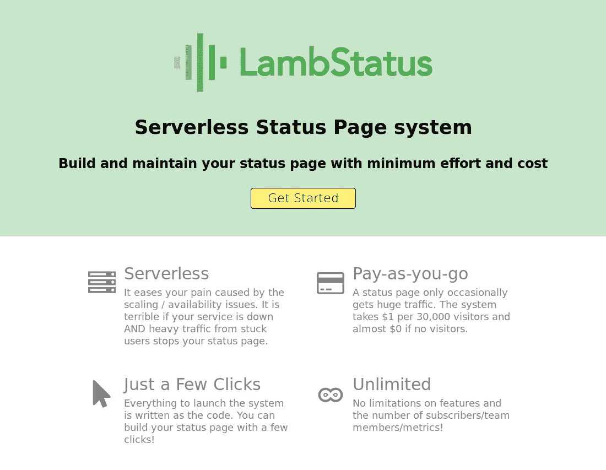
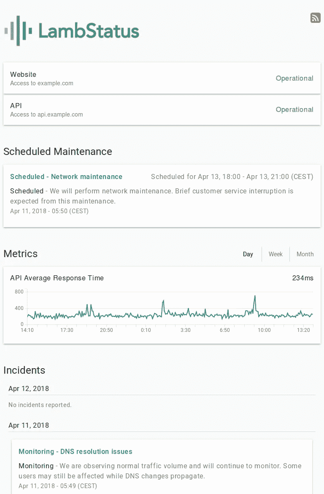

# 在 15 分钟内建立一个伟大的状态页面，没有预算

> 原文：<https://medium.com/hackernoon/build-a-great-status-page-in-15-minutes-with-no-budget-98257f67aef1>

## 这里有一个我不得不通过艰难的方式学到的教训:**每个人都需要一个状态页面。**

Senior Lamb Data Analyst. (Original photo by [Robin Vet](https://stocksnap.io/author/46145) on [Stocksnap](https://stocksnap.io/photo/CX48VQ5EU7))

昨天我的应用程序宕机了。那天晚上晚些时候，我的 PaaS 提供商决定更新他们的平台。这导致了一个模糊的错误，使我的 Docker 容器无法再次旋转。后果是毁灭性的:我的[应用](https://hackernoon.com/tagged/app)离线了几个小时。我无法修复我无法控制的错误。

**更糟糕的是:我没有好办法让我的用户知道发生了什么。我只能给每个人发邮件，当面道歉。**

# 为什么监测是不够的

Here’s an email you don’t want to get at 11:24 PM

当然，我已经设置了对我的应用程序的网页和 API 端点的自动监控。但是如果*你*知道你的服务器停机了，这还不够——除非只有你一个人在使用它！如果其他人依赖你的服务，**你需要有一个沟通渠道*当*(不是如果！)出问题了。**

状态页面可能是你与用户关系中的一个重要元素。它帮助您实现以下目标:

1.  **透明**
    公开问题所在，以及你正在采取的补救措施
2.  **快速危机响应**
    及时发布有关服务中断的信息和更新
3.  建立用户信任透明和积极响应是向用户展示他们可以信任你的最好方式。他们知道即使事情变糟，他们也可以依靠你的服务。

# 为什么要建立自己的网页

有很多状态页面即服务提供商。一个突出的例子是 [Atlassian Statuspage](https://www.statuspage.io/) ，它为 [Vimeo](http://www.vimeostatus.com/) 、 [Dropbox](https://status.dropbox.com/) 或 [Reddit](https://reddit.statuspage.io/) 等网站的状态页面提供支持。同样众所周知的还有 [Status.io](https://status.io/) ，它位于 [Twitter](https://status.twitterstat.us/) 、 [Docker](https://status.docker.com/) 和 [Let's Encrypt](https://letsencrypt.status.io/) 的状态页面之后。其他商业替代品包括[对不起](https://www.sorryapp.com/)、[状态](https://statusy.co/)和[管理实验室](https://www.adminlabs.com/)。

它们都不便宜；Statuspage 的最小计划(不包括短信通知)为 348 美元/年；Status.io 的基本计划(同样没有短信通知，这次甚至没有 HTTPS 加密)的价格不低于 948 美元/年。我相信这个价格对风投支持的硅谷公司来说非常合理，但对我这样的创业公司或自由职业者来说就不一样了。这就是我决定建立自己的状态页面的原因。

# 我们想要什么？

一个好的状态页面需要检查三个方面:

1.  ☐ **来自监控服务的自动更新**
    状态页面需要能够显示来自外部来源的监控和/或性能数据
2.  ☐:当前状态和计划维护的沟通状态页面的主要目的是:向用户传达服务的可用性
3.  ☐:很明显，它需要看起来很好！

# 解决办法？

幸运的是，有一个开源的(Apache-2.0 许可的)状态页面可以满足我的所有要求: [LambStatus](http://lambstatus.github.io/) 。 **LambStatus 是一个可以一键安装在 AWS 上的状态页面**。

[The LambStatus website](https://lambstatus.github.io)

尽管它的名字让人联想到可爱的毛茸茸的绵羊宝宝，但 LambStatus 实际上是以亚马逊的[无服务器](https://en.wikipedia.org/wiki/Serverless_computing)平台 [AWS Lambda](https://aws.amazon.com/lambda/) 命名的。LambStatus 本质上是一堆 node.js 函数，通过一些 [AWS](https://hackernoon.com/tagged/aws) 配置粘在一起。这些函数存储在 AWS Lambda 中，仅在需要时执行。这意味着:除了一些额外的资源(比如 S3 的一些文件)，**运行 LambStatus 几乎没有运营成本。**运营成本有多低？以下是来自 LambStatus 网站的估计:

> 一个状态页只是偶尔获得巨大的流量。该系统每 30，000 名访客收取 1 美元，如果没有访客，则几乎为 0 美元。

让我们回顾一下我们的要求:

## ☑ **来自监控服务的自动更新**

LambStatus 可以显示来自自动监控许多 AWS 资源的 AWS CloudWatch 的数据。它还可以通过 API 从[外部监控服务](https://lambstatus.github.io/integrate-with-other-monitoring-systems)接收数据。

除此之外，您还可以为自定义 HTTP(S)端点设置自己的监控。我在这里写了一个关于这个的指南:

 [## 使用 AWS Lambda 对应用和网站进行无服务器监控

### 这是监控网站和 API 端点的最简单、最便宜、最可靠的方法吗？

medium.com](/@pentacent/serverless-monitoring-of-apps-websites-with-aws-lambda-5431e6713a66) 

## ☑ **传达当前状态和计划维护**

使用 LambStatus，您的用户可以通过 RSS 或电子邮件订阅事件。您可以宣布计划的维护，并在事件发生时提供更新。

## ☑ **它需要看起来不错**

你可以在[试玩状态页](https://demo-status.lambstatus.org/)和[试玩管理页](https://demo-admin.lambstatus.org/)看看 LambStatus 的极简之美。或者直接从这张截图中截取:

Clean, clear, minimalist. What more can you want from a status page?

# LambStatus 入门

我打算写一个分步指南，提供一些设置 LambStatus 的个人技巧。请务必订阅我的时事通讯，以免错过下一篇文章！

Are you interested in best practices for application deployment? Make sure to subscribe to my newsletter!

如果不想等:LambStatus 入门真的很简单。你唯一需要的是一个 AWS 账户。多亏了 LambStatus 的 CloudFormation 模板，你只需点击几下鼠标就能设置好。看看官方[入门指南](https://lambstatus.github.io/get-started)！