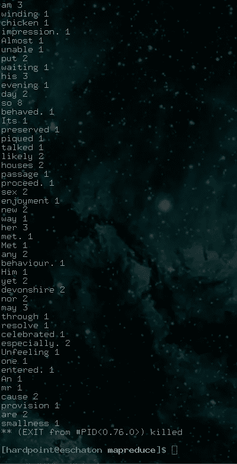

# 在 Elixir 中构建 MapReduce 流

> 原文：<https://medium.com/hackernoon/build-a-mapreduce-flow-in-elixir-f97c317e457e>

## 给大象一些药剂


MapReduce 是一种常见的大数据模式，用于同时分析数据集。本教程将向您介绍 Elixir 和 Hadoop 背后的原理。我们将在 MapReduce 中建立一个字数统计程序的 Hello World 的等价物。Map 和 Reduce 也是函数式编程世界中常见的高阶函数。Map 是一个函数，它将一个列表和一个匿名函数或 lambda 作为参数，将该函数应用于列表中的每个元素，并返回一个新列表，其中包含每个元素的 lambda 输出。Reduce 是一个类似的函数，它在 Elixir(一个累加器)中使用相同的参数和一个额外的参数，但是返回一个累加值而不是一个列表。Elixir 是学习并发性的好语言，MapReduce 既是一个有用的例子，也展示了 Elixir 的许多特性。

## MapReduce 流程

MapReduce 是数据流动和处理的管道。它可以被分解成大约 5 个步骤，对应于我们将在 Elixir 中编写的 5 个模块。我们的第一步是输入阅读器。它接收数据，将其分割成我们的 Map 流程可以读取的形式，并同时启动 Map 流程。我们的 Map 进程读取提供给它的数据，对每条数据运行一个函数，并向分区/比较进程输出一个键值对。分区进程从所有映射进程中累积键值对，比较这些键值对，并为每个唯一键生成 Reduce 进程。每个 Reduce 进程对每个值运行一个函数，将给定键的所有值相加，并将这些值发送到输出编写器。最后，输出编写器以您选择的格式生成数据。

## 步骤 0:设置

首先，确保您已经为当前系统安装了 Elixir。说明可以在[这里找到](https://elixir-lang.org/install.html)。从主站点[这里](https://elixir-lang.org/getting-started/introduction.html)可以获得对该语言的精彩介绍，hexdocs.pm 在这里提供了 Elixir 模块文档[。](https://hexdocs.pm/elixir/Kernel.html) [Learnxiny](https://learnxinyminutes.com/docs/elixir/) 还提供了优秀的 Elixir 语法入门。本教程假设很少或没有使用过 Elixir，但熟悉基本的编程概念和操作系统的命令行。这个项目的所有代码都可以在 [Github](https://github.com/torchhound/mapreduce) 上获得。

安装好 Elixir 后，使用`mix new`创建一个新项目。

```
mix new mapreduce --module MapReduce
```

接下来进入你的`mapreduce`目录，用`def project do []`中的这一行编辑`mix.ex`。

```
escript: [main_module: MapReduce]
```

## 第一步:父进程

一旦你有了一个新项目，在你的项目目录中导航到`lib/`，打开`mapreduce.ex`，它应该是由`mix`自动生成的。首先删除文件中除`defmodule MapReduce do` 和`end`以外的所有内容。让我们为稍后将要编写的模块添加几个导入到模块的顶部。

```
defmodule MapReduce do
  require InputReader
  require Partition
```

接下来，让我们创建一个主函数，并将它的参数传递给几个函数。 [Pipe](https://hexdocs.pm/elixir/Kernel.html#%7C%3E/2) ，`|>`，是一个操作符，其行为与 bash 的 Pipe 非常相似。

```
def main(args) do
  args |> parse_args |> pipeline
end
```

之后，让我们编写一个私有函数(用`defp`代替`def`来表示)来解析我们的命令行参数。这里我们创建了一个 tuple 类型的变量，它包含了`OptionParser.parse`的结果。我们的命令行参数是`--file=example.txt`，因此我们相应地在解析器函数的参数中设置开关。我们只需要解析器的第一个输出，我们将从`parse_args`返回，其他输出用下划线表示，表示我们不需要它们。

```
defp parse_args(args) do
    {options, _, _} = OptionParser.parse(args,
      switches: [file: :string]
    )
    options
  end
end
```

我们父流程的最后一部分是管道。第一个`pipeline` 函数是一个模式匹配案例，它检查一个空文件参数。下一个`pipeline`函数启动一个分区进程，但只将进程 id 存储在一个变量中。我们使用`elem`来给出通过启动我们的进程返回的元组的第二个元素，因为我们不需要 atom，`:ok`，第一个元素。然后，分区进程 id 和文件名被传递给我们将在下一步中编写的输入读取器。最后，我们使用一个递归函数`forever`，在 MapReduce 流程的其余部分执行时保持父流程的活动。

```
defp pipeline([]) do
    IO.puts "No file given"
enddefp pipeline(options) do
    partition = elem(Partition.start_link, 1)
    InputReader.reader("#{options[:file]}", partition)
    forever()
enddefp forever do
    forever()
end
```

## 步骤 2:输入阅读器

这个模块相当简单，它包含一个函数，该函数接受文件名和进程 id。该函数将尝试打开一个文件，如果失败，将向 STDERR 发送一条消息。如果我们的文件成功打开，我们将在文件的每一行执行一个函数。我们使用正则表达式来解析文件中的行，并将它们作为列表返回。`Enum.each`与 map 相同，除了它在成功完成时返回一个原子而不是一个列表。对于列表中的每一行，我们将使用行和分区进程 id 作为参数来映射进程。

```
defmodule InputReader do
  require Mapperdef reader(file, partition) do
    case File.read(file) do
      {:ok, body}      -> Enum.each(Regex.split( ~r/\r|\n|\r\n/, String.trim(body)), fn line -> spawn(fn -> Mapper.map(line, partition) end) end)
      {:error, reason} -> IO.puts :stderr, "File Error: #{reason}"
    end
  end
end
```

## 第三步:映射器

映射器模块很短，首先我们将当前映射进程的进程 id 发送给分区进程。这将使我们能够稍后在分区中检查我们的映射进程是否仍在运行。之后，我们将再次使用`Enum.each`将列表中的单词发送到分区进程，该列表是通过基于空格字符拆分每行而生成的。

```
defmodule Mapper do
  def map(line, partition) do
    send(partition, {:process_put, self()})
    Enum.each(String.split(line, " "), fn key -> send(partition, {:value_put, key}) end)
  end
end
```

## 第四步:分区

分区模块是我们将要创建的最复杂的模块。这里我们将使用`Task`模块，而不仅仅是`spawn`。我们使用`start_link`而不是`start`,因为我们希望当这个进程被终止时父进程也被终止。我们链接的进程依次是 MapReduce、Partition 和 OutputWriter。OutputWriter 将在退出自己的进程之前检查所有 Reduce 进程是否都已完成。这将退出所有链接的进程，一直回到父进程。我们在`start_link`中使用一个 lambda 来启动一个递归函数，该函数以 2 个列表作为参数。请注意，end 是关闭所有 lambdas 所必需的。

```
defmodule Partition do
  require Reducer
  require OutputWriter def start_link do
    Task.start_link(fn -> loop([], []) end)
  end
end
```

接下来我们将编写我们的递归`loop`函数。这将首先检查由我们的 Map 进程发送的邮件的邮箱长度。如果它已经处理了所有的消息，它将启动一个检查，看看我们是否应该启动我们的 Reduce 进程。我们使用`Keyword.delete`来删除混入键值对中的所有 null 或空白字符。注意使用了一个[符号](https://elixir-lang.org/getting-started/sigils.html)，`~s(\s)`，来表示一个空白字符。接下来，我们有一些模式匹配代码，用于检查所有接收到的消息中的特定元组。如果我们收到 atom `:processor_put`，我们将把调用者映射进程的进程 id 附加到递归`loop`调用中的进程列表中。如果我们收到的是 atom `:value_put`，我们将添加一个[关键字](https://hexdocs.pm/elixir/Keyword.html)，其中包含 Map 发送给我们的关键字和单词计数的值 1。任何其他消息都会产生错误。

```
defp loop(processes, values) do
  mailbox_length = elem(Process.info(self(), :message_queue_len), 1)
  if (mailbox_length == 0), do: (
    mapper_check(processes, Keyword.delete(Keyword.delete(values, String.to_atom(~s(\s))), String.to_atom("")))
  )
  receive do
    {:process_put, caller} ->
      loop([caller | processes], values)
    {:value_put, key} ->
      loop(processes, [{String.to_atom(key), 1} | values])
    error -> IO.puts :stderr, "Partition Error: #{error}"
  end
end
```

最后一块隔板是`mapper_check`。该函数检查是否所有的 Map 进程都是死的，如果是，则为每个唯一的单词启动 Reduce 进程。首先，我们使用`Enum.filter`返回一个列表`check`，其中包含所有仍在运行的进程。然后我们创建一个列表，包含每个唯一的关键字/单词。如果我们有一个非零数量的键，并且没有映射进程是活动的，那么我们`start_link`输出 Writer 并将其进程 id 传递给我们产生的每个 Reduce 进程。之后，我们在 unique 上使用`Enum.each`并使用`Keyword.take`提取每个 unique 的每个实例，然后生成一个包含所有这些实例的 Reduce 进程。

```
defp mapper_check(processes, values) do
    check = Enum.filter(processes, fn process -> Process.alive?(process) == true end)
    uniques = Enum.uniq(Keyword.keys(values))
    if (length(check) == 0 && length(uniques) != 0), do: (
      output_writer = elem(OutputWriter.start_link, 1) 
      Enum.each(uniques, fn unique -> spawn(fn -> Reducer.reduce(Keyword.to_list(Keyword.take(values, [unique])), output_writer) end) end)
    )
  end
end
```

## 第五步:减肥药

倒数第二个模块是我们的 Reduce 过程。这需要一个元组列表(键值对)和输出编写器的进程 id。与 Map 类似，我们向输出编写器发送 Reduce 的进程 id 来跟踪它的状态。然后，我们检查以确保`tuples`不为空，并且案例模式匹配。如果`tuples`不为空，我们将向输出编写器发送一个字符串。这个字符串可能看起来有点奇怪，但那是因为我们使用了 Elixir 的字符串插值语法`"#{}"`，来放置两个由空格分隔的表达式。让我们分解发送给输出编写器的字符串中的两个表达式。首先，我们使用之前见过的`elem`，使用`hd`或 head 从列表中的第一个元组获取密钥。列表中的所有键应该是相同的，所以我们使用哪一个并不重要。其次，我们使用`Enum.reduce`将来自键值元组的所有值相加，使用累加器作为`reduce`中的第二个参数和`reduce`中的 lambda。

```
defmodule Reducer do
  def reduce(tuples, output_writer) do
    send(output_writer, {:process_put, self()})
    case tuples do
      [] ->  IO.puts :stderr, "Empty List"
      tuples ->
        send(output_writer, {:value_put, "#{elem(hd(tuples), 0)} #{Enum.reduce(tuples, 0, fn ({_, v}, total) -> v + total end)}"})
    end
  end
end
```

## 步骤 6:输出编写器

这个模块应该看起来非常熟悉，因为它是 Partition 的一个稍微修改的版本。唯一的区别是在`reducer_check`中，我们打开一个文件，将每个单词及其计数写入 STDOUT 和我们刚刚打开的文件，然后关闭文件和整个进程链，一直返回到我们的父进程。一个重要的细节是使用`Path.join`为我们提供跨不同操作系统的一致文件路径。另一个是使用`<>`，它是 Elixir 的字符串连接操作符。

```
defmodule OutputWriter do
  def start_link do
    Task.start_link(fn -> loop([], []) end)
  enddefp loop(processes, values) do
    mailbox_length = elem(Process.info(self(), :message_queue_len), 1)
    if (mailbox_length == 0), do: (
      reducer_check(processes, values)
    )
    receive do
      {:process_put, caller} ->
        loop([caller | processes], values)
      {:value_put, value} ->
        loop(processes, [value | values])
    end
  enddefp reducer_check(processes, values) do
    check = Enum.filter(processes, fn process -> Process.alive?(process) == true end)
    if (length(check) == 0 && length(processes) != 0), do: (
      {:ok, file} = File.open(Path.join("test", "output.txt"), [:write])
      for value <- values do
        IO.puts value
        IO.write(file, value <> ~s(\n))
      end    
      File.close(file)
      Process.exit(self(), :kill)
    )
  end
end
```

## 测试和总结

恭喜你！您已经成功地编写了一个小而不平凡的灵药程序，它能做一些有用的事情。让我们做一些测试，然后我们就完成了。首先创建一个名为 test 的目录和一个包含随机文本的文件。我用[randomtextgenerator.com](http://www.randomtextgenerator.com/)给我的文件。接下来用`mix escript.build`编译您的项目。最后使用`./mapreduce --file=test/input.txt`运行您的代码。您应该会在命令行上看到数百行文本，如下所示。



Notice the exit message at the bottom.

最后打开您的`test`目录，应该会有一个新的文件名`output.txt`，其输出与您的命令行相同，只是退出消息不会在最后。

感谢阅读，如果这篇教程对你有帮助，请留下一个或几个掌声！

***Joe Cieslik 是 Whiteboard Dynamics 的 CEO，这是一个专门从事函数式编程和 Android 的全栈开发团队。您可以在***[***【whiteboarddynamics.co】***](https://whiteboarddynamics.co/)***了解更多关于我们的信息、我们如何帮助您以及我们过去的项目。***