# 使用 Spotify API 创建一个 React Shuffle 博客

> 原文：<https://medium.com/hackernoon/build-a-react-shuffle-blog-using-the-spotify-api-d5498d47c47b>

# TL；博士:

[React Spotify 博客演示](https://cosmicjs.com/apps/react-spotify-blog)
[React Spotify 博客源代码](https://github.com/cosmicjs/react-spotify-blog)

**先决条件**

我们在这个项目中使用了 Node JS 和 npm，所以在我们开始之前，请确保您已经安装了它们。我还将对 React、CSS Grid 或 Flexbox 有所了解，所以在开始之前最好先熟悉一下，没有 ES7 async/await 来处理 AJAX 请求之类的异步代码，我就活不下去。如果这些术语中的任何一个对你来说听起来很陌生，我都不会高度推荐来自[韦斯·博斯](https://wesbos.com/)的教程——他是我所知道的最聪明、最有魅力的加拿大人！

最后，如果你真的想按下播放键听音乐，你需要一个 Spotify 高级会员。如果你没有一个也可以——你只需在 Spotify 中手动打开你的播放列表，然后打开我们制作的新播放列表。

**计划好了**

我是一个守旧派，所以我总是喜欢从一张纸开始，准确地计划出我想要的东西的样子和用途。但是我的书写很糟糕，所以我的论文基本上是这样的:

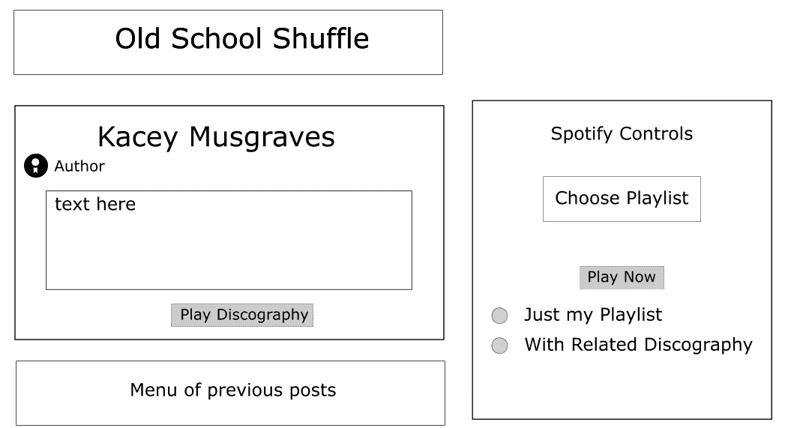

我想要两个主要功能:首先，我希望能够向我最喜欢的艺术家之一致敬，并有一个按钮直接连接到他们在 Spotify 上的专辑播放列表，这样读者就可以立即开始收听。也应该有一种方法让他们阅读关于其他艺术家的帖子。其次，我认为 Spotify 不让你按专辑进行原生洗牌是犯罪行为(你应该如何进入艺术家的最佳状态？)所以用户应该能够按照专辑来打乱自己的播放列表。如果他们只有一张专辑中的几首歌曲，他们也应该能够自动引入该专辑中的其他歌曲。

使用 React 时的另一个关键计划步骤是列出您将需要的组件。组件是用户界面的小模块，它们可以组合在一起构成完整的用户界面。不是每个元素都必须是它自己的组件，但是我们希望得到主要的东西。根据我的图纸(粗略的线框)，我们需要大约 7 个组件:

**应用程序/容器/包装器**

**特色艺人贴**

作者

**菜单选择其他岗位**

**Spotify 容器**

连接组件(当用户尚未登录时)

播放列表选择器

**挑选合适的工具**

现在我知道了我想要什么，下一步是看看是否有任何现有的工具或库给我一个好的开始。有几个，所以很多工作是为我们做的！

*   Cosmic JS:优秀的内容管理系统，向我们的应用程序公开一个简单灵活的 API 和数据。Cosmic JS 比 Wordpress 之类的东西更简单、更轻便，但给了我们以后添加新艺术家纪念的灵活性，而无需重新部署应用程序。
*   create-react-app:我是 react 的人，但是像这样为一个单页应用程序设置所有的配置可能会很复杂。脸书有一个很棒的回购和工具，叫做 [create-react-app](https://github.com/facebook/create-react-app) ，可以随时定制。
*   CSS Grid，Flexbox:说到 CSS，我不是老派:Grid 和 Flexbox 比老派更容易预测 float:left。我喜欢用实际上有意义的 CSS 系统开始一个新的项目
*   Material-UI:扁平设计和[材质 UI](https://material-ui.com/) 风靡一时，由于我不太喜欢演示，所以有一些像样的基于 react 的设计组件是很好的。
*   Spotify API: Spotify 拥有最干净、记录最完整的 REST APIs 之一。在 javascript 前端使用 JMPerez 的优秀包装器库 [spotify-web-api-js](https://github.com/jmperez/spotify-web-api-js) 会更容易

**从创建-反应-应用开始**

让我们从克隆 create-react-app 开始。他们在[回购](https://github.com/facebook/create-react-app)有简单的说明。如果您的 npm 版本是 5.2 或更高版本，您可以打开终端，导航到项目的新目录并键入。

我正在运行 npm 版本 4.2.0，因此我必须先安装 create-react-app 命令行工具(CLI 工具)，然后使用 CLI 工具创建应用程序。记住，一旦完成，还要执行 git init，这样就可以保存您的工作。

使用 npm start quick 启动示例，以确保一切正常。如果它看起来像这样，那么伟大的工作！如果没有，你将会有一些问题…我不喜欢 create-react-app 给我们的文件结构，所以我喜欢修改它，把我们的组件放在 src 下它们自己的子文件夹中。这样，我们可以在 src 中保存不直接影响 UI 的帮助文件，并将组件放在它们自己的文件夹中，这样它们更容易浏览。

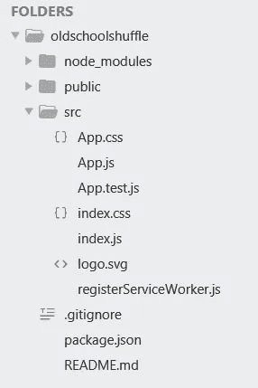

create-react-app 默认文件结构

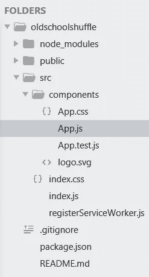

我的首选文件结构

如果您执行相同的操作，请记住进入 index.js 并更改 App 组件的导入引用，以便 index.js 可以在 new components 子文件夹中找到它。

**在**中设置结构

让我们先用一些虚拟组件设置整体结构，然后我们可以逐个深入研究。我们只是将组件重新定位为我们的顶级包装器。把 JSX 代码取出来，换成这个:

JSX/HTML 代码只告诉浏览器元素是什么，所以我们需要一些 CSS。我们将使用 CSS 网格来布局一个类似于线框的结构。针对 800 像素以下屏幕的媒体查询将所有内容都放在一个移动列中。现在让我们把这段代码复制到 App.css 中，评论会解释一些亮点。

让我们看看！使用 chrome devtools 并高亮显示会显示网格。我们做 5 行而不是 3 行的原因是因为我们希望 Spotify 播放器能够从页眉到页脚，但在左侧，我们希望特色帖子有 2/3 的垂直空间，其他帖子只有 1/3。我们可能有 4 排，但 5 排对我来说是对的。

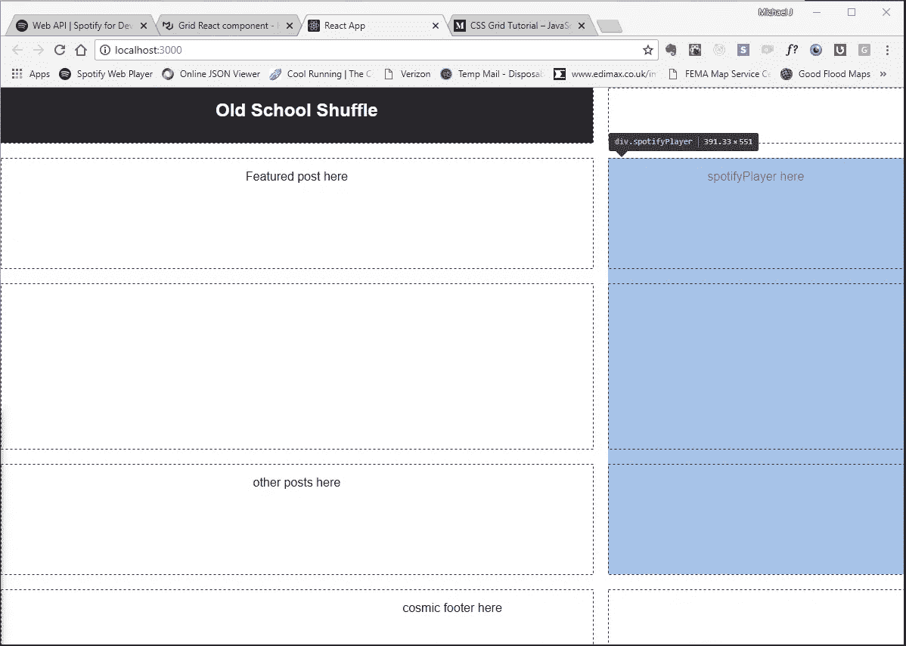

好吧！让我们构建第一个真正的显示组件:首先，让我们从 Material UI(又名 Mui)中获得一些漂亮的组件。他们的[入门](https://material-ui.com/getting-started/installation/)页面会带我们浏览。首先，我们需要安装他们的节点包。

我们还需要将 Roboto 字体添加到我们的 index.html 中，这样一切都可以正常显示。

Mui 有一个很棒的背景组件，叫做 Paper，类似于引导面板。他们还为标题和副标题使用了排版组件。它看起来很经典，而且我听说如果你想改变你的外观，使用排版可以更容易地应用他们的“主题”。

让我们继续在我们的组件文件夹中创建两个文件:FeaturedPost.js 和 FeaturedPost.css。我通常复制 App.js 和 App.css，只需将' App '替换为' FeaturedPost ',然后编辑，但您的调用。这些文件应该是这样的:

如果我们在同一个地方，应用程序应该是这样的:

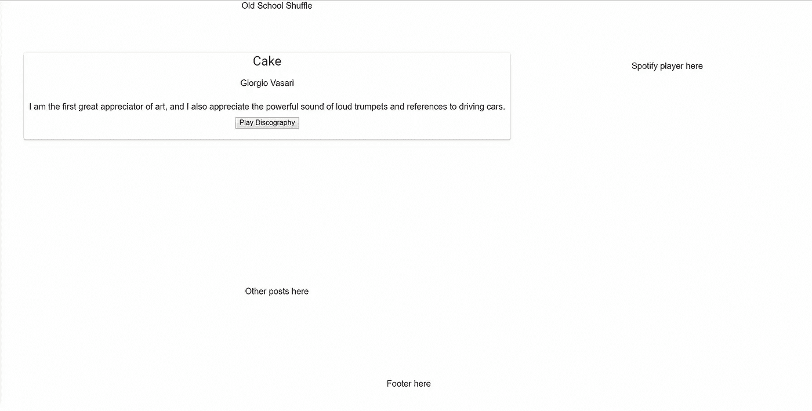

好的，太好了。但是没有比静态内容更无聊的了。我们把一些数据连接到这个东西上怎么样？数据意味着内容，这意味着我们已经准备好建立宇宙 JS 了！

**从 Cosmic JS 获取动态内容**

Cosmic JS 是一个后端内容管理系统，为我们提供了最好的应用程序开发和内容。在内容方面，我们得到了类似 Wordpress 界面的所有便利，营销团队或博客可以使用它来轻松地添加新帖子、作者或他们喜欢的任何东西。实际上，我发现 Wordpress 更容易，因为它更干净、更简单。但在应用程序开发方面，我们得到了一个非常干净、简单的 json-API，我们可以将它放入我们的 crisp React 应用程序(或任何其他您喜欢的框架)。我们不必处理 php 和插件，以及 Wordpress 强加给我们的所有杂乱的东西，这些东西会使网站膨胀。耶！

首先，我们在[宇宙 JS](https://cosmicjs.com/) 创建一个新的免费账户。您必须验证您的电子邮件，或者您可以使用 GitHub 登录。我推荐使用 GitHub，以便以后更容易部署。

一旦你设置了你的帐户，你需要创建一个新的桶，这基本上是我们的应用程序的所有内容数据将去的地方。您将为桶使用一个唯一的名称(我使用了 oldschoolshuffle)。选择从头开始并保存存储桶。

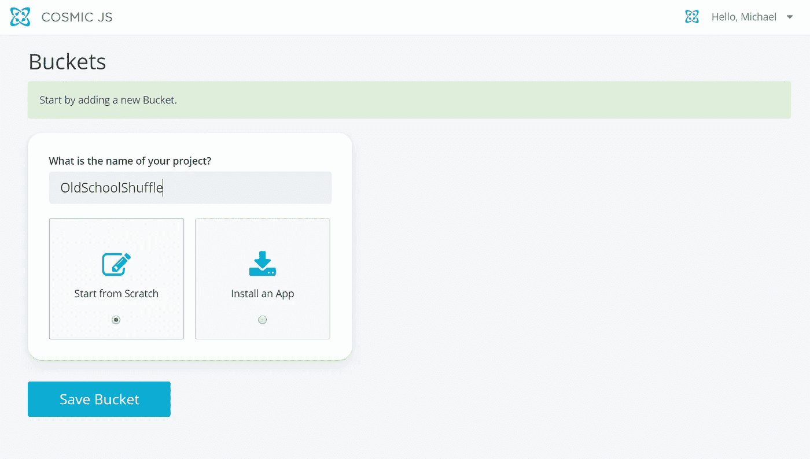

在一个存储桶中，数据被组织成对象、对象类型和文件。这是一个非常轻便灵活的系统。这些分别是什么？

*   对象类型基本上是模式:它们描述了你可能想在你的应用程序中使用的一类东西，以及知道关于那个东西的什么细节是重要的。在我们的情况下，我们需要帖子，我们需要作者来写这些帖子。如果你正在做一个关于世界地理的应用程序，你可能有一个国家对象类型，或者如果你正在做一个旅行社应用程序，你可能有一个飞机航班或酒店的对象类型。重要的是，一个对象类型有元字段(属性),包含你想知道的关于该类型事物的所有信息。
*   对象是你可能想在应用中引用的任何离散的东西。关于凯茜·玛斯格蕾芙斯的帖子是 post 对象类型的对象。奥斯汀到波士顿的 AA2345 航班可能是旅行社应用程序中航班类型的对象。
*   文件是您可能需要使用的媒体或二进制文件(有时称为“静态”文件)。通常这些是图片，但也可能是可下载的内容、白皮书、MP3 或其他任何东西。

你也可以设置多个用户，但是这个意义上的用户是指在 Cosmic JS 中有权限修改东西的人(比如你作为一个开发者，或者一个博客作者)，而不是你的应用中的用户。

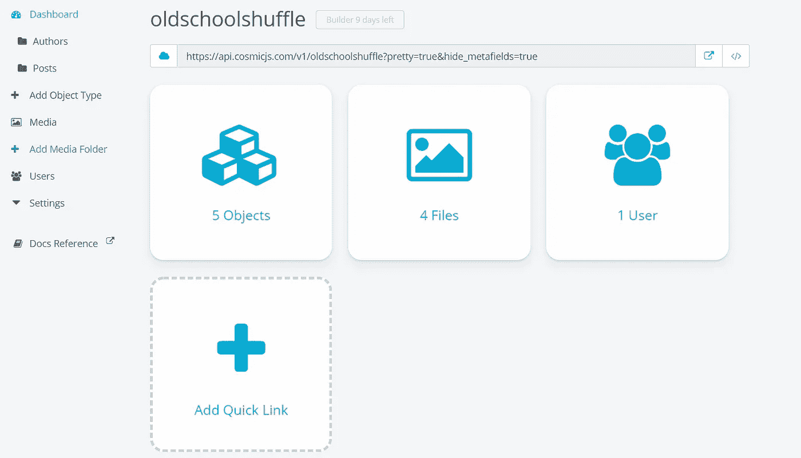

我们将首先为作者设置我们的对象类型，因为我们希望每个人都知道谁喜欢老派的倾听。基于我们的线框一个作者需要一个名字和一个头像图像，所以我们有更多的天赋。点击左边菜单中的“添加对象类型”,然后在“基本设置”下，为单数名称添加作者，为复数名称添加作者。

接下来，单击元字段模板选项卡。每个对象类型都会自动获得一个标题和一个内容元字段，所以我们不需要添加一个标题元字段，但是我们需要为头像添加一个元字段。点击蓝色加号，你会看到一个不同类型的元字段菜单。我们想要一个图像，所以选择它。

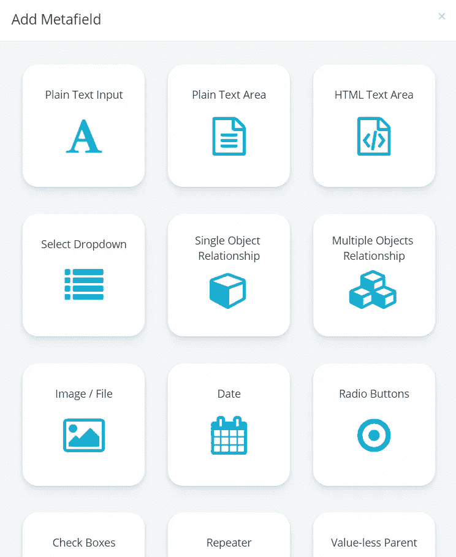

请记住，我们还没有确定一个具体的作者，所以除非你想设置一个默认值，否则请抵制拖放图片的诱惑。更重要的是，我们将标题设置为 avatarImage，这样我们可以在以后为它分配内容。我喜欢 camelcasetowrithings thillhavetoseinmycodelater，但在这种情况下你不必这样做，因为 Cosmic JS 会自动分配一个我们将在代码中使用的键。

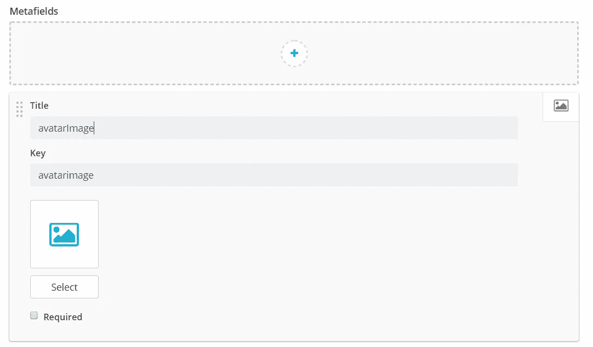

完成后，单击保存对象类型按钮。现在我们可以创建两个特定的作者。现在，您应该会在左侧菜单下看到一个新的 Authors 文件夹。点击它，你应该有一个空白部分和一个添加作者按钮。我建议你点击那个按钮。

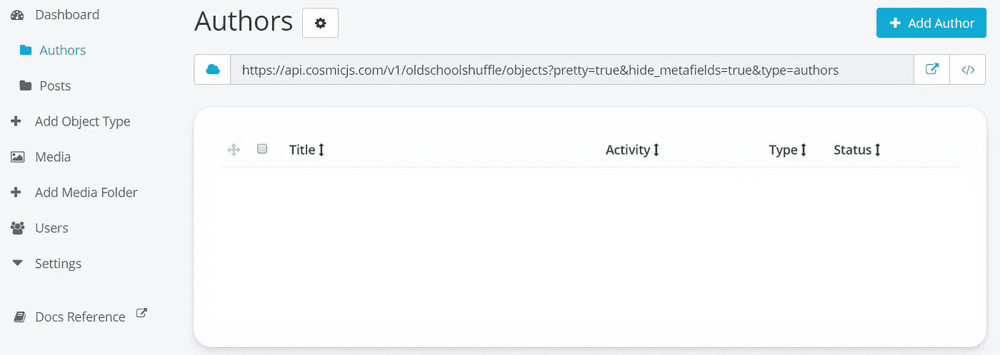

干得好！把作者的名字(我用埃尔维斯·考斯特罗)作为标题。您还会看到我们在 Object 类型中创建的 avatarImage 元字段继续存在，现在我们可以选择一个图像，比如一个老式的 RV 拖车，用作头像。

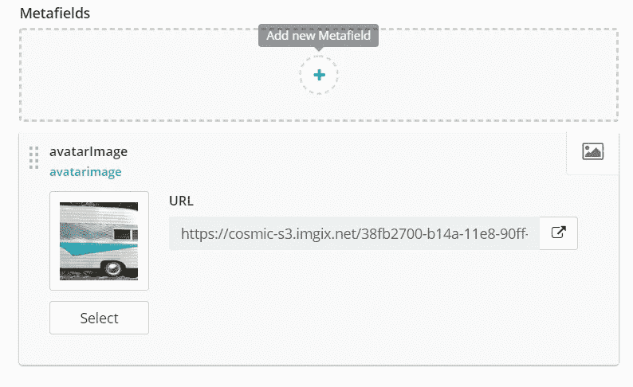

当我们完成后，按下发布按钮保存该作者并关闭屏幕。

对第二个作者做同样的事情，只是为了好玩。然后我们需要通过再次点击菜单中的 Add Object Type 为我们的文章构建对象类型。将 Post/Post 设置为单数/复数，然后转到图元字段模板选项卡。

我们为帖子添加了两个元字段:spotifyArtistId 和 author。第一个是 spotifyArtistId，它将是一个纯文本输入，我们将在那里存储一个唯一的 Id，Spotify 使用它来识别 API 中的音乐艺术家。

第二个元字段(author)将是一个单一对象关系元字段，这意味着我们将把帖子与我们前面创建的对象类型的单一作者连接起来。

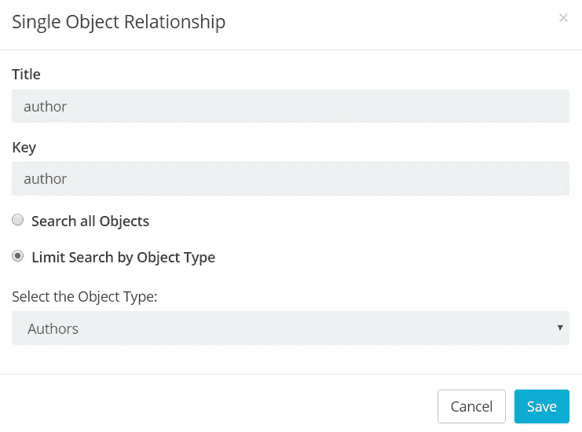

确保为“作者”元字段选择“按对象类型限制搜索”，并从下拉菜单中选择“作者”。一个帖子是一个帖子的作者是没有意义的。完成后，单击保存对象类型，我们将返回到控制面板。

亲提示！如果你在作者之前发帖(操之过急！)您可以返回并编辑您的 Post 对象来添加 author 元字段。从菜单中选择文章，然后单击齿轮图标。我花了一段时间才想明白！

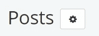

好了，现在我们只需要发几个帖子，然后我们就可以完成初始的内容设置了！点击帖子，然后 App 帖子，我们来创建 3。使用艺术家的名字作为标题，在内容部分表达你对他们的敬意(去吧，我会等着)，并从下拉菜单中为每个人选择一个作者。请注意，内容区域是支持 HTML 的，因此您可以在其中发挥一点创造力。您还需要 spotifyArtistId，它看起来像这样:70kkdajctXSbqSMJbQO424。您可以在这里查找您最喜欢的艺术家的 id，或者您可以使用这些:

*   凯茜·玛斯格蕾芙斯:70kkdajctXSbqSMJbQO424
*   瑞安·宾汉:31z9f9AyPawiq0qlBO1M3i
*   Ted Leo: 5hbH3dvtk49g07qpc1QwPe

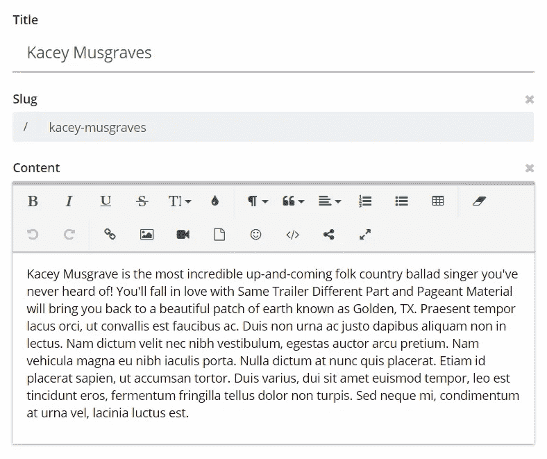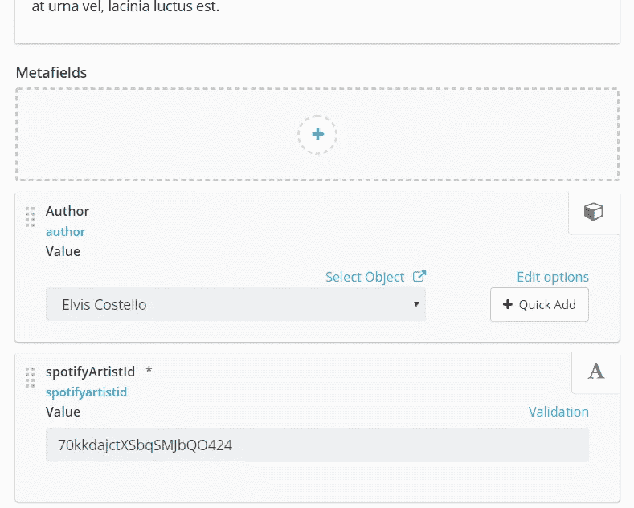

我们终于完成了内容！多好的脑力锻炼啊。让我们回到一些简单的事情上，比如用第三方数据编写移动响应单页面应用程序。

**连线宇宙 JS 内容**

首先:如果你对 React 感到不舒服，你现在应该停止阅读，去看看韦斯·博斯的 [React 初学者](https://reactforbeginners.com/)课程，你将真正成为一名专家。就像我们在网格 CSS 方面所做的一样，我将努力保持最高水平。

听起来不错吧？好了，让我们从 React 中所有好的东西开始的地方开始——在我们的顶层组件。在 React 中，一切都与状态(组件的内部条件)和属性(传递给子组件的数据或函数)有关。让我们添加一个构造函数到。

state 中的属性是我们将从 Cosmic JS 中获得的一切，以使博客/敬意成为这项工作的一部分:

*   dataReceived 将从 false 开始，在我们从 Cosmic JS 中获取数据后变为 true。这让我们等到获得正确呈现文章所需的数据后再呈现文章。
*   posts 是一个数组，我们将在其中存储从 Cosmic JS 获得的所有帖子。
*   authors 是一个数组，我们将在其中存储所有来自宇宙 JS 的作者。
*   featuredPostIndex 是一个整数，我们将使用 posts 数组来确定在特色文章组件中显示哪个文章。其他职位将在“其他职位”组件中列出。
*   其他帖子将始终是帖子的子集，不包括任何当前有特色的帖子。

现在，我们需要将 React 应用程序连接到我们的 Cosmic JS API，并获取我们在 CMS 中输入的数据。React 组件真的不应该做太多繁重的工作，所以为了模块化和可读性，转到 src 文件夹并添加一个名为 cosmicFunctions.js 的新文件(这将在组件目录之外)。

Cosmic JS 在 npm 上提供了一个非常方便的节点模块，可以轻松获取我们需要的数据，而无需处理 CORS(跨源请求)问题或 ajax 请求。让我们先用 npm 安装它。

我们还需要添加一个. env 文件，以我们的 Bucket 命名(也称为 slug)。您不希望在代码中暴露这些敏感数据，所以我们将它们存储在一个环境变量中，您不需要将它上传到您的公共存储库中。幸运的是，create-react-app 使这变得很容易，所以您只需要在根目录下创建一个. env 文件。确保它在根目录中，而不是在您的 src 目录中，并且以点开始。我们还需要以 REACT_APP_ 开始变量名，否则 create-react-app 会忽略它。

如果你不知道你的桶蛞蝓点击设置->基本设置在你的宇宙 JS 仪表板，你会看到它在第二行。

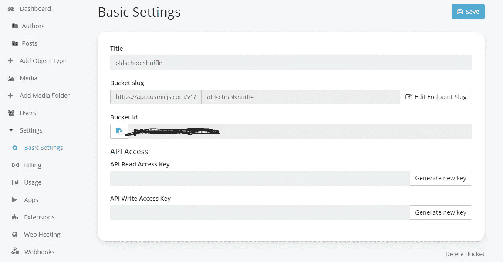

现在我们已经设置好了，我们将把 Cosmic JS 节点模块导入到新的 cosmicFunctions.js 文件中，并添加两个函数 getCosmicJsData 和 organizeCosmicJsDataByObjectType。

我们来看看 getCosmicJsData。首先，在定义函数之前，您会注意到 export async。导出让我们稍后可以使用这个函数。async 使我们能够在函数中使用异步方法，在我们的例子中是对 Cosmic JS 的 ajax API 请求。异步意味着我们向 API 发送一个请求，开始我们的业务，当我们得到一个响应时，我们的应用程序将返回函数并使用数据。

这个异步的东西曾经是一个真正的[痛苦](http://callbackhell.com/)在[对接](/javascript-scene/master-the-javascript-interview-what-is-a-promise-27fc71e77261)中，但是现在我们可以简单地把关键字 await 放在任何异步方法之前，代码会自动等待一个有用数据的响应，然后继续。太牛逼了。

让我们仔细看看第 10 行:

哇，那里发生了很多事。逻辑是这样的:bucket.getObjects()是一个异步方法，它告诉 Cosmic JS 向我们发送他们拥有的所有东西的有效载荷。因为我们没有太多的数据，所以最简单的方法就是现在(当页面第一次加载时)从 API 中获取所有数据，然后自己进行排序。和 API 一样，许多有效负载的[是我们不需要的元数据。因此，我们将该调用放在括号中，只取它的 objects 属性，这是我们拥有的所有帖子和作者的数组。](https://api.cosmicjs.com/v1/oldschoolshuffle?pretty=true&hide_metafields=true)

现在我们有了所需的数据，这些数据是我们所有对象类型的混合体，但是为了在我们的状态中干净地存储这些数据，我们希望更加有组织性。这就是我们将 arrayOfAllObjectsInBucket 传递给 organizeCosmicJsDataByObjectType 函数的原因。它映射整个数组，并根据不同的对象类型和该类型对象的数组返回带有键的对象。我们可以只查找帖子和作者，但这种方式更灵活，如果我们决定将帖子重命名为 HomagesToGreatness 或类似的名称，就不需要更改。

无论如何，转换后的数据看起来像这样:

看看那会给我们州带来多大的好处？让我们把它钩起来！React 组件内置了[生命周期](https://reactjs.org/docs/state-and-lifecycle.html)方法，我们可以告诉它在加载、关闭、重新渲染等时做什么。将外部数据装入组件的最佳时间是在组件首次装入 [DOM](https://css-tricks.com/dom/) 之后(如果您不知道 DOM 是什么，您现在应该离开了)所以让我们添加一个 componentDidMount 方法，并将 getCosmicJsData 函数放入其中。

这段代码的几个要点是:

*   记住，您必须导入我们的 cosmicFunctions 助手库来访问 getCosmicJsData。这也是一个目录，所以你必须使用[../](https://stackoverflow.com/questions/7591240/what-does-dot-slash-refer-to-in-terms-of-an-html-file-path-location)
*   componentDidMount 必须是异步函数。它包含 getCosmicJsData，它必须是异步的，因为它包含 bucket.getObjects()，后者本来就是异步的。
*   我尝试总是将异步代码包装在 try/catch 块中，因为你永远不知道它们是否会失败。
*   奇怪的 const {posts，authors} = …格式是 [ES6 析构](https://wesbos.com/destructuring-objects/)，基本上和 posts = someObject.posts 一样，析构对于分解对象很棒。
*   在 React 中，除了在构造函数中，永远不能将属性赋给 this.state。这样做违反了一个叫做[不变性](https://reactjs.org/docs/update.html)的概念，但是足以说它破坏了 React。相反，您总是使用 this.setState 和 React 为您处理它(谢谢 React！)

让我们也来看看这条粗糙的线:

这是怎么回事？简而言之，它告诉我们在收到我们需要的数据之前不要渲染。React 将此称为[条件渲染](https://reactjs.org/docs/conditional-rendering.html)，它可以防止难看的空白组件或错误。

实际上，它只是一个三元运算符，如果 this.state.dataReceived 为真，则传递 JSX React 组件，否则呈现一个空字符串。由于我们更新了这个. state . data，componentDidMount React 现在知道何时显示 FeaturedPost 是安全的。

最后一件可怕的事情:

我们之前制作的 React 组件也是如此。它需要 Post 对象中的数据来显示艺术家姓名和敬意。this.state.posts 是我们从 Cosmic JS 得到的 Post 对象数组。

this.state.featurePostIndex 只是一个数组索引，用来挑选数组中我们感兴趣的帖子，比如 posts[0]。所以我们所做的就是识别一个 Post 对象，并将其作为一个名为 Post 的属性(props)传递给 FeaturedPost。这样我们可以使用子组件中的数据，即使我们在父组件中获得了数据！

让我们继续实际显示数据。

**展示我们对凯茜·玛斯格蕾芙斯的敬意**

让我们直接进入代码，在这里潜水。我们将修改之前编写的代码，从我们刚刚传递的 post 属性中获取数据。

我们还不会处理播放唱片目录按钮，但是我们用{this.props.post.title}替换了艺术家蛋糕，所以现在我们得到了动态的帖子标题/艺术家姓名。我们还用动态内容替换了内容，但它更复杂，因为来自 Cosmic JS 的内容元字段是 HTML，而不仅仅是简单的文本。

react[非常怀疑](https://reactjs.org/docs/dom-elements.html)将外部来源的 HTML 直接注入你的应用程序，因为这是一个重大的安全风险，但我们对此没有意见，因为我们控制着我们的宇宙 JS 数据，因为这只是一个示例应用程序。要使用外部 HTML，您必须在 div 元素上使用 dangerouslySetInnerHTML 属性，还必须向它传递一个唯一格式化的对象，而不仅仅是作为常规字符串的 HTML 代码。基本上，他们使它变得很麻烦，所以你不会做错。

我们还看到一个新组件，它也传递作者姓名和图片。你的父母给了你什么，总有一天你会传给你自己的孩子。

非常简单，所以我们只需要复制代码。请记住，您需要在组件目录中为 Author.js 和 Author.css 创建文件，并记住在 FeaturedPost.js 的顶部导入 Author.js。

做一个 npm 启动，看看它看起来像什么。希望是这样的？

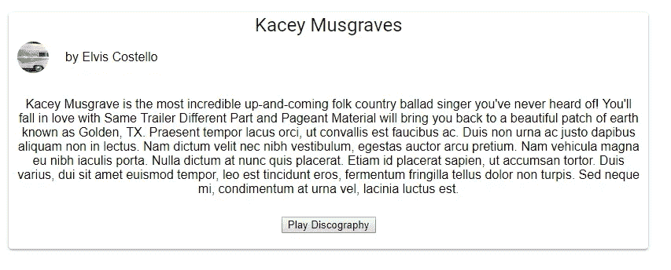

[轰沙拉卡拉卡](https://www.urbandictionary.com/define.php?term=boom%20shakalaka)。快完成内容了！不幸的是，这可能是内容中最棘手的部分。

让我们分两部分来做。在我们获得动态之前，让我们使用 Material UI 的扩展面板组件来布局一个基本的哑组件。这意味着在组件目录中创建 OtherPosts.js 和 OtherPosts.css 文件。我们还需要进入组件，用新创建的虚拟组件替换占位符文本。代码如下:

很多代码，但没有太可怕的。扩展面板的东西看起来很奇怪，但它的结构基本上是一样的

*   带嵌套
*   元素和一个标签。如果这一切都正常，你应该有一个干净的可点击面板，展开显示我们的虚拟职位。

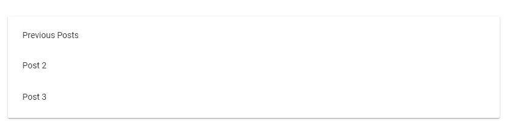

*   让我们把数据放进去。当我们更新时，我们把其他帖子的道具传给了。因为 otherPosts 是其他帖子的数组，所以我们应该能够通过将[映射到 other posts 数组并使用来自每个帖子的数据来替换我们的虚拟元素。让我们现在就开始吧:](https://reactjs.org/docs/lists-and-keys.html)

那还不算太糟。使用{postObject.title}输入文章名称很简单。唯一令人惊讶的部分是这个关键属性，我们在其中加入了数组索引，这在我们的虚拟组件中是没有的。原因是 React 使用[键](https://reactjs.org/docs/lists-and-keys.html)属性来区分具有相同父元素的相似元素(比如

*   元素)，所以我们需要一个惟一的键来帮助反应，使它们保持直线。

*   这并不比。那么为什么我认为是如此棘手呢？嗯[威尔伯](https://en.wikipedia.org/wiki/Mister_Ed)，难道我们不希望你能够点击另一个帖子并改变吗？哪个帖子被点击看起来像是。等等，是一个不同的组件…这意味着我们正在通过状态上游！我们到底要怎么做？
*   这是心理柔术——你不要错过这个状态。还记得住在父(ie)里的 this.state.featuredPostIndex 吗？您在中编写一个方法来更改该状态，并将该方法传递给。
*   有多元？想要更具体的东西吗？我们来编码吧。首先:

这里需要注意一些变化:

添加了 changeFeaturedPost 方法:这是我们将传递给它的方法。然后可以使用帖子的正确索引调用该方法。这将依次改变 state.featuredPostIndex。因为将 state.featuredPostIndex 传递给，所以会更新。简单的像馅饼！

将所有帖子传递给:将需要所有帖子的数组，以便它可以确定所选帖子的索引。我们一会儿会解释更多细节。

将 changedFeaturedPost 方法传递给:通过传递函数本身，而不是状态，我们使能够调用它。请记住将它作为一个箭头函数传递，而不仅仅是{this.changedFeaturedPost}，否则 React 将会混淆，单击帖子将返回函数本身，而不是函数的结果。

现在让我们更新

橡胶终于带着那个漂亮的手柄咔嚓方法上路了！事情是这样的:

首先，我们必须将 handleClick 方法传递给 Post 的 onClick 方法。记住 onClick 是一个事件监听器，所以即使我们不使用它，你也必须传递事件。

这个方法在一篇文章被点击时被调用，并接收被点击的文章的 Post 对象。

为了调用我们传递来的 changeFeaturedPost 方法，我们实际上需要查看所有帖子的数组(这就是为什么我们将它作为 props.allPosts 传递来),并返回与刚刚被点击的帖子相匹配的索引。Javascript 有一个很棒的 [array.findIndex](https://developer.mozilla.org/en-US/docs/Web/JavaScript/Reference/Global_Objects/Array/findIndex) 函数，我们可以在其中定义对象属性(在我们的例子中，我们正在寻找并返回索引。

一旦我们有了那个索引，我们只需用它调用我们传递的 changeFeaturedPost 方法，瞧——React 做剩下的事情！

如果一切顺利，我们现在应该能够点击一个帖子，看到被点击的特色帖子的变化，以及我们的其他帖子列表的调整。

*   在使用 Spotify 之前有一点:你不是唯一一个讨厌在组件之间传递函数的人。这个应用程序很简单，但对于有十几个组件的应用程序，我强烈推荐使用 [Redux](https://redux.js.org/basics/usagewithreact) 来管理你的状态和道具。这个想法基本上就像在一个地方有一个包含所有属性和函数的库，然后每个组件都有一个库卡来获取它需要的任何函数。这需要大量的设置，但是一旦你克服了最初的障碍，这是非常值得的。你也可以看看[反应环境](https://reactjs.org/docs/context.html)作为问题的另一个解决方案。
*   **第二部分 Spotify 整合的攻击**
*   我们现在将从我们的老学校 Shuffle 应用程序的第二部分开始，这是与 Spotify 的集成。我们再次从一张纸上的头脑风暴开始，但这一次我们将首先关注后端，最后处理前端组件。我们需要用 Spotify 做些什么？
*   Spotify 计划

我需要 API 做什么？

访问用户的 Spotify

获取他们的播放列表

获取特定播放列表的曲目

获取特定播放列表的专辑

获取特定专辑的曲目

创建播放列表

无序播放播放列表

播放特定艺术家的唱片目录

获取艺术家的专辑

这些工作是否已经完成，并且可以在此基础上进行构建？

是啊！JMPerez 的优秀 [spotify-web-api-js](https://github.com/JMPerez/spotify-web-api-js) 包装器库！

**向 Spotify 注册您的应用**

*   Spotify 有一个真正的全启动 API，它有非常好的文档记录，他们用他们的 [Web API 教程来指导开发者，但是我们会试着快速开始。首先，你必须有一个 Spotify 听众帐户，如果你在这里，你可能已经有了。之后，你需要去你的](https://developer.spotify.com/documentation/web-api/quick-start/)[仪表盘](https://developer.spotify.com/dashboard/login)注册成为开发者，并通过获取客户端 Id 注册你的应用。
*   登录后，控制面板如下所示:

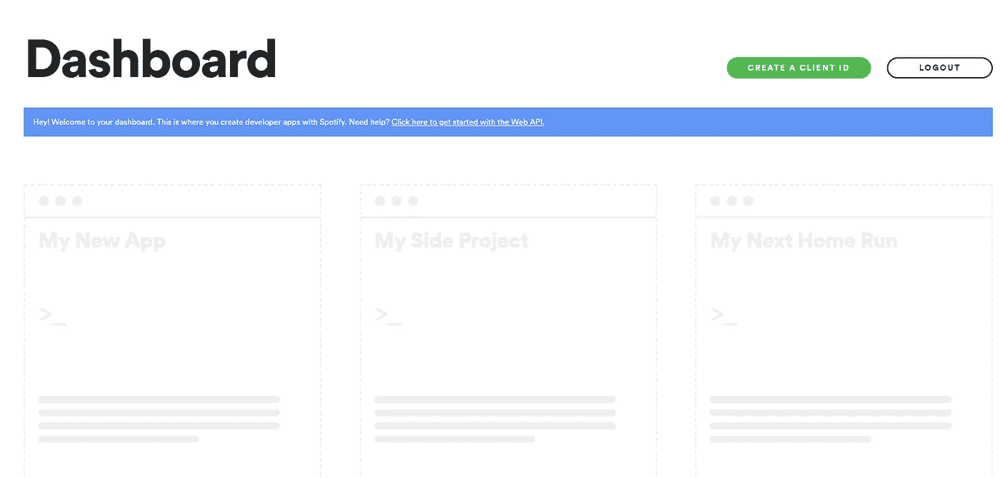

*   他们会带你注册应用程序并获得一个客户端 Id。如果你在做一个非商业应用(像这样的开源应用)是免费的，但我认为他们会对商业访问收费。完成后，您会在仪表板上看到一个客户 Id。

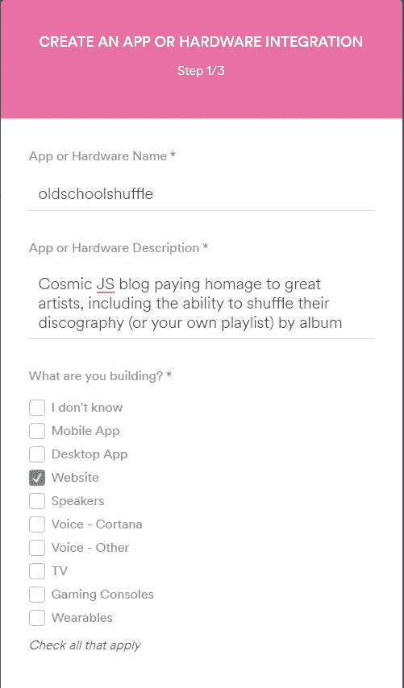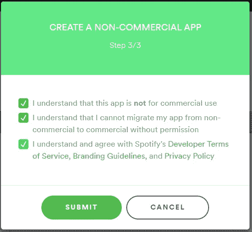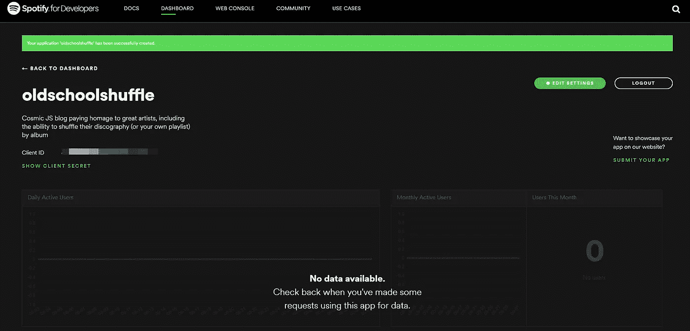

*   我们将需要那个客户 Id(我把我的 Id 弄模糊了)，所以继续把它保存在你的。env 文件格式为 REACT_APP_SPOTIFY_CLIENT_ID。如果你没有这样做作为设置的一部分，我们还需要为我们的应用程序设置一个“重定向 URI”。单击仪表板中的“编辑设置”按钮，您应该会看到一个弹出窗口，如下所示:

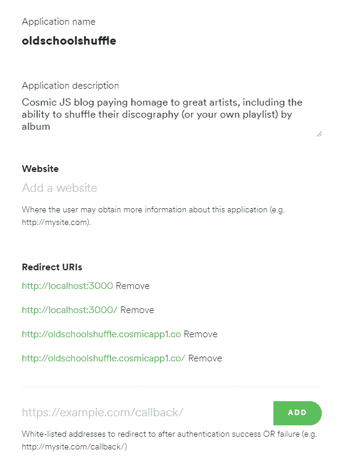

*   稍后，您将需要添加您的开发环境(如果您使用 create-react-app，应该是 [http://localhost:3000](http://localhost:3000/) )以及您的生产环境 URL。把它保存在你的。env 文件也可以作为 REACT _ APP _ SPOTIFY _ DEVELOPMENT _ REDIRECT _ URI 和 REACT _ APP _ SPOTIFY _ PRODUCTION _ REDIRECT _ URI。你可以在你的宇宙 JS 仪表板中检查你的生产 URI。
*   当我们发送登录请求时，Spotify 将使用重定向 URI 来确认确实是我们。现在你的。env 文件应该看起来像这样:

在我们进行设置的同时，让我们继续安装带有 npm 的 [spotify-web-api-js](https://github.com/JMPerez/spotify-web-api-js) ，以及我们将使用的一些特定的 [Lodash](https://lodash.com/docs/4.17.10) 助手函数。

让我们也在 src 目录中创建一个 spotifyFunctions.js 文件(在 cosmicFunctions.js 旁边)。不过里面会有很多代码，所以我们先导入我们的库，然后再讨论 Spotify 的认证是如何工作的。

**认证**

*   授权是每个 web 开发人员都害怕的事情之一。您必须一直这样做，但是这往往是跨源(CORS)错误、OAuth2 服务器、Json Web 令牌(JWT)、握手令牌、刷新令牌和授权 HTTP 头的雷区。
*   所有这些都是可行的，但是它们让我有点想吐，尤其是在一个小的演示应用程序上。Spotify 支持 [3 种不同的认证方法](https://developer.spotify.com/documentation/general/guides/authorization-guide/)，但我们很幸运，他们提供了一个隐式的授权流。这不是很安全，但我们谈论的是音乐播放列表而不是银行账户，而且它只能用一个小时，所以你只能引起太多的麻烦。它对我们来说非常完美，因为它不需要任何服务器端代码。这很方便，因为默认情况下，create-react-app 会隐藏快速路线。您可以用它来设置一个[代理服务器](https://medium.freecodecamp.org/how-to-make-create-react-app-work-with-a-node-backend-api-7c5c48acb1b0)，但是对于这个认证来说，这似乎有点过了。
*   这是 Spotify 关于隐式 Grant 如何工作的图表。

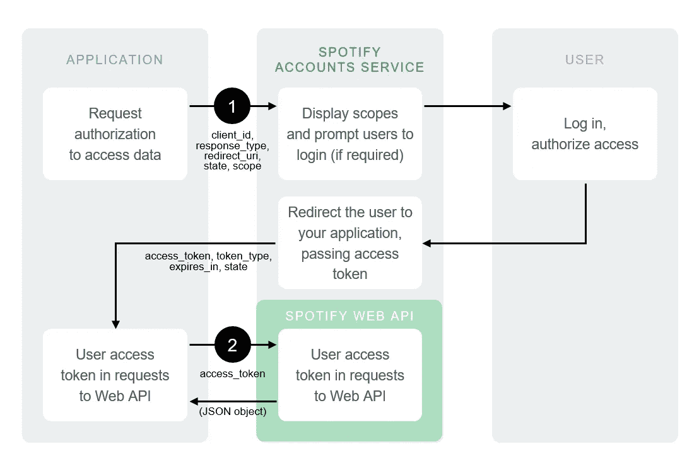

*   与需要 ajax 请求的 OAuth/OAuth2 或 JWT 不同，Implicit Grant 非常简单，基于一个[查询字符串](https://en.wikipedia.org/wiki/Query_string)，这是一种在网页的 URL 中传递数据的方式。实际上，我们所做的是让我们的登录按钮成为指向 Spotify 授权 URL 的外部链接，包括像查询字符串中的 Spotify 客户端 ID 这样的数据。通过点击链接，用户实际上离开了我们的页面，并转到 Spotify 托管的页面，给予我们的应用程序访问权限。
*   如果他们同意(或者如果他们已经登录到 Spotify 并在早些时候给了我们权限)，Spotify 将根据我们在数据库中注册的应用程序检查数据，然后他们会将用户重定向回我们的页面，但包括一个带有授权令牌的查询字符串。我们所要做的就是在 API 请求中包含这个令牌(截图中的 BQAHoHp…)。我们实际上甚至不需要做授权头，因为 spotify-web-api-js 会替我们做。

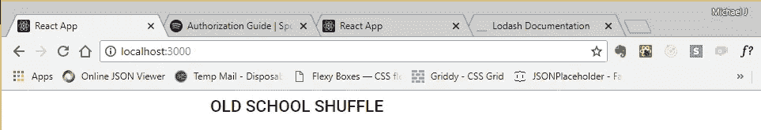

*   登录前的 URL

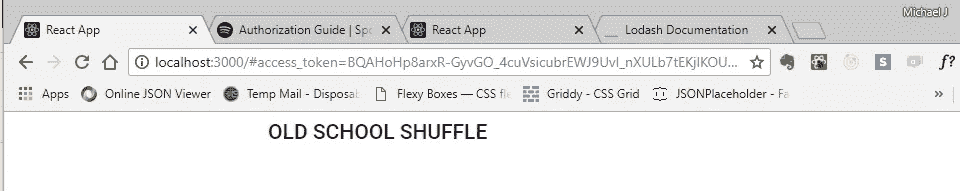

*   登录后的 URL
*   现在，让我们通过构建三个 Spotify 相关组件中的两个来尝试一下:
*   是 Spotify 相关用户界面的外部包装
*   是我们将在用户尚未登录 Spotify 时显示的内容。基本上只是一个登录按钮。
*   让用户从现有的播放列表中选择，并按专辑随机播放。我们稍后会解决这个问题。
*   我们还需要更新，将我们的虚拟“Spotify Player Here”替换为。我们将为 spotifyFunctions.js 添加一些函数。下面是代码。

我们不会在这些组件上花太多时间:在中，我们将虚拟的 Spotify 占位符文本替换为。有我们是否登录的状态，如果是，我们从 Spotify 的访问令牌是什么。如果 state.loggedInToSpotify 为 false，那么我们显示组件(基本上只是一个登录按钮)，或者显示一个带有访问令牌的占位符。

*   还有一个 componentDidMount 生命周期方法，它在每次渲染时检查我们是否使用 spotifyFunctions.js 库中的函数登录。这也是代码。

让我们从登录开始。redirectUrlToSpotifyForLogin 只是一个字符串连接器，用查询字符串构建一个 URL，告诉 Spotify 我们的应用程序是谁，以及我们想向用户请求什么权限(Spotify 称之为[范围](https://developer.spotify.com/documentation/general/guides/scopes/))。它还包括我们的客户 Id 和我们在 Spotify 注册的重定向 URI。您可以在中看到，我们只是将登录按钮链接到这个生成的 URL。

*   checkUrlForSpotifyAccessToken 也很简单。它只是用一个名为 access_token 的参数检查 URL 中的查询字符串。这是可行的，因为当我们第一次初始化我们的应用程序时，我们的 URL 将是 [http://localhost:3000，](http://localhost:3000,)，但在我们登录后，Spotify 将使用我们的重定向 URI 重定向到我们的应用程序，但附有他们授权的查询字符串。它看起来就像[http://localhost:3000/# access _ token = whatever。](http://localhost:3000/#access_token=whatever.)此时将再次重新呈现，查看访问令牌，并以文本形式呈现访问代码，而不是连接到 Spotify 按钮。很简单！
*   FYI getHashParams 只是一个通用的帮助器函数，用于解析来自 URL 的查询字符串。
    现在我们已经准备好了登录 Spotify 所需的一切。它应该是这样的。

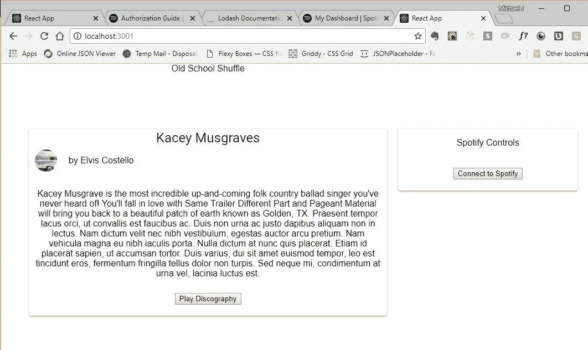

*   登录前

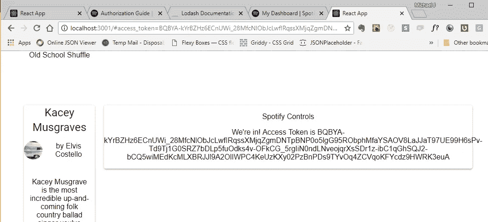

登录后

*   **Spotify 用户界面**
*   现在我们已经登录了，我们必须添加并连接它。用户应该能够从他们的播放列表列表中进行选择，并产生一个由专辑洗牌的新版本。以防你的播放列表上有单曲(异端！)我们还将包括一个自动添加到整个相册的选项。它应该是这样的:

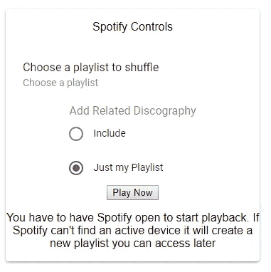

*   您现在已经是前端 React 代码的老手了，所以我将一次性向您提供所有代码，而不是填鸭式的。如果你有任何问题，可以在评论中问我。非常注重用户界面，尤其是他们的菜单组件，如果你想了解的话，这个教程可以帮助你理解。别忘了把它连接到。

您会注意到那里有很多对我们的 spotifyFunctions.js helper 库的引用，所以在我们处理那部分之前它不会呈现。这是我接下来要关注的地方。

**认识斑点先生:一个可疑的 API**

简单回顾一下，下面是我们希望应用程序的 API 部分做的事情:

*   Spotify 计划
*   我需要 API 做什么？
*   访问用户的 Spotify——完成
*   获取他们的播放列表
*   获取特定播放列表的曲目
*   获取特定播放列表的专辑
*   获取特定专辑的曲目
*   创建播放列表
*   无序播放播放列表
*   播放特定艺术家的唱片目录
*   获取艺术家的专辑

这是所有的代码。对它如何符合我们的要求有一个总体的感觉，但我们将通过每个功能，所以不要担心，如果你不明白一切。我提前道歉，它可能经得起一点点重构。

好吧——让我们从头开始！

我们之前已经解决了从的导入问题，但是我们需要一个 spotify-web-api-js 包装器库的实际实例来使用它，所以我们在这里创建它，并将其命名为 spotifyApi。

这些是我们前面提到的认证功能。这里没什么好说的了。

一旦我们有了访问令牌，我们需要[将它](https://github.com/JMPerez/spotify-web-api-js)传递给我们的 spotifyApi 实例，然后我们就不必担心在以后的函数调用中会记住它。我们必须导出这个函数，因为它是在

一旦我们有了访问令牌，我们希望得到一个用户播放列表的数组，他们可以从中进行选择。像所有调用第三方 API 的函数一样，这必须是一个异步函数。我们的 spotifyApi 有一个内置的 [getUserPlaylists](https://doxdox.org/jmperez/spotify-web-api-js#src-spotify-web-api.js-constr.prototype.getuserplaylists) 方法，但是 Spotify 给了我们很多我们不需要的关于播放列表的信息。

为了细化，我们可以映射从 API 获得的播放列表对象数组，并使用 [ES6 析构](https://wesbos.com/destructuring-objects/)返回一个更简单的对象数组，只包含每个播放列表的 id 和名称。我们可以把它输入到 state.playlists 中，并用它来填充我们的菜单。

请注意，我们还有一个错误处理程序，如果它无法连接到 API，将返回“无法下载您的播放列表”。这也反馈到菜单中，所以如果有连接问题，用户会得到一个有点帮助的消息，而不是崩溃的应用程序。

一旦用户选择了一个播放列表，我们需要找出播放列表上的曲目。我们需要曲目的名称和 id，它所在专辑的名称和 id，它在专辑中的曲目编号，以及演唱这首歌的艺术家的名称和 id。Spotify 还保存了一个 URI，我们只需将它放入浏览器就可以获得曲目，所以我们也会保存它。

这非常类似于 getSimplePlaylistTracks，但是我们不是接收 playlistId，而是传递给它一个 albumId、albumName 和 albumUri。当用户想要添加唱片目录时，这很有帮助，因为我们可以遍历他们的播放列表，获得每个曲目的专辑，然后使用它从同一专辑中获得所有其他曲目。

这两个函数看起来非常相似，但有细微的不同，因为 Spotify API 对专辑的响应与播放列表中的数据略有不同。可能有一个聪明的方法可以将它们重构为一个函数——如果你想到了，请告诉我！

正如我们在上一节中所说的，这个函数接收 getSimplePlaylistTracks 的输出，并从播放列表中的曲目生成一个 albumIds 数组。如果我们需要完整的唱片目录，可以将它输入 getSimpleAlbumTracks，或者如果我们只需要按专辑对播放列表进行排序，只需返回 albumId。returnSimpleArray 标志让我们决定我们想要哪种输出。

请注意，我们首先获取 albumIds 数组，然后使用 Lodash uniq 函数从数组中删除重复项，然后对其进行洗牌。在添加曲目之前，先随机播放专辑会更有效率。

这只是一个普通的帮助函数，用来随机打乱数组。

这与 identifyAlbumsInPlaylist 基本相同，只是它使用了 artistId。我们将用它来播放艺术家的唱片目录。我们可以再次一起重构这两个函数。

这是一个棘手的问题。本质上，我们在一个播放列表中获取一个大的曲目数组，并将其从一个内聚数组转换为一个具有相同 albumId 的较小数组的对象。这些短数组是专辑，所以在每张专辑中，我们根据专辑中的曲目编号对曲目进行排序。稍后我们可以重新组合它们。

以下是 convertPlaylistToObjectByProperty 的效果示例:

酷毙了。这里有一个简单的例子:

这是一个很好的帮助函数，当您将它作为参数提供给 array.sort 时，它可以根据对象的指定属性对对象进行排序，就像我们在 convertPlaylistToPbjectByProperty 中所做的那样。我毫不掩饰地把这个从栈溢出来，并欠 [Ege Ozcan](https://stackoverflow.com/a/4760279) 一份情！

看那个出口声明！看看这是多么可读！当用户选择按专辑随机播放播放列表而不添加丢失的曲目时，从中的“立即播放”按钮调用此功能。这是一个异步函数，我们现在真正受益于抽象出我们的底层操作。

我们从接收状态开始，提取用户选择的播放列表的名称和 id。从那里我们:

*   获取播放列表中的一组曲目
*   在播放列表中获取一系列已经被打乱的专辑
*   使用 convertPlaylistToObjectByProperty 将大的曲目数组排序到一个对象中，较小的数组按专辑排序
*   将较小的(现在已排序的)曲目数组重新组合成一个大的曲目数组，但现在按专辑分组
*   展平重组后数组，现在它又变成了一个简单的播放列表
*   将平面重组数组传递给 createPlaylist 函数

我知道我们还没有解决创建播放列表的问题——留到最后再说。

这个和我们上一个函数很像，但是 byAlbumWithDiscography 中间有不同的逻辑。一旦我们从用户的播放列表中得到混排的专辑，我们就扔掉实际的播放列表。取而代之的是，我们循环遍历 albumIds 数组，并执行 API 调用来获取每个 albumIds 的曲目，然后将它们组合成一个大的播放列表。

*   这里有一个稍微不同寻常的代码模式:

在 ES7 中，Javascript 添加了 async/await 关键字，但是[在幕后](https://hackernoon.com/6-reasons-why-javascripts-async-await-blows-promises-away-tutorial-c7ec10518dd9)它仍然在使用 Promises。当我们在 array.map 函数中进行异步 API 调用时，我们实际上返回了一个未履行承诺的数组，而不是这些承诺的结果。令人困惑的是，尽管它充满了未实现的承诺，但数组本身是同步创建的，这意味着等待 promiseArrayOfTracksFromAlbum 将不起作用。相反，我们调用 wait[promise . all](/@ian.mundy/async-map-in-javascript-b19439f0099)(promiseArrayOfTracksFromAlbum)，它创建一个新的承诺，一旦数组中的所有承诺都被解析，这个承诺就会被解析。

*   在 Promise.all 解析后，我们有一个轨道数组，所以我们像以前一样将其展平，并将结果传递给 createPlaylist。

这是我们用来创建中显示的艺术家的整个唱片目录的播放列表的功能。它与 byAlbumWithDiscography 几乎完全相同，只是我们不是从播放列表中获取 albumIds 数组，而是通过向 SpotifyAPI 请求与艺术家相关联的专辑来获取它。现在，让我们继续将这个函数与 Play Discography 按钮连接起来:

**最终的 spotifyFunction—create playlist**

*   女士们先生们，这是 spotofyFunctions.js 中的最后一个函数，也是项目的最后一段代码！准备好创建播放列表并播放了吗？

好吧，Spotify 的 API 并没有让我们轻松。即使我们有看似方便的 spotifyApi.createPlaylist 和 spotifyApi.play 函数，它们也有一些条件:

*   在创建播放列表之前，我们必须获得用户 Id
*   我们必须先创建一个空白的播放列表，然后向其中添加曲目。
*   我们不能一次添加超过 100 个轨道，所以如果超过 100 个，我们需要多次调用 spotifyApi.addTracksToPlaylist。
*   我们只能播放播放列表，如果用户有一个“活动设备”，但不清楚“活动设备”到底是什么意思。
*   不管了！这就是为什么我们有这个自定义的 createPlaylist 函数来处理复杂性。函数的逻辑基本上遵循我们刚刚列出的挑战。chunk 是一个很棒的 Lodash 库，它可以将一个大数组拆分成更小的数组。还要注意，我们必须再次使用 Promise.all 构造来添加轨道，因为这是 array.map 内部的异步操作。
*   哎呦——来自现实生活的教训——API 挫折
    我知道，你对完成这件事很兴奋，我也是。但是 Spotify 有其他计划。长话短说，从我开始这个项目到博客发布，Spotify 宣布改变他们的 API，然后[违背了](https://developer.spotify.com/community/news/2018/06/12/changes-to-playlist-uris/)的改变，从而破坏了我们的应用程序！他们所做的只是改变了创建播放列表的端点，但这意味着我们的 spotofy-web-api-js 库无法工作！如果我是一个更好的公民，我会在库上做一个 pull 请求来修复它，但是快速修复是编写我们的临时 ajax API 调用来创建播放列表，而不是库。一旦库被更新，我们将把它改回来。

我没有将整个文件复制到要点中，因为我们只修改了几处内容:

既然我们需要 spotify-web-api-js 库外部的访问令牌，我们必须添加一个全局变量来保存它，并更新 setAccessToken

我们需要在上面编写的 createPlaylist 函数中调用 tempCreatePlayist 函数。

我们需要创建我们的临时函数，这只是一个对我们需要的端点的 ajax 调用。

**管用！**

*   看看吧——你现在应该可以登录 Spotify，在你的播放列表中选择，并按专辑随机播放。您还可以添加相关的唱片目录，以及生成凯茜·玛斯格蕾芙斯、瑞安·宾汉和特德·利奥的专辑目录(我强烈建议完整收听)或添加对您自己喜欢的艺术家的纪念！
*   当按钮被点击时，它们不会做任何视觉上的事情，但是如果你的手机打开你旁边的播放列表页面，它应该在几秒钟后开始播放，否则检查你的播放列表，看看新专辑的随机播放方法，并开始听老学校风格！

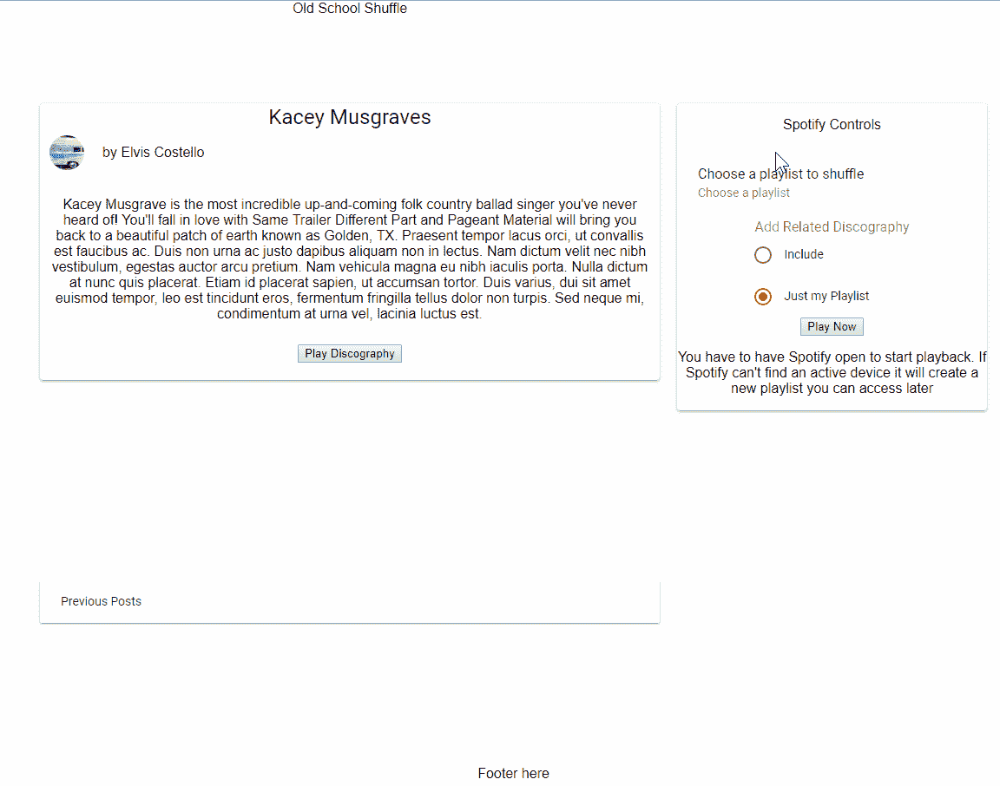

*   **将 create-react-app 部署到生产中**
*   如果你愿意，最后一步是部署你的应用程序，这样你就可以在互联网上使用它，而不仅仅是在你的本地开发环境中。这并不难，但是当像我们这样使用 create-react-app 时，这个过程并没有很好地记录下来。
*   create-react-app 在启动和运行带有热重装的开发服务器时，为我们提供了许多功能中的一个，但对于生产，构建脚本创建了 1 个 Javascript、1 个 CSS 和 1 个 html 文件。
*   因为我们只有这些文件，这意味着我们需要将它们放在现有的服务器上，或者在 Node 中启动一个简单的 Express 服务器来为我们提供这些文件。这就是我们要走的路线，所以在根目录中添加一个名为 app.js 的新文件。这是一个与 components 文件夹中的 App.js 不同的文件，我们将编写一个简单的服务器来提供这些构建文件:

现在我们有了一个服务器来托管我们的构建文件，我们需要一个脚本来使用它。打开你的 package.json，让我们开始吧。

*   create-react-app 已经为我们准备了一个很好的构建脚本，所以对于我们的 productionstart 脚本，我们需要做的就是运行这个构建脚本，然后启动服务器。注意，我们还添加了 express 作为显式依赖项。这应该不是必要的，因为 create-react-app 已经在后端使用了它，但保持整洁也不错。
*   我们需要添加的最后一个文件是 Procfile(大写，没有点)，它包含部署服务的指令(最初是 Heroku，但是我们将使用 Cosmic JS 的服务)。Procfile 将告诉服务启动单个 web 节点并运行我们的 productionstart 脚本。

如此接近，我们可以品尝它！Cosmic JS 使得直接从 Github repo 进行部署变得极其容易(您已经上传了您的 git 提交，对吗？).你所要做的就是回到你的 Cosmic JS 仪表板，在设置下面有一个 Web 部署选项。从那里你只需点击蓝色的部署到宇宙 JS 按钮。这将需要几分钟的时间来设置和发送电子邮件给你时，你的生产老派洗牌是现场。

*   现在非常，非常，非常最后的事情是，我们需要在我们的宇宙 JS 部署中设置我们的环境变量，以反映我们的。开发中的 env 文件。Protip —不要忘记单击“设置环境变量”按钮，然后给它几分钟时间进行更新。

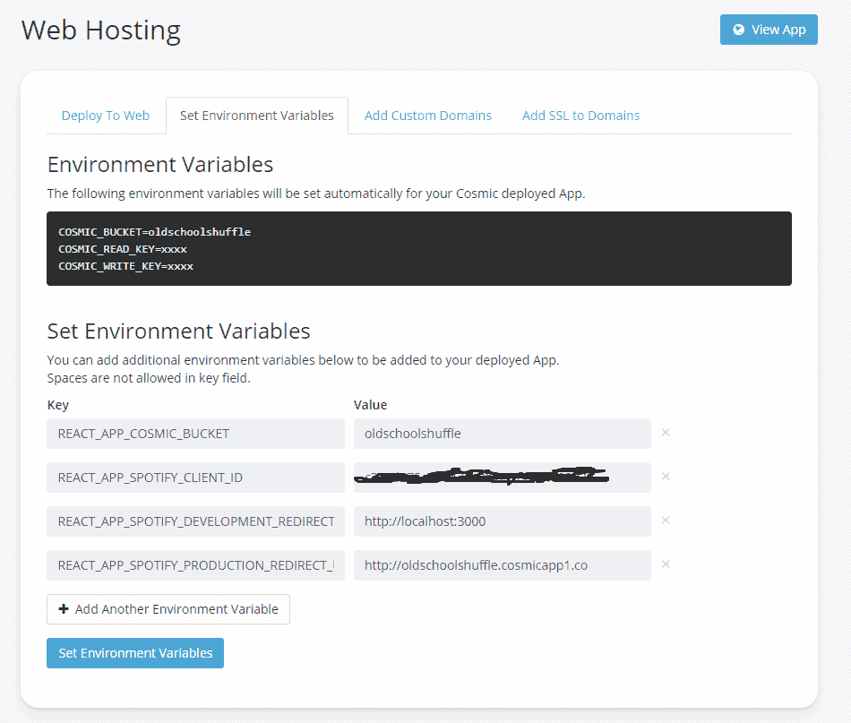

**最后的润色**

*   现在，我们的应用程序实际上工作了，我更喜欢它了，所以我把 CSS 分类，给它多一点活力。这些微小的变化没有在 github gists 中显示出来，但它们在回购协议中得到了反映。

**那都是乡亲们！**

现在享受你的劳动成果吧！谢谢你的加入，我希望你能喜欢并学到一些东西。这是我的就职编码教程，所以请留下评论，如果我错过了什么…或者如果你有任何意见！

[在 Twitter 上联系我们](https://twitter.com/cosmic_js)和[加入我们的 Slack 社区](https://cosmicjs.com/community)。