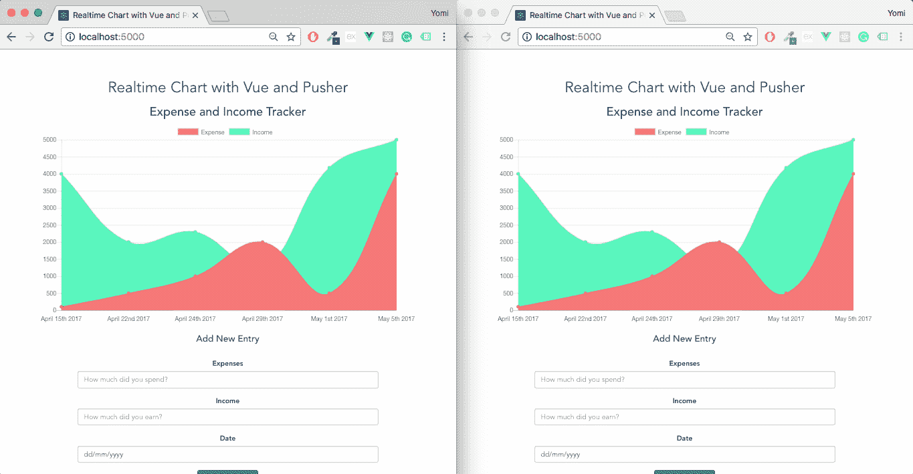

# 用 Vue.js 构建实时图表

> 原文：<https://medium.com/hackernoon/build-a-realtime-chart-with-vue-js-6527ac55c315>


[数据](https://hackernoon.com/tagged/data)最近已经成为我们生活中非常重要的一部分，理解这些数据也同样重要。如果您无法跟踪或分析数据，那么拥有数据就毫无意义，尤其是如果这些数据与财务有关的话。

这就是为什么我们将建立一个支出和收入跟踪图表，使用[按钮](http://pusher.com)的实时功能。我们的交互式仪表盘会有一个折线图，显示你每天的收入和支出。您将能够添加新的支出和收入，并实时查看图表更新。

仪表板图表将由 [Node.js](http://nodejs.org) + [Express](http://expressjs.com) 作为后端服务器，由 [vue-cli](https://github.com/vuejs/vue-cli) 引导的[Vue](http://vuejs.org)+[Vue-chart js](https://github.com/apertureless/vue-chartjs)作为前端服务器。



# 使用 vue-cli 搭建应用

vue-cli 是一个简单的 cli，用于搭建 Vue.js 项目。我们将安装 vue-cli，然后用它来使用 webpack 模板引导应用程序，命令如下:

```
npm install -g vue-clivue init webpack-simple realtime-chart-pusher 
```

*   *提示:webpack-simple 模板是一个简单的 webpack + vue-loader 设置，用于快速原型制作。你可以在这里阅读更多关于*[](https://github.com/vuejs/vue-cli)**。**

# *设置 Node.js 服务器*

*接下来要做的是建立一个服务器，它将帮助我们与 Pusher 通信。我将假设 Node 和 npm 都安装在您的系统上。然后，我们将安装将用于节点服务器的依赖项。*

```
*npm install body-parser express nodemon pusher*
```

*   **提示:nodemon 将监视 nodemon 启动时所在目录中的文件，如果有任何文件发生变化，nodemon 将自动重启您的节点应用程序。**

*还有一件事，我们需要一个节点服务器的入口点/文件。我们可以通过在应用程序的根目录下创建一个`server.js`文件来实现。*

# *推动器设置*

*为了实现实时功能，我们需要 Pusher 的强大功能。如果你还没有，[注册一个推手账户](https://pusher.com/signup)并创建一个新的应用程序。创建新应用程序后，从 Pusher 仪表盘获取您的 app_id、密钥和集群。*

# *应用程序设置*

*现在我们有了一个 Pusher 帐户，并且安装了 Node.js 后端所需的依赖项，让我们开始构建吧。*

*让我们为`server.js`文件编写代码。*

*让我们看看这里发生了什么。我们需要 express、path、body-parser 和 Pusher，我们用 app 初始化了 Express()。*

*我们使用 body-parser 提取传入请求流的整个主体部分，并在 req.body 上公开它。*

*Pusher 还会使用您的仪表盘中的应用凭证和集群进行初始化。请确保对其进行更新，否则节点服务器将无法连接到仪表板。最后，节点服务器将运行在 5000 端口上。*

*接下来要做的是定义我们的应用程序的路线，并为支出和收入图表添加模拟数据。使用以下内容更新 server.js 文件。*

*首先，我们有一个 expensesList 对象，其中的数据包含特定日期的支出和收入。*

```
*app.get('/finances', (req,res) => { res.send(expensesList);});*
```

*这个路由只是将 expensesList 对象作为 JSON 发送。我们使用这个路径来获取数据并显示在前端。*

*`/expense/add`路线确实做了很多。这是一个 POST 路径，这意味着我们将期待一些传入数据(在本例中，是支出金额和收入金额)。*

*然后，我们将新的收入和支出推送到现有的收入和支出，之后，我们还将更新的支出列表推送到 Pusher。*

*最后，我们发送一个 JSON 作为对路由的响应，其中包含最新的收入、费用、日期和更新的费用列表。*

*你最终的`server.js`应该是这样的:*

# *构建前端(Vue + vue-chartjs)*

*大多数前端工作将在`src/components`文件夹中完成。导航到该目录，您应该会看到一个`Hello.vue`文件。您可以删除该文件或将其重命名为`Home.vue`，因为我们将需要 components 文件夹中的`Home.vue`文件。*

*在开始构建和显示图表之前，我们需要做几件事情。打开`src`文件夹中的`App.vue`文件，替换为以下代码:*

*接下来，我们将安装 [vue-chartjs](https://github.com/apertureless/vue-chartjs) 、 [momentjs](http://momentjs.com) 、 [pusher-js](https://github.com/pusher/pusher-js) (Pusher 的 [Javascript](https://hackernoon.com/tagged/javascript) 库)和 [axios](https://github.com/mzabriskie/axios) (我们将使用 axios 进行 API 请求)。然后将它们添加到 [Vue.js](https://hackernoon.com/tagged/vue-js) app 中。*

```
*npm install axios vue-chartjs pusher-js moment*
```

*完成后，我们将导入 axios 并在我们的应用程序中进行全球注册。我们可以通过打开`src`文件夹中的`main.js`文件来实现。*

*接下来，让我们创建一个 Vue.js 组件来帮助显示我们的图表。我们将使用它来指定我们想要的图表类型，配置其外观和行为方式。*

*然后我们将这个组件导入到`Home.vue`组件中，并在那里使用它。这是`vue-chartjs`的优势之一，它通过导入基本图表类来工作，然后我们可以对其进行扩展。让我们继续创建该组件。在`src/components`文件夹中创建一个名为`LineChart.vue`的新文件，并用下面的代码进行编辑。*

*在上面的代码块中，我们从 vue-chartjs 和 mixins 模块中导入了折线图。Chart.js 通常不提供在数据集发生变化时自动更新的选项，但是可以在 vue-chartjs 中借助以下 mixins 来完成:*

1.  *反应性螺旋桨*
2.  *反应数据*

*这些 mixins 自动创建`chartData`作为道具或数据，并添加一个守望者。如果数据发生变化，图表将会更新。点击阅读更多[。](https://github.com/apertureless/vue-chartjs)*

*另外，`mounted`函数中的`this.renderChart()`函数负责呈现图表。`this.chartData`是一个包含图表所需数据集的对象，我们将通过将它作为一个道具包含在`Home.vue`模板中来获得它，`this.options`包含决定图表外观和配置的 options 对象。*

*我们现在有了一个`LineChart`组件，但是我们如何查看我们的图表并测试它的实时功能呢？我们通过将`LineChart`添加到我们的`Home.vue`组件中，并通过 pusher-js 订阅我们的 Pusher 通道来实现这一点。*

*打开`Home.vue`文件，编辑如下内容:*

# *fillData*

*这个函数在应用程序被[挂载](https://vuejs.org/v2/api/#mounted)后立即被调用，它基本上向节点后端(/finances)发出一个 API 请求，并检索 expensesList。*

*向`/finances` [Node.js](https://hackernoon.com/tagged/node-js) route 发出 GET 请求，它返回最新的`expensesList`，然后我们用 Javascript 的`.map`操作该数据，并将其分配给各种变量。*

# *添加费用*

*上面的代码块简单地利用 POST 方法 route to `/expense/add`来更新`expensesList`(记住节点服务器中的`/expense/add` route 将更新后的`expensesList`发送到 Pusher 仪表板)以及收入、费用和日期数据。*

*然后使用通过`channel.bind`从[按钮](https://pusher.com/docs/client_api_guide/client_events#bind-events)获得的数据再次构建折线图，并将新条目自动添加到图表中。*

# *fetchData*

*该函数在 Vue 实例[被创建](https://vuejs.org/v2/api/#created)后被调用，它还通过 Pusher 监听图表数据集的变化，并自动更新折线图。*

*您最终的 Home.vue 文件应该如下所示:*

# *还有一件事！*

*在运行我们的应用程序之前，我们需要做一些叫做 [API 代理](https://vuejs-templates.github.io/webpack/proxy.html)的事情。API 代理允许我们将 vue-cli 应用程序与后端服务器(在我们的例子中是节点服务器)集成。这意味着我们可以并行运行开发服务器和 API 后端，并让开发服务器将所有 API 请求代理到实际的后端。*

*我们可以通过编辑`config/index.js`中的`dev.proxyTable`选项来启用 API 代理。您可以使用下面的代码进行编辑。*

*完成后，我们终于准备好看到我们的应用程序，你可以运行`npm run dev`来启动应用程序。*

*就是这样！此时，您应该有一个实时更新的实时仪表板图表。*

*你可以点击查看现场演示[或者访问整个应用的代码，这些代码在](https://realtime-chart-pusher-ojppytklmk.now.sh/) [Github 上供你阅读](https://github.com/yomete/realtime-chart-pusher)。*

# *结论*

*在 vue-chartjs 的帮助下，我们已经看到了如何在 Vue 中使用 ChartJS 构建一个基本的折线图，并且由于 Pusher，我们还添加了实时功能。*

*然后我们看到了如何使用 reactiveProps 让 ChartJS 在数据集发生变化时更新它的数据集。我们还看到了如何使用 Pusher 在服务器上触发事件，并使用 JS 在客户端监听它们。*

*你最近用 Pusher 做了什么很酷的东西吗，比如图表？让我们在下面的回答中知道。*

**本帖最早出现在* [*推手博客*](https://pusher.com/tutorials/chart-vuejs/) *。**