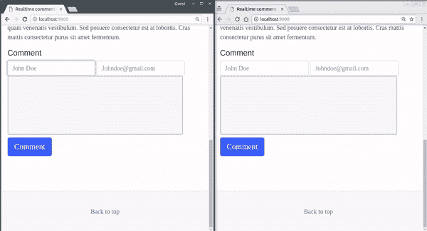
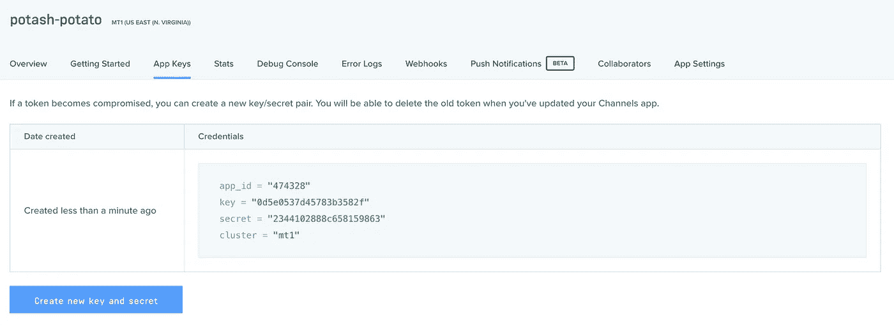
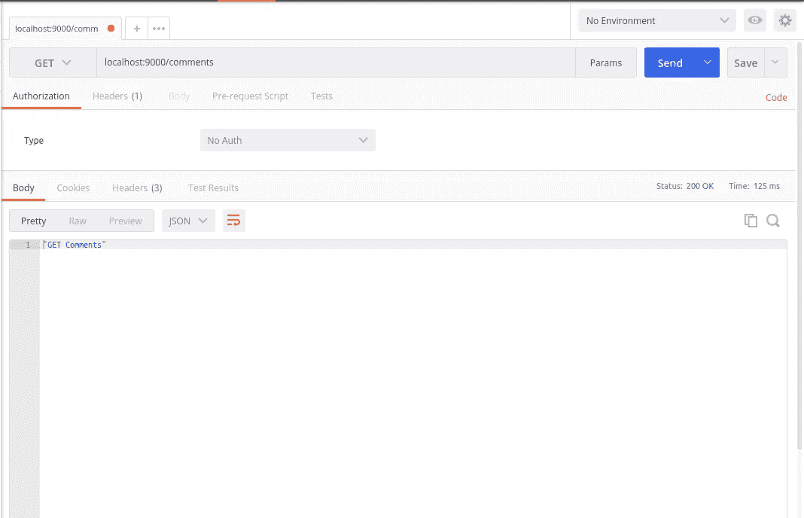
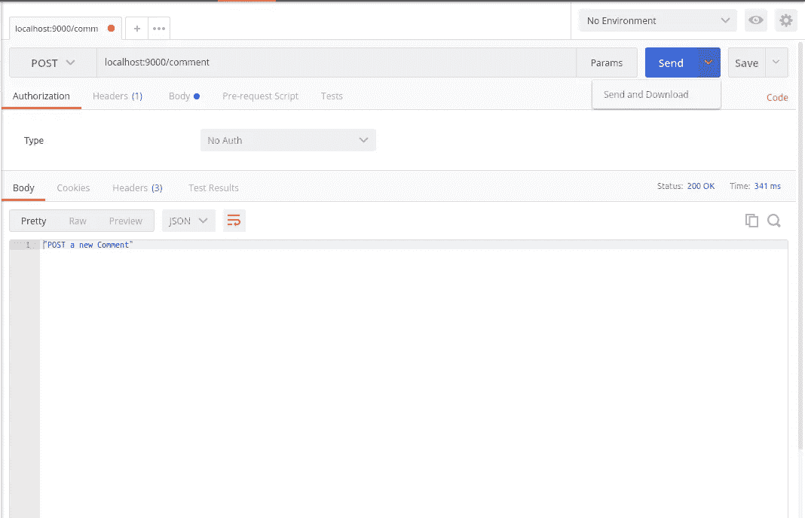
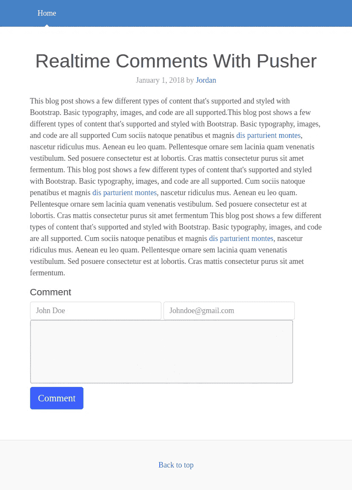

# 用 Go 和 Pusher 频道构建一个实时评论应用程序

> 原文：<https://medium.com/hackernoon/build-a-realtime-comment-app-with-go-and-pusher-channels-387b2bf20a9e>

> *你需要在你的机器上安装 Go 和 SQLite。Go 和 JavaScript 的基础知识会有帮助。*

互联网是各种社会活动的温床，因为它扩大了交流的可能性。为了保持 web 应用程序的社会性和趣味性，为用户提供一个或多个交互界面是非常重要的。一个这样的界面是评论部分。

评论区是用户可以讨论他们有权访问的主题(帖子、视频、图片)的地方。过去，一个用户要看到另一个用户的评论，必须刷新浏览器窗口。然而，现在有了实时评论，我们可以自动实时获取评论。本文将介绍如何使用 Pusher 构建实时评论。

到本文结束时，我们将构建一个如下所示的应用程序:



# 要求

要阅读本文，您需要以下内容:

*   Go(版本> = 0.10.x)安装在您的计算机上。下面是你如何安装 Go 的方法。
*   安装在您机器上的 SQLite (v3.x)。[安装指南](http://www.sqlitetutorial.net/download-install-sqlite/)。
*   Go 编程语言的基础知识。
*   JavaScript 基础知识(ES6)。
*   Vue.js 的基础知识。

# 获得推广渠道应用

第一步将是获得一个推广渠道的应用。我们需要应用程序凭证来使我们的实时特性工作。

去 Pusher 网站创建一个帐户。创建帐户后，您应该创建一个新的应用程序。遵循应用程序创建向导，然后您应该获得您的应用程序凭证，我们将在本文后面使用它。



现在我们有了应用程序，让我们进入下一步。

# 设置代码库

让我们首先导航到位于`$GOPATH`中的`src`目录。然后，我们将在那里为我们的应用程序创建一个新目录。

```
$ cd $GOPATH/src
$ mkdir go-realtime-comments
$ cd go-realtime-comments
```

在这个目录下创建一个`comments.go`文件。

在我们编写代码之前，我们需要导入几个 Go 包来帮助运行我们的项目。我们将安装 [Echo 框架](https://echo.labstack.com/)和 [SQLite 包](https://github.com/mattn/go-sqlite3)。运行以下命令来拉入包:

```
$ go get github.com/labstack/echo
$ go get github.com/labstack/echo/middleware
$ go get github.com/mattn/go-sqlite3
```

> *如果你使用 Windows，你遇到错误‘cc . exe:对不起，未实现:64 位模式未编译入’，那么你需要一个 Windows gcc 端口，比如*[*https://sourceforge.net/projects/mingw-w64/*](https://sourceforge.net/projects/mingw-w64/)*。又见本* [*GitHub 一期*](https://github.com/mattn/go-sqlite3/issues/297) *。*

使用您最喜欢的编辑器，打开`comments.go`文件并粘贴以下代码行:

```
package mainimport (
    // "database/sql" "github.com/labstack/echo"
    "github.com/labstack/echo/middleware" // _ "github.com/mattn/go-sqlite3"
)
```

# 配置数据库和路由

每个 Go 应用都必须有一个`main`函数。这是应用程序执行的起点，所以让我们创建我们的`main`函数:

在`comments.go`文件中，在导入下面添加以下内容:

```
func main() { // Echo instance
    e := echo.New() // Middleware
    e.Use(middleware.Logger())
    e.Use(middleware.Recover()) // Define the HTTP routes
    e.GET("/comments", func(c echo.Context) error {
        return c.JSON(200, "GET Comments")
    }) e.POST("/comment", func(c echo.Context) error {
        return c.JSON(200, "POST a new Comment")
    }) // Start server
    e.Logger.Fatal(e.Start(":9000"))
}
```

在 main 函数中，我们定义了一些基本的 route handler 函数，这些函数基本上根据请求向浏览器返回硬编码的文本。最后一行将使用 Echo 的 start 方法启动 Go 的标准 HTTP 服务器，并在端口 9000 监听请求。

我们可以通过运行应用程序并使用 [Postman](https://www.getpostman.com/) 发出一些请求来测试应用程序在这个阶段是否工作。

下面是运行该应用程序的方法:

```
$ go run ./comments.go
```

我们可以使用 Postman 发送 HTTP 请求。下面是一个使用 Postman 的 GET 请求示例:



邮递员的邮寄请求:



我们将创建一个初始化数据库的函数，为此，我们需要 SQL 和 SQLite3 驱动程序。我们已经将它们添加到了`import`语句中，所以取消对它们的注释。我们还将创建一个函数，该函数将使用函数中定义的数据库模式来迁移数据库。

打开`comments.go`文件，在`main`函数前粘贴以下代码:

```
func initDB(filepath string) *sql.DB {
    db, err := sql.Open("sqlite3", filepath)
    if err != nil {
        panic(err)
    }if db == nil {
        panic("db nil")
    }
    return db
}func migrate(db *sql.DB) {
    sql := `
    CREATE TABLE IF NOT EXISTS comments(
            id INTEGER NOT NULL PRIMARY KEY AUTOINCREMENT,
            name VARCHAR NOT NULL,
            email VARCHAR NOT NULL,
            comment VARCHAR NOT NULL
    );
    `
    _, err := db.Exec(sql)
    if err != nil {
        panic(err)
    }
}
```

接下来，将以下代码添加到`main`函数的顶部:

```
// [...]// Initialize the database
db := initDB("storage.db")
migrate(db)// [...]
```

我们现在可以通过运行应用程序来检查这些函数是否被调用，以及数据库是否在执行过程中被创建:

```
$ go run comments.go
```

> *⚠️如果你已经在运行 Go 应用程序，你需要使用键盘上的****ctrl+c****终止这个进程，然后重启它以查看变化。*

当应用程序第一次运行时，如果之前不存在一个`storage.db`文件，将在工作目录中创建该文件。

# 设置处理程序

我们已经测试了我们的应用程序监听指定的端口 9000，并按照我们的配置处理 HTTP 请求。然而，当前的处理函数只是将硬编码的文本返回给浏览器，所以让我们创建新的处理函数来处理对路由的响应。

在根目录下创建一个名为`handlers`的新文件夹:

```
$ mkdir handlers
$ cd handlers
```

接下来，创建一个`handlers.go`文件并粘贴以下内容:

```
package handlersimport (
    "database/sql"
    "go-realtime-comments/models"
    "net/http"
    "github.com/labstack/echo"
)
```

现在我们需要返回到`comments.go`文件并导入处理程序包:

```
import (
    "go-realtime-comments/handlers" // [...]
)
```

在同一文件中，用以下内容替换之前的路由定义:

```
// [...]// Define the HTTP routes
e.File("/", "public/index.html")
e.GET("/comments", handlers.GetComments(db))
e.POST("/comment", handlers.PushComment(db))// [...]
```

接下来，将以下代码粘贴到导入语句下的`handlers.go`文件中:

```
type H map[string]interface{}// GetComments handles the HTTP request that hits the /comments endpoint
func GetComments(db *sql.DB) echo.HandlerFunc {
    return func(c echo.Context) error {
        return c.JSON(http.StatusOK, models.GetComments(db))
    }
}func PushComment(db *sql.DB) echo.HandlerFunc {
    return func(c echo.Context) error {
        var comment models.Comment c.Bind(&comment) id, err := models.PushComment(db, comment.Name, comment.Email, comment.Comment)
        if err == nil {
            return c.JSON(http.StatusCreated, H{
                "created": id,
            })
        } return err
    }
}
```

`GetComments`函数从数据库获取并返回评论，而`PushComment`将评论保存到数据库并返回响应。

# 建立模型

为了创建模型包，我们需要在应用程序的根目录下创建一个新文件夹:

```
$ mkdir models     
$ cd models
```

接下来，创建一个`models.go`文件并粘贴以下代码:

```
package modelsimport (
    "database/sql" _ "github.com/mattn/go-sqlite3"
)
```

让我们创建一个注释`type`，它是一个具有四个字段的结构:

*   `ID` -评论的 ID。
*   `Name` -发表评论的用户的用户名。
*   `Email` -发表评论的用户的电子邮件。
*   `Comment` -评论。

在 Go 中，我们可以将元数据添加到变量中，方法是将它们放在反勾号中。我们可以用它来定义每个字段在转换成`JSON`时应该是什么样子。这也将有助于`c.Bind`函数在注册新注释时知道如何映射`JSON`数据。

让我们定义一下`Comment`和`CommentCollection`的结构。在`models.go`文件下面粘贴以下导入内容:

```
type Comment struct {
    ID      int    `json:"id"`
    Name    string `json:"name"`
    Email   string `json:"email"`
    Comment string `json:"comment"`
}type CommentCollection struct {
    Comments []Comment `json:"items"`
}
```

接下来，在结构后粘贴以下代码:

```
func GetComments(db *sql.DB) CommentCollection {
    sql := "SELECT * FROM comments"
    rows, err := db.Query(sql) if err != nil {
        panic(err)
    } defer rows.Close() result := CommentCollection{} for rows.Next() {
        comment := Comment{} err2 := rows.Scan(&comment.ID, &comment.Name, &comment.Email, &comment.Comment)
        if err2 != nil {
            panic(err2)
        } result.Comments = append(result.Comments, comment)
    } return result
}
```

`GetComments`函数负责从数据库中检索所有可用的注释，并将它们作为我们定义的`CommentCollection`的实例返回。

接下来，将下面的代码粘贴到上面的代码下面:

```
func PushComment(db *sql.DB, name string, email string, comment string) (int64, error) {
    sql := "INSERT INTO comments(name, email, comment) VALUES(?, ?, ?)"
    stmt, err := db.Prepare(sql)
    if err != nil {
        panic(err)
    } defer stmt.Close() result, err2 := stmt.Exec(name, email, comment)
    if err2 != nil {
        panic(err2)
    } return result.LastInsertId()
}
```

`PushComments`功能向数据库添加新的注释。

# 构建前端

接下来，在我们的应用程序的根目录下创建一个`public`文件夹，并在其中创建一个`index.html`文件。

打开`index.html`文件并粘贴以下代码:

```
<!DOCTYPE html>
<html lang="en">
<head>
    <meta charset="UTF-8">
    <meta name="viewport" content="width=device-width, initial-scale=1.0">
    <meta http-equiv="X-UA-Compatible" content="ie=edge">
    <link rel="stylesheet" href="[https://maxcdn.bootstrapcdn.com/bootstrap/4.0.0-beta.2/css/bootstrap.min.css](https://maxcdn.bootstrapcdn.com/bootstrap/4.0.0-beta.2/css/bootstrap.min.css)" integrity="sha384-PsH8R72JQ3SOdhVi3uxftmaW6Vc51MKb0q5P2rRUpPvrszuE4W1povHYgTpBfshb" crossorigin="anonymous">
    <title>Realtime comments</title>
    <script src="[https://unpkg.com/axios/dist/axios.min.js](https://unpkg.com/axios/dist/axios.min.js)"></script>
    <script src="[https://cdn.jsdelivr.net/npm/vue@2.5.16/dist/vue.js](https://cdn.jsdelivr.net/npm/vue@2.5.16/dist/vue.js)"></script>
    <style>
        [@media](http://twitter.com/media) (min-width: 48em) {
        html {
            font-size: 18px;
        }
        }
        body {
        font-family: Georgia, "Times New Roman", Times, serif;
        color: #555;
        }
        h1, .h1, h2, .h2, h3, .h3, h4, .h4, h5, .h5, h6, .h6 {
        font-family: "Helvetica Neue", Helvetica, Arial, sans-serif;
        font-weight: 400;
        color: #333;
        }
        .blog-masthead {
        margin-bottom: 3rem;
        background-color: #428bca;
        box-shadow: inset 0 -.1rem .25rem rgba(0,0,0,.1);
        }
        .nav-link {
        position: relative;
        padding: 1rem;
        font-weight: 500;
        color: #cdddeb;
        }
        .nav-link:hover, .nav-link:focus {
        color: #fff;
        background-color: transparent;
        }
        .nav-link.active {
        color: #fff;
        }
        .nav-link.active::after {
        position: absolute;
        bottom: 0;
        left: 50%;
        width: 0;
        height: 0;
        margin-left: -.3rem;
        vertical-align: middle;
        content: "";
        border-right: .3rem solid transparent;
        border-bottom: .3rem solid;
        border-left: .3rem solid transparent;
        }
        [@media](http://twitter.com/media) (min-width: 40em) {
        .blog-title {
            font-size: 3.5rem;
        }
        }
        .sidebar-module {
        padding: 1rem;
        }
        .sidebar-module-inset {
        padding: 1rem;
        background-color: #f5f5f5;
        border-radius: .25rem;
        }
        .sidebar-module-inset p:last-child,
        .sidebar-module-inset ul:last-child,
        .sidebar-module-inset ol:last-child {
        margin-bottom: 0;
        }
        .blog-post {
        margin-bottom: 4rem;
        }
        .blog-post-title {
        margin-bottom: .25rem;
        font-size: 2.5rem;
        text-align: center;
        }
        .blog-post-meta {
        margin-bottom: 1.25rem;
        color: #999;
        text-align: center;
        }
        .blog-footer {
        padding: 2.5rem 0;
        color: #999;
        text-align: center;
        background-color: #f9f9f9;
        border-top: .05rem solid #e5e5e5;
        }
        .blog-footer p:last-child {
        margin-bottom: 0;
        }
        input{
            width: 45% !important;
            display: inline-block !important;
        }
        textarea {
            width: 90%;
            height: 150px;
            padding: 12px 20px;
            box-sizing: border-box;
            border: 2px solid #ccc;
            border-radius: 4px;
            background-color: #f8f8f8;
            resize: none;
        }
        textarea:focus, input:focus{
            outline: none !important;
        }
        #comment-section{
        background: rgb(178, 191, 214); 
        padding: 0.5em 2em; width: 90%;
        margin: 10px 0;
        border-radius: 15px;
        }
        #comment-section > div > p {
        color: black;
        display:inline;
        }
        img{
        border-radius: 50%;
        float: left;
        }
    </style>
</head>
<body>
<div id="app">
    <header>
        <div class="blog-masthead">
            <div class="container">
            <nav class="nav">
                <a class="nav-link active" href="#">Home</a>
            </nav>
            </div>
        </div>
        </header><main role="main" class="container"><div class="row"><div class="col-sm-12 blog-main"><div class="blog-post">
                <h2 class="blog-post-title">Realtime Comments With Pusher</h2>
                <p class="blog-post-meta">January 1, 2018 by <a href="#">Jordan</a></p>
                <p>This blog post shows a few different types of content that's supported and styled with Bootstrap. Basic typography, images, and code are all supported.This blog post shows a few different types of content that's supported and styled with Bootstrap. Basic typography, images, and code are all supported
                </p>
                <div class="comment-section">
        <form class="form-signin">
        <h5 class="comment">Comment</h5>
        <input type="username" ref="username" class="form-control" placeholder="John Doe" required autofocus>
        <input type="email" ref="email" class="form-control" placeholder="[Johndoe@gmail.com](mailto:Johndoe@gmail.com)" required>
        <textarea ref="comment"></textarea>
        <button class="btn btn-lg btn-primary" [@click](http://twitter.com/click).prevent="sendComment" type="submit">Comment</button>
        </form>
        <br>
        <div id="comment-section" v-for="comment in comments">
        <div>
            
            <p>&nbsp;&nbsp;{{comment.name}} &nbsp;< {{comment.email}} ></p>
            <hr>
        </div>
        <p style="color:black">{{comment.comment}}</p>
        </div>
                </div>
            </div>
            </div></div></main><footer class="blog-footer">
        <p><a href="#">Back to top</a></p>
        </footer></div>
</body>
</html>
```

现在，在同一个文件中，将以下代码粘贴到 HTML 的结束`body`标记之前:

```
<script>
var app = new Vue({
    el: '#app',
    data: {
        comments : []
    },
    created: function() {
        axios.get('/comments').then(response => { 
        this.comments = response.data.items ? response.data.items : [] 
        })
    },
    methods: {
        sendComment: function(index) {
            let comment = {
            name: this.$refs.username.value,
            email: this.$refs.email.value,
            comment: this.$refs.comment.value
            }axios.post('/comment', comment).then(response => { 
            this.$refs.username.value = '',
            this.$refs.email.value = '',
            this.$refs.comment.value = ''
            })
        }
    }
})
</script>
```

上面是我们应用程序的 Vue.js 代码，这是它的功能总结:

*   我们实例化了一个包含所有可用注释的注释数组。
*   在`created()`方法中，我们使用 [Axios](https://www.npmjs.com/package/axios) 从 API 获取所有可用的注释，并将其存储在`comments`数组中。
*   在`sendComment`方法中，我们向 API 发送一个创建新的`comment`的请求。

我们可以在这个阶段构建我们的应用程序，然后访问 [http://localhost:9000](http://localhost:9000/) ，我们应该会看到:

```
$ go run comments.go
```

我们的应用程序应该如下所示:



# 让评论实时显示

我们需要做的下一件事是确保评论被实时显示。为此，我们需要在每次添加新评论时触发一个事件。我们将在后端使用 [Pusher Go 库](https://github.com/pusher/pusher-http-go)完成这项工作。

要拉入 Pusher Go 库，运行以下命令:

```
$ go get github.com/pusher/pusher-http-go
```

接下来，让我们导入库。在我们的`models.go`文件中，在 imports 语句中执行以下操作:

```
package modelsimport (
    // [...] pusher "github.com/pusher/pusher-http-go"
)
```

在同一个文件中，在`type`定义之前，粘贴以下代码:

```
// [...]var client = pusher.Client{
    AppId:   "PUSHER_APP_ID",
    Key:     "PUSHER_APP_KEY",
    Secret:  "PUSHER_APP_SECRET",
    Cluster: "PUSHER_APP_CLUSTER",
    Secure:  true,
}// [...]
```

这里，我们已经使用之前创建的应用程序中的凭证初始化了 Pusher 客户端。

> *⚠️用你的 Pusher app 凭证替换* `*PUSHER_APP_**` *键。*

接下来，让我们在每次注释保存到数据库时触发一个事件。用以下代码替换`PushComment`功能:

```
func PushComment(db *sql.DB, name string, email string, comment string) (int64, error) {
    sql := "INSERT INTO comments(name, email, comment) VALUES(?, ?, ?)"
    stmt, err := db.Prepare(sql)
    if err != nil {
        panic(err)
    } defer stmt.Close() result, err2 := stmt.Exec(name, email, comment)
    if err2 != nil {
        panic(err2)
    } newComment := Comment{
        Name:    name,
        Email:   email,
        Comment: comment,
    } client.Trigger("comment-channel", "new-comment", newComment) return result.LastInsertId()
}
```

在这个新版本的函数中，我们创建了一个`newComment`对象来保存保存到数据库中的最后一条注释的信息。每当创建新的评论时，我们都会将其发送到推送通道`comment-channel`，以便在事件`new-comment`时触发。

**在客户端实时显示数据**为了接收评论，我们必须在前端代码中注册 [Pusher JavaScript 客户端](https://github.com/pusher/pusher-js)。将这行代码添加到 index.html 文件中 HTML 的 head 标签中:

```
<script src="https://js.pusher.com/4.1/pusher.min.js"></script>
```

接下来，我们将在`created()`生命周期挂钩中注册一个 Pusher 实例:

```
created: function() {
    const pusher = new Pusher('PUSHER_APP_KEY', {
        cluster: 'PUSHER_APP_CLUSTER',
        encrypted: true
    }); const channel = pusher.subscribe('comment-channel'); channel.bind('new-comment', data => {
        this.comments.push(data)
    }); // [...]    
}
```

> *⚠️将* `*PUSHER_APP_**` *键替换为您的 Pusher 应用的凭证*

在上面的代码中，我们创建了一个 Pusher 实例，然后订阅了一个通道。在那个频道，我们正在收听`new-comment`事件。

现在我们可以运行我们的应用程序了:

```
$ go run comments.go
```

我们可以将 web 浏览器指向这个地址 [http://localhost:9000](http://localhost:9000/) ，我们应该可以看到应用程序在运行:


# 结论

在本文中，我们研究了如何使用 Go、Vue.js 和 Pusher 通道构建实时评论系统。该应用的源代码可在 [GitHub 上获得。](https://github.com/neoighodaro/realtime-comments-go-pusher)

这篇文章最初出现在 [Pusher 博客](https://pusher.com/tutorials/live-comments-go-vuejs)上。