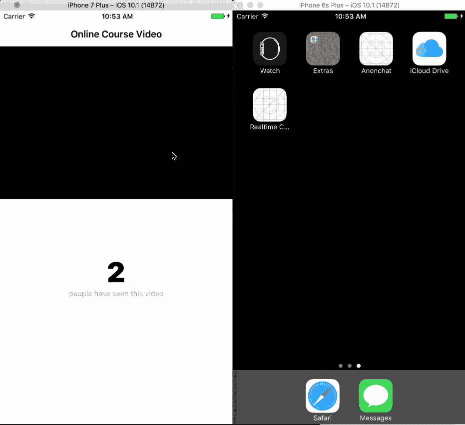
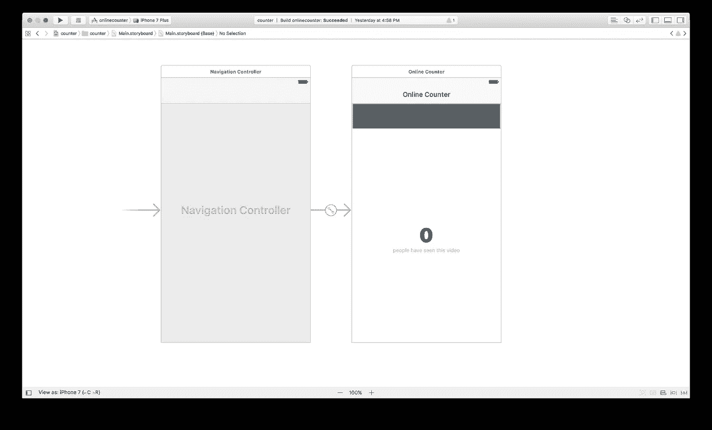
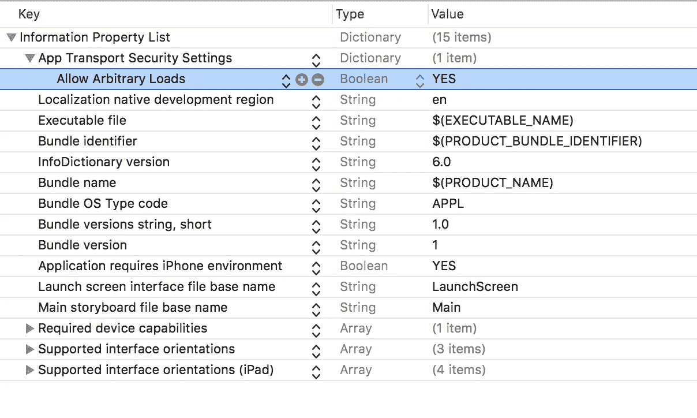

# 使用 Swift 构建实时计数器

> 原文：<https://medium.com/hackernoon/build-a-realtime-counter-using-swift-9008c3aa9a9c>

> 遵循本教程需要对 Swift 和 Node.js 有基本的了解。

应用程序(web 或其他)中最常见的元素之一是计数器。例如，YouTube 使用计数器来查看有多少人观看了某个视频。脸书也为他们平台上的视频做同样的事情。

然而，这些网站上的大多数计数器只在你刷新页面时才更新计数。这留下了许多需要改进的地方，因为有时你只是想实时看到数量的增加。这给你的印象是，目前有很多人在查看这个项目。

在本文中，我们将探讨如何利用 Pusher 的实时特性来创建一个实时更新的计数器。我们将创建一个视频浏览器 iOS 应用程序，实时计数器显示有多少人观看了视频。



要继续学习，您需要 Swift、Xcode 和命令行的基础知识。您还需要建立一个推销商帐户，并创建一个应用程序。你可以在这里这样做[。](https://pusher.com/)

# 基本设置

要开始，您需要在您的机器上安装 Cocoapods。Cocoapods 是一个包管理器，我们将使用它来管理应用程序的依赖性。要安装 Cocoapods，请在命令行中键入以下内容:

```
$ gem install cocoapods
```

安装完成后，启动 Xcode 并创建一个新的单页应用程序项目。按照设置向导进行操作，然后在 Xcode 项目编辑器打开后，关闭 Xcode。`cd`到你的项目的根目录并运行命令:

```
$ pod init
```

这应该会在项目的根目录下创建一个`Podfile`。在您喜欢的编辑器中打开该文件，然后将文件内容更新为以下内容:

```
# Uncomment the next line to define a global platform for your project
platform :ios, '9.0'target 'counter' do
  # Comment the next line if you're not using Swift and don't want to use dynamic frameworks
  use_frameworks! # Pods for counter
  pod 'Alamofire'
  pod 'PusherSwift'end
```

在上面的文件中，我们指定了两个依赖项:`PusherSwift`和`Alamofire`。这些在项目的后期会很有用。现在，通过从终端运行以下命令来安装这些依赖项:

```
$ pod install
```

一旦完成，您应该在项目的根目录下有一个`.xcworkspace`文件。打开这个文件，它应该会启动 Xcode。(在打开文件之前，请确保您没有为该项目运行任何 Xcode 实例，否则您将会得到一个错误。)

# 为我们的实时应用程序创建视图

现在项目已经打开，我们将为我们的应用程序创建一些视图。打开`Main.storyboard`文件，在那里我们将创建视图。

我们想要创建一个导航控制器，它将有一个`ViewController`作为导航控制器的根控制器。然后在新的视图控制器中，我们将添加一个 webview 这是我们将嵌入我们希望人们观看的视频的地方。我们还将添加两个标签，一个用于计数器，另一个只是普通的不可变消息。

在我们完成之后，这是我们目前所拥有的:



# 将我们的实时特性添加到应用程序中

既然我们已经创建了应用程序，现在我们可以添加与视图交互的代码，并添加实时支持和视频。

创建一个新的`MainViewController`类，并将其链接到我们上面创建的视图控制器。然后在 Xcode 中创建一个分割视图，ctrl+从`webview`拖动到视图控制器。这将在控制器中创建一个`@IBOutlet`；对计数器标签做同样的操作，这样它会创建另一个`@IBOutlet`。我们的控制器现在应该有两个`@IBOutlet`一个用于 webview，一个用于计数器标签。太好了。

现在我们将添加代码来加载我们的视频。在这个练习中，我们将使用 YouTube 上的一段视频来演示推手教程。在`viewDidLoad`方法中添加以下内容:

```
func viewDidLoad() {
    super.viewDidLoad()
    loadYoutube(videoID:"xDQ8vzD0lzw")
}
```

现在让我们创建`loadYoutube`方法和其他依赖方法:

```
func loadYoutube(videoID:String) {
    self.automaticallyAdjustsScrollViewInsets = false
    webview.allowsInlineMediaPlayback = true
    webview.mediaPlaybackRequiresUserAction = false let embedHTML = getEmbedHTML(id:videoID); let url: NSURL = NSURL(string: "[https://www.youtube.com/embed/\(videoID)](https://www.youtube.com/embed/\(videoID))")! webview.loadHTMLString(embedHTML as String, baseURL:url as URL )
}private func getEmbedHTML(id: String) -> String {
    return "<html><head><style type=\"text/css\">body {background-color: transparent;color: white;}</style></head><body style=\"margin:0\"> <iframe webkit-playsinline width=\"100%\" height=\"100%\" src=\"[https://www.youtube.com/embed/\(id)?feature=player_detailpage&playsinline=1\](https://www.youtube.com/embed/\(id)?feature=player_detailpage&playsinline=1\)" frameborder=\"0\"></iframe>";
}
```

现在，我们已经指示应用程序自动加载 YouTube 视频。但是，计数器功能还不能工作。让我们解决这个问题。

导入`PusherSwift`库并添加一个新方法，使用 Pusher 更新计数器:

```
updateViewCount() {
    let options = PusherClientOptions(
        host: .cluster("PUSHER_CLUSTER")
    ) pusher = Pusher(key: "PUSHER_KEY", options: options) let channel = pusher.subscribe("counter")
    let _ = channel.bind(eventName: "new_user", callback: { (data: Any?) -> Void in
        if let data = data as? [String: AnyObject] {
            let viewCount = data["count"] as! NSNumber
            self.count.text = "\(viewCount)" as String!
        }
    }) pusher.connect()
}
```

> *注意:在显示* `*PUSHER_CLUSTER*` *和* `*PUSHER_KEY*` *的地方，您应该用您实际的推杆组合和按键替换。你还需要导入*

现在你可以从`viewDidLoad`方法中调用`updateViewCount`，这样当视图被加载时它就会被调用。

我们要做的最后一件事是使用`Alamofire`向后端发送一个请求，这样计数器可以被更新和保存，这样我们就不会丢失观看视频的人数。导入`Alamofire`并添加以下内容:

```
func sendViewCount() {
    Alamofire.request(endpoint, method: .post).validate().responseJSON { response in
        switch response.result {
        case .success:
            if let result = response.result.value {
                let data = result as! NSDictionary
                let viewCount = data["count"] as! NSNumber
                self.count.text = "\(viewCount)" as String!
            }
        case .failure(let error):
            print(error)
        }
    }
}
```

现在我们已经完成了，现在`MainViewController`应该看起来有点像这样:

```
import UIKit
import Alamofire
import PusherSwiftclass MainViewController: UIViewController { [@IBOutlet](http://twitter.com/IBOutlet) weak var count: UILabel!
    [@IBOutlet](http://twitter.com/IBOutlet) weak var webview: UIWebView! var endpoint: String = "[http://localhost:4000/update_counter](http://localhost:4000/update_counter)" var pusher : Pusher! override func viewDidLoad() {
        super.viewDidLoad()
        loadYoutube(videoID:"xDQ8vzD0lzw")
        sendViewCount()
        updateViewCount()
    } func sendViewCount() {
        Alamofire.request(endpoint, method: .post).validate().responseJSON { response in
            switch response.result { case .success:
                if let result = response.result.value {
                    let data = result as! NSDictionary
                    let viewCount = data["count"] as! NSNumber
                    self.count.text = "\(viewCount)" as String!
                }
            case .failure(let error):
                print(error)
            }
        }
    } func updateViewCount() {
        let options = PusherClientOptions(
            host: .cluster("PUSHER_CLUSTER")
        ) pusher = Pusher(key: "PUSHER_KEY", options: options) let channel = pusher.subscribe("counter")
        let _ = channel.bind(eventName: "new_user", callback: { (data: Any?) -> Void in
            if let data = data as? [String: AnyObject] {
                let viewCount = data["count"] as! NSNumber
                self.count.text = "\(viewCount)" as String!
            }
        }) pusher.connect()
    } func loadYoutube(videoID:String) {
        self.automaticallyAdjustsScrollViewInsets = false
        webview.allowsInlineMediaPlayback = true
        webview.mediaPlaybackRequiresUserAction = false
        let embedHTML = getEmbedHTML(id:videoID); let url: NSURL = NSURL(string: "[https://www.youtube.com/embed/\(videoID)](https://www.youtube.com/embed/\(videoID))")!
        webview.loadHTMLString(embedHTML as String, baseURL:url as URL )
    } private func getEmbedHTML(id: String) -> String {
        return "<html><head><style type=\"text/css\">body {background-color: transparent;color: white;}</style></head><body style=\"margin:0\"> <iframe webkit-playsinline width=\"100%\" height=\"100%\" src=\"[https://www.youtube.com/embed/\(id)?feature=player_detailpage&playsinline=1\](https://www.youtube.com/embed/\(id)?feature=player_detailpage&playsinline=1\)" frameborder=\"0\"></iframe>";
    }
}
```

如果我们现在加载应用程序，它将加载视频，但计数器将不工作。这是因为我们还没有设置后端逻辑。

# 为我们的实时计数器 iOS 应用程序创建后端

对于后端，我们将创建一个非常基本的 Node.js 应用程序。这个应用程序只需要一个端点来保存计数器状态，并向 Pusher 发送一个触发器，这样订阅通道事件的其他侦听器就可以获取它并实时更新。

首先，为您的应用程序创建一个新目录。在应用程序中创建两个文件:

## 文件:package.json

```
{
  "main": "index.js",
  "dependencies": {
    "body-parser": "^1.16.0",
    "express": "^4.14.1",
    "pusher": "^1.5.1"
  }
}
```

**文件:index.js**

```
var Pusher = require('pusher');
let express = require('express');
let bodyParser = require('body-parser');
let fs = require('fs');let app = express();let pusher = new Pusher({
  appId: 'PUSHER_ID',
  key: 'PUSHER_KEY',
  secret: 'PUSHER_SECRET',
  cluster: 'PUSHER_CLUSTER',
  encrypted: true
});app.use(bodyParser.json());
app.use(bodyParser.urlencoded({ extended: false }));app.post('/update_counter', function(req, res) {
  let counterFile = './count.txt'; fs.readFile(counterFile, 'utf-8', function(err, count) {
    count = parseInt(count) + 1;
    fs.writeFile(counterFile, count, function (err) {
      pusher.trigger('counter', 'new_user', {count:count});
      res.json({count:count});
    });
  });
});app.use(function(req, res, next) {
    let err = new Error('Not Found');
    err.status = 404;
    next(err);
});module.exports = app;app.listen(4000, function(){
  console.log('App listening on port 4000!')
})
```

最后，在同一个目录中创建`counter.txt`文件，并将其改为可写。

```
$ echo "0" > count.txt 
$ chmod 0644 count.txt
```

现在运行`npm install`来安装 node 使后端应用程序工作所需的所有依赖项。当依赖项安装完成后，运行`node index.js`来启动应用程序。

为了让我们的应用程序与本地主机应用程序交互，我们需要做的最后一个更改是在我们的项目`info.plist`文件中。在启动应用程序之前，进行以下更改:



现在，当您启动应用程序时，您可以看到计数器增加，如果有应用程序的另一个实例，他们可以看到计数器实时增加。整洁！

# 结论

在本文中，我们探讨了如何在 iOS 应用程序中使用 Pusher 创建实时计数器。我们很想知道你会如何将它整合到你的 iOS 应用程序中。如果你有任何其他你想看的用例，或者有任何反馈，请在下面留下评论。

这篇文章最初出现在 [Pusher 博客](https://pusher.com/tutorials/counter-swift/)上。