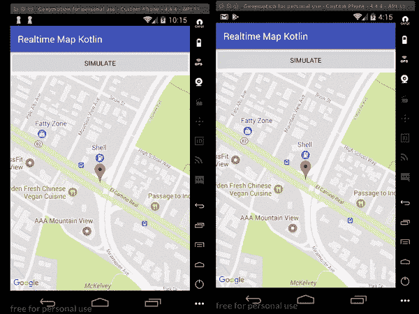

# 使用 Kotlin 构建实时地图

> 原文：<https://medium.com/hackernoon/build-a-realtime-map-using-kotlin-8f99ebd15fc>

> 要阅读本教程，需要对 Kotlin 和 Node.js 有基本的了解。

顾名思义，本文的目的是显示地图上标记的实时移动。此功能在位置跟踪应用中很常见。我们看到打车应用和订餐应用利用了这样的功能。Google 提供了一个非常简单的地图 API，我们将利用它，而实时功能将由 Pusher 负责。

# 我们将建造什么

我们将构建一个应用程序，该应用程序将基于我们注入其中的初始坐标从服务器接收坐标。收到这些坐标后，我们会在应用程序上更新地图。



# 要求

对于本教程，我们需要以下内容:

*   [安卓工作室](https://developer.android.com/studio/archive.html) —推荐 3.0.1 以上版本。
*   [安装在您机器上的节点 JS](https://nodejs.org/) 和 npm。
*   一个[推杆](https://dashboard.pusher.com)应用。
*   [谷歌地图 API 键](https://developers.google.com/maps/documentation/android-api/signup)。
*   安装了 Google Play 服务的 Android 设备。

# 构建我们的服务器

我们将使用节点 JS 构建我们的服务器。服务器会为我们生成随机坐标。首先，创建一个新文件夹。在其中，创建一个名为`package.json`的新文件，并粘贴如下内容:

```
{
    "main": "index.js",
    "dependencies": {
        "body-parser": "^1.16.0",
        "express": "^4.14.1",
        "pusher": "^1.5.1"
    }
}
```

接下来，在根目录下创建名为`index.js`的文件并粘贴:

```
// Load the required libraries
let Pusher = require('pusher');
let express = require('express');
let bodyParser = require('body-parser');// initialize express and pusher
let app = express();
let pusher = new Pusher(require('./config.js'));// Middlewares
app.use(bodyParser.json());
app.use(bodyParser.urlencoded({ extended: false }));// Generates 20 simulated GPS coords and sends to Pusher
app.post('/simulate', (req, res, next) => {
    let loopCount = 0
    let operator  = 0.001000  
    let longitude = parseFloat(req.body.longitude)
    let latitude  = parseFloat(req.body.latitude)

    let sendToPusher = setInterval(() => {
        loopCount++; // Calculate new coordinates and round to 6 decimal places...
        longitude = parseFloat((longitude + operator).toFixed(7))
        latitude  = parseFloat((latitude - operator).toFixed(7)) // Send to pusher
        pusher.trigger('my-channel', 'new-values', {longitude, latitude}) if (loopCount === 20) {
            clearInterval(sendToPusher)
        }
    }, 2000); res.json({success: 200})
})// Index
app.get('/', (req, res) => res.json("It works!"));// Serve app
app.listen(4000, _ => console.log('App listening on port 4000!'));
```

上面的代码是一个快速应用程序。在`/simulate`路线中，我们正在模拟经度和纬度值，然后将它们发送给 Pusher。这些将由我们的应用程序选择。

> *💡经度和纬度值通常从现实场景中被跟踪的设备获得。*

最后，我们将创建名为`config.js`的配置文件。将此片段粘贴到此处:

```
module.exports = {
    appId: 'PUSHER_APP_ID',
    key: 'PUSHER_APP_KEY',
    secret: 'PUSHER_APP_SECRET',
    cluster: 'PUSHER_APP_CLUSTER',
};
```

用推动器仪表板上的键替换那里的值。然后，通过在根目录下运行以下命令来安装我们的服务器所需的模块:

```
$ npm install
```

我们的服务器应该在端口 **4000** 上启动并运行。

# 在 Android Studio 中构建我们的实时地图

# 创建新的 Android 项目

打开 Android studio 并创建一个新项目。输入您的应用程序详细信息，包括 Kotlin 支持，选择一个最低的 SDK(这不应该低于 API 14)，选择一个空活动，并完成该过程。下面是这个过程的快速 GIF:


# 添加应用程序依赖项

这个演示有几个依赖项。我们需要实时功能的 Pusher 依赖，轻松将地图集成到我们的应用程序中的 Google Maps API，以及轻松访问我们的服务器的改进。

打开您的应用程序模块`build.gradle`文件并粘贴以下依赖项:

```
// Pusher dependency
implementation 'com.pusher:pusher-java-client:1.5.0'// Google maps API
implementation 'com.google.android.gms:play-services-maps:11.8.0'// Retrofit dependencies
implementation 'com.squareup.retrofit2:retrofit:2.3.0'
implementation 'com.squareup.retrofit2:converter-scalars:2.3.0'
```

同步您的 Gradle 文件，以便可以下载库并使其可用。

# 构建我们的布局

打开`activity_main.xml`并粘贴这个:

```
<?xml version="1.0" encoding="utf-8"?>
<FrameLayout xmlns:android="[http://schemas.android.com/apk/res/android](http://schemas.android.com/apk/res/android)"
    xmlns:tools="[http://schemas.android.com/tools](http://schemas.android.com/tools)"
    android:layout_width="match_parent"
    android:layout_height="match_parent"
    android:orientation="vertical">
    <fragment xmlns:android="[http://schemas.android.com/apk/res/android](http://schemas.android.com/apk/res/android)"
        xmlns:tools="[http://schemas.android.com/tools](http://schemas.android.com/tools)"
        android:layout_marginTop="50dp"
        android:id="@+id/map"
        android:name="com.google.android.gms.maps.SupportMapFragment"
        android:layout_width="match_parent"
        android:layout_height="match_parent"
        tools:context="com.example.mapwithmarker.MapsMarkerActivity" />
    <Button
        android:id="@+id/simulateButton"
        android:layout_width="match_parent"
        android:layout_height="wrap_content"
        android:text="Simulate" />
</FrameLayout>
```

在上面的代码片段中，我们有一个包含地图和按钮的片段。

# 设置 Google 地图 API 密钥

此时，您应该已经获得了 API 密钥。你可以按照这里[的步骤](https://developers.google.com/maps/documentation/android-api/signup)去拿。我们现在想用我们的密钥配置应用程序。打开你的`strings.xml`文件并粘贴进去。这位于`name-of-project/app/src/main/res/values`:

```
<resources>
    <!-- ... -->
    <string name="google_maps_key">GOOGLE_MAPS_KEY</string>
</resources>
```

> *⚠️将* `*GOOGLE_MAPS_KEY*` *占位符替换为谷歌的实际关键字。*

该文件包含应用程序开发过程中使用的所有字符串。应用程序中的所有原始字符串都保存在这里。当需要将您的应用程序翻译成多种语言时，这是必需的。

接下来，打开`AndroidManifest.xml`文件并将它们粘贴到`<application>`标签下:

```
<meta-data
    android:name="com.google.android.gms.version"
    android:value="[@integer/google_play_services_vers](http://twitter.com/integer/google_play_services_vers)ion" />
<meta-data
    android:name="com.google.android.geo.API_KEY"
    android:value="[@string/google_maps_key](http://twitter.com/string/google_maps_key)" />
```

有了这个，我们的应用程序就知道如何以及在哪里获取我们的密钥。

# 安装改装

我们已经有了作为依赖项的改型，但是我们还需要两样东西——一个显示要访问的端点/路由的接口和我们的改型对象。首先创建一个新的 Kotlin 文件名`ApiInterface.kt`并粘贴它:

```
import okhttp3.RequestBody
import retrofit2.Call
import retrofit2.http.Body
import retrofit2.http.POST
interface ApiInterface {
    [@POST](http://twitter.com/POST)("/simulate")
    fun sendCoordinates([@Body](http://twitter.com/Body) coordinates: RequestBody): Call<String>
}
```

因为我们在这个演示中只提出一个请求，所以我们将改造对象的范围限制在`MainActivity.kt`类。这意味着我们将在一个类中为它创建一个函数。将此函数粘贴到类中:

```
fun getRetrofitObject(): ApiInterface {
    val httpClient = OkHttpClient.Builder()
    val builder = Retrofit.Builder()
            .baseUrl("[http://10.0.3.2:4000/](http://10.0.3.2:4000/)")
            .addConverterFactory(ScalarsConverterFactory.create())
    val retrofit = builder
            .client(httpClient.build())
            .build()
    return retrofit.create(ApiInterface::class.java)
}
```

我使用了一个 Genymotion 模拟器，它的本地主机地址是`10.0.3.2`。

将互联网权限添加到`AndroidManifest.xml`文件:

```
<uses-permission android:name="android.permission.INTERNET"/>
```

# 配置我们的地图并获得实时更新

为了初始化和使用映射，我们的`MainActivity.kt`类必须实现`OnMapReadyCallback`接口并覆盖`onMapReady`方法。我们还需要设置 Pusher 来实时监听事件和接收模拟坐标。打开你的`MainActivity.kt`并粘贴这个:

```
import android.support.v7.app.AppCompatActivity
import android.os.Bundle
import android.util.Log
import com.google.android.gms.maps.*
import com.google.android.gms.maps.model.MarkerOptions
import com.google.android.gms.maps.model.LatLng
import com.pusher.client.Pusher
import com.pusher.client.PusherOptions
import kotlinx.android.synthetic.main.activity_main.*
import okhttp3.MediaType
import okhttp3.OkHttpClient
import org.json.JSONObject
import retrofit2.Call
import retrofit2.Callback
import retrofit2.Response
import retrofit2.Retrofit
import retrofit2.converter.scalars.ScalarsConverterFactory
import okhttp3.RequestBody
import com.google.android.gms.maps.model.CameraPosition
import com.google.android.gms.maps.model.Markerclass MainActivity : AppCompatActivity(), OnMapReadyCallback { private lateinit var markerOptions:MarkerOptions private lateinit var marker:Marker private lateinit var cameraPosition:CameraPosition var defaultLongitude = -122.088426 var defaultLatitude  = 37.388064 lateinit var googleMap:GoogleMap lateinit var pusher:Pusher override fun onCreate(savedInstanceState: Bundle?) {
        super.onCreate(savedInstanceState) setContentView(R.layout.activity_main) markerOptions = MarkerOptions() val latLng = LatLng(defaultLatitude,defaultLongitude) markerOptions.position(latLng) cameraPosition = CameraPosition.Builder()
                .target(latLng)
                .zoom(17f).build()
    } override fun onMapReady(googleMap: GoogleMap?) {
        this.googleMap = googleMap!! marker = googleMap.addMarker(markerOptions)
        googleMap.animateCamera(CameraUpdateFactory.newCameraPosition(cameraPosition))
    }
}
```

我们首先创建了一些类变量来保存我们的初始坐标和其他地图工具，比如相机位置和标记位置。我们在`onCreate`函数中初始化了它们。接下来，我们向模拟按钮添加了一个点击监听器。

接下来要做的事情还是在`MainActivity.kt`类。在`onCreate`方法中，粘贴这个:

```
simulateButton.setOnClickListener {
    callServerToSimulate()
}
```

点击按钮时，调用`callServerToSimulate`函数。像这样在类内创建一个函数`callServerToSimulate`:

```
private fun callServerToSimulate() {
    val jsonObject = JSONObject()
    jsonObject.put("latitude",defaultLatitude)
    jsonObject.put("longitude",defaultLongitude)
    val body = RequestBody.create(
        MediaType.parse("application/json"), 
        jsonObject.toString()
    )
    getRetrofitObject().sendCoordinates(body).enqueue(object:Callback<String>{
        override fun onResponse(call: Call<String>?, response: Response<String>?) {
            Log.d("TAG",response!!.body().toString())
        }
        override fun onFailure(call: Call<String>?, t: Throwable?) {
            Log.d("TAG",t!!.message)
        }
    })
}
```

在这个函数中，我们将初始坐标发送到服务器。然后，服务器生成二十个类似于最初发送的坐标，并使用 Pusher 将它们发送到通道`my-channel`，触发`new-values`事件。

接下来，我们用地图的视图 ID 创建并初始化一个`SupportMapFragment`对象:

```
val mapFragment = supportFragmentManager.findFragmentById(R.id.map)  as  SupportMapFragment
mapFragment.getMapAsync(this)
setupPusher()
```

接下来将`setupPusher`函数添加到该类中，它看起来应该是这样的:

```
private fun setupPusher() {
    val options = PusherOptions()
    options.setCluster(PUSHER_CLUSTER)
    pusher = Pusher(PUSHER_API_KEY, options) val channel = pusher.subscribe("my-channel") channel.bind("new-values") { channelName, eventName, data ->
        val jsonObject = JSONObject(data)
        val lat:Double = jsonObject.getString("latitude").toDouble()
        val lon:Double =  jsonObject.getString("longitude").toDouble()

        runOnUiThread {
            val newLatLng = LatLng(lat, lon)
            marker.position = newLatLng
            cameraPosition = CameraPosition.Builder()
                    .target(newLatLng)
                    .zoom(17f).build()
            googleMap.animateCamera(CameraUpdateFactory.newCameraPosition(cameraPosition))
        }
    }
}
```

我们在这里初始化 Pusher 并监听坐标更新。当我们接收到任何更新时，我们更新我们的标记并将摄像机视图移向新的点。您需要用 Pusher 仪表盘上的按键和详细信息替换 Pusher 参数。

然后我们在类中分别调用`onPause`和`onResume`函数中的 disconnect 和 connect 函数。这些函数继承自父类`AppCompatActivity`:

```
override fun onResume() {
    super.onResume()
    pusher.connect()
}override fun onPause() {
    super.onPause()
    pusher.disconnect()
}
```

# 结论

我们已经能够利用 Pusher、Kotlin 和谷歌地图 API 的力量来创建一个实时位置跟踪应用程序。希望你已经从教程中学到了一些东西，并且可以利用这些知识用 Pusher 和 Kotlin 构建漂亮的实时应用程序。

这篇文章最初出现在[推手](https://pusher.com/tutorials/realtime-map-kotlin)的博客上。