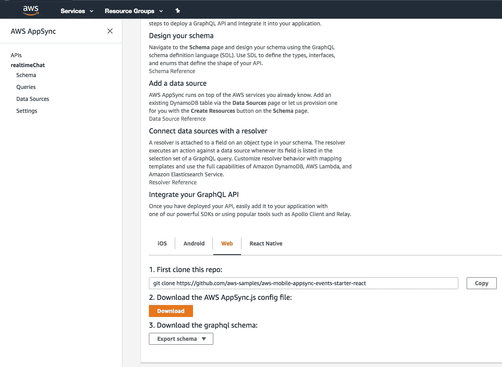

# 在 AWS 上用 Websockets 构建一个实时无服务器的 GraphQL API

> 原文：<https://medium.com/hackernoon/build-a-realtime-serverless-graphql-api-with-websockets-on-aws-d9e553a997>


随着 AWS AppSync 的发布，我们终于有能力在 AWS 上创建实时无服务器应用。以前，为了创建 websocket 连接，您不得不启动 EC2 实例，因为 AWS Lambda 不支持它们。

在本教程中，您将学习如何使用 AWS AppSync 构建一个简单的 [GraphQL](https://hackernoon.com/tagged/graphql) API。然后，您将使用普通的 [javascript](https://hackernoon.com/tagged/javascript) (没有框架)编写一个客户端应用程序，通过 websockets 接收实时更新。我们开始吧！

# 1.设置

继续安装无服务器框架 cli，我们将使用它来部署 AppSync GraphQL API 并为我们的项目创建一个新目录。

```
$ npm install -g serverless $ mkdir realtime-chat
$ cd realtime-chat
```

# 2.创建 GraphQL 模式

我们将为我们的聊天应用程序定义一个基本的 GraphQL 模式。

```
schema {
    query: Query
    mutation: Mutation
    subscription: Subscription
}type Subscription {
    inbox(to: String): Page
    [@aws_subscribe](http://twitter.com/aws_subscribe)(mutations: ["message"])
}type Mutation {
    message(body: String!, to: String!): Page!
}type Message {
    from: String!
    to: String!
    body: String!
    sentAt: String!
}type Query {
    me: String
}
```

除实时订阅之外的标准 GraphQL 模式，它使用特殊的语法向 AWS AppSync 指示订阅哪个变异(`@aws_subscribe(mutations: ["message"])`)，在本例中是`message`变异。

# 3.创建映射模板

现在我们已经定义了模式，我们需要为它添加解析器。如果你期望需要写一个 lambda 函数，那你就错了！AppSync 引入了[映射模板](https://docs.aws.amazon.com/appsync/latest/devguide/resolver-mapping-template-reference-overview.html)的概念，它将客户端请求翻译成后台存储(DynamoDB、elasticsearch 等)理解的请求，然后将响应再次翻译回客户端。

为了简单起见，我们正在创建一个没有数据库的 API。AppSync 提供了一种特殊类型的解析器，称为[本地解析器](https://docs.aws.amazon.com/appsync/latest/devguide/tutorial-local-resolvers.html)，它不保存请求数据，而是将请求数据转发给当时存在的任何订阅者。

让我们创建一个目录来存放我们的映射模板。

```
$ mkdir mapping-templates
```

然后，让我们在一个名为`mapping-templates/Message.request.vtl`的文件中为我们的`message`变异创建请求模板，它将从变异请求中提取字段。

```
{
  "version": "2017-02-28",
  "payload": {
    "body": "${context.arguments.body}",
    "from": "${context.identity.username}",
    "to":  "${context.arguments.to}",
    "sentAt": "$util.time.nowISO8601()"
  }
}
```

对于响应，我们只使用标准转发模板。用以下内容创建一个名为`mapping-templates/ForwardResult.response.vtl`的文件。

```
$util.toJson($context.result)
```

您的文件夹结构现在应该如下所示:

```
$ tree mapping-templates mapping-templates ├── ForwardResult.response.vtl └── Message.request.vtl
```

# 4.使用无服务器框架部署 AppSync GraphQL API

现在我们需要为无服务器框架创建一个配置文件来提供我们的 API。为此，我们将使用[无服务器 AppSync 插件](https://github.com/sid88in/serverless-appsync-plugin)。

用`npm`安装。

```
$ npm install --dev serverless-appsync-plugin
```

然后用以下内容创建一个`serverless.yml`文件。

```
---
service: realtime-chatframeworkVersion: ">=1.21.0 <2.0.0"plugins:
  - serverless-appsync-pluginprovider:
  name: aws
  region: eu-west-1custom:
  awsAccountId: ${env:AWS_ACCOUNT_ID}
  appSync:
    name: realtimeChat
    apiKey: ${env:APPSYNC_API_KEY}
    apiId: ${env:APPSYNC_API_ID}
    authenticationType: API_KEY
    schema: schema/schema.graphql
    serviceRole: "AppSyncServiceRole" # AppSyncServiceRole is a role defined by amazon and available in all accounts
    mappingTemplatesLocation: mapping-templates
    mappingTemplates:
      - dataSource: Chat
        type: Mutation
        field: message
        request: Message.request.vtl
        response: ForwardResult.response.vtl
      - dataSource: Chat
        type: Subscription
        field: inbox
        request: Message.request.vtl
        response: ForwardResult.response.vtl
    dataSources:
      - type: NONE  # use an AppSync local resolver
        name: Chat
        description: 'Chat relay'
```

如您所见，我们将数据源类型设置为`NONE`，以便使用[本地解析器](https://docs.aws.amazon.com/appsync/latest/devguide/tutorial-local-resolvers.html)，因为我们不想将聊天消息保存在数据库中，而是将它们转发给其他监听更新的客户端。

我们的`serverless.yml`配置包含一些我们必须提供的环境变量。让我们创建一个包含 AWS 帐户 ID 的`.env`文件，并动态填充其他变量。

```
# .envexport AWS_ACCOUNT_ID=123456789export APPSYNC_API_ID=$(aws appsync list-graphql-apis \
  --query 'graphqlApis[?name==`realtimeChat`].apiId' \
   --output text >/dev/null 2>&1)export APPSYNC_API_KEY=$(aws appsync list-api-keys \
  --api-id "$APPSYNC_API_ID" \
  --query 'apiKeys[0].id' \
   --output text >/dev/null 2>&1)
```

现在我们已经准备好用一个命令来部署我们的 API 了:

恭喜你！您刚刚部署了一个具有实时支持的 GraphQL API。

# 5.为客户端应用程序创建 GraphQL 查询

我们需要做的下一件事是创建 GraphQL 查询，我们将从我们的客户端使用它来查询我们的 API。

首先，让我们创建一个目录来存放我们的客户机代码。

```
$ mkdir src
```

然后让我们为我们的查询创建一个目录。

```
$ mkdir src/graphql
```

在`src/graphql/inboxSubscription.js`为我们的订阅查询创建一个文件，包含以下内容:

```
import gql from 'graphql-tag';export default gql`
subscription Inbox($to: String) {
    inbox(to: $to) {
      from
      body
    }
}`;
```

这只是一个简单的订阅查询，将返回`from`和`body`消息字段。

# 6.从 AWS 控制台下载 API 配置

我们需要下载应用程序的配置设置，以便它可以连接到我们的 GraphQL API。

导航到 AWS 控制台中的 AppSync 部分。选择您的 API 并下载 web 配置设置。



您的下载区中会有一个名为`AppSync.js`的文件。将这个目录移动到您的`src`目录，并将其重命名为`config.js`。

如果您将保护 API 的默认选项保留为`API_KEY`，那么您下载的配置文件应该如下所示。

```
export default {
  "graphqlEndpoint": "[https://xxxx.appsync-api.eu-west-1.amazonaws.com/graphql](https://xxxx.appsync-api.eu-west-1.amazonaws.com/graphql)",
  "region": "eu-west-1",
  "authenticationType": "API_KEY",
  "apiKey": "xxxxxxxxxxxxxxxxxxxxxxxxx"
}
```

# 7.用于订阅实时 API 更新的同构普通 JavaScript 客户端代码

我们将创建一个同构的客户端——既可以在浏览器中运行，也可以通过 node.js 在终端中运行。

首先让我们安装我们需要的依赖项。

```
$ npm install -s apollo-cache-inmemory apollo-client apollo-link aws-appsync aws-sdk es6-promise graphql graphql-cli graphql-tag isomorphic-fetch ws
```

然后让我们为应用程序创建一个入口点。

您的应用程序源代码目录现在应该包含以下内容。

```
$ tree src
src
├── config.js
├── graphql
│   └── inboxSubscription.js
└── index.js
```

将以下代码粘贴到您的`index.js`文件中:

```
const RECIPIENT = 'Bobby';if (!global.WebSocket) {
  global.WebSocket = require('ws');
}
if (!global.window) {
  global.window = {
    setTimeout: setTimeout,
    clearTimeout: clearTimeout,
    WebSocket: global.WebSocket,
    ArrayBuffer: global.ArrayBuffer,
    addEventListener: function () { },
    navigator: { onLine: true }
  };
}
if (!global.localStorage) {
  global.localStorage = {
    store: {},
    getItem: function (key) {
      return this.store[key];
    },
    setItem: function (key, value) {
      this.store[key] = value;
    },
    removeItem: function (key) {
      delete this.store[key];
    }
  };
}
require('es6-promise').polyfill();
require('isomorphic-fetch');// Require config file downloaded from AWS console with endpoint and auth info
const AppSyncConfig = require('./config').default;
const AWSAppSyncClient = require('aws-appsync').default;
import InboxSubscription from './graphql/inboxSubscription';// Set up Apollo client
const client = new AWSAppSyncClient({
  url: AppSyncConfig.graphqlEndpoint,
  region: AppSyncConfig.region,
  auth: {
    type: AppSyncConfig.authenticationType,
    apiKey: AppSyncConfig.apiKey,
  }
});client.hydrated().then(function (client) {const observable = client.subscribe({ query: InboxSubscription, variables: { to: RECIPIENT } });const realtimeResults = function realtimeResults(data) {
    console.log('realtime data: ', data);
  };observable.subscribe({
    next: realtimeResults,
    complete: console.log,
    error: console.log,
  });
});
```

对于这个简单的演示，我们已经将收件人硬编码为`Bobby`，但是很明显，您希望在实际应用程序中实现这种动态。

# 8.Node.js 客户端应用程序构建流程

此时，我们已经为 websockets 客户端编写了所有的源代码，我们只需要实现构建过程。因为源代码使用 es6 特性，我们需要使用 babel 来转换它。

安装我们需要的开发依赖项。

```
$ npm install --save-dev babel-cli babel-preset-es2015 rimraf webpack webpack-cli webpack-dev-server
```

现在让我们构建我们的应用程序。

```
$ rimraf build/ && babel ./src --out-dir build/ --ignore ./node_modules,./.babelrc,./package.json,./npm-debug.log --copy-file
```

# 9.Node.js 客户端应用程序

现在让我们运行 node.js 中的应用程序。

```
$ node build/index.js
```

在 AWS 控制台中导航到 AppSync API 中的`queries`页面，并运行以下 graphQL 变体来触发一些更新。

```
mutation Message {
    message(to: "Bobby", body: "Yo node!") {
        body
        to
        from
        sentAt
    }
}
```


您应该会看到消息立即出现在您的终端中。


# 10.浏览器客户端应用程序构建流程

记住我们写的代码是同构的。这意味着它可以在浏览器中运行。

首先安装我们需要的开发依赖项。

```
$ npm install --save-dev webpack webpack-cli webpack-dev-server
```

我们将使用 [webpack](https://webpack.js.org/) 来运行我们的构建过程，因此我们需要为它创建一个配置文件。在项目路径下创建一个名为`webpack.config.js`的文件，内容如下。

```
const path = require('path');module.exports = {
  entry: './src/index.js',
  output: {
    filename: 'bundle.js',
    path: path.resolve(__dirname, 'dist')
  }
};
```

由于 web 服务器将提供来自`dist`目录的资产，我们需要添加一个包含 webpack 将生成的`bundle.js`文件的`index.html`文件。在`dist/index.html`创建一个文件，内容如下。

```
<!DOCTYPE html>
<html>
<head>
  <title>AWS Serverless Websockets Demo</title>
</head>
<body></body>
<script type="text/javascript" src="bundle.js"></script>
</html>
```

# 10.浏览器客户端应用程序

运行以下命令，这将从`dist`目录中启动`[webpack-dev-server](https://github.com/webpack/webpack-dev-server)`服务资产。

```
$ webpack-dev-server --mode development --content-base dist/
```

然后在您的浏览器中导航到`http://localhost:8080`并打开开发工具，因为我们将把数据记录到控制台。

在 AWS 控制台中导航到 AppSync API 中的`queries`页面，并运行另一个 graphQL 变体来触发更新。

```
mutation Message {
    message(to: "Bobby", body: "hello browser!") {
        body
        to
        from
        sentAt
    }
}
```


您应该会看到更新被记录到浏览器的控制台中。


# 12.结论

我们已经用 node.js 和浏览器客户端建立了一个无服务器的 GraphQL API，通过 websockets 使用实时更新。不到 30 分钟的工作还不错！

虽然 AppSync 被宣传为托管 GraphQL API 服务，但对我来说，它最好的特性是提供实时更新的能力。以前，您必须全天候运行服务器才能做到这一点。现在，您可以获得无服务器的所有成本节约，并且没有管理服务器的任何麻烦。

github 上有这个[无服务器 websockets 示例](https://github.com/techjacker/appsync-realtime-vanillajs)的完整源代码。

如果你有兴趣了解更多关于构建实时无服务器应用的知识，那么请查看我即将推出的培训课程[AWS app sync 上的全栈无服务器 GraphQL 应用](https://andrewgriffithsonline.com/training/full-stack-serverless-graphql-appsync)。

【andrewgriffithsonline.com】最初发表于[](https://andrewgriffithsonline.com/blog/serverless-websockets-on-aws)**。**