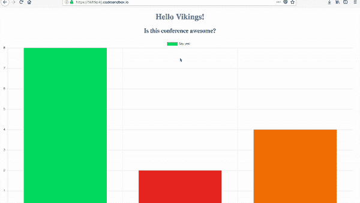
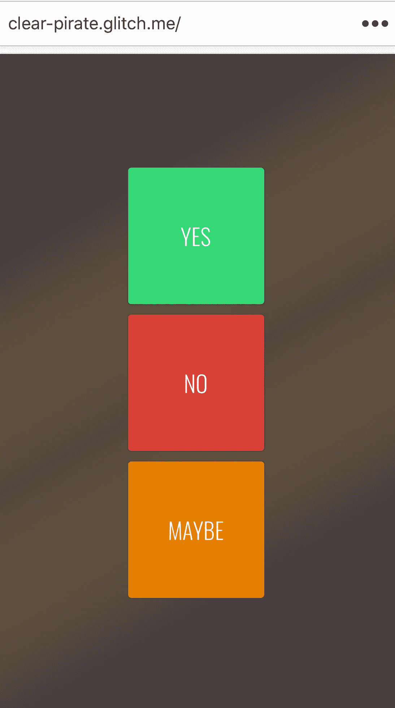
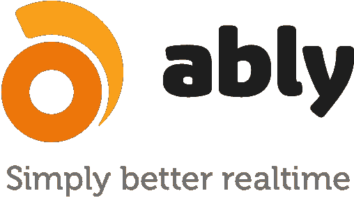
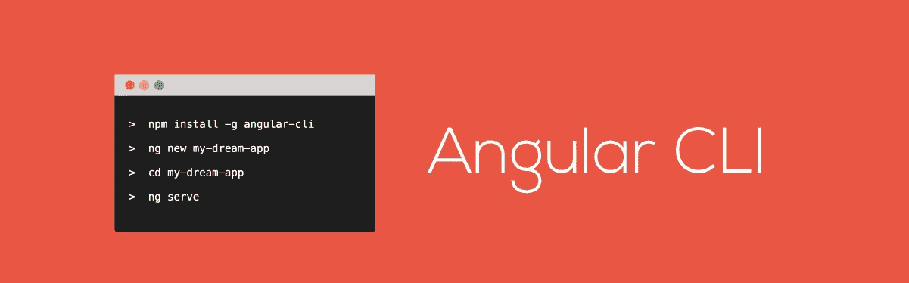
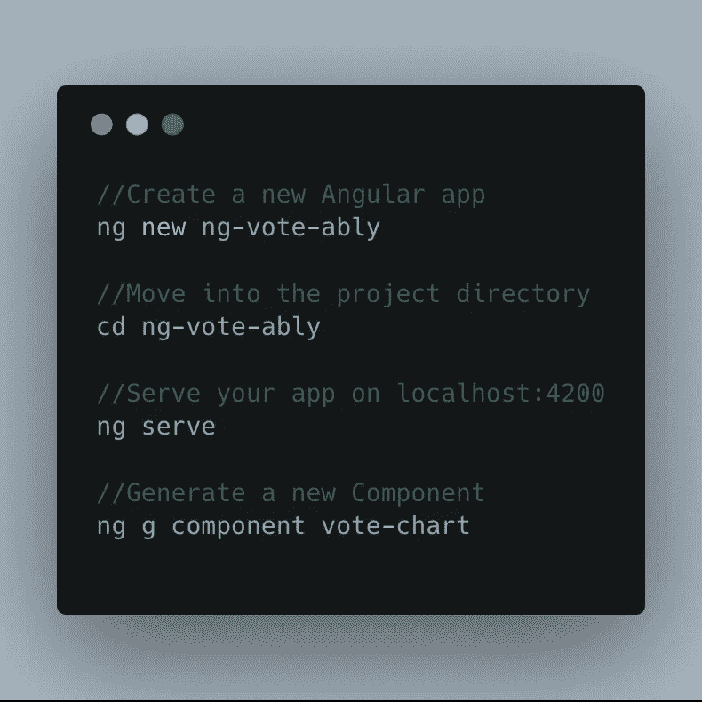
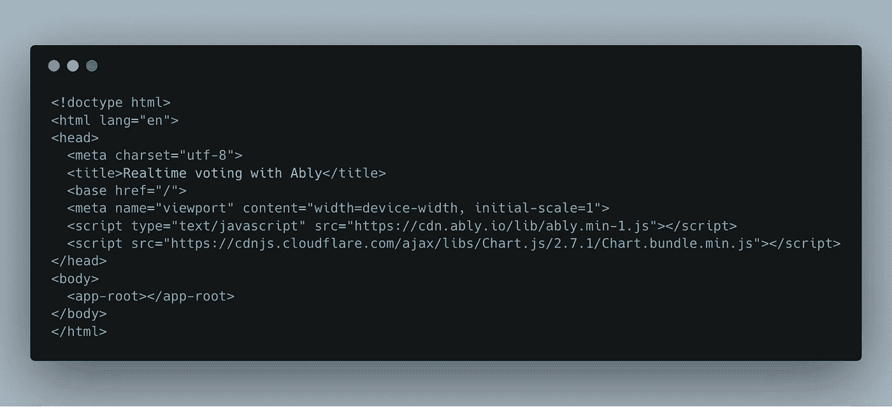
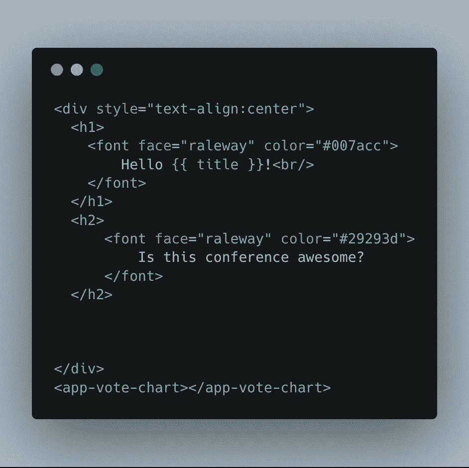
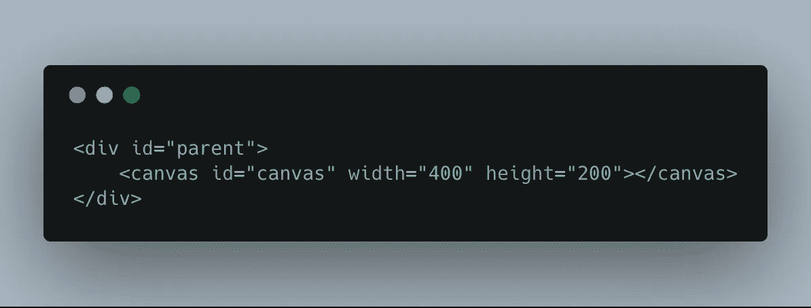
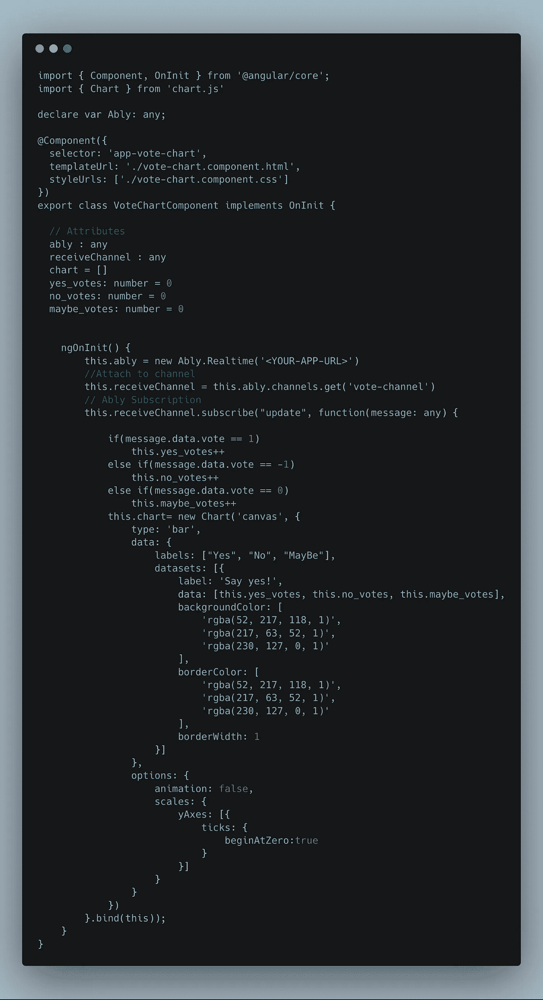
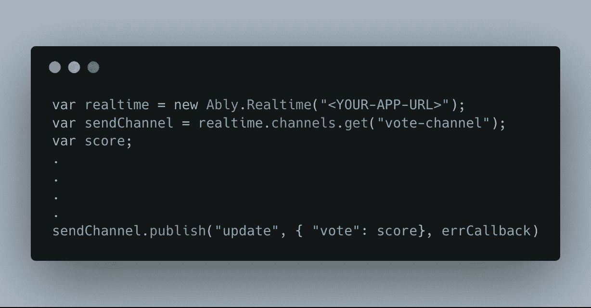

# 在不到 10 分钟的时间内构建一个实时投票应用程序

> 原文：<https://medium.com/hackernoon/build-a-realtime-voting-app-in-less-than-10-min-336ec364b5da>

实时技术和数据使得应用程序更加有用和实用。整个实时世界是如此迷人，它的每一点探索只会让人更加敬畏！

本教程是我在 2018 年 3 月在芬兰赫尔辛基举行的[维京人大会](http://ngvikings.org)上做的[演讲](https://youtu.be/PJZ06MLXGwA)的后续！[的演讲](https://speakerdeck.com/srushtika/understanding-the-realtime-ecosystem-2)可以在我的[个人资料](https://speakerdeck.com/srushtika)上查看。

# 我们将建造什么？

A quick preview of how the outcome would look

我们将构建一个简单的投票应用程序，允许与会者对会议的反馈进行实时投票，如上所示！

与会者将使用另一个由三个简单按钮组成的应用程序，每个按钮对应一种投票类型。一旦用户投票，所有按钮都被禁用，这样他们就不会重复投票。然而，这个应用程序并不是万无一失的，因为它不需要用户登录，因此，一个用户可以通过重复刷新页面来投多张票。因此，这只是一个实时演示:)

# 演示

如果你只是想试试最终的结果，打开浏览器，打开 angular 应用程序，这里是。现在从手机或另一个浏览器窗口/选项卡，打开投票应用程序托管，[此处](http://tiny.cc/realtime-voting)。

完整的源代码存放在我的 [GitHub repo](https://github.com/Srushtika/realtime-voting) 上。

# 我们将使用什么？

我们将使用一些 JavaScript 框架和库，这将使我们的工作变得更容易和更可展示。

## 1.能够实现实时功能

Ably Realtime

是一个优秀的实时消息平台，可以很容易地为我们的应用程序添加实时功能。它附带了实时库和 REST 库，根据用例来使用。对于我们的应用程序，我们将使用 Ably 的实时库，它允许我们通过 WebSockets 连接到平台。为此，您首先需要在这里创建一个新帐户(您可以免费获得一个)[并从仪表盘获取一个应用程序 URL。](https://ably.com/)

## 2.用于构建漂亮图表的 Chart.js

Chart.js is a library for implementing various types of charts

Chart.js 是一个库，它让我们可以轻松地包含漂亮的图形，这些图形代表静态或动态变化的数据。我们将使用 Chart.js 来显示用户的投票。

## 3.Angular 4 CLI 作为前端框架

Angular Command Line Interface

我们使用 Angular 4 构建投票应用程序。为什么？因为 Angular 是一个非常好的构建前端 web 应用的 JavaScript 框架。展望未来，Angular 有潜力利用像 [Ably](https://ably.com/) 这样的平台，漂亮地呈现实时获得的数据。如果你的系统上还没有安装这个软件，请按照[网站](https://cli.angular.io/)上的[这些](https://cli.angular.io/)简单步骤操作。

# 入门指南

我们将详细了解 angular 应用程序，它显示了实时投票数的图表。然而，我们将只浏览带有三个按钮的客户端应用程序，让用户投票，因为它非常简单！

注意:本教程是如何构建应用程序的高级概述，如果您希望复制代码，请访问 [GitHub repo](https://github.com/Srushtika/realtime-voting) 。

## 在 macOS 终端上通过 CLI 创建新的 Angular4 应用程序

在我们开始之前，请确保您的计算机上安装了节点包管理器( [npm](https://www.npmjs.com/get-npm) )和 [Angular CLI](https://cli.angular.io/) 。

首先创建一个新的 Angular 应用程序。我把它命名为*ng-vote ably*，可以随意修改。

接下来，移动到新的项目文件夹，并在您的浏览器上本地提供该应用程序，以确保初始设置没有问题。

如果到目前为止一切正常，我们将开始创建一个新的组件来保存我们的图表。我已经将组件命名为*投票图*，可以随意修改。

现在，在 src 文件夹内的 index.html 文件中，分别为 Ably 和 Chart.js 添加两个脚本，如下所示:

index.html

接下来，导航到 src->app->app.component.ts，并将其修改为包含以下内容:

app.component.html

请注意，还添加了一个新标记“app-vote-chart ”,它将保存我们之前创建的新组件的内容。

“title”变量是在 src->app->app.component.ts 中声明的。将它的内容修改为“Vikings ”,以便在插入 HTML 文件时，它会有一些意义。

## 投票图表组件

现在让我们写一些真正的代码吧！

在组件的 HTML 文件中，添加一个新的 div，它将包含我们图形的画布，如下所示:

vote-chart.component.html

现在，在组件的 TS 文件中，我们将连接到 Ably 的实时库，使用:

> 这是新的。实时(<your-app-url>)；</your-app-url>

附加到用户将在其上发布投票的频道，如下所示:

> this . receive channel = this . ably . channels . get(' vote-channel ')；

接下来，订阅该通道上的更新，以便在该通道上发布任何数据(新投票)时触发回调函数，如下所示:

> this . receive channel . subscribe(" update "，function(message: any) {}

但是在这样做之前，一定要导入 chart.js 并声明 Ably 变量。我们的目标是每当用户在名为“投票频道”的频道上发布任何投票时更新图表，如下所示。您的 *vote-chart.component.ts* 文件应该包含以下内容:

vote-chart.component.ts

如上所示，我们创建了一个新图表，并设置了标签和来自投票发布者的实际数据。此外，每种投票都有不同的背景颜色。对于每一个公布的投票，我们增加一个简单的计数器，并更新图表以反映这些新数据。

## 发布投票

包含可以用来投票的按钮的应用程序的完整代码可以在[这里](https://glitch.com/edit/#!/clear-pirate)找到。这是一个简单的 JavaScript 应用程序，当点击一个按钮时，它在“投票-频道”上发布投票，如下所示:

# 就是这样！

你的实时投票程序已经准备好了。如果你在实现这个应用程序时有任何困难，或者如果你有任何问题，请随时通过评论这个帖子或通过 [Twitter](http://twitter.com/Srushtika) 联系我。

如果你想了解实时技术世界的最新动态，订阅 Ably 的时事通讯吧！

如果你觉得这个教程有帮助，请鼓掌并分享:)