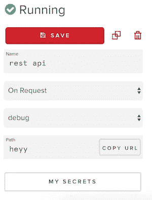

# 用 PubNub 在 5 分钟内构建一个 REST API

> 原文：<https://medium.com/hackernoon/build-a-rest-api-in-5-minutes-with-pubnub-38a5a982946e>

开发者需要 API。每一家提供基于互联网的服务的科技公司都公开了一个应用程序编程接口，让开发人员更快地完成工作，让 T2 更聪明。

构建一个 API 需要一个经验丰富的开发团队考虑所有的业务逻辑、安全性、网络负载和系统成本，以使公司成功地为客户服务。

[*在这里注册*](https://dashboard.pubnub.com/signup?utm_source=Syndication&utm_medium=Medium&utm_campaign=SYN-CY18-Q2-Medium-June-24) *到* ***获取自己的 API 密匙*** *并访问*[***PubNub***](https://hackernoon.com/tagged/pubnub)***函数*** *这样你就可以构建自己的 API* ***现在*** *。*

# API 开发

制作一个 API 所需的时间和精力可能非常昂贵。PubNub 的产品和 DevRel 团队深谙工程团队必须克服的障碍，以产生一个令人敬畏的 API。考虑到这些挑战，PubNub Functions 工程团队已经构建了 **On Request** 事件处理程序特性，使开发人员能够在几分钟而不是几个月内全局部署无服务器 [REST API](https://hackernoon.com/tagged/rest-api) 。

**而不是**抽出时间来

*   选择云托管提供商
*   购买域名并设置 DNS
*   配置 Kubernetes 集群
*   将应用代码和微服务归档
*   将代码全局部署到几个存在点

…你可以通过点击一个按钮将你的代码部署到一个 **PubNub 函数事件处理器**，或者用 [PubNub 命令行接口](https://www.pubnub.com/docs/blocks/cli-api?utm_source=Syndication&utm_medium=Medium&utm_campaign=SYN-CY18-Q2-Medium-June-24)部署一行代码。

# PubNub 函数

PubNub 函数是 JavaScript 事件处理程序，可以在传输中的 PubNub 消息上执行，或者在 HTTPS 上以 RESTful API 的请求/响应风格执行。如果你熟悉 [Node.js](https://nodejs.org/en/) 和 [Express](https://expressjs.com/) ，那么 On Request 事件处理程序的开发将成为你的第二天性。

部署代码可以在命令行上使用 npm 上的`pubnub-cli`来完成，也可以通过 CI/CD 来完成，就像本教程中的[一样。](https://www.pubnub.com/blog/ci-cd-deploy-pubnub-functions-cli/?utm_source=Syndication&utm_medium=Medium&utm_campaign=SYN-CY18-Q2-Medium-June-24)

使用命令行进行部署，[参见这个工具](https://www.pubnub.com/docs/blocks/cli-api?utm_source=Syndication&utm_medium=Medium&utm_campaign=SYN-CY18-Q2-Medium-June-24)。

PubNub 函数是无服务器的。无需担心部署流程、维护基础架构或扩展。我们在世界各地有几个同时部署您的代码的地点。这将确保您的用户无论身在何处都能获得极低的延迟体验**。**

首先，在 [**PubNub**](https://dashboard.pubnub.com/signup?utm_source=Syndication&utm_medium=Medium&utm_campaign=SYN-CY18-Q2-Medium-June-24) 创建一个永久**免费账户，然后点击仪表板中的**功能选项卡**。根据请求**创建一个**模块**和一个类型为**的事件处理程序。**

按下右边的 play 按钮，使用左边的 UI 进行测试 **GET** 、 **POST** 、 **PUT** 、 **DELETE** 请求。

左边的**复制 URL** 按钮给出了这个 API 可以访问的公共 URL。结尾的**路径**可以调整，但是 URL 本身是不可变的。

*其余 API 示例在我的* [***GitHub 库***](https://github.com/ajb413/pfunc-rest-api-example) *中的一个事件处理程序中演示。*

*使用* [*功能 CLI*](https://www.pubnub.com/docs/blocks/cli-api?utm_source=Syndication&utm_medium=Medium&utm_campaign=SYN-CY18-Q2-Medium-June-24) *或仪表盘中的编辑器部署功能代码。*

*接下来，在您喜欢的 web 浏览器中运行****index.html****文件，直接与您的 REST API 进行交互。*

# 例子

这个 repo 中的事件处理程序展示了如何在 API 中发挥作用。每个路由 URL 参数都有一个指向 JavaScript 函数的控制器对象。

作为开发人员，您为每个控制器分配路径名，如代码片段所示。应该为使用的每个 HTTP 请求方法(如 GET、POST、PUT、PATCH 和 DELETE)定义函数定义。方法是这些对象中的键，JavaScript 函数是值。方法字符串被转换成**小写**，所以像**获取**、**发布**、**放置**、**修补**，或者**删除**那样定义你的函数。

最底层的代码根据请求方法和 URL 参数(如 **route** )选择要执行的函数。如果在后端没有定义路线，则返回 **404** 。

以下功能是为账户**的 API 路径执行的控制器**。account 是一个 JSON 对象，包含各种客户数据。KV Store 功能的使用类似于数据库，通过指定的 **ID** 检索/存储对象。这些函数展示了如何在您的 API 中实现基本的**创建**、**读取**、**更新**或**销毁**功能。

# REST API 的 CRUD 方法

# 返回一个 HTML 响应

# 代理一个或多个外部 API 请求

在一次事件处理程序执行中，最多可以发出 3 个`xhr`请求。可以使用 JavaScript promises 将它们链接起来。

同样，需要秘密 API 密钥的 API 请求可以在使用[库](https://www.pubnub.com/docs/blocks/vault-module?utm_source=Syndication&utm_medium=Medium&utm_campaign=SYN-CY18-Q2-Medium-June-24)的函数中正确实现。通过在事件处理程序编辑器页面中点击**我的秘密**向模块添加秘密密钥。

# 测试 REST API

我已经创建了一个 HTML 文件，可以在 web 浏览器中打开它来测试 API 功能。如果你还没有，将你的代码部署到 PubNub 函数中，作为一个**请求**事件处理程序(在这里注册一个永远免费的账户[)。](https://dashboard.pubnub.com/signup?utm_source=Syndication&utm_medium=Medium&utm_campaign=SYN-CY18-Q2-Medium-June-24)

接下来，复制 live REST API 的 URL，并将其粘贴到 HTML 文件的第 50 行。您可以在 PubNub 函数事件处理程序编辑器页面中找到该 URL 点击左侧的**复制网址**按钮。

保存文件，用 Chrome 或 FireFox 等现代浏览器打开。

接下来，使用 UI**选择一个单选按钮**。它们中的每一个都对应于 PubNub 函数中的一个端点。选择一个使用普通 JavaScript 的 **XMLHttpRequest** 准备适当的请求。要执行，按下**发送请求**按钮。在您按下按钮后，JavaScript 代码将请求和响应细节写入屏幕。

# 警报和监控

想知道您的 API 是否正在经历宕机？将`pubnub`模块包含在您的事件处理程序中，并在发生**时发布到通道。catch** 块执行。这可以配置为弹性搜索和寻呼功能。您也可以将此 repo 用于[持续监控应用](https://github.com/bigoper/pubnub-monitoring-functions)。

# 成功！

你现在可以看到 PubNub 函数非常强大。使用该系统部署的事件处理程序可以在任何时候处理大量的请求。用这个 [GitHub repo](https://github.com/ajb413/pfunc-rest-api-example) 做自己的 REST API。如果您有任何问题或需要一些建议，请联系 devrel@pubnub.com。

*原载于*[*www.pubnub.com*](https://www.pubnub.com/blog/build-a-rest-api-in-5-minutes-with-pubnub/?utm_source=Syndication&utm_medium=Medium&utm_campaign=SYN-CY18-Q2-Medium-June-24)*。*