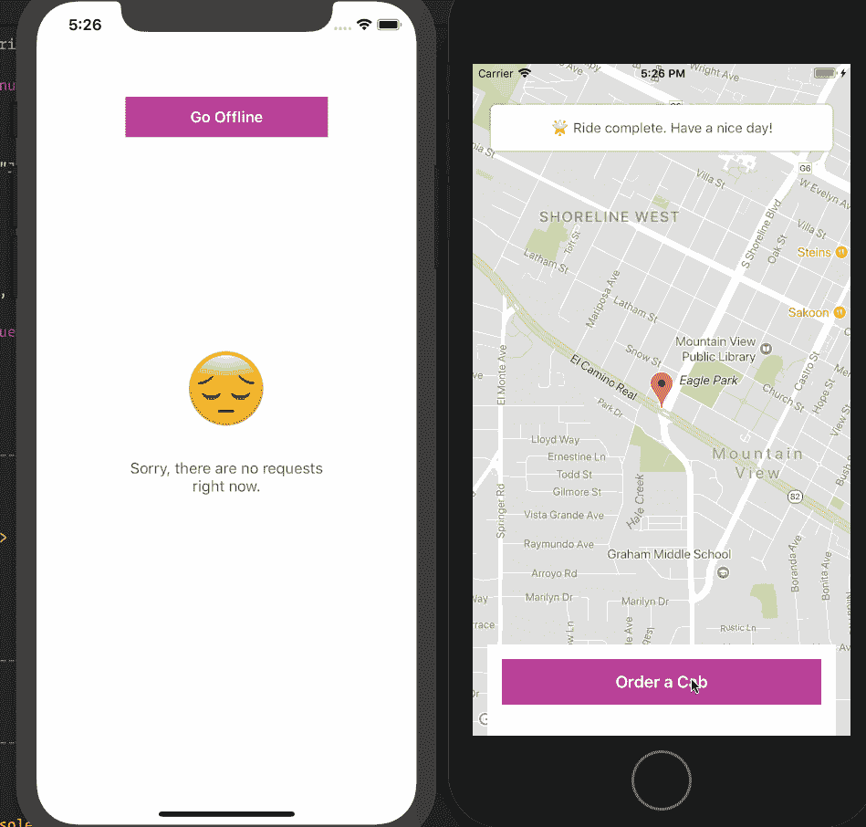
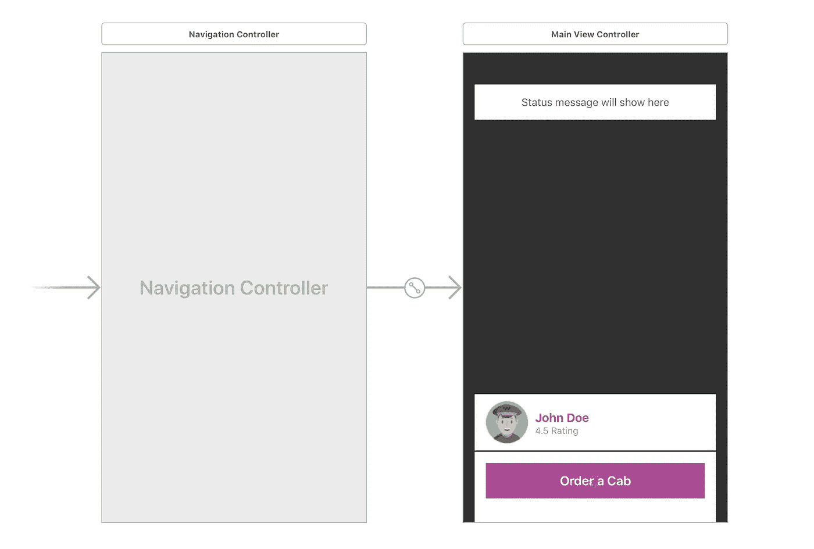

# 构建一个带有推送通知的乘车共享 iOS 应用程序。

> 原文：<https://medium.com/hackernoon/build-a-ride-sharing-ios-app-with-push-notifications-96a5e2324cc>

> 要学习本教程，您需要一台安装了 Xcode 的 Mac、Xcode 和 Swift 的知识、JavaScript(包括 Node.js)的基础知识、一个 Pusher 帐户和安装在您机器上的 Cocoapods。

像[优步](https://uber.com)和 [Lyft](https://lyft.com) 这样的拼车应用可以让乘客向他们所在地区的司机请求搭车。当乘客请求搭车时，应用程序会尽快找到司机。如果乘客在等待时关闭了应用程序，他们需要一种方式来通知他们汽车正在路上，一旦汽车到达，他们就会再次收到通知。

在本文中，我们将创建一个简单的虚拟乘车共享应用程序，重点关注如何集成 Pusher 的 Beams API 来提供事务性推送通知。

我们将制作两个 iOS 应用程序来满足司机和骑手的需求，并制作一个 Node.js 应用程序来支持他们。然后，我们将添加推送通知，提醒司机有新的乘车请求，并提醒乘客他们有司机在路上，一旦他们到达。

# 先决条件

*   安装了 Xcode 的 Mac。[在这里下载 Xcode】。](https://developer.apple.com/xcode/)
*   Xcode 使用知识。
*   [迅捷](https://developer.apple.com/swift/)的知识。
*   推销账户。[在这里创建一个](http://pusher.com)。
*   一个谷歌地图 API 密钥。[在这里创建一个](https://developers.google.com/maps/documentation/ios-sdk/get-api-key)。
*   JavaScript/Node.js 基础知识([查看本教程](https://www.w3schools.com/nodejs/default.asp))。
*   安装在您的机器上的 Cocoapods [。](https://guides.cocoapods.org/using/getting-started.html)

一旦有了要求，就开始吧。

# 关于我们的应用

在本教程中，我们将制作三个应用程序:

*   后端应用程序(使用 Node.js 的 Web)。这将是两个 iOS 应用程序的动力之家。它将包含应用程序正常运行所需的所有端点。它还将负责向各个设备发送推送通知。
*   骑手应用程序(使用 Swift 的 iOS)。这将是骑手用来请求乘车的应用程序。
*   驱动程序应用程序(使用 Swift 的 iOS)。这将是司机用来接受乘客请求的应用程序。驾驶员将能够根据情况更新游乐设备的状态。

这是我们完成后的屏幕录像:



> *💡我们不会过多关注拼车功能，但我们将主要关注如何将推送通知集成到应用程序中。*

# 构建后端应用程序(API)

我们首先要构建的是 API。我们将添加支持我们的 iOS 应用程序所需的一切，然后在稍后添加推送通知。

首先，为 API 创建一个项目目录。在目录中，创建一个名为`package.json`的新文件，并在文件中粘贴以下内容:

```
{
      "main": "index.js",
      "scripts": {},
      "dependencies": {
        "body-parser": "^1.18.2",
        "express": "^4.16.2",
        "pusher": "^1.5.1",
        "pusher-push-notifications-node": "^0.10.1"
      }
    }
```

接下来，在您的终端中运行以下命令:

```
$ npm install
```

这将安装所有列出的依赖项。接下来，在与`package.json`文件相同的目录下创建一个`index.js`文件，并粘贴以下代码:

```
// --------------------------------------------------------
    // Pull in the libraries
    // -------------------------------------------------------- const app = require('express')()
    const bodyParser = require('body-parser')
    const config = require('./config.js')
    const Pusher = require('pusher')
    const pusher = new Pusher({
        appId: 'PUSHER_APP_ID',
        key: 'PUSHER_APP_KEY',
        secret: 'PUSHER_APP_SECRET',
        cluster: 'PUSHER_APP_CLUSTER',
        encrypted: true
    }) // --------------------------------------------------------
    // In-memory database
    // -------------------------------------------------------- let rider = null
    let driver = null
    let user_id = null
    let status = "Neutral" // --------------------------------------------------------
    // Express Middlewares
    // -------------------------------------------------------- app.use(bodyParser.json())
    app.use(bodyParser.urlencoded({extended: false})) // --------------------------------------------------------
    // Helpers
    // -------------------------------------------------------- function uuidv4() {
        return 'xxxxxxxx-xxxx-4xxx-yxxx-xxxxxxxxxxxx'.replace(/[xy]/g, function (c) {
            var r = Math.random() * 16 | 0, v = c == 'x' ? r : (r & 0x3 | 0x8);
            return v.toString(16);
        });
    } // --------------------------------------------------------
    // Routes
    // -------------------------------------------------------- // ----- Rider -------------------------------------------- app.get('/status', (req, res) => res.json({ status })) app.get('/request', (req, res) => res.json(driver)) app.post('/request', (req, res) => {
        user_id = req.body.user_id
        status = "Searching"
        rider = { name: "Jane Doe", longitude: -122.088426, latitude: 37.388064 } pusher.trigger('cabs', 'status-update', { status, rider })
        res.json({ status: true }) })
    app.delete('/request', (req, res) => {
        driver = null
        status = "Neutral"
        pusher.trigger('cabs', 'status-update', { status })
        res.json({ status: true })
    }) // ----- Driver ------------------------------------------ app.get('/pending-rider', (req, res) => res.json(rider)) app.post('/status', (req, res) => {
        status = req.body.status if (status == "EndedTrip" || status == "Neutral") {
            rider = driver = null
        } else {
            driver = { name: "John Doe" }
        } pusher.trigger('cabs', 'status-update', { status, driver })
        res.json({ status: true })
    }) // ----- Misc --------------------------------------------- app.get('/', (req, res) => res.json({ status: "success" })) // --------------------------------------------------------
    // Serve application
    // -------------------------------------------------------- app.listen(4000, _ => console.log('App listening on port 4000!'))
```

> *💡您需要将* `*PUSHER_APP_**` *键替换为推杆仪表板上的真实键。*

在上面的代码中，我们首先获取应用程序运行所需的所有依赖项。接下来，我们设置一些变量来保存数据，作为内存中的数据存储。然后我们定义一个 UUID 生成器函数，我们将使用它来生成对象的 ID。接下来，我们定义我们的应用程序路线:

*   `POST /request`保存对驱动程序的新请求。
*   `GET /request`获取处理请求的驱动程序。
*   取消搭车请求。
*   `GET /pending-order`获取挂起的请求。
*   `POST /status`改变游乐设备的状态。

这就是我们现在在 API 中所需要的，当我们需要发送推送通知时，我们将再次访问它。如果您想测试 API 是否正常工作，那么在您的终端上运行以下命令:

```
$ node index.js
```

这将启动一个监听端口 **4000** 的新节点服务器。

# 构建骑士应用程序

我们需要做的下一件事是构建客户端应用程序。启动 Xcode 并创建一个新的“单一应用程序”项目。我们将把这个项目命名为 **RiderClient。**

项目创建完成后，退出 Xcode，在刚刚创建的 Xcode 项目的根目录下创建一个名为`Podfile`的新文件。在文件中粘贴以下代码:

```
platform :ios, '11.0'

    target 'RiderClient' do
      use_frameworks!
      pod 'GoogleMaps', '~> 2.6.0'
      pod 'PusherSwift', '~> 5.1.1'
      pod 'Alamofire', '~> 4.6.0'
    end
```

在上面的文件中，我们指定了项目需要运行的依赖项。**记得把上面的** `**target**` **改成你项目的名字。**现在，在您的终端中，运行以下命令来安装依赖项:

```
$ pod install
```

安装完成后，打开由 Cocoapods 生成的 Xcode 工作空间文件。这将重新启动 Xcode。

当 Xcode 重新启动后，打开`Main.storyboard`文件，在那里我们将为我们的客户端应用程序创建故事板。下面是我们如何设计故事板的截图:



在主视图控制器中，我们定义了显示游乐设备状态、驾驶员详细信息和 CTA 按钮的视图。

> *💡CTA 是* ***号召行动*** *的缩写。*

在 Xcode 中创建一个名为`MainController.swift`的新文件，并将其作为上面主视图控制器的自定义类。接下来粘贴以下代码:

```
import UIKit
    import Alamofire
    import GoogleMaps class MainViewController: UIViewController, GMSMapViewDelegate {
        var latitude = 37.388064
        var longitude = -122.088426
        var locationMarker: GMSMarker! @IBOutlet weak var mapView: GMSMapView!
        @IBOutlet weak var loadingIndicator: UIActivityIndicatorView!
        @IBOutlet weak var loadingOverlay: UIView!
        @IBOutlet weak var orderButton: UIButton!
        @IBOutlet weak var orderStatusView: UIView!
        @IBOutlet weak var orderStatus: UILabel!
        @IBOutlet weak var cancelButton: UIButton!
        @IBOutlet weak var driverDetailsView: UIView! override func viewDidLoad() {
            super.viewDidLoad()
            mapView.camera = GMSCameraPosition.camera(withLatitude:latitude, longitude:longitude, zoom:15.0)
            mapView.delegate = self
            locationMarker = GMSMarker(position: CLLocationCoordinate2D(latitude: latitude, longitude: longitude))
            locationMarker.map = mapView
            orderStatusView.layer.cornerRadius = 5
            orderStatusView.layer.shadowOffset = CGSize(width: 0, height: 0)
            orderStatusView.layer.shadowColor = UIColor.black.cgColor
            orderStatusView.layer.shadowOpacity = 0.3 updateView(status: .Neutral, msg: nil)
        }
    }
```

在上面的代码中，我们有视图控制器类。在`viewDidLoad`我们建立了谷歌地图，并调用了`updateView`方法。`updateView`方法是一个辅助函数，它只是根据`RideStatus`改变显示的视图。将方法添加到类中:

```
private func updateView(status: RideStatus, msg: String?) {
        switch status {
        case .Neutral:
            driverDetailsView.isHidden = true
            loadingOverlay.isHidden = true
            orderStatus.text = msg != nil ? msg! : "💡 Tap the button below to get a cab."
            orderButton.setTitleColor(UIColor.white, for: .normal)
            orderButton.isHidden = false
            cancelButton.isHidden = true
            loadingIndicator.stopAnimating() case .Searching:
            loadingOverlay.isHidden = false
            orderStatus.text = msg != nil ? msg! : "🚕 Looking for a cab close to you..."
            orderButton.setTitleColor(UIColor.clear, for: .normal)
            loadingIndicator.startAnimating()
        case .FoundRide, .Arrival:
            driverDetailsView.isHidden = false
            loadingOverlay.isHidden = true if status == .FoundRide {
                orderStatus.text = msg != nil ? msg! : "😎 Found a ride, your ride is on it's way"
            } else {
                orderStatus.text = msg != nil ? msg! : "⏰ Your driver is waiting, please meet outside."
            } orderStatus.text = msg != nil ? msg! : "😎 Found a ride, your ride is on it's way"
            orderButton.isHidden = true
            cancelButton.isHidden = false
            loadingIndicator.stopAnimating()
        case .OnTrip:
            orderStatus.text = msg != nil ? msg! : "🙂 Your ride is in progress. Enjoy."
            cancelButton.isEnabled = false
        case .EndedTrip:
            orderStatus.text = msg != nil ? msg! : "🌟 Ride complete. Have a nice day!"
            orderButton.setTitleColor(UIColor.white, for: .normal)
            driverDetailsView.isHidden = true
            cancelButton.isEnabled = true
            orderButton.isHidden = false
            cancelButton.isHidden = true
        }
    }
```

接下来是调用向 API 发送请求的`sendRequest`方法的`orderButtonPressed`方法。下一个方法是`cancelButtonPressed`，它也调用`sendRequest`方法。

```
@IBAction func orderButtonPressed(_ sender: Any) {
        updateView(status: .Searching, msg: nil)

        sendRequest(.post) { successful in
            guard successful else {
                return self.updateView(status: .Neutral, msg: "😔 No drivers available.")
            }
        }
    }

    @IBAction func cancelButtonPressed(_ sender: Any) {
        sendRequest(.delete) { successful in
            guard successful == false else {
                return self.updateView(status: .Neutral, msg: nil)
            }
        }
    }

    private func sendRequest(_ method: HTTPMethod, handler: @escaping(Bool) -> Void) {
        let url = AppConstants.API_URL + "/request"
        let params = ["user_id": AppConstants.USER_ID]

        Alamofire.request(url, method: method, parameters: params)
            .validate()
            .responseJSON { response in
                guard response.result.isSuccess,
                    let data = response.result.value as? [String:Bool],
                    let status = data["status"] else { return handler(false) }

                handler(status)
            }
    }
```

# 使用 Pusher 集成实时更新

接下来，让我们给视图控制器添加一些推送功能，这样它就可以实时获取对`RideStatus`的更改。

首先，您需要`import`Pusher swift SDK:

```
import PusherSwift
```

然后在类的顶部定义`pusher`变量:

```
let pusher = Pusher(
        key: AppConstants.PUSHER_API_KEY,
        options: PusherClientOptions(host: .cluster(AppConstants.PUSHER_API_CLUSTER))
    )
```

接下来，将以下方法添加到该类中:

```
private func listenForUpdates() {
        let channel = pusher.subscribe("cabs")

        let _ = channel.bind(eventName: "status-update") { data in
            if let data = data as? [String:AnyObject] {
                if let status = data["status"] as? String, 
                let rideStatus = RideStatus(rawValue: status) {
                    self.updateView(status: rideStatus, msg: nil)
                }
            }
        }

        pusher.connect()
    }
```

上面的方法只是订阅了一个 Pusher 通道，并绑定到通道上的`status-update`事件。当事件被触发时，调用`updateView`方法。

最后在`viewDidLoad`方法的底部，添加一个对`listenForUpdates`方法的调用:

```
listenForUpdates()
```

现在，当后端应用程序触发一个状态更新事件时，我们的 rider 应用程序将获取它，并根据需要更改 UI。

# 设置谷歌地图

接下来，打开您的`AppDelegate`类并导入以下内容:

```
import GoogleMaps
```

接下来，您可以用以下代码替换`application(didFinishLaunchingWithOptions:)`方法:

```
func application(_ application: UIApplication, didFinishLaunchingWithOptions launchOptions: [UIApplicationLaunchOptionsKey: Any]?) -> Bool {
        GMSServices.provideAPIKey(AppConstants.GOOGLE_API_KEY)
        return true
    }
```

# 定义密钥和乘坐状态

创建一个名为`AppConstants.swift`的新文件，并粘贴以下代码:

```
import Foundation class AppConstants {
        static let GOOGLE_API_KEY = "GOOGLE_MAPS_API_KEY"
        static let PUSHER_API_KEY = "PUSHER_APP_KEY"
        static let PUSHER_API_CLUSTER = "PUSHER_APP_CLUSTER"
        static let API_URL = "http://127.0.0.1:4000"
        static let USER_ID = UUID().uuidString
    }
```

> ⚠️您需要用各自仪表板中的实际值替换上面的占位符。

接下来，创建一个名为`RideStatus.swift`的文件，我们将在这里定义所有可用的游乐设备状态:

```
import Foundation

    enum RideStatus: String {
        case Neutral = "Neutral"
        case Searching = "Searching"
        case FoundRide = "FoundRide"
        case Arrived = "Arrived"
        case OnTrip = "OnTrip"
        case EndedTrip = "EndedTrip"
    }
```

这就是客户端应用程序的全部内容。让我们继续创建 Rider 应用程序。

我们需要做的最后一件事是修改`info.plist`文件。我们需要在`plist`文件中添加一个条目，以允许连接到我们的本地服务器:


让我们转到 rider 应用程序。

# 构建驱动程序应用程序

启动 Xcode 并创建一个新的“单一应用程序”项目。我们将把我们的项目命名为 **RiderDriver。**

项目创建完成后，退出 Xcode，在刚刚创建的 Xcode 项目的根目录下创建一个名为`Podfile`的新文件。在文件中粘贴以下代码:

```
platform :ios, '11.0'

    target 'RiderDriver' do
      use_frameworks!
      pod 'PusherSwift', '~> 5.1.1'
      pod 'Alamofire', '~> 4.6.0'
      pod 'GoogleMaps', '~> 2.6.0'
      pod 'PushNotifications'
    end
```

在上面的文件中，我们指定了项目需要运行的依赖项。**记得把上面的** `**target**` **改成你项目的名字。**现在在您的终端中，运行以下命令来安装依赖项:

```
$ pod install
```

安装完成后，打开由 Cocoapods 生成的 Xcode 工作空间文件。这将重新启动 Xcode。

当 Xcode 重新启动后，打开`Main.storyboard`文件，在那里我们将为我们的客户端应用程序创建故事板。下面是我们如何设计故事板的截图:


在主视图控制器中，我们定义了显示骑手信息的视图，以及改变游乐设备状态所需的按钮。我们还有一个隐藏的视图，当没有未决请求时将会显示。

在 Xcode 中创建一个名为`MainController.swift`的新文件，并将其作为上面主视图控制器的自定义类。接下来粘贴以下代码:

```
import UIKit
    import Alamofire
    import GoogleMaps class MainViewController: UIViewController, GMSMapViewDelegate {
        var status: RideStatus!
        var locationMarker: GMSMarker! @IBOutlet weak var riderName: UILabel!    
        @IBOutlet weak var mapView: GMSMapView!
        @IBOutlet weak var requestView: UIView!
        @IBOutlet weak var noRequestsView: UIView!
        @IBOutlet weak var cancelButton: UIButton!
        @IBOutlet weak var statusButton: UIButton! override func viewDidLoad() {
            super.viewDidLoad()
            status = .Neutral
            requestView.isHidden = true
            cancelButton.isHidden = true
            noRequestsView.isHidden = false
            Timer.scheduledTimer(
                timeInterval: 2,
                target: self,
                selector: #selector(findNewRequests),
                userInfo: nil,
                repeats: true
            )
        }
    }
```

`viewDidLoad`设置用户界面的初始设置。然后我们注册一个每 2 秒触发一次`findNewRequests`方法的定时器。让我们来定义这个方法。将下面的方法添加到类中:

```
@objc private func findNewRequests() {
        guard status == .Neutral else { return } Alamofire.request(AppConstants.API_URL + "/pending-rider")
            .validate()
            .responseJSON { response in
                guard response.result.isSuccess,
                    let data = response.result.value as? [String:AnyObject] else { return } self.loadRequestForRider(Rider(data: data))
            }
    }
```

该方法将向后端发送一个请求，如果有挂起的请求，它会将其加载到 UI。但是，除非游乐设备状态为`Neutral`，否则不会触发请求。

接下来让我们定义当有一个待定的乘坐请求时调用的`loadRequestsForRider`方法:

```
private func loadRequestForRider(_ rider: Rider) {
        mapView.camera = GMSCameraPosition.camera(withLatitude:rider.latitude, longitude:rider.longitude, zoom:15.0)
        mapView.delegate = self locationMarker = GMSMarker(position: CLLocationCoordinate2D(latitude: rider.latitude, longitude: rider.longitude))
        locationMarker.map = mapView status = .Searching
        cancelButton.isHidden = false
        statusButton.setTitle("Accept Trip", for: .normal) riderName.text = rider.name
        requestView.isHidden = false
        noRequestsView.isHidden = true
    }
```

该方法只需使用发出请求的骑手的经度和纬度来加载谷歌地图。然后，它还准备 UI 来显示请求。

接下来要定义的方法是根据各种事件改变游乐设备状态和更新 UI 的方法:

```
private func sendStatusChange(_ status: RideStatus, handler: @escaping(Bool) -> Void) {
        let url = AppConstants.API_URL+"/status"
        let params = ["status": status.rawValue] Alamofire.request(url, method: .post, parameters: params).validate()
            .responseJSON { response in
                guard response.result.isSuccess,
                    let data = response.result.value as? [String: Bool] else { return handler(false) } handler(data["status"]!)
            }
    } private func getNextStatus(after status: RideStatus) -> RideStatus {
        switch self.status! {
        case .Neutral,
                .Searching: return .FoundRide
        case .FoundRide: return .Arrived
        case .Arrived: return .OnTrip
        case .OnTrip: return .EndedTrip
        case .EndedTrip: return .Neutral
        }
    } @IBAction func cancelButtonPressed(_ sender: Any) {
        if status == .FoundRide || status == .Searching {
            sendStatusChange(.Neutral) { successful in
                if successful {
                    self.status = .Neutral
                    self.requestView.isHidden = true
                    self.noRequestsView.isHidden = false
                }
            }
        }
    } @IBAction func statusButtonPressed(_ sender: Any) {
        let nextStatus = getNextStatus(after: self.status) sendStatusChange(nextStatus) { successful in
            self.status = self.getNextStatus(after: nextStatus) switch self.status! {
            case .Neutral, .Searching:
                self.cancelButton.isHidden = true
            case .FoundRide:
                self.cancelButton.isHidden = false
                self.statusButton.setTitle("Announce Arrival", for: .normal)
            case .Arrived:
                self.cancelButton.isHidden = false
                self.statusButton.setTitle("Start Trip", for: .normal)
            case .OnTrip:
                self.cancelButton.isHidden = true
                self.statusButton.setTitle("End Trip", for: .normal)
            case .EndedTrip:
                self.status = .Neutral
                self.noRequestsView.isHidden = false
                self.requestView.isHidden = true
                self.statusButton.setTitle("Accept Trip", for: .normal)
            }
        }
    }
```

`sendStatusChange`是一个助手方法，它向 API 发送请求来改变游乐设备的状态。`getNextStatus`是一个 helper 方法，它从传递给它的方法中返回下一个`RideStatus`。

当按下取消按钮并请求取消游乐设备时，触发`cancelButtonPressed`。最后，`statusButtonPressed`只是根据游乐设备的当前状态发送一个改变状态的请求。它还会更新 UI 以适应它被更改到的状态。

# 使用 Pusher 集成实时更新

接下来，让我们给视图控制器添加一些 Pusher 功能，这样它就可以实时获取对`RideStatus`的更改。

首先，您需要`import`Pusher swift SDK:

```
import PusherSwift
```

然后在类的顶部定义`pusher`变量:

```
let pusher = Pusher(
        key: AppConstants.PUSHER_API_KEY,
        options: PusherClientOptions(host: .cluster(AppConstants.PUSHER_API_CLUSTER))
    )
```

接下来，将以下方法添加到该类中:

```
private func listenForStatusUpdates() {
        let channel = pusher.subscribe(channelName: "cabs") let _ = channel.bind(eventName: "status-update") { data in
            if let data = data as? [String: AnyObject] {
                if let status = data["status"] as? String, let rideStatus = RideStatus(rawValue: status) {
                    if rideStatus == .Neutral {
                        self.status = .Neutral
                        self.cancelButtonPressed(UIButton())
                    }
                }
            }
        } pusher.connect()
    }
```

上面的方法只是订阅了一个推送通道，并绑定到通道上的`status-update`事件。当事件被触发时，取消按钮函数被调用。

最后在`viewDidLoad`方法的底部，添加一个对`listenForStatusUpdates`方法的调用:

```
listenForStatusUpdates()
```

现在，当后端应用程序触发一个状态更新事件时，我们的应用程序将获取它，并根据需要更改 UI。

# 设置谷歌地图

接下来，打开您的`AppDelegate`类并导入以下内容:

```
import GoogleMaps
```

接下来，您可以用以下代码替换`application(didFinishLaunchingWithOptions:)`方法:

```
func application(_ application: UIApplication, didFinishLaunchingWithOptions launchOptions: [UIApplicationLaunchOptionsKey: Any]?) -> Bool {
        GMSServices.provideAPIKey(AppConstants.GOOGLE_API_KEY)
        return true
    }
```

# 定义密钥和乘坐状态

创建一个名为`AppConstants.swift`的新文件，并粘贴以下代码:

```
class AppConstants {
        static let GOOGLE_API_KEY = "GOOGLE_API_KEY"
        static let PUSHER_KEY = "PUSHER_API_KEY"
        static let PUSHER_CLUSTER = "PUSHER_API_CLUSTER"
        static let API_URL = "http://127.0.0.1:4000"
        static let PUSH_NOTIF_INSTANCE_ID = "PUSHER_NOTIFICATION_INSTANCE_ID"
        static let USER_ID = UUID().uuidString
    }
```

> *⚠️您需要将上面的占位符替换为各自仪表板中的实际值。*

接下来，创建两个名为`Rider.swift`和`RideStatus.swift`的文件，然后将以下代码粘贴到文件中:

```
// Rider.swift
    import Foundation struct Rider {
        let name: String
        let longitude: Double
        let latitude: Double init(data: [String:AnyObject]) {
            self.name = data["name"] as! String
            self.longitude = data["longitude"] as! Double
            self.latitude = data["latitude"] as! Double
        }
    }// RideStatus.swift
    import Foundation enum RideStatus: String {
        case Neutral = "Neutral"
        case Searching = "Searching"
        case FoundRide = "FoundRide"
        case Arrived = "Arrived"
        case OnTrip = "OnTrip"
        case EndedTrip = "EndedTrip"
    }
```

骑手应用程序到此为止。我们需要做的最后一件事是修改`info.plist`文件，就像我们在客户端应用程序中做的那样。

现在我们已经创建了应用程序，您可以运行它们来查看它们的运行情况。但是，我们没有在应用程序中添加推送通知。我们需要这样做，这样当应用程序最小化时，用户可以知道服务上有一个事件。

让我们来设置推送通知。

# 向我们的 iOS 应用程序添加推送通知

我们需要做的第一件事是让我们的服务器能够发送推送通知。

此时，应用程序开箱即可正常工作。我们现在需要向应用程序添加推送通知，以使其更具吸引力，即使用户当前没有使用该应用程序。

> *⚠️您需要* [*注册苹果开发者计划*](https://developer.apple.com/programs/enroll/) *才能使用推送通知功能。此外，推送通知不能在模拟器上运行，因此您需要一个实际的 iOS 设备来测试。*

Pusher 的 [Beams API](https://pusher.com/push-notifications) 对原生 iOS 应用有一流的支持。您的 iOS 应用程序实例订阅了**兴趣**；然后，您的服务器向这些兴趣发送推送通知。订阅该兴趣的每个应用实例都将收到通知，即使该应用当时未在设备上打开。

本节介绍如何设置 iOS 应用程序，以便通过 Pusher 接收关于您的食品交付订单的交易推送通知。

# 配置 APN

Pusher 依靠苹果推送通知服务(APNs)代表你向 iOS 应用用户发送推送通知。当我们发送推送通知时，我们使用您的 APNs 密钥。本页将指导您完成获取 APNs 密钥的过程，以及如何将密钥提供给 Pusher。

点击[这里](https://developer.apple.com/account)进入苹果开发者仪表板，然后创建一个新的密钥，如下所示:


创建密钥后，下载它。请妥善保管，因为我们将在下一节用到它。

> *⚠️你必须妥善保管生成的密钥，因为一旦丢失就无法找回。*

# 创建您的 Pusher 应用程序

接下来你需要做的是从 [Pusher 仪表板](https://dash.pusher.com)创建一个新的 Pusher Push 通知应用程序。


创建应用程序后，您应该会看到一个快速启动向导，它将帮助您设置应用程序。

为了配置推送通知，您需要从 Apple 获得一个 APNs 密钥。这与我们在上一节中下载的密钥相同。获得密钥后，将其上传到快速入门向导。


输入您的 Apple 团队 ID。你可以从[这里](https://developer.apple.com/account/#/membership)获取团队 ID。点击继续进行下一步。

# 更新您的骑手应用程序以支持推送通知

在您的客户端应用程序中，如果您还没有，请打开`Podfile`并将以下 pod 添加到依赖项列表中:

```
pod 'PushNotifications'
```

现在像前面一样运行`pod install`命令来获取通知包。接下来打开`AppDelegate`类并导入`PushNotifications`包:

```
import PushNotifications
```

现在，作为`AppDelegate`类的一部分，添加以下内容:

```
let pushNotifications = PushNotifications.shared func application(_ application: UIApplication, didFinishLaunchingWithOptions launchOptions: [UIApplicationLaunchOptionsKey: Any]?) -> Bool {
      // [...] self.pushNotifications.start(instanceId: "PUSHER_NOTIF_INSTANCE_ID")
      self.pushNotifications.registerForRemoteNotifications() // [...] return true
    } func application(_ application: UIApplication, didRegisterForRemoteNotificationsWithDeviceToken deviceToken: Data) {
      // [...] self.pushNotifications.registerDeviceToken(deviceToken) {
        try? self.pushNotifications.subscribe(interest: "rider_\(AppConstants.USER_ID)")
      } // [...]
    }
```

> *💡将* `*PUSHER_PUSH_NOTIF_INSTANCE_ID*` *替换为 Pusher 应用程序给你的密钥。*

在上面的代码中，我们在`application(didFinishLaunchingWithOptions:)`方法中设置了推送通知，然后我们订阅了`application(didRegisterForRemoteNotificationsWithDeviceToken:)`方法中的兴趣。

动态兴趣演示了如何轻松地为特定设备或用户使用特定兴趣。只要服务器推送至正确的兴趣，您就可以放心，订阅该兴趣的设备将会收到推送通知。

接下来，我们需要为应用程序启用推送通知。在项目导航器中，选择您的项目，并点击*功能*选项卡。[打开开关，启用推送通知](http://help.apple.com/xcode/mac/current/#/devdfd3d04a1)。


# 更新您的驱动程序应用程序以支持推送通知

你的 rider 应用程序也需要能够接收推送通知。该过程类似于上面的设置。唯一的区别是我们将在`AppDelegate`中认购的利息，这将是 **ride_requests** 。

# 向 iOS 上的推送通知添加丰富的操作

# 向 iOS 上的推送通知添加丰富的操作

按照目前的情况，我们的应用程序将能够接收推送通知，但让我们更进一步，向应用程序添加丰富的操作。这将增加通知的参与度。


首先，打开`AppDelegate`类并导入以下类:

```
import PushNotifications
    import UserNotifications
```

接下来，您需要用类扩展`AppDelegate`。然后添加以下代码:

```
func application(_ application: UIApplication, didFinishLaunchingWithOptions launchOptions: [UIApplicationLaunchOptionsKey: Any]?) -> Bool {
        // [...]            let center = UNUserNotificationCenter.current()
        center.delegate = self let cancelAction = UNNotificationAction(
            identifier: "cancel", 
            title: "Reject", 
            options: [.foreground]
        ) let acceptAction = UNNotificationAction(
            identifier: "accept", 
            title: "Accept Request", 
            options: [.foreground]
        ) let category = UNNotificationCategory(
            identifier: "DriverActions", 
            actions: [acceptAction, cancelAction], 
            intentIdentifiers: []
        ) center.setNotificationCategories([category]) // [...] return true
    }
```

在上面的代码中，我们指定了希望推送通知显示的[动作](https://developer.apple.com/documentation/usernotifications/unnotificationaction)。

在同一个`AppDelegate`类中，添加以下方法，当在推送通知中选择动作时，该方法将处理这些动作:

```
func userNotificationCenter(_ center: UNUserNotificationCenter, didReceive response: UNNotificationResponse, withCompletionHandler completionHandler: @escaping () -> Void) {
        let name = Notification.Name("status") if response.actionIdentifier == "cancel" {
            NotificationCenter.default.post(name: name, object: nil, userInfo: ["status": RideStatus.Neutral])
        } if response.actionIdentifier == "accept" {
            NotificationCenter.default.post(name: name, object: nil, userInfo: ["status": RideStatus.FoundRide])
        } completionHandler()
    }
```

在代码中，我们只是在点击推送通知动作时发送一个本地通知。接下来，我们将在视图控制器中添加一个观察器，它将在收到通知时触发一些代码。

打开`MainViewController`类并在`viewDidLoad`方法中添加以下代码:

```
NotificationCenter.default.addObserver(
        self,
        selector: #selector(changeStatusFromPushNotification),
        name: Notification.Name("status"),
        object: nil
    )
```

接下来，将`changeStatusFromPushNotification`方法添加到该类中:

```
@objc private func changeStatusFromPushNotification(notification: Notification) {
        guard
            let data = notification.userInfo as? [String: RideStatus],
            let status = data["status"] else { return } sendStatusChange(status) { successful in
            guard successful else { return } if status == .Neutral {
                self.status = .FoundRide
                self.cancelButtonPressed(UIButton())
            } if status == .FoundRide {
                self.status = .Searching
                self.statusButtonPressed(UIButton())
            }
        }
    }
```

这个回调只是触发了我们在前面的教程中已经定义的`sendStatusChange`方法。

# 创建我们的通知服务扩展

接下来，我们需要创建通知服务扩展。

> *💡当在 iOS 应用程序中收到通知时，您可能希望能够下载内容以响应通知，或者在内容显示给用户之前对其进行编辑。在 iOS 10 中，苹果现在允许应用程序通过一个新的* ***通知服务扩展*** *来做到这一点。—* [*代码*](https://code.tutsplus.com/tutorials/ios-10-notification-service-extensions--cms-27550)

在 Xcode 中，转到**文件>新建>目标……**，选择**通知服务扩展**，然后给目标命名，点击**完成**。


如果您在 Xcode 的文件浏览器中查看，您应该看到添加了两个新文件的新目标:`NotificationService.swift`和`info.plist`。我们将修改这些文件，以确保它为我们的推送通知获取并提供正确的信息。

打开`NotificationService`类并用以下内容替换`didReceive`方法:

```
override func didReceive(_ request: UNNotificationRequest, withContentHandler contentHandler: @escaping (UNNotificationContent) -> Void) {
        self.contentHandler = contentHandler
        bestAttemptContent = (request.content.mutableCopy() as? UNMutableNotificationContent) func failEarly() {
            contentHandler(request.content)
        } guard
            let content = (request.content.mutableCopy() as? UNMutableNotificationContent),
            let apnsData = content.userInfo["data"] as? [String: Any],
            let mapURL = apnsData["attachment-url"] as? String,
            let attachmentURL = URL(string: mapURL.addingPercentEncoding(withAllowedCharacters: .urlQueryAllowed)!),
            let imageData = try? NSData(contentsOf: attachmentURL, options: NSData.ReadingOptions()),
            let attachment = UNNotificationAttachment.create(imageFileIdentifier: "image.png", data: imageData, options: nil)
        else {
            return failEarly()
        } content.attachments = [attachment]
        contentHandler(content.copy() as! UNNotificationContent)
    }
```

在上面的代码中，我们试图获取推送通知的内容。因为我们希望在通知中显示地图，所以我们希望从推送通知的自定义数据中获得一个静态地图 URL。我们使用它并将其作为一个`attachment`来添加到推送的内容中。我们最终将`content`传递给`contentHandler`。

接下来，将以下扩展名添加到同一个文件中:

```
extension UNNotificationAttachment { static func create(imageFileIdentifier: String, data: NSData, options: [NSObject : AnyObject]?) -> UNNotificationAttachment? {
            let fileManager = FileManager.default
            let tmpSubFolderName = ProcessInfo.processInfo.globallyUniqueString
            let tmpSubFolderURL = NSURL(fileURLWithPath: NSTemporaryDirectory()).appendingPathComponent(tmpSubFolderName, isDirectory: true) do {
                try fileManager.createDirectory(at: tmpSubFolderURL!, withIntermediateDirectories: true, attributes: nil)
                let fileURL = tmpSubFolderURL?.appendingPathComponent(imageFileIdentifier)
                try data.write(to: fileURL!, options: [])
                let imageAttachment = try UNNotificationAttachment(identifier: imageFileIdentifier, url: fileURL!, options: options)
                return imageAttachment
            } catch let error {
                print("error \(error)")
            } return nil
        }
    }
```

`create`方法将静态地图保存到设备上的一个临时位置，这样就不必从 URL 加载了。

我们想要做的最后一个更改是在`info.plist`文件中。在这里，我们想要注册推送通知的所有动作标识符。打开`info.plist`文件，添加下图中高亮显示的内容；


这就是我们在应用程序端需要做的全部工作。现在我们需要确保 API 发送推送通知。

# 从 Node.js API 发送推送通知

在 Node.js 项目中，打开我们的`index.js`文件并导入推送通知包:

```
const PushNotifications = require('pusher-push-notifications-node')
    const pushNotifications = new PushNotifications({
        instanceId: 'YOUR_INSTANCE_ID_HERE',
        secretKey: 'YOUR_SECRET_KEY_HERE'
    })
```

> *💡您应该用 Pusher 仪表板中的值替换占位符值。*

接下来，添加以下助手函数:

```
function sendRiderPushNotificationFor(status) {
        switch (status) {
            case "Neutral":
                var alert = {
                    "title": "Driver Cancelled :(",
                    "body": "Sorry your driver had to cancel. Open app to request again.",
                }
                break;
            case "FoundRide":
                var alert = {
                    "title": "🚕 Found a ride",
                    "body": "The driver is on the way."
                }
                break;
            case "Arrived":
                var alert = {
                    "title": "🚕 Driver is waiting",
                    "body": "The driver outside, please meet him."                
                }
                break;
            case "OnTrip":
                var alert = {
                    "title": "🚕 You are on your way",
                    "body": "The driver has started the trip. Enjoy your ride."
                }
                break;
            case "EndedTrip":
                var alert = {
                    "title": "🌟 Ride complete",
                    "body": "Your ride cost $15\. Open app to rate the driver."
                }
                break;
        }
        if (alert != undefined) {
            pushNotifications.publish(['rider'], {apns: {aps: {alert, sound: "default"}}})
                .then(resp => console.log('Just published:', resp.publishId))
                .catch(err => console.log('Error:', err))
        }
    } function sendDriverPushNotification() {
        pushNotifications.publish(['ride_requests'], {
            "apns": {
                "aps": {
                    "alert": {
                        "title": "🚗 New Ride Request",
                        "body": `New pick up request from ${rider.name}.`,
                    },
                    "category": "DriverActions",
                    "mutable-content": 1,
                    "sound": 'default'
                },
                "data": {
                    "attachment-url": "https://maps.google.com/maps/api/staticmap?markers=color:red|37.388064,-122.088426&zoom=13&size=500x300&sensor=true"
                }
            }
        })
        .then(response => console.log('Just published:', response.publishId))
        .catch(error => console.log('Error:', error));
    }
```

上面我们有两个函数。第一个是`sendRiderPushNotificationFor`，它根据旅行的状态向乘客发送通知。第二种方法是`sendDriverPushNotification`,它只是向司机发送一个通知。

在`sendDriverPushNotification`中，我们可以看到推送通知的格式与第一个略有不同。这是因为我们支持丰富的动作，所以我们必须指定`category`键和`mutable-content`键。`category`必须匹配我们在`AppDelegate`中指定的名称。

接下来，您需要在各自的路径中调用上面的函数。第一个函数应该添加到`POST /status`路径中，在`pusher.trigger`方法调用之上。第二个函数应该在`pusher.trigger`方法调用上面的`POST /request`路径中被调用。

现在，当我们运行我们的应用程序时，我们应该在我们的设备上获得推送通知。

> *⚠️在 iOS 上使用推送通知时，服务器必须采用 HTTPS。*

这就是使用 Pusher 添加推送通知的全部内容。下面是我们应用程序运行的屏幕记录:


# 结论

在本文中，我们创建了一个基本的乘车共享服务，并使用它来演示如何使用 Pusher 发送具有丰富操作的推送通知。希望你已经学会了如何使用 Pusher 来简化向用户发送推送通知的过程。

资源库的源代码可以在 [GitHub](https://github.com/neoighodaro/ride-sharing-app) 上获得。

本帖最早发表在[推手](https://pusher.com/tutorials/ride-sharing-app-push-notifications)上。