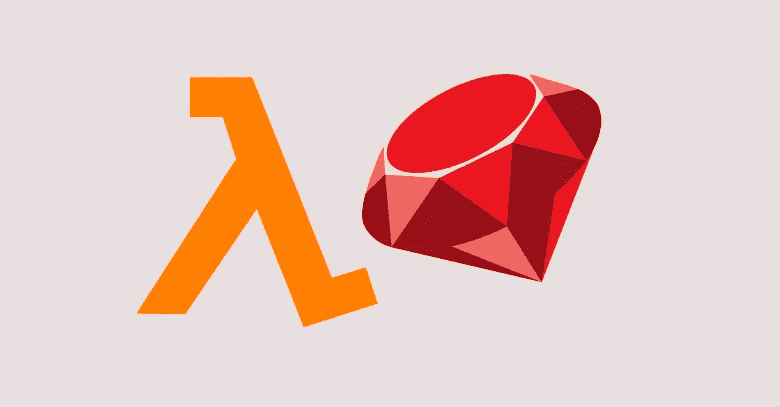
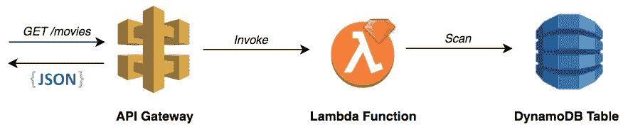
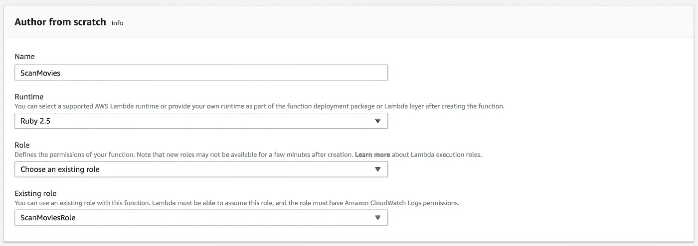
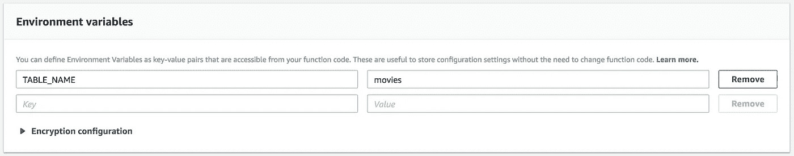
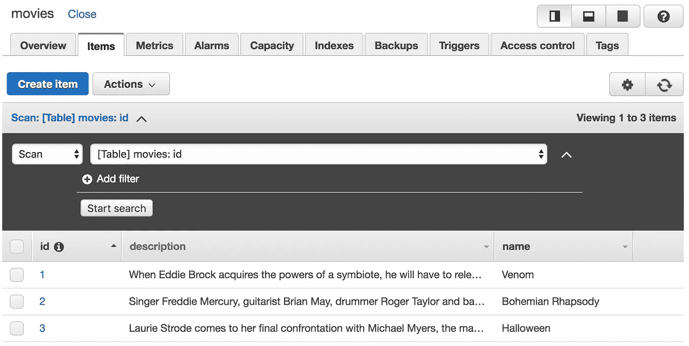
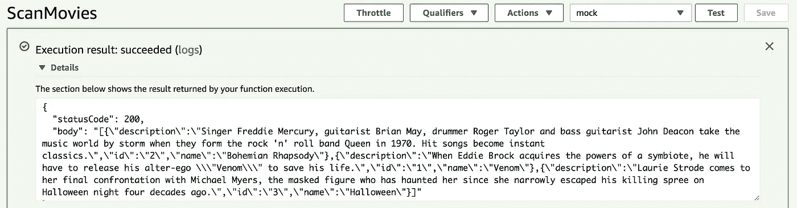
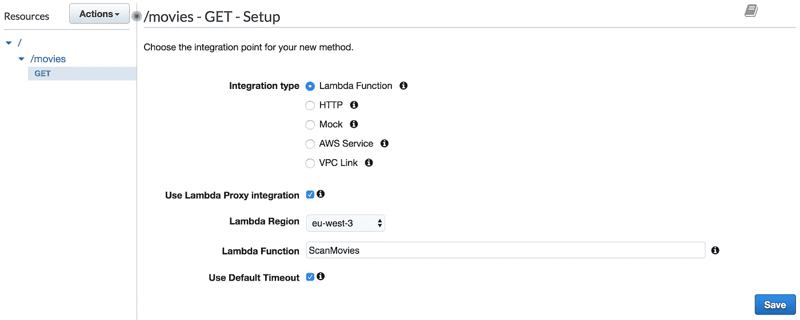
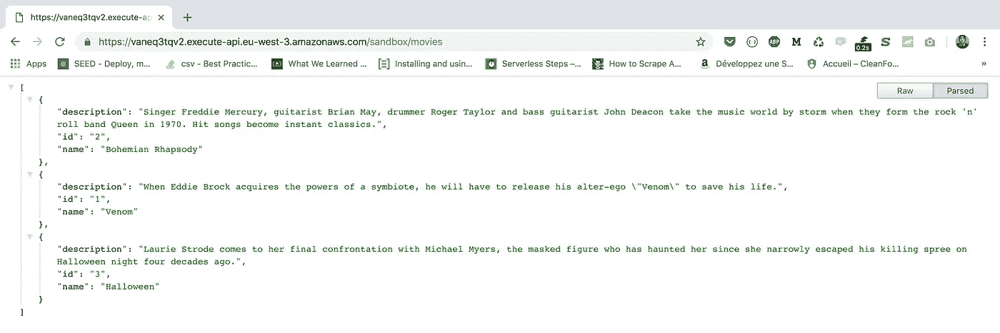
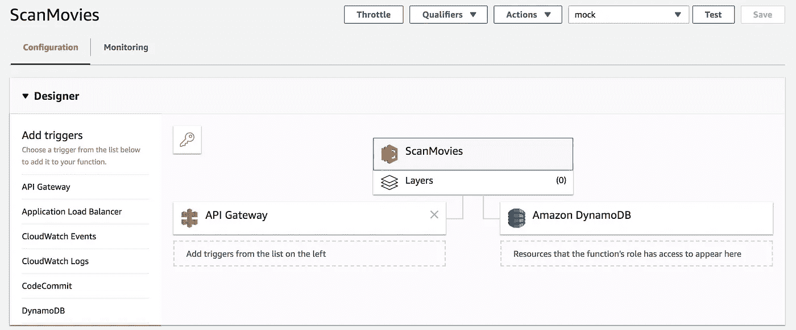

# 构建一个基于 Ruby 的 Lambda 函数

> 原文：<https://medium.com/hackernoon/build-a-ruby-based-lambda-function-44f3d006fef6>

在 AWS re:Invent 2018 上，宣布了 **Ruby** 现在是 AWS Lambda 支持的语言。在这篇文章中，我将带你从头开始编写第一个基于 Ruby 的 Lambda 函数，然后是如何配置、部署和测试 Lambda 函数。

**API 网关**将传入的请求转发给目标基于 Ruby 的 Lambda 函数，该函数将在 *movies* 表上调用相应的 **DynamoDB** 操作。

首先，创建一个 Lambda 执行角色，允许在 DynamoDB 表上调用*扫描*操作:

下面的函数入口点是不言自明的，它使用 AWS SDK(该包预安装在 Lambda 中)在适当的区域实例化 DynamoDB 客户端，并在 DynamoDB 表上发出 *Scan* 操作(在环境变量中定义):

> 默认情况下，AWS SDK for Ruby 包含在 Lambda 执行环境中。

既然已经定义了我们的处理程序，那么就转到 Lambda 表单创建，并从**现有角色**下拉列表中选择 IAM 角色(您可能需要刷新页面以使更改生效)。然后，点击**创建功能**按钮:

将表名设置为环境变量:

*电影*表包含一组电影:

使用 AWS CLI 命令创建部署包(zip 文件)并更新函数代码:

> 确保将 Lambda 函数处理程序设置为 *handler.lambda_handler*

一旦部署了该功能，通过点击控制台右上角的“**测试”**按钮，使用样本事件数据手动调用它。

到目前为止，我们学习了如何用 Ruby 构建我们的第一个 Lambda 函数。我们还学习了如何从控制台手动调用它。为了利用 Lambda 的强大功能，我们将学习如何使用 AWS API 网关服务触发这个 Lambda 函数来响应传入的 HTTP 请求(事件驱动架构):

创建一个部署阶段，用 API **调用 URL** 打开自己喜欢的浏览器；您应该会看到类似以下屏幕截图所示的消息:

下面的屏幕截图显示了一个正确配置的基于 Ruby 的 Lambda 函数，它具有对 DynamoDB 的 IAM 访问权限:

喜欢你正在读的东西吗？查看我的书，了解如何使用 AWS Lambda 在 Golang 中构建、保护、部署和管理生产就绪的无服务器应用程序。

 [## 使用 Go 的实际操作无服务器应用程序:使用 AWS 构建真实的、生产就绪的应用程序…

### 学习使用 AWS Lambda 关键功能在 Golang 中构建、保护、部署和管理您的无服务器应用程序

www.amazon.com](https://www.amazon.com/Hands-Serverless-Applications-production-ready-applications-ebook/dp/B07DT9DD4V)