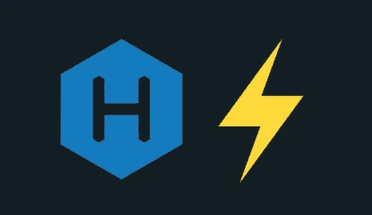
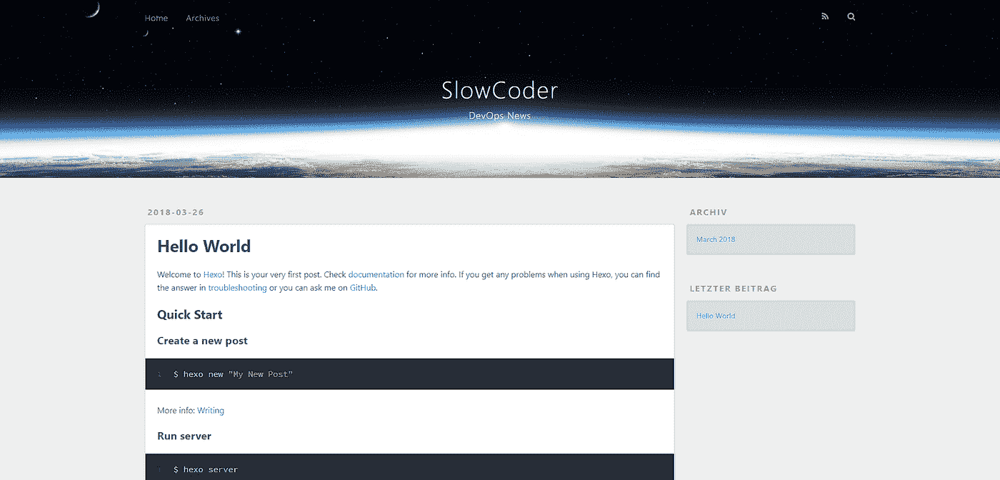
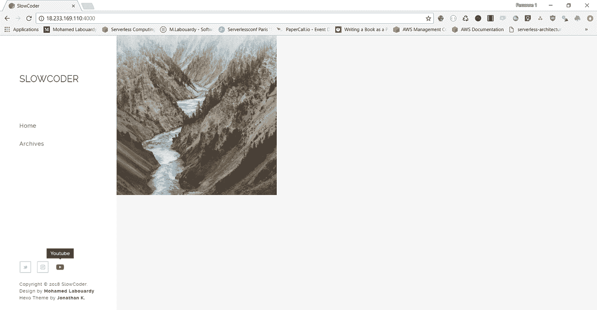
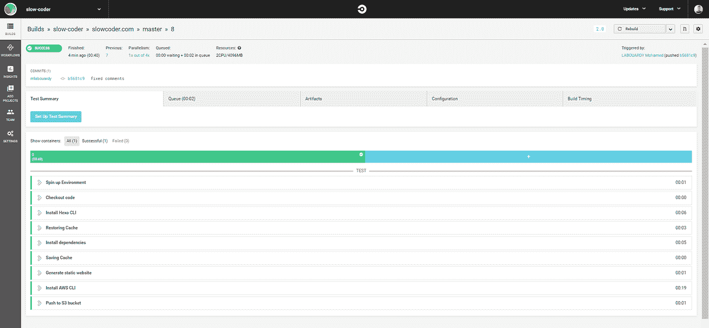
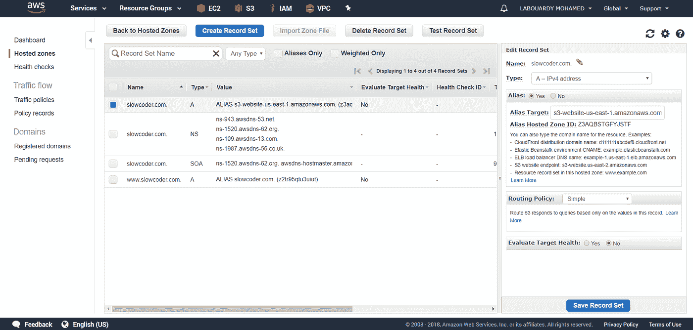
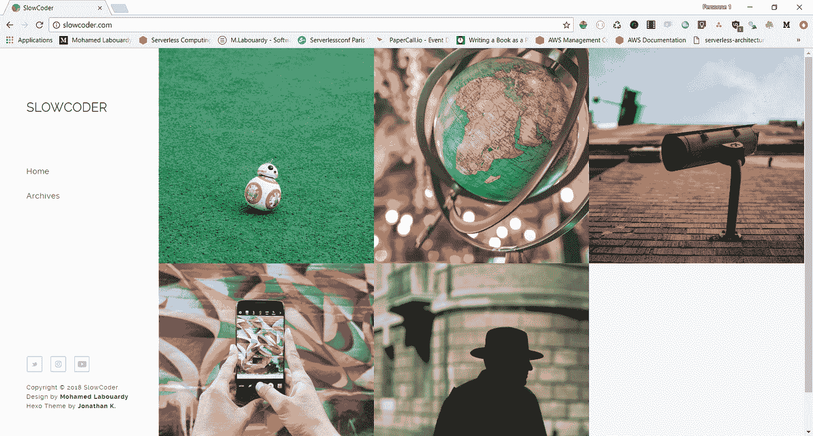

# 构建一个无服务器的生产就绪型博客

> 原文：<https://medium.com/hackernoon/build-a-serverless-production-ready-blog-b1583c0a5ac2>

http://www.slowcoder.com

你是否厌倦了维护你的 **CMS** (WordPress，Drupal 等)？支付昂贵的托管费？每天修复安全问题？

不久前，我发现了一个名为 [**Hexo**](https://hexo.io/) 的新博客框架，它可以让你以博客文章的形式发布 **Markdown** 文档。所以像往常一样，我亲自动手写了这篇文章，向你展示如何用 Hexo 构建一个生产就绪的博客，并使用 AWS S3 让你的博客变得无服务器化。在这个过程中，我将向您展示如何通过建立一个 **CI/CD** 管道来自动化新帖子的部署。

要开始使用**，Hexo** 需要**节点。JS** & **Git** 待安装。一旦安装了所有需求，发出以下命令来安装 **Hexo CLI** :

> npm 安装-g hexo-cli

接下来，创建一个新的空项目:

> hexo 初始化 slowcoder.com

修改 *_config.yml* 文件中的博客全局设置:

用“ **hexo server** ”启动一个本地服务器。默认情况下，这是在 [http://localhost:4000](http://localhost:4000/) 。你会看到 Hexo 预定义的“ **Hello World** ”测试帖:

如果你想改变默认主题，你只需要去[这里](https://hexo.io/themes/)找一个你喜欢的新主题。

我选择[磁性主题](https://github.com/klugjo/hexo-theme-magnetic)，因为它包含许多功能:

*   迪斯克斯和脸书的评论
*   谷歌分析
*   帖子和页面的封面图像
*   标签支持
*   响应图像
*   图像库
*   社交账户配置
*   页码

如下克隆主题 **GitHub** 仓库:

> https://github.com/klugjo/hexo-theme-magnetic 主题/磁性

然后更新你博客的主 *_config.yml* 设置主题为*磁性*。一旦完成，重启服务器 *:*

现在你差不多完成了你的博客设置。是时候写你的第一篇文章了。要生成新的文章文件，请使用以下命令:

> hexo 新帖子 _ 标题

现在，登录到 **AWS 管理控制台**，导航到 **S3 仪表盘**并创建一个 **S3 桶**或使用 **AWS CLI** 创建一个新桶:

> aws s3 mb s3://slowcoder.com

将下面的**策略**添加到 **S3 桶**中，使所有对象默认为公共的:

接下来，在 S3 桶上启用**静态网站托管**:

> aws s3 网站 S3://slow coder . com-索引-文档 index.html

以便在每次发布新文章时将博客部署到产品中的过程自动化。我们将使用 **CircleCI** 设置一个 **CI/CD** 管道。

使用您的 **GitHub** 帐户登录 [CircleCI](https://circleci.com/) ，然后将 *circle.yml* 文件添加到您的项目中:

注意:请务必在 **CircleCI** 上的项目设置页面中设置 **AWS 访问密钥 ID** 和 **Secret 访问密钥**(*S3:PutObject*permission)。

现在，每次您将更改推送到您的 **GitHub** repo 时， **CircleCI** 会自动将更改部署到 **S3** 。这是一个临时构建:

最后，为了让我们的博客更方便用户，我们将在 **Route53** 中设置一个自定义域名，如下所示:

注意:你可以更进一步，在 **S3** 桶的前面设置一个 **CloudFront 分布**来优化博客资产的交付。

你现在可以输入以下地址来测试你的全新博客:[http://slowcoder.com](http://slowcoder.com/):

